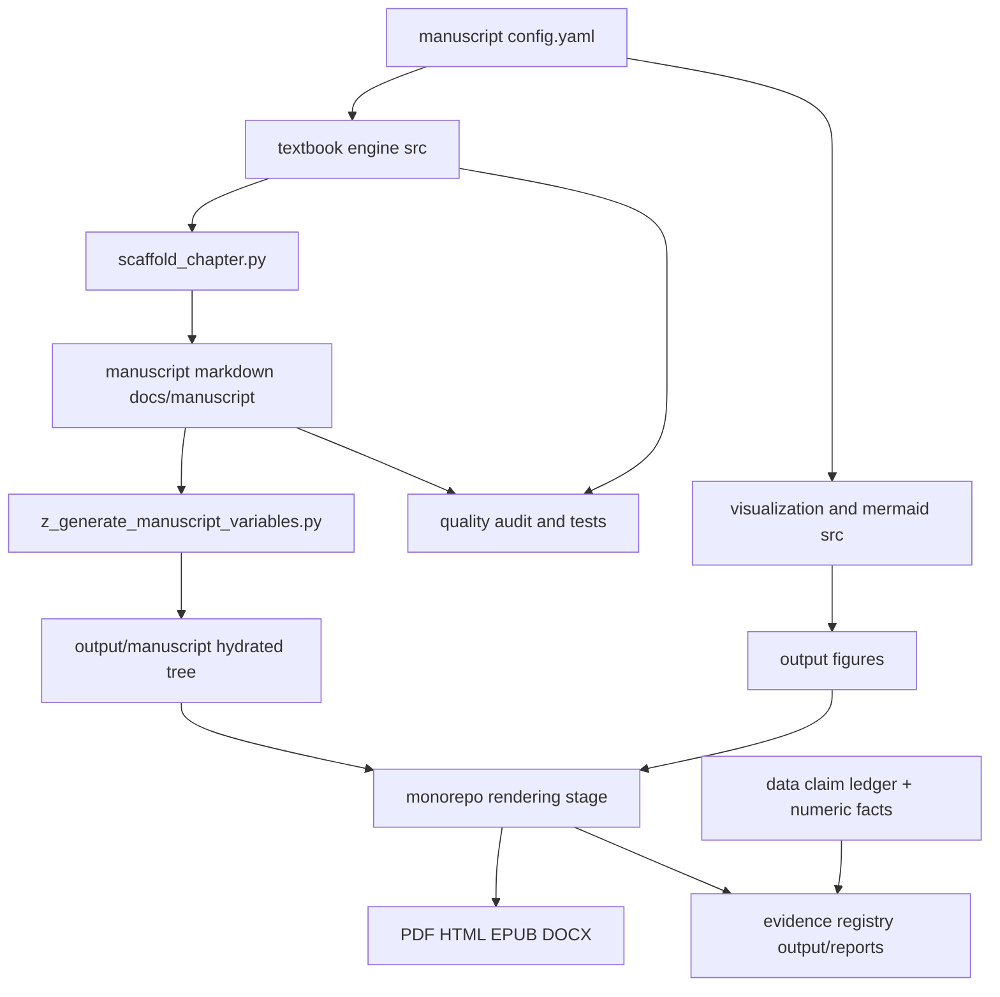

# Architecture

`OmniLatticeTextbook` is a filled fork of the `template_textbook` project of
the [docxology/template](https://github.com/docxology/template) two-layer
research-template monorepo. **Layer 1** is the generic, reusable
`infrastructure/` at the monorepo root (rendering, validation, the pipeline
runner, the evidence-registry compiler). **Layer 2** is this project:
everything domain-specific lives here. The unifying rule is the
**thin-orchestrator pattern** — business logic lives only in `src/`; scripts
coordinate I/O and call tested functions.

## The single source of truth

[`docs/manuscript/config.yaml`](../docs/manuscript/config.yaml) declares the entire book:
its four parts, the 30 chapters inside each part (in order), the 30 labs and
30 question banks that mirror those chapters, the unit intros, the seven
appendices, the front-matter ordering, the render formats, and the
page/typography settings. Nothing downstream hard-codes the structure — the
table of contents, chapter auto-numbering, figure filenames, lab/question
wiring, and the manuscript-integrity tests all read this one file.

To grow the book you edit `config.yaml` (add a part or a chapter), then run
[`scripts/scaffold_chapter.py`](../scripts/scaffold_chapter.py) to materialise
any missing stub files in the correct shape. To skip a chapter without deleting
it, add `enabled: false` to its entry.

## The `src/textbook` engine

```
src/textbook/
  constants.py   # the structural contract (see below)
  config.py      # load_config, iter_chapters, validate_config, ChapterRef
  toc.py         # build_toc, chapter_number, section/lab/question labels
  content.py     # scaffold_chapter / scaffold_lab / scaffold_question_bank,
                 # validate_chapter, count_stub_markers, count_words
  models.py      # the 23 tested formalisms — generic (logistic_growth,
                 # saturating_response, exponential_decay, half_life,
                 # linear_fit, descriptive_statistics,
                 # normalize_unit_interval) and Omni-Lattice (octave_term,
                 # catalog_size, prime_parity_partition,
                 # holographic_rhyme_field, metrological_overlap,
                 # net_zero_balance, goldilocks_band, …)
  analysis.py    # deterministic worked-example summary (build_worked_model_summary)
  audit.py       # run_manuscript_audit — the shared structural gate (CLI + tests)
  contracts.py   # source-bound contracts (config-shape parity, numeric facts,
                 # diagram inventory)
```

- **`constants.py`** encodes the contract every chapter must satisfy:
  `CITATION_KEYS` (the 31 `mendez2026*` corpus keys),
  `GLOSSARY_ANCHORS` (44 anchors),
  `REQUIRED_SECTION_HEADINGS`, `REQUIRED_TOKENS`, and `STUB_MARKERS`. These are
  the names the tests assert against, so they are the contract, not prose about
  the contract.
- **`config.py`** parses `config.yaml` into `ChapterRef` objects and validates
  it. `iter_chapters()` yields chapters in book order (skipping disabled ones by
  default).
- **`toc.py`** turns the config into numbered table-of-contents entries and
  derives the `{#sec:...}`, lab, and question labels — so numbering is computed,
  never typed.
- **`content.py`** is the meta-template engine. `scaffold_chapter()` emits a
  contract-satisfying stub (all required headings, tokens, a figure, an
  equation, a table, a mermaid block, glossary links, and citations);
  `validate_chapter()` returns the list of contract violations for a chapter's
  text; `count_stub_markers()` / `count_words()` report fill progress.
- **`models.py`** holds the worked formalisms the book teaches and that the
  figures plot — tested numerical functions, not toy code in scripts. Each
  Omni-Lattice formalism exists so prose can show an equation and call a
  function instead of retyping math.
- **`analysis.py`** assembles a deterministic worked-example summary
  (`build_worked_model_summary`) that the analysis script writes to
  `output/data/` as JSON.
- **`audit.py`** implements `run_manuscript_audit` — the shared structural gate
  (missing/contract-violating chapters, unit intros, orphan part markdown, and
  configured appendices) used by both `scripts/audit_textbook_quality.py` and
  the test suite. `--require-complete` is the filled-manuscript gate this book
  passes with zero stubs.
- **`contracts.py`** keeps configuration and generated teaching evidence from
  drifting: config-shape parity vs. `config.yaml.example`, the source-bound
  numeric-facts registry, and the generated-diagram inventory.

## Visualization and diagrams

- [`src/visualization/plots.py`](../src/visualization/plots.py) produces every
  matplotlib figure deterministically: the four generic **worked** figures
  (driven by `models.py`) plus one **canonical chapter figure** per chapter —
  30 in all, named `<part_id>_<stem>.png` to match the
  `` path each chapter
  references. The deterministic cover
  (`manuscript/assets/cover/omnilattice_cover.png`) is a tested artifact too.
- [`src/mermaid/`](../src/mermaid) reads
  [`diagram_specs.yaml`](../src/mermaid/diagram_specs.yaml) (31 specs) and
  emits Mermaid sources, rendering them to PNG when `mmdc` is available and
  falling back to `.mmd` files otherwise.

See the [visualization guide](visualization_guide.md) for details, including
render-time hydration and Chrome wiring for inline diagrams.

## Scripts are thin orchestrators

Everything in [`scripts/`](../scripts) imports from `src/` and only handles I/O,
argument parsing, and printing output paths for the pipeline manifest:

- `generate_figures.py` → `visualization.plots.generate_all_figures`
- `generate_diagrams.py` → `mermaid.diagrams.generate_all_diagrams`
- `analysis.py` → numerical demonstrations from `textbook.models`
- `scaffold_chapter.py` → `textbook.content` (author tool; not in the render path)
- `audit_textbook_quality.py` → `textbook.audit.run_manuscript_audit` (gate)
- `z_generate_manuscript_variables.py` → copies `docs/manuscript/` →
  `output/manuscript/` (hydration for the render stage)

`config.yaml`'s `analysis.scripts` lists only the **build-producing** scripts
(`generate_figures.py`, `generate_diagrams.py`, `analysis.py`) so a render is
reproducible and non-mutating; the maintenance scripts stay callable by hand.

## Output layout

Build products land under the project's `output/` directory. Unlike a fresh
scaffold, this filled fork **tracks** its rendered artifacts in git (only
public output files above 50 MB stay out):

```
output/
  manuscript/     # hydrated copy of docs/manuscript/ (consumed by the render stage)
  figures/        # the 30 <part_id>_<stem>.png chapter figures, worked figures,
                  # gallery/, and mermaid_inline/ artifacts
  data/           # numerical artifacts emitted by analysis.py
  pdf/ html/ epub/ docx/ web/   # the rendered book (OmniLatticeTextbook_combined.*)
  reports/        # validation_report, evidence_registry.json, provenance
```

Everything under `output/` is regenerable from `src/` + `config.yaml` +
`docs/manuscript/`; tracked copies exist so the rendered book is inspectable
without running the pipeline.

## Evidence anchoring

`data/` holds versioned **inputs**: `claim_ledger.yaml` and
`numeric_facts.yaml` (plus their `*_evidence_b/c.yaml` chunk files, each list
kept ≤ 256 items). The monorepo's evidence-registry collector walks these and
the build outputs into `output/reports/evidence_registry.json`, so every
headline number in prose resolves to a declared, machine-verifiable source.

## Data flow



The config feeds the engine and the generators; the engine scaffolds the
manuscript and computes numbering; the generators produce the figures;
hydration copies the manuscript into the render stage's expected location; the
manuscript plus figures render to the final book; and the engine, tests,
audit, and evidence registry gate the whole thing.
