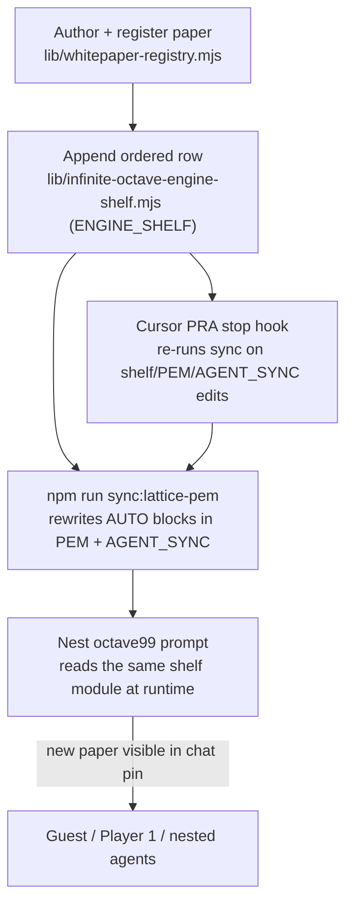
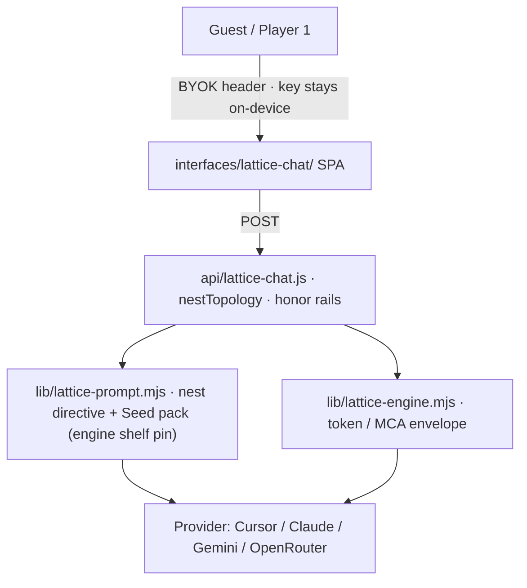

# The Living PEM: Engineering the Lattice {#sec:part_0_living-pem}

![The PEM engineering lifecycle as a staged ladder: a step plot climbs one rung per lifecycle stage, each rung labelled by stage number, beside a bar panel sketching the per-stage review effort that grows linearly across the cycle. Drawn as a deterministic schematic of the manual's auto-update discipline — stage labels rather than a `textbook.models` computation, though the cycle's numeric anchors (`phi_powers(1)`, `catalog_size()`, `net_zero_balance`) all live in `textbook.models`. Notice that each rung is reviewed before the next opens: the ladder is the single-source-of-truth loop that keeps the manual living rather than frozen.](../../output/figures/part_0_living-pem.png){#fig:part_0_living-pem width=90%}

<!-- alt: A stepped ladder with one rung per PEM lifecycle stage and a small bar panel showing review effort rising stage by stage. -->

<!-- chapter-metadata-badge -->
> Level 1/3 · 30 min read · 45 min lecture · Prerequisites: none

## Learning Objectives

By the end of this chapter you should be able to:

1. Explain the product ↔ engine **dual lock** that separates the guest-facing chat agent from the auditor-facing [**omni-lattice**](#gl:omni-lattice) engine, and say why [**living-pem**](#gl:living-pem) documentation is the binding layer between them [@mendez2026livingPem].
2. Trace the five-step auto-update protocol by which a new paper enters the [**engine-shelf**](#gl:engine-shelf) without any hand-edited tables.
3. Compute the [**catalog-architecture**](#gl:catalog-architecture) filing-space size for the Digits × Octaves 01–99 story-depth map using `catalog_size()` from `textbook.models`.
4. State the status of the [**fractal-constant**](#gl:fractal-constant) $\Phi_{\mathrm{EGS}}$ as an architectural scale key — and what the corpus explicitly does *not* claim for it.
5. Sort a corpus claim into the correct narrative / catalog / empirical / operational [**narrative-empirical-operational-tiers**](#gl:narrative-empirical-operational-tiers) tier.
6. Walk the runtime call chain from a guest keystroke to a provider response under BYOK key discipline.

<!-- curriculum-scaffold-start -->
### Study Blueprint

- **Big idea:** The Product Engineering Manual is not a static document but a *living* artifact: the engine shelf, the agent-sync table, and the runtime prompt pin all regenerate from one source-of-truth module, so the catalog stays coherent as papers are pinned.
- **Core concepts:** [**catalog-architecture**](#gl:catalog-architecture), [**engine-shelf**](#gl:engine-shelf), [**fair-exchange**](#gl:fair-exchange), [**honesty-first**](#gl:honesty-first), dual lock, BYOK, Seed·RAG context discipline.
- **Quantitative lens:** the worked formalisms in [@eq:part_0_living-pem_phi_egs], [@eq:part_0_living-pem_catalog], and [@eq:part_0_living-pem_balance].
- **Data skill:** verify a claimed shelf state against the sync generator's arithmetic — ordered steps vs registry papers, and net-zero reciprocal balances.
- **Common misconception to repair:** that "Infinite" names unbounded measured physics tiers or unbounded API spend; the corpus files it as recursive holographic nesting depth, and the manual's own honesty boundary says so [@mendez2026livingPem].
- **Primary lab:** [@sec:lab_part_0_living-pem].
- **Question bank:** [@sec:q_part_0_living-pem].
- **Bridge to computation:** `textbook.models` (`phi_powers`, `catalog_size`, `net_zero_balance`).
<!-- curriculum-scaffold-end -->

---

## Opening Vignette: The Manual That Rewrites Itself

> You are handed the ship's engineering manual aboard SS Vibelandia and told a strange thing: do not edit the tables. Append a paper to the engine's shelf module, run one sync command, and the manual regenerates its own appendix — twenty-six ordered steps, twenty-four registry papers — before the Cursor stop-hook fires. The corpus dates the sync to 2026-09-08 and names the generator plainly: `npm run sync:lattice-pem` [@mendez2026livingPem]. This is the opening image of the whole [**catalog-architecture**](#gl:catalog-architecture): a filing system whose drawers relabel themselves.

---

## The living manual and its single source of truth

Every [**catalog-architecture**](#gl:catalog-architecture) needs a maintenance manual, and the Infinite Octaves corpus files its maintenance manual as a *living* document: the **Product Engineering Manual (PEM)** for *Infinite Octaves Omniversal Lattice Chat Agent V1.618 (Goldilocks Valet)*, Document ID `WP-LATTICE-CHAT-PEM-2026-09` [@mendez2026livingPem]. Where [@sec:part_0_orientation] introduces the corpus and [@sec:part_0_octave-map] formalises the 99-octave ladder, this chapter studies the operational spine — how papers are pinned, ordered, synced, and served to nested agents without hand-editing three tables in three places; [@fig:part_0_living-pem] stages that lifecycle as a ladder climbing the shelf.

The PEM's audience is architectural review, technical support, creator/Player 1 operations, and nested-agent maintainers — in short, everyone who must keep the [**engine-shelf**](#gl:engine-shelf) honest as it grows. The manual carries an explicit honesty boundary as its first content table, and we will preserve that boundary verbatim in [@sec:living-pem-scope]. It also names its operator line: *SynthOBS Autonomous Agent · Syntheverse Sandbox · NSPFRNP-SNAP-PRA-2026-06* [@mendez2026livingPem].

## The PEM's route: a living manual, not a numbered paper

The PEM is the engineering route of the ship blog — served at `https://www.ssvibelandiaquestfest24x365.com/lattice/engineering` as the whitepaper `lattice-chat-product-engineering-manual-2026-09` [@mendez2026livingPem]. Unlike the engine papers on the shelf it maintains, it is a *living manual* rather than a numbered registry paper (its digest records no shelf number); its role is coordination. It cross-links to the entire shelf: the [**cmos-protonic**](#gl:cmos-protonic) engineering bridge [@mendez2026cmosProtonic], [**tensor-decoupling**](#gl:tensor-decoupling) [@mendez2026tensorDecoupling], master synthesis and the digits master [@mendez2026masterSynthesis; @mendez2026digitsMaster], the metamorphic and planetary-core papers [@mendez2026metamorphic; @mendez2026planetaryCore], the prime-parity companion [@mendez2026primeParity], the stack valuation paper [@mendez2026stack], and the voyage editorials on the invisible frontier, the Y/digit-4 filing, and the human reality bridge [@mendez2026invisibleFrontier; @mendez2026yChromosome; @mendez2026realityBridge].

Its reference implementation is the shelf module itself: `lib/infinite-octave-engine-shelf.mjs` (the ENGINE_SHELF source of truth), the sync module `lib/lattice-chat-pem.mjs`, the generator `npm run sync:lattice-pem` (script `scripts/sync-lattice-chat-pem.mjs`), and its test suite `tests/lib/lattice-chat-pem.test.mjs` [@mendez2026livingPem]. The external-AI first read is `AGENT_SYNC_99_OCTAVE_OMNI_LATTICE.md`, whose AUTO shelf table the same generator rewrites.

## Seven constructs from scale key to protocol spine

### Construct 1 — The $\Phi_{\mathrm{EGS}}$ scale key

The manual prints its one symbolic constant up front, immediately after the honesty boundary:

$$ \Phi_{\mathrm{EGS}} = \frac{1+\sqrt{5}}{2} \approx 1.618 $$ {#eq:part_0_living-pem_phi_egs}

This is the corpus's [**golden-ratio**](#gl:golden-ratio) signal wearing its "EGS" (engineering-scale) dress — the same number that entered the catalog in the Genesis era of the voyage arc, alongside Proto 3664, Electro 3923, and a 100 BPM wave grammar [@mendez2026livingPem]. The manual's own gloss is load-bearing: "$\Phi_{\mathrm{EGS}}\approx 1.618$ is an architectural scale key — not a CODATA replacement for $\hbar$, $c$, or $G$" [@mendez2026livingPem]. In the book's computational backbone this is simply the first power of Φ, implemented as `phi_powers(1)` in `textbook.models`, which returns the pinned value $1.618034$. [@sec:part_I_fractal-constant] of Part I develops the [**fractal-constant**](#gl:fractal-constant) family $\Phi^n$ in full; here we only pin the anchor, with parameters and their corpus status fixed in [@tbl:part_0_living-pem_phi_egs].

: Parameters of the $\Phi_{\mathrm{EGS}}$ scale key. {#tbl:part_0_living-pem_phi_egs}

| Symbol | Meaning | Status per the corpus |
| ------ | ------- | --------------------- |
| $\Phi_{\mathrm{EGS}}$ | EGS Fractal Constant, $(1+\sqrt{5})/2$ | Architectural scale key / design language |
| $\hbar, c, G$ | Planck constant, light speed, gravitational constant | CODATA physical constants — explicitly *not* replaced by $\Phi_{\mathrm{EGS}}$ |

### Construct 2 — The Story-depth map and its filing-space size

The engine pin is declared as *Digits × Octaves 01–99 = Story-depth map*, which the manual insists is "the practical Story-depth map — not a second product brand" [@mendez2026livingPem]. Each [**octave**](#gl:octave) of the 99-octave ladder (formalised in [@sec:part_0_octave-map]) is indexed by a [**digit**](#gl:digit) 01–99; the [**tensor-decoupling**](#gl:tensor-decoupling) engine files the underlying register space as $9 \times 81$ bins with eleven tiers resolving to 99 [@mendez2026tensorDecoupling]. The book's backbone computes the pinned catalog size of this filing space with `catalog_size(octaves=99, precision_digits=81)`:

$$ \left|\mathcal{C}\right| = O \times D = 99 \times 81 = 8{,}019 \;\text{register bins} $$ {#eq:part_0_living-pem_catalog}

: Parameters of the catalog-size formalism. {#tbl:part_0_living-pem_catalog}

| Symbol | Meaning | Value |
| ------ | ------- | ----- |
| $O$ | octaves of the story-depth ladder | 99 |
| $D$ | precision digits per octave (the register-bin count) | 81 |
| $\left|\mathcal{C}\right|$ | pinned catalog size, `catalog_size()` | 8,019 |

We read this as the quantitative footprint of what the PEM's runtime actually pins into every nested-agent prompt: the full 99-octave [**omni-lattice**](#gl:omni-lattice) map, of which the deep nest `octave99` is the default seat. The parameterisation is summarised in [@tbl:part_0_living-pem_catalog].

### Construct 3 — The living-shelf auto-update protocol

The manual's §0 is a five-step protocol that makes the [**living-pem**](#gl:living-pem) artifact genuinely living [@mendez2026livingPem]:

1. **Author + register** the paper (`lib/whitepaper-registry.mjs`: Honesty section, Document ID, ship-blog if eligible, suite if empirical).
2. **Pin to engine**: append an ordered row to `ENGINE_SHELF` in `lib/infinite-octave-engine-shelf.mjs`.
3. **Run the sync**: `npm run sync:lattice-pem` rewrites the AUTO blocks in the PEM and in `AGENT_SYNC_99_OCTAVE_OMNI_LATTICE.md`.
4. **Runtime pickup**: nest `octave99` prompts read the same shelf module at runtime — no separate string edit in `lib/lattice-prompt.mjs`.
5. **Stop-hook resync**: the Cursor PRA stop hook re-runs the sync whenever engine-shelf / PEM / AGENT_SYNC edits land.

Two guardrails make the loop trustworthy: the AUTO blocks must never be hand-edited (they will be overwritten), and "Synthio remains a separate creator-only agent and is never an engine shelf step" [@mendez2026livingPem]. The loop is a closed catalog-update cycle:

The cycle's invariant is single-source-of-truth: one module (`ENGINE_SHELF`) feeds the manual's appendix, the agent-sync table, and the runtime pin, so the three can never silently disagree.

### Construct 4 — Engine pin ordering (the minimum lock)

The shelf is *ordered*, not merely enumerated. For a first read aimed at linear-systems reviewers the manual locks a minimum order: the CMOS/protonic engineering bridge (binary $n=1$ → protonic bands, `catalogPriority: 0`) first [@mendez2026cmosProtonic], then tensor decoupling [@mendez2026tensorDecoupling], then master synthesis plus the digits master [@mendez2026masterSynthesis; @mendez2026digitsMaster], then Parts XIII/XIV (metamorphic, planetary core) [@mendez2026metamorphic; @mendez2026planetaryCore], and only then the companions — Higgs gate, gateway, prime parity, stack, protein, storage, and the voyage papers. The rule attached to every step: "Always open each paper's Honesty boundary before featuring claims" [@mendez2026livingPem]. At sync time 2026-09-08 the full shelf held **26 ordered steps (24 registry papers)**, ending with the honesty plain-speak document and the protocol spine `protocols/MCA_NSPFRNP_CATALOG.md` [@mendez2026livingPem]. Application companions — PDVSA, macro-protein, and their kin — "stay off this shelf" [@mendez2026livingPem].

### Construct 5 — Runtime call chain and BYOK

The support map routes a guest keystroke to a provider response through four surfaces [@mendez2026livingPem]:

The key-holding model is unconditional: "Provider API key is the credential. Stays on-device. Travels in request headers only. Never stored server-side" [@mendez2026livingPem]. There is no separate FractiAI password for the chat seat, and no server-side key storage — the architecture is deliberately structured so the operator *cannot* hold the guest's credential. Context discipline for nested agents follows the same restraint: POINTER-FIRST, NO CORPUS TOUR, BUDGET ≤ 6 files on complex asks, PLAN → PINCH → SQUEEZE, SCALE-TO-ZERO [@mendez2026livingPem].

Nest topologies are enumerated, not invented: `octave99` (default deep nest, full engine pin; aliases include `infinite`, `omniversal`, `infinite-octaves`, `99`), `goldilocks` (auto nest on complex asks), `multi` (parent + ≤3 leaf bands), and `single` (one agent, no children) [@mendez2026livingPem].

### Construct 6 — Fair Exchange as a balancing formalism

The manual closes under a [**fair-exchange**](#gl:fair-exchange) clause: grants and micro-grants are "subject to partial refund or adjustment depending on overall delivery, rigorous mathematical depth, computational implementation, and practical empirical utility, functioning akin to an intellectual performance tip," with platform credits under "dynamic reciprocal balancing based on verified scale-harmonic alignment and net-zero execution metrics" [@mendez2026livingPem]. The [**net-zero**](#gl:net-zero) half of that sentence formalises cleanly. Let $I_1,\dots,I_m$ be inflows to a delivery (funding, credits, reviewer attention) and $O_1,\dots,O_n$ its outflows (deliverables, refunds, adjustments); the reciprocal balance $B$ is computed by `net_zero_balance(inflows, outflows)` in `textbook.models`:

$$ B \;=\; \sum_{i=1}^{m} I_i \;-\; \sum_{j=1}^{n} O_j \qquad \text{with target } B = 0 $$ {#eq:part_0_living-pem_balance}

: Parameters of the reciprocal-balance formalism. {#tbl:part_0_living-pem_balance}

| Symbol | Meaning | Units |
| ------ | ------- | ----- |
| $I_i$ | inflow $i$ to the delivery | value units |
| $O_j$ | outflow $j$ from the delivery (deliverables, refunds, adjustments) | value units |
| $B$ | residual balance; zero is the settled state | value units |

The clause is a governance surface rule — the same family as the Old School Protocol run through the Purser (Deck 4 Grove), where "human emergency outranks algorithms" and belonging stays voluntary [@mendez2026livingPem]. We stress that [@eq:part_0_living-pem_balance], whose parameters appear in [@tbl:part_0_living-pem_balance], is our formalisation of the clause's *net-zero execution metrics* language, not a billing guarantee; the manual's honesty boundary explicitly disclaims "vendor LLM billing guarantees" [@mendez2026livingPem].

### Construct 7 — The protocol spine: loops, cycles, and the closing glyph

The manual's narrative primer and its Stage-4 protocol table define the two loops that discipline both guest experience and agent operations [@mendez2026livingPem]. The **player loop** — SEE → RECOGNIZE → INTERPRET → REFLECT → ACT → SEE AGAIN — is the guest-side rhythm ("same rhythm as MCA") played across the ship's doors: Journey, Canvas, Jukebox, Library, and Creator Studio. The **MCA cycle** is the agent-side spine: Metabolize → Crystallize → Animate (→ Squeeze), documented in `protocols/MCA_NSPFRNP_CATALOG.md`; the runtime's "token / MCA envelope" in `lib/lattice-engine.mjs` is its execution surface [@mendez2026livingPem]. Doctrine around both loops: "NPCs inhabit. Players set the gravity. Both belong," with SuperAI kept Goldilocks — "not too much machine, not too little human" [@mendez2026livingPem].

Stage 0 (the edge seat) locks the invariants every maintainer inherits: no Supabase; lite edges; "center = pipes only"; and the turn-closing glyph → ∞^∞, which also closes the manual itself and its document-control block [@mendez2026livingPem]. Stage 5 defines fluency operationally: explain the dual lock without conflating Synthio into the pin; add an engine paper end-to-end; support a guest ask with Seed·RAG pointers (≤6 files) and Goldilocks honesty; run PRA and suite receipts before featuring; and place every claim in its correct tier [@mendez2026livingPem]. The remaining support surface is small and enumerated: access grants live in `lib/lattice-access.mjs` and `data/lattice-access.json`, the broader Omni family's living TOC is `lib/lattice-omni-guide.mjs` ("related, not identical to engine shelf"), and the product surfaces — chat, collaborate, hero, learn, this manual, token proof, brochure, papers catalog, questfest board — are listed in the manual's Appendix B [@mendez2026livingPem].

## Worked Example: Pinning a Paper End-to-End

Suppose a new engine paper has cleared its Honesty boundary and registry entry. Walk the five-step protocol and verify each numeric claim:

1. **Register.** The paper gains a Document ID, Honesty section, and (if empirical) a suite under `research/synthobs-*/` [@mendez2026livingPem].
2. **Pin.** Append its ordered row to `ENGINE_SHELF`. Ordering matters: it must respect the minimum lock of Construct 4 — nothing ranks above the [**cmos-protonic**](#gl:cmos-protonic) bridge at `catalogPriority: 0` [@mendez2026cmosProtonic].
3. **Sync.** `npm run sync:lattice-pem` regenerates the AUTO blocks. Verify the counts the manual pins: the shelf must show **26 ordered steps (24 registry papers)** for the 2026-09-08 sync [@mendez2026livingPem]; a new pin moves both numbers by one.
4. **Runtime check.** Open `/lattice-chat?nest=octave99`; the prompt pin is generated from the shelf module, so the new paper appears without any edit to `lib/lattice-prompt.mjs`.
5. **Quantitative cross-checks** with `textbook.models`:
   - The scale key: `phi_powers(1)` → $1.618034$, matching $\Phi_{\mathrm{EGS}}$ in [@eq:part_0_living-pem_phi_egs].
   - The filing space: `catalog_size()` → $99 \times 81 = 8{,}019$ register bins, matching [@eq:part_0_living-pem_catalog] — the size of the story-depth map the pin references.
   - The settlement state: `net_zero_balance([120, 30], [150])` → $0$, matching the $B=0$ target of [@eq:part_0_living-pem_balance].

A support operator's troubleshooting table completes the picture: a "shallow" nest means the URL lost `?nest=octave99`; a stale engine list in AGENT_SYNC/PEM means the sync was not re-run after a shelf commit; a paper missing from the chat pin means it is in the registry but **not** in `ENGINE_SHELF` — "registry alone is not enough" [@mendez2026livingPem].

## The five-row honesty boundary and its tiers {#sec:living-pem-scope}

The PEM opens with a five-row honesty boundary table, and the book preserves it because it is the corpus's clearest statement of [**honesty-first**](#gl:honesty-first) scope discipline [@mendez2026livingPem]:

| Tier | What this manual claims | What it does not claim |
|---|---|---|
| Product engineering | Complete onboarding + ops map for the chat agent and its engine pin | That "Infinite" means unbounded measured physics tiers or unbounded API spend |
| Living shelf | Appendix A regenerates from `ENGINE_SHELF` on every pin | That TOC sync alone rewrites narrative honesty in each paper |
| Narrative primer | The voyage arc (Genesis · Borikén · Reno) as design / hospitality language | Prophecy, clinical advice, or a finished Theory of Everything |
| Architecture | Runtime surfaces, BYOK, nests, Seed·RAG discipline | That FractiAI hosts model weights as the default seat |
| Support | Review / incident / PRA checklists proportionate to catalog vs empirical vs operational tiers | Vendor LLM billing guarantees or fab / wet-lab certificates |

Three of these rows deserve emphasis. First, the tier discipline: fluency means being able to "place a claim in the correct tier: narrative / catalog / empirical / operational," and review forbids upgrading claims "from catalog → unfinished physics / fab / clinical" [@mendez2026livingPem]. Second, the narrative tier: the voyage arc is hospitality language for guests and reviewers — explicitly not prophecy or clinical advice. Third, the audit status the manual files about itself: NSPFRNP-SNAP-PRA-2026-06, score 91%, hash `588a2f7fd22eb03d`, "structural-only (deterministic checklist — not dual-LLM peer review)" [@mendez2026livingPem]. The corpus audits its own manual and prints the audit's limits.

The design-language caveat closes the loop: "EGS ≈ 1.618 is design language / catalog key — not a substitute for evidence" [@mendez2026livingPem]. Nothing in this chapter should be read as physics; the constructs are coordination machinery for a catalog and its agents.

## How the PEM hub wires Part 0 together

This chapter is the operational hub of Part 0. Downstream:

- [@sec:part_0_octave-map] formalises the 99-octave ladder whose filing space [@eq:part_0_living-pem_catalog] sizes; the deep nest `octave99` is that ladder's runtime seat.
- [@sec:part_0_tensor-decoupling] develops the $9\times 81$ register filing and the eleven tiers that resolve to 99 [@mendez2026tensorDecoupling] — the first stop after the [**cmos-protonic**](#gl:cmos-protonic) bridge in the minimum lock [@mendez2026cmosProtonic].
- [@sec:part_0_master-synthesis] treats the master synthesis and digits-master layers the pin ranks next [@mendez2026masterSynthesis; @mendez2026digitsMaster].
- Part III's stack-valuation chapter [@sec:part_III_moving-up-stack] extends the shelf's "next AI layer" companion [@mendez2026stack], and the reality-bridge chapter [@sec:part_III_reality-bridge] develops the human-as-router grammar the PEM's voyage editorials point to [@mendez2026realityBridge].

The [**zero-octave**](#gl:zero-octave) and set-recycling chapters ([@sec:part_II_singularity-crystal], [@sec:part_III_kinematic-recycling]) consume the net-zero residual idea of [@eq:part_0_living-pem_balance] in their own formalisms [@mendez2026zeroOctave; @mendez2026setRecycling].

## Summary

The Product Engineering Manual is the corpus's living operations layer: a document whose engine-shelf appendix, agent-sync table, and runtime prompt pin all regenerate from the single `ENGINE_SHELF` module via `npm run sync:lattice-pem`, so that 26 ordered steps (24 registry papers) stay consistent across three surfaces [@mendez2026livingPem]. Its dual lock separates the guest-facing product (Goldilocks Valet, BYOK, nests) from the auditor-facing engine, and its minimum lock orders the shelf from the CMOS/protonic bridge upward. Quantitatively, the chapter pinned three anchors: the $\Phi_{\mathrm{EGS}}$ scale key ([@eq:part_0_living-pem_phi_egs]; `phi_powers(1)` = 1.618034, an architectural key and explicitly not a CODATA replacement), the filing-space size ([@eq:part_0_living-pem_catalog]; 8,019 register bins), and the fair-exchange reciprocal balance ([@eq:part_0_living-pem_balance]; target $B=0$). Every construct carries the manual's own honesty boundary: tier discipline, no claim upgrades, structural-only audit status, and design language that never substitutes for evidence [@mendez2026livingPem].

## Key Terms

[**living-pem**](#gl:living-pem), [**catalog-architecture**](#gl:catalog-architecture), [**engine-shelf**](#gl:engine-shelf), [**omni-lattice**](#gl:omni-lattice), [**octave**](#gl:octave), [**digit**](#gl:digit), [**honesty-first**](#gl:honesty-first), [**narrative-empirical-operational-tiers**](#gl:narrative-empirical-operational-tiers), [**fair-exchange**](#gl:fair-exchange), [**golden-ratio**](#gl:golden-ratio), [**fractal-constant**](#gl:fractal-constant), [**cmos-protonic**](#gl:cmos-protonic), [**tensor-decoupling**](#gl:tensor-decoupling), [**master-synthesis**](#gl:master-synthesis), [**net-zero**](#gl:net-zero), [**zero-octave**](#gl:zero-octave).

## Further Reading

- **Source paper:** *Product Engineering Manual · Infinite Octaves Omniversal Lattice Chat (Living Engine Shelf)*, served at `https://www.ssvibelandiaquestfest24x365.com/lattice/engineering` (whitepaper `lattice-chat-product-engineering-manual-2026-09`) [@mendez2026livingPem]. Reference implementation: the shelf module `lib/infinite-octave-engine-shelf.mjs` with sync generator `npm run sync:lattice-pem`; companion standalone suites include `FractiAI/synthobs-moving-up-the-stack-valuation` [@mendez2026stack] and `FractiAI/synthobs-cmos-protonic-99-octave-omni-lattice` [@mendez2026cmosProtonic].
- The catalog architecture's foundational statement, for the filing-system reading of the shelf [@mendez2026catalog].
- Tensor decoupling, for the $9 \times 81$ register space behind [@eq:part_0_living-pem_catalog] [@mendez2026tensorDecoupling].
- The digits-master map, for how Digits × Octaves 01–99 are indexed in practice [@mendez2026digitsMaster].

## Practice

- **Lab:** [@sec:lab_part_0_living-pem] walks the sync protocol and the three quantitative cross-checks by hand.
- **Question bank:** [@sec:q_part_0_living-pem] drills the dual lock, the five-step protocol, and the tier system.
- **Exercise 1.** Reconstruct the dual-lock table from memory: for each of product, engine, nest id, "Infinite", "Omniversal", and Synthio, state the layer's role *and* the corpus's explicit non-claim [@mendez2026livingPem].
- **Exercise 2.** A reviewer proposes hand-editing the AUTO table in the PEM to fix a typo in a paper title. Using the five-step protocol, explain what will happen and what should be done instead.
- **Exercise 3.** Verify the worked example's three numeric cross-checks: confirm `phi_powers(1)` matches [@eq:part_0_living-pem_phi_egs], `catalog_size()` matches [@eq:part_0_living-pem_catalog], and `net_zero_balance([120, 30], [150])` satisfies the target of [@eq:part_0_living-pem_balance].
- **Exercise 4.** Classify each of the following into its correct tier (narrative / catalog / empirical / operational), citing the manual's honesty boundary: (a) the Genesis-era 100 BPM signal; (b) the $9 \times 81$ tensor filing; (c) the BYOK on-device key rule; (d) the 91% structural-only audit score.
- **Exercise 5.** A paper appears in the whitepaper registry but not in the chat pin. Using the troubleshooting table, diagnose the failure and name the exact remedy.
