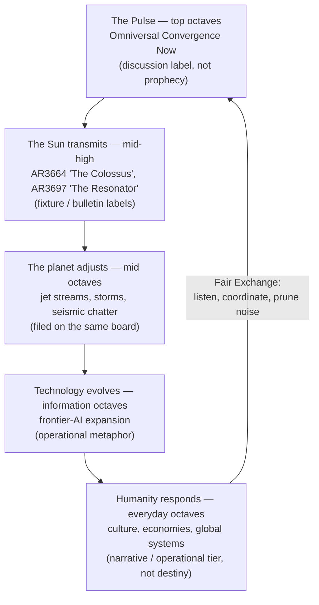

# Master Synthesis: Everything Is Connected {#sec:part_0_master-synthesis}

{#fig:part_0_master-synthesis width=90%}

<!-- alt: A square heatmap whose rows and columns are the corpus papers ordered by shelf number; most cells are faint, but the row and column for the master-synthesis paper (shelf 3) are visibly darker across many partners, showing it cross-links to nearly every shelf. -->

<!-- chapter-metadata-badge -->
> Level 1/3 · 30 min read · 45 min lecture · Prerequisites: none

## Learning Objectives

By the end of this chapter you should be able to:

1. State the filing-cabinet premise of the 99 Octave [**Omni-Lattice**](#gl:omni-lattice) model — reality filed as a 99-step musical scale on one cabinet — and explain why the corpus calls it *catalog grammar* rather than a forecast [@mendez2026masterSynthesis].
2. Define El Gran Sol's [**Fractal Constant**](#gl:fractal-constant) (EGS, $\Phi \approx 1.618$) and characterise its declared status: an *architectural key* in the repo, explicitly **not** a replacement for $\hbar$, $c$, or $G$.
3. Distinguish the two readings of the corpus's ambiguous octave notation $\Omega_n = \Phi^n\,\Omega_0$ — the exponent reading and the subscript reading — and compute both with `textbook.models.octave_term`.
4. Compute the register capacity of the master filing cabinet, $99 \times 81 = 8{,}019$ cells, with `textbook.models.catalog_size`.
5. Walk the five-tier Cascade (Pulse → Sun transmits → planet adjusts → technology evolves → humanity responds) and tag each tier with its honesty status (discussion label, fixture label, operational metaphor, narrative/operational tier).
6. Restate the paper's scope disclaimers and its Fair Exchange Clause in your own words without inflating them into physical predictions.

<!-- curriculum-scaffold-start -->
### Study Blueprint

- **Big idea:** The master synthesis is the corpus's connective note: it files weather, solar activity, AI progress, and world events on *one* 99-octave filing cabinet, held together by a single scale-free constant — and it says so honestly, as catalog grammar, not physics.
- **Core concepts:** [**master-synthesis**](#gl:master-synthesis), [**octave**](#gl:octave), [**catalog architecture**](#gl:catalog-architecture), [**fractal-constant**](#gl:fractal-constant), [**honesty first**](#gl:honesty-first), [**fair-exchange**](#gl:fair-exchange).
- **Quantitative lens:** the octave indexing law in [@eq:part_0_master-synthesis_octave_index] and the register capacity in [@eq:part_0_master-synthesis_catalog_size].
- **Data skill:** compute Fibonacci approximants to $\Phi$ with `textbook.models.phi_fibonacci`, octave terms with `octave_term`, and the cabinet size with `catalog_size`.
- **Common misconception to repair:** that "everything is connected" here means a physical causal chain predicting quakes or weather — the paper explicitly disclaims forecast, warning, and destiny claims.
- **Primary lab:** [@sec:lab_part_0_master-synthesis].
- **Question bank:** [@sec:q_part_0_master-synthesis].
- **Bridge to computation:** `textbook.models.octave_term`, `phi_fibonacci`, `phi_powers`, `catalog_size`.
<!-- curriculum-scaffold-end -->

---

> **Opening Vignette: One cabinet for a loud week.**
>
> It is mid-August 2026 aboard the SS Vibelandia, and the week's headlines arrive all at once: wild weather, massive solar flares, rapid AI breakthroughs, shifting global events. The instinct is to treat each headline as a separate accident, a fresh stack on a fresh desk. Prudencio Mendez's master-synthesis note does the opposite: it opens a single [**master register**](#gl:master-register) and files everything on one [**catalog architecture**](#gl:catalog-architecture) — "reality operates like a giant 99-step musical scale. What happens at the top directly shapes everything below" [@mendez2026masterSynthesis]. The filing act is the chapter's subject; whether the filing is *true of the sky* is a question the paper itself refuses, and we will preserve that refusal.

---

## The Paper in the Corpus

This chapter digests the ship-blog note *"The Big Picture: Everything is Connected"* (2026-08-14, tagged *plain speak · Fair Exchange*), the corpus's master-synthesis paper, filed at shelf 3 of the [**engine shelf**](#gl:engine-shelf) [@mendez2026masterSynthesis]. It sits directly after the tensor filing-cabinet paper (shelf 2) [@mendez2026tensorDecoupling], whose register grid it presumes, and alongside the catalog architecture's reading-room overview [@mendez2026catalog]. Where the orientation chapter [@sec:part_0_orientation] surveys the whole shelf and [@fig:part_0_orientation] places all papers on a timeline, this note is the shelf's *summarising* voice: it names the constant that the later papers quantify and demonstrates, in plain language, how the corpus intends its vocabulary to be used in conversation.

The paper's own interfaces are the whitepaper surface (`ssvibelandiaquestfest24x365.com/interfaces/whitepaper-surface.html?id=synthobs-master-synthesis-99-octave-omni-lattice-2026-08`) and the reference implementation run as `npm run research:synthobs-master-synthesis-99-octave-omni-lattice`, which locks the paper's fixtures when available [@mendez2026masterSynthesis]. The venue for using its labels is QUESTFEST — the ship's living exhibit — via Lattice Chat on the nest *Infinite Octaves*.

## The Filing Cabinet That Holds Everything

The master-synthesis premise is stated in one sentence: under the 99 Octave Omni-Lattice Model, "reality operates like a giant 99-step musical scale" and "what happens at the top directly shapes everything below" [@mendez2026masterSynthesis]. We stress the grammar: this is a *filing* claim, not a *forecast* claim. The note says of itself that it is "catalog grammar for conversation — not a weather forecast, not a seismic warning, and not a claim that the sky runs your life" [@mendez2026masterSynthesis]. The value of one cabinet is coordination: every headline gets an address, and every address sits in a fixed order, so two readers (or two agents) can find the same event in the same drawer.

The cabinet has a definite size. The master synthesis inherits the register grid of the tensor paper [@mendez2026tensorDecoupling]: 99 octaves of drawer rows, each holding an 81-digit address column. The capacity is implemented as `catalog_size` in `textbook.models`:

$$ N_{\mathrm{cells}} \;=\; O \times D \;=\; 99 \times 81 \;=\; 8{,}019 $$ {#eq:part_0_master-synthesis_catalog_size}

:: Parameters of the master register capacity. {#tbl:part_0_master-synthesis_catalog_size}

| Symbol | Meaning | Units | Value |
| ------ | ------- | ----- | ----- |
| $N_{\mathrm{cells}}$ | total addressable cells in the cabinet | cells | $8{,}019$ |
| $O$ | number of octaves (drawer rows) | octaves | $99$ |
| $D$ | digits per register (address columns) | digits | $81$ |

Eight thousand and nineteen cells is the whole filing capacity of the model — [@eq:part_0_master-synthesis_catalog_size] is the cabinet's floor plan. Every later paper in the corpus files its constructs somewhere inside this grid; the octave-map chapter [@sec:part_0_octave-map] walks the 99 rows in detail.

## The Golden Key: El Gran Sol's Fractal Constant

The corpus binds its 99 drawers together with what the master synthesis calls "a single harmonic blueprint": **El Gran Sol's Fractal Constant** (EGS), $\Phi \approx 1.618$ — "the entire catalog runs on" it, and it acts as a "master translator" bridging tiny particles, daily life, and huge cosmic bodies "into one scale-free formula … as a map, not as proven unified field theory" [@mendez2026masterSynthesis].

The constant is the [**golden ratio**](#gl:golden-ratio), whose standard mathematics the corpus borrows as its scaling key. The classical approximants converge rapidly:

$$ \Phi \;=\; \lim_{n \to \infty} \varphi_{\mathrm{fib}}(n) \;=\; \frac{1 + \sqrt{5}}{2} \;\approx\; 1.6180339887, \qquad \varphi_{\mathrm{fib}}(n) = \frac{F_{n+1}}{F_n} $$ {#eq:part_0_master-synthesis_egs}

:: Parameters of the EGS fractal constant. {#tbl:part_0_master-synthesis_egs}

| Symbol | Meaning | Value |
| ------ | ------- | ----- |
| $\Phi$ | EGS fractal constant (golden ratio) | $\approx 1.6180339887$ |
| $F_n$ | $n$-th Fibonacci number | $1, 1, 2, 3, 5, 8, \dots$ |
| $\varphi_{\mathrm{fib}}(5)$ | fifth Fibonacci approximant, $F_6/F_5 = 8/5$ | $1.6$ |
| $\varphi_{\mathrm{fib}}(10)$ | tenth approximant, $F_{11}/F_{10} = 89/55$ | $\approx 1.618182$ |

Computed by `textbook.models.phi_fibonacci`, the approximants bracket the constant from both sides: $\varphi_{\mathrm{fib}}(5) = 1.6$ is already within $1.2\%$ of $\Phi$, and $\varphi_{\mathrm{fib}}(10) \approx 1.618182$ within $0.01\%$. This is ordinary Fibonacci-ratio mathematics; what the corpus adds is the *filing decision* — that this one number, and nothing else, is the harmonic blueprint of the cabinet. The honesty-first block is explicit about the limit of that decision: EGS "is an architectural key in this repo — not a replacement for $\hbar$, $c$, or $G$" [@mendez2026masterSynthesis]. The fractal-constant chapter ([@sec:part_I_fractal-constant]) develops the scaling law quantitatively.

## Indexing the Octaves

If $\Phi$ is the blueprint, each of the 99 drawers needs an address on the scale. The corpus prints its octave law as "$\Omega_n = \Phi^n \cdot \Omega_0$", and prints it *ambiguously*: the superscript-shaped notation admits two stable readings, and the corpus uses both in different papers. We formalise both, because the rest of the book must commit to one at a time:

$$ \Omega_n \;=\; \underbrace{\Phi^{\,n}\,\Omega_0}_{\text{exponent reading}} \qquad \text{or} \qquad \Omega_n \;=\; \underbrace{\varphi_{\mathrm{fib}}(n)\,\Omega_0}_{\text{subscript reading}} $$ {#eq:part_0_master-synthesis_octave_index}

:: Parameters of the octave indexing law. {#tbl:part_0_master-synthesis_octave_index}

| Symbol | Meaning | Units | Exponent reading | Subscript reading |
| ------ | ------- | ----- | ---------------- | ----------------- |
| $\Omega_n$ | address of octave $n$ on the scale | arbitrary units | grows without bound | approaches $\Phi\,\Omega_0$ |
| $\Omega_0$ | base frequency (the zero drawer) | arbitrary units | chosen reference | chosen reference |
| $n$ | octave index, $1 \le n \le 99$ | — | exponent | subscript |
| $\Phi$ | EGS fractal constant | dimensionless | base of the exponent | limiting ratio |

Both readings are implemented as `octave_term(omega0, n, convention)` in `textbook.models`; the two conventions agree only in spirit (each step is set by $\Phi$'s neighbourhood), not numerically. Under the exponent reading, stepping up one octave multiplies the address by $\Phi$: the sequence for $\Omega_0 = 1$ and $n = 1,\dots,6$ runs $1.618034,\; 2.618034,\; 4.236068,\; 6.854102,\; 11.090170,\; 17.944272$ — the unbounded, cascade-friendly growth that "what happens at the top shapes everything below" evokes. Under the subscript reading, the multiplier *is* the Fibonacci approximant and the sequence saturates: $\Omega_5 = 1.6\,\Omega_0$ and $\Omega_{10} \approx 1.618182\,\Omega_0$ barely differ, a nearly flat ladder. We read the corpus's exponent-flavoured prose ("firing down through all 99 octaves") as favouring the exponent reading for cascade talk, while the subscript reading suits papers that want a bounded, ratio-true ladder; wherever a later chapter computes, it names its convention explicitly. The octave-map chapter [@sec:part_0_octave-map] draws the 99-rung ladder that results.

## The Cascade: How the Cabinet Files a Loud Week

The master synthesis's operational core is the **Cascade** — a five-step, top-to-bottom flow that shows *how the corpus intends* its cabinet to be used on a day when everything happens at once. Each tier files a different kind of content, and each carries its own honesty tag [@mendez2026masterSynthesis]:

:: The five tiers of the Cascade, with their filing content and honesty status. {#tbl:part_0_master-synthesis_cascade}

| Tier | Octave band (as filed) | Content filed | Honesty status (per the paper) |
| ---- | ---------------------- | ------------- | ------------------------------ |
| The Pulse | top octaves | higher omniverse undergoing alignment | "Omniversal Convergence Now" — a discussion label, **not prophecy** |
| The Sun transmits | mid-high octaves | solar active regions as "antennae" | AR3664 "The Colossus", AR3697 "The Resonator" — **fixture/bulletin labels**, antenna *stories* |
| The planet adjusts | mid octaves | jet streams, storms, seismic activity | filed "in the story" on the same board |
| Technology evolves | information octaves | rapid frontier-AI expansion | **operational metaphor**, not cosmic ordination |
| Humanity responds | everyday octaves | culture, economies, global systems | **narrative / operational** tier, "not destiny" |



Read [@tbl:part_0_master-synthesis_cascade] against the diagram: the Cascade is a *routing table*, not a causal chain. The corpus's own verb for what solar active regions do is "act like antennae in the bulletin, firing geomagnetic energy toward Earth as **catalog talk**" [@mendez2026masterSynthesis] — the transmission is filed, not asserted as physics. Likewise the AI tier is explicitly "operational metaphor, not a claim that models are cosmically ordained": human computing *mirrors* the lattice's data-flow grammar as a filing convenience. The two fixture characters — "The Colossus" and "The Resonator" — are bulletin labels "from the master-synthesis and macro-seismic papers," antenna *stories* that recur across notes as filing shorthand, exactly as a newsletter reuses a nickname [@mendez2026masterSynthesis]. The loop closes through [**fair-exchange**](#gl:fair-exchange): the note's closing clause declares that "value exchanged is fluid and may be partially refunded based on resonance and overall delivery" — the cabinet's reciprocity rule for conversation itself.

## Worked Example: Filing the Week in Three Computations

We now do what the paper invites: file the week on the cabinet, using only the tested backbone.

**Step 1 — size the cabinet.** Confirm that the whole model fits in one register grid:

```python
from textbook.models import catalog_size
catalog_size(octaves=99, precision_digits=81)   # -> 8019
```

This is [@eq:part_0_master-synthesis_catalog_size] evaluated: $99 \times 81 = 8{,}019$ cells. Any headline the Cascade files must fit somewhere among them.

**Step 2 — set the blueprint.** Compute the Fibonacci approximants that pin the EGS constant:

```python
from textbook.models import phi_fibonacci
phi_fibonacci(5)    # -> 1.6
phi_fibonacci(10)   # -> 1.6181818181818182 (89/55)
```

Both bracket $\Phi \approx 1.6180339887$, as tabulated in [@tbl:part_0_master-synthesis_egs].

**Step 3 — walk the scale downward from the Pulse.** Take $\Omega_0 = 1$ and read the top six drawers under the exponent convention of [@eq:part_0_master-synthesis_octave_index]:

```python
from textbook.models import octave_term
[octave_term(1.0, n, "exponent") for n in range(1, 7)]
# -> [1.618034, 2.618034, 4.236068, 6.854102, 11.090170, 17.944272]
```

Each rung is $\Phi$ times the one above it — the same geometric shape at every scale, which is precisely the "scale-free formula" property the corpus files EGS under [@mendez2026masterSynthesis]. Under the subscript convention the same calls return $1.6$ and $1.618182$ at $n=5$ and $n=10$: a nearly flat ladder. The contrast *is* the lesson: the cabinet's addresses depend on a convention the corpus leaves ambiguous, so any computation that names a drawer must name the convention too. What does **not** depend on the convention is the filing act itself — five tiers, one cabinet, 8,019 cells, and an honesty tag on every entry.

## Scope and Honesty

The master synthesis is the corpus's most explicit statement of its [**honesty-first**](#gl:honesty-first) discipline, and we restate its disclaimers precisely:

- **Not a forecast.** "Catalog grammar for conversation — not a weather forecast, not a seismic warning, and not a claim that the sky runs your life" [@mendez2026masterSynthesis].
- **Not prophecy.** "Omniversal Convergence Now is a discussion label, not prophecy" [@mendez2026masterSynthesis].
- **Not physics by nickname.** AR3664 "The Colossus" and AR3697 "The Resonator" are "fixture / bulletin labels … antenna *stories* for filing solar-active-region chatter" [@mendez2026masterSynthesis]; a nickname files a headline, it does not model a magnetic field.
- **Not a new fundamental constant.** EGS "is an architectural key in this repo — not a replacement for $\hbar$, $c$, or $G$" [@mendez2026masterSynthesis].
- **Not unified field theory.** The scale-free bridging holds "as a map, not as proven unified field theory" [@mendez2026masterSynthesis].
- **Not cosmic ordination of AI.** Technology evolves "because human computing mirrors the higher data-flow grammar of the lattice — operational metaphor" [@mendez2026masterSynthesis].
- **Not destiny.** Society's response is filed on the "narrative / operational" tier, "not destiny" [@mendez2026masterSynthesis].

What the construct **is** for, the paper states in its takeaway: today's intensity is filed as **tuning up**, not "breaking down" — "every layer of life on Earth is adjusting to match a higher frequency *in the story we use to file events*. Use it to listen, coordinate, and prune noise — not to panic-buy or predict the next quake" [@mendez2026masterSynthesis]. The cabinet's purpose is conversational: a shared address space that lets readers and agents coordinate without mistaking the filing for the weather. Its reciprocity terms are the Fair Exchange Clause of [@tbl:part_0_master-synthesis_cascade]'s closing loop — value exchanged fluidly, refundable "based on resonance and overall delivery" [@mendez2026masterSynthesis].

## Connections

The master synthesis is deliberately a hub, and its cross-links organise the rest of Part 0. Upstream, the register grid it presumes is built in the tensor filing-cabinet paper, whose digit $\times$ octave heatmap is dissected in [@sec:part_0_tensor-decoupling] (see also [@fig:part_0_tensor-decoupling]); the engineering lifecycle of the living-PEM framework that keeps the catalog maintained runs in [@sec:part_0_living-pem]. Downstream, the EGS constant introduced here is quantified as $\Phi^n$ growth in the fractal-constant chapter ([@sec:part_I_fractal-constant]), and the 99-drawer ladder it indexes is walked rung by rung in [@sec:part_0_octave-map]. Later parts inherit the filing habit: the planetary-core companion [@mendez2026planetaryCore] shows the same cabinet filing a single system ("Old Earth") across tiers, and the zero-octave work at the scale's base is developed in [@sec:part_0_living-pem]'s lifecycle terms and the corpus's zero-octave paper [@mendez2026zeroOctave]. Wherever you land in this book, the master synthesis's rule applies: name the drawer, name the convention, keep the honesty tag on.

## Summary

The master-synthesis paper files the week's whole noise — weather, solar flares, AI, world events — on one 99-octave filing cabinet, indexed by the EGS fractal constant $\Phi \approx 1.618$ and sized at $99 \times 81 = 8{,}019$ cells by [@eq:part_0_master-synthesis_catalog_size]. Its Cascade ([@tbl:part_0_master-synthesis_cascade]) is a five-tier routing table from the Pulse down to everyday life, and every tier carries its own honesty tag: discussion label, fixture label, operational metaphor, narrative/operational tier. The octave law in [@eq:part_0_master-synthesis_octave_index] must be read under a declared convention, because the corpus's notation $\Omega_n = \Phi^n\,\Omega_0$ supports both an unbounded (exponent) and a saturating (subscript) ladder. Above all, the paper models the honesty-first discipline the whole corpus claims: the cabinet is for listening, coordinating, and pruning noise — catalog grammar, never forecast.

## Key Terms

[**master-synthesis**](#gl:master-synthesis), [**omni-lattice**](#gl:omni-lattice), [**octave**](#gl:octave), [**master register**](#gl:master-register), [**catalog architecture**](#gl:catalog-architecture), [**engine shelf**](#gl:engine-shelf), [**fractal-constant**](#gl:fractal-constant), [**golden-ratio**](#gl:golden-ratio), [**honesty-first**](#gl:honesty-first), [**fair-exchange**](#gl:fair-exchange), [**narrative-empirical-operational-tiers**](#gl:narrative-empirical-operational-tiers).

## Further Reading

- Mendez, P. (2026). *The Big Picture: Everything is Connected* — this chapter's source paper; read its honesty-first block alongside its cascade table [@mendez2026masterSynthesis]. Whitepaper surface: `https://www.ssvibelandiaquestfest24x365.com/interfaces/whitepaper-surface.html?id=synthobs-master-synthesis-99-octave-omni-lattice-2026-08`; reference implementation: `npm run research:synthobs-master-synthesis-99-octave-omni-lattice`.
- Mendez, P. (2026). *The 99 Octave engine as a tensor filing cabinet* — the shelf-2 paper whose register grid this note presumes; read for the digit $\times$ octave geometry [@mendez2026tensorDecoupling].
- Mendez, P. (2026). *Reading Room · Deep Memory* — the catalog architecture overview that defines filing, shelves, and the reading-room conventions [@mendez2026catalog].
- Mendez, P. (2026). *Old Earth letting go* — the planetary-core companion, filing one system across tiers the way this note files a whole week [@mendez2026planetaryCore].

## Practice

- **Lab:** [@sec:lab_part_0_master-synthesis] — size the cabinet, pin the constant, and walk the scale in a notebook.
- **Question bank:** [@sec:q_part_0_master-synthesis] — recall through synthesis.
- Reproduce the exponent-reading ladder of the worked example for $n = 1,\dots,6$ using `textbook.models.octave_term` with $\Omega_0 = 1$, and verify the sixth value against the pinned $17.944272$.
- Using `textbook.models.phi_fibonacci`, find the smallest $n$ whose approximant is within $0.5\%$ of $\Phi \approx 1.6180339887$, and justify why the bracketing seen in [@tbl:part_0_master-synthesis_egs] guarantees one exists.
- Take one tier of the Cascade in [@tbl:part_0_master-synthesis_cascade] and rewrite its row in your own filing vocabulary, preserving the honesty tag exactly — then swap with a partner and check that neither of you promoted a label into a prediction.
