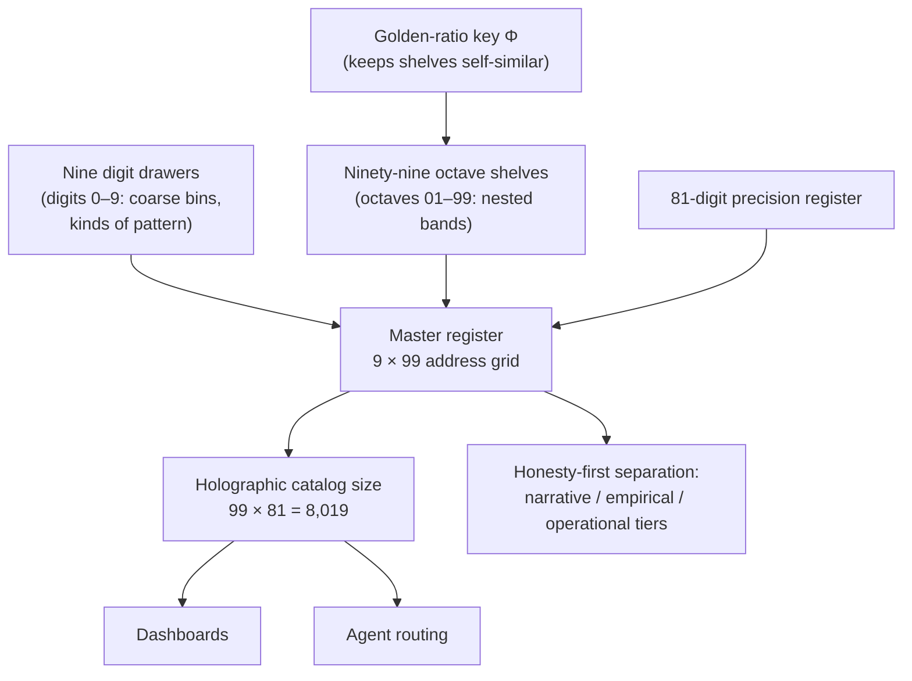

# Nine Digits, Ninety-Nine Octaves {#sec:part_0_octave-map}

{#fig:part_0_octave-map width=90%}

<!-- alt: A vertical ladder of 99 narrow bands labelled 01 through 99, with band boundaries spaced by powers of the golden ratio Φ and nine coarser digit labels (0 through 9) grouped alongside the ladder. -->

<!-- chapter-metadata-badge -->
> Level 1/3 · 30 min read · 45 min lecture · Prerequisites: none

## Learning Objectives

By the end of this chapter you should be able to:
1. State what the [**digit**](#gl:digit)s 0–9 and the [**octave**](#gl:octave)s 01–99 mean in the [**Omni-Lattice**](#gl:omni-lattice) [**master register**](#gl:master-register): coarse bins for kinds of pattern, and nested bands for finer shelves inside each story [@mendez2026digitsMaster].
2. Recite and apply the holographic catalog size $99 \times 81 = 8{,}019$, and say precisely what the corpus files it *for* (dashboards and agent routing) and what it explicitly does *not* file it for (measuring physical systems).
3. Distinguish the two readings of the corpus's ambiguous notation $\Omega_n = \Phi_n \cdot \Omega_0$ — the exponent convention $\Omega_n = \Phi^n \Omega_0$ and the subscript convention $\Omega_n = \varphi_{\mathrm{fib}}(n)\,\Omega_0$ — and compute each with `textbook.models.octave_term`.
4. Explain how the [**golden-ratio**](#gl:golden-ratio) key keeps the 99 shelves self-similar, and why self-similarity is a property of the map's grammar, not a physical claim.
5. Use the map the way the source paper says it should be used: to navigate ("which [**octave**](#gl:octave) band am I in?"), to stay honest (the [**narrative-empirical-operational-tiers**](#gl:narrative-empirical-operational-tiers) stay separate), and to code (the `octave99` nest inherits the same grammar) [@mendez2026digitsMaster].

<!-- curriculum-scaffold-start -->
### Study Blueprint

- **Big idea:** "Nine digits and ninety-nine octaves" is not a spell but a library map — nine kinds of digit drawers, ninety-nine octave shelves, and a golden-ratio key that keeps the shelves self-similar; the map exists for coordination, not cosmic destiny [@mendez2026digitsMaster].
- **Core concepts:** [**digit**](#gl:digit), [**octave**](#gl:octave), [**master register**](#gl:master-register), [**golden-ratio**](#gl:golden-ratio), [**honesty-first**](#gl:honesty-first), [**narrative-empirical-operational-tiers**](#gl:narrative-empirical-operational-tiers).
- **Quantitative lens:** the golden-ratio key in [@eq:part_0_octave-map_exponent] and [@eq:part_0_octave-map_subscript], and the catalog size in [@eq:part_0_octave-map_catalog].
- **Data skill:** compute band positions under both conventions of `octave_term` and verify the catalog size with `catalog_size`, then check any reported number against what it is filed *for*.
- **Common misconception to repair:** the corpus prints "$\Omega_n = \Phi_n \cdot \Omega_0$" ambiguously — it is not obvious whether $\Phi_n$ means $\Phi^n$ (a power) or $\varphi_{\mathrm{fib}}(n)$ (a Fibonacci ratio). The two agree only asymptotically; every worked number in this book states which convention is in force.
- **Primary lab:** [@sec:lab_part_0_octave-map].
- **Question bank:** [@sec:q_part_0_octave-map].
- **Bridge to computation:** `textbook.models.octave_term` and `textbook.models.catalog_size`.
<!-- curriculum-scaffold-end -->

---

> **Opening Vignette: A map you can actually walk.**
>
> On the ship *SS Vibelandia*, the phrase "nine digits and ninety-nine octaves" could sound like a spell. The author's move — filed under the site's plain-speak [**Fair Exchange**](#gl:fair-exchange) framing — is to hang a different object on the wall: a library map. Nine kinds of digit drawers. Ninety-nine octave shelves. A golden-ratio key that keeps the shelves self-similar. A visitor asking "which octave band am I in?" is not invoking cosmology; they are asking a librarian for an aisle number [@mendez2026digitsMaster]. This chapter walks that map aisle by aisle, computes its one headline number honestly, and records, in the corpus's own words, what the map is not.

---

## The paper in the corpus

The source for this chapter is the ship-blog note "Nine digits, ninety-nine octaves — a map you can actually walk" (shelf number 4, section label "Digits master", 2026-08-09), whose whitepaper is filed as `synthobs-99-octave-digits-master-2026-08` [@mendez2026digitsMaster]. It is a short, deliberately plain-speak note: the [**catalog-architecture**](#gl:catalog-architecture) summary layer for a larger corpus. The note itself points deeper — "the Master Digits treatise is the big walkthrough of that map" — and the surrounding corpus develops the same grammar in companion papers: the catalog/protocol framing [@mendez2026catalog], the cross-linking Master Synthesis [@mendez2026masterSynthesis], the digit-by-octave filing of constructs [@mendez2026tensorDecoupling], and the corpus's downward extension of shelf vocabulary toward the [**zero-octave**](#gl:zero-octave) [@mendez2026zeroOctave].

Where does this note sit on the [**engine-shelf**](#gl:engine-shelf)? It is foundational bookkeeping. The papers that follow — filed and cross-indexed in [@sec:part_0_orientation] — reuse its vocabulary constantly: every later "octave band" reference, every dashboard count of catalog addresses, and every tier-separation argument inherits the grammar fixed here. The note is written for two named systems, and the honesty-first line says so plainly: *"this is catalog / protocol grammar for SynthOBS and Lattice Chat"* [@mendez2026digitsMaster].

## Core constructs

### Digits as coarse bins, octaves as nested bands

The first construct is a two-level address scheme (C-synthobs-99-octave-digits-master-3):

- **Digits 0–9 are coarse bins** — "ways to label kinds of pattern" [@mendez2026digitsMaster]. A digit answers the question *what kind of thing is this story about?* It is the drawer label in the library.
- **Octaves 01–99 are nested bands** — "finer shelves inside each story" [@mendez2026digitsMaster]. An octave answers the question *where inside the drawer does this shelf sit?* It is the shelf number.

Together they form the 9-digits × 99-octaves [**master register**](#gl:master-register) (formalism F-synthobs-99-octave-digits-master-1): a grid of nine drawers each subdivided into ninety-nine self-similar shelves, kept coherent by a golden-ratio key. The companion chapter on filing develops the same grid as a register of bins and shows where individual corpus constructs are filed in it [@mendez2026tensorDecoupling]; here we stay with the map itself.

### The golden-ratio key

The map's shelves are "kept self-similar by a golden-ratio key" [@mendez2026digitsMaster]. In the corpus's matrix language this is printed as $\Omega_n = \Phi_n \cdot \Omega_0$, where $\Omega_0$ is the origin band and $\Phi$ is the corpus's [**fractal-constant**](#gl:fractal-constant), $\Phi = (1+\sqrt{5})/2 \approx 1.6180339887$. The notation is ambiguous, and the ambiguity is load-bearing, so this book treats both readings as first-class and implements both behind one tested function, `octave_term(omega0, n, convention)`.

**Reading 1 — the exponent convention.** The band scale grows geometrically in $\Phi$:

$$ \Omega_n = \Phi^{\,n}\,\Omega_0, \qquad \Phi = \frac{1+\sqrt{5}}{2} \approx 1.6180339887 $$ {#eq:part_0_octave-map_exponent}

: Parameters of the exponent convention. {#tbl:part_0_octave-map_exponent}

| Symbol | Meaning | Role |
| ------ | ------- | ---- |
| $\Omega_0$ | origin band (normalised to $1$ in worked examples) | parameter |
| $n$ | octave index | parameter |
| $\Phi$ | golden ratio, $(1+\sqrt{5})/2 \approx 1.6180339887$ | constant |
| $\Omega_n$ | position of band $n$ on the ladder | computed |

The parameters of [@eq:part_0_octave-map_exponent] are collected in [@tbl:part_0_octave-map_exponent]; the ladder these parameters generate — ninety-nine bands whose boundaries are Φ-spaced — is the chapter figure, [@fig:part_0_octave-map].

**Reading 2 — the subscript convention.** The band scale grows by the ratio of consecutive Fibonacci numbers, which is the classic discrete staircase that converges to $\Phi$:

$$ \Omega_n = \varphi_{\mathrm{fib}}(n)\,\Omega_0, \qquad \varphi_{\mathrm{fib}}(n) = \frac{F_{n+1}}{F_n} $$ {#eq:part_0_octave-map_subscript}

: Parameters of the subscript convention. {#tbl:part_0_octave-map_subscript}

| Symbol | Meaning | Role |
| ------ | ------- | ---- |
| $\Omega_0$ | origin band (normalised to $1$ in worked examples) | parameter |
| $n$ | octave index | parameter |
| $F_n$ | $n$-th Fibonacci number ($1, 1, 2, 3, 5, 8, \dots$) | sequence |
| $\varphi_{\mathrm{fib}}(n)$ | ratio $F_{n+1}/F_n$; e.g. $\varphi_{\mathrm{fib}}(5) = 8/5 = 1.6$, $\varphi_{\mathrm{fib}}(10) = 89/55 \approx 1.618182$ | computed |
| $\Omega_n$ | position of band $n$ on the ladder | computed |

[@tbl:part_0_octave-map_subscript] collects the parameters of the subscript reading.

The two readings agree *asymptotically* — $F_{n+1}/F_n \to \Phi$ as $n$ grows, which is standard Fibonacci mathematics — but they disagree for small $n$, and a map with only ninety-nine shelves is full of small $n$. This is the misconception the Study Blueprint flags: when a later paper prints "$\Omega_n = \Phi_n \cdot \Omega_0$", the honest response is to ask which convention is in force, and `octave_term` makes that question explicit in its `convention` argument rather than hiding it in notation.

### The holographic catalog size

The second headline construct is the corpus's most-cited number (formalism F-synthobs-99-octave-digits-master-2, claim C-synthobs-99-octave-digits-master-4). Multiply the ninety-nine segments by an 81-digit precision register:

$$ N_{\mathrm{cat}} = \text{(octave segments)} \times \text{(precision digits)} = 99 \times 81 = 8{,}019 $$ {#eq:part_0_octave-map_catalog}

The inputs to [@eq:part_0_octave-map_catalog] are collected in [@tbl:part_0_octave-map_catalog].

: Parameters of the holographic catalog size. {#tbl:part_0_octave-map_catalog}

| Symbol | Meaning | Value |
| ------ | ------- | ----- |
| octave segments | nested bands on the ladder | $99$ |
| precision digits | width of the precision register | $81$ |
| $N_{\mathrm{cat}}$ | holographic catalog size | $8{,}019$ |

The paper attaches an immediate and unusual use-restriction to its own number: *"That number is for dashboards and agent routing, not for measuring magma"* [@mendez2026digitsMaster]. We read this as the corpus applying its [**honesty-first**](#gl:honesty-first) discipline to arithmetic itself: 8,019 is the address space of a coordination tool, computed by `catalog_size(octaves=99, precision_digits=81)`, and it is a category error to lift it out of that role and paste it onto a physical system. The adjective *holographic* here names a catalog metric; it is not the [**holographic-rhyme**](#gl:holographic-rhyme) four-pillar interference formalism of [@sec:part_I_holographic-rhyme], and the two should not be conflated.

## Worked example: walking the ladder

**Step 1 — grow the ladder (exponent convention).** Normalise $\Omega_0 = 1$ and apply [@eq:part_0_octave-map_exponent] for the first six bands. Implemented as `octave_term(omega0=1, n, convention="exponent")` in `textbook.models`, the values are:

| $n$ | 1 | 2 | 3 | 4 | 5 | 6 |
| --- | - | - | - | - | - | - |
| $\Omega_n = \Phi^n \Omega_0$ | 1.618034 | 2.618034 | 4.236068 | 6.854102 | 11.090170 | 17.944272 |

Notice the beautiful accident of the golden ratio hiding in plain sight: $\Omega_2 = \Phi^2 = \Phi + 1 = 2.618034$, exactly one more than $\Omega_1$. This is standard $\Phi$ algebra, not a corpus claim, but it is the kind of self-similarity the "golden-ratio key" language gestures at.

**Step 2 — grow the same ladder (subscript convention).** Apply [@eq:part_0_octave-map_subscript] with $\Omega_0 = 1$: $\Omega_5 = \varphi_{\mathrm{fib}}(5)\,\Omega_0 = 8/5 = 1.6$ and $\Omega_{10} = \varphi_{\mathrm{fib}}(10)\,\Omega_0 = 89/55 \approx 1.618182$. Compare $\Omega_5$ across conventions: $11.090170$ (exponent) versus $1.6$ (subscript). Same notation, same index, different band — by a factor of nearly seven. This is precisely why the corpus's ambiguous "$\Phi_n$" cannot be left ambiguous in any worked number, and why every figure in this book that draws the ladder states its convention in the caption.

**Step 3 — verify the catalog size.** Call the tested backbone:

```python
from textbook.models import catalog_size
catalog_size(octaves=99, precision_digits=81)   # -> 8019
```

$99 \times 81 = 8{,}019$, matching [@eq:part_0_octave-map_catalog]. Per the paper's own restriction, this number now lives on a dashboard or inside an agent-routing decision — it names the size of the address space the [**catalog-architecture**](#gl:catalog-architecture) offers to SynthOBS and Lattice Chat [@mendez2026digitsMaster].

**Step 4 — navigate, honestly.** The paper lists three uses of the map (C-synthobs-99-octave-digits-master-6). *Navigate*: a working question — say, a sunspot discussion — is assigned a digit bin (what kind of pattern?) and an octave band (which shelf inside the drawer?), and the answer to "which octave band am I in?" becomes a shared, checkable coordinate. *Stay honest*: the [**narrative-empirical-operational-tiers**](#gl:narrative-empirical-operational-tiers) separation means a story-level claim filed on a narrative shelf can be pointed at without being confused with an empirical measurement or an operational deployment. *Code*: a nest named `octave99` inherits the same grammar, so code that walks the map uses the same addresses as prose that describes it [@mendez2026digitsMaster].

The payoff the paper claims for this discipline is coordination without conflation: *"once you have a shared map, sunspot talk, biology metaphors, and deep-cosmic horizons can point at the same shelves without pretending they are the same science"* (C-synthobs-99-octave-digits-master-5) [@mendez2026digitsMaster].



## Scope and honesty

The corpus polices its own claims, and this chapter preserves the policing verbatim in structure. The note's scope line reads: *"this is catalog / protocol grammar for SynthOBS and Lattice Chat. It does not claim the CMB or your bloodstream literally store an 8,019-bit master key"* (C-synthobs-99-octave-digits-master-1, C-synthobs-99-octave-digits-master-2) [@mendez2026digitsMaster]. Three boundaries follow from it:

1. **What the map is FOR**: coordination — navigation between shelves, tier separation, and shared grammar for code (`octave99` nests) and agent routing (the 8,019-address space).
2. **What the map is explicitly NOT**: a claim that physical systems — cosmic microwave background, bloodstream, magma or anything else — literally implement or store the register. The paper volunteers this denial before any reader can supply it.
3. **The closing sentence of the note**: *"the map is for coordination, not cosmic destiny"* (C-synthobs-99-octave-digits-master-7) [@mendez2026digitsMaster]. If a use of the map starts sounding like destiny, it has left the scope the paper filed for it.

We read the 8,019 restriction ("not for measuring magma") as the same discipline applied to the corpus's own arithmetic: numbers, like shelves, have filed purposes, and moving a number to an unfilmed purpose is the quantitative version of mixing tiers.

## Connections

The grammar fixed here is used by every later chapter in this part. The filing chapter develops the same digit × octave grid as a register of bins and locates individual corpus constructs on it — its digit-by-octave heatmap [@fig:part_0_tensor-decoupling] is, in effect, this chapter's ladder viewed from above [@mendez2026tensorDecoupling]. The synthesis chapter surveys how the corpus papers cross-link through precisely these addresses [@mendez2026masterSynthesis], and [@sec:part_0_master-synthesis] works that adjacency in detail. Downstream, Part I develops $\Phi$ itself as the corpus's [**fractal-constant**](#gl:fractal-constant) in [@sec:part_I_fractal-constant] and its Fibonacci-overlay companion, while Part II generalises the octave-band idea to densification curves in [@sec:part_II_metamorphic-octaves]. Companion papers extend the shelf vocabulary below octave 01 — the corpus files a separate treatment of the [**zero-octave**](#gl:zero-octave) [@mendez2026zeroOctave] — and the catalog/protocol framing is developed in [@mendez2026catalog].

## Summary

"Nine digits and ninety-nine octaves" is a library map: digits 0–9 are coarse bins for kinds of pattern, octaves 01–99 are nested bands — finer shelves inside each story — and a golden-ratio key keeps the shelves self-similar [@mendez2026digitsMaster]. The key is printed ambiguously as $\Omega_n = \Phi_n \cdot \Omega_0$; this book resolves the ambiguity by implementing both readings, the exponent convention $\Omega_n = \Phi^n \Omega_0$ and the subscript convention $\Omega_n = \varphi_{\mathrm{fib}}(n)\,\Omega_0$, behind the tested `octave_term` function, and it states the convention wherever a band number is computed. The map's headline number, $99 \times 81 = 8{,}019$ (computed by `catalog_size`), is filed for dashboards and agent routing and explicitly not for measuring physical systems. The map's three uses are navigation, honesty (the narrative, empirical, and operational tiers stay separate), and code (`octave99` nests inherit the grammar); its one-sentence summary, in the paper's own words: the map is for coordination, not cosmic destiny.

## Key Terms

[**digit**](#gl:digit), [**octave**](#gl:octave), [**master register**](#gl:master-register), [**golden-ratio**](#gl:golden-ratio), [**fractal-constant**](#gl:fractal-constant), [**holographic-rhyme**](#gl:holographic-rhyme), [**catalog-architecture**](#gl:catalog-architecture), [**engine-shelf**](#gl:engine-shelf), [**Omni-Lattice**](#gl:omni-lattice), [**honesty-first**](#gl:honesty-first), [**Fair Exchange**](#gl:fair-exchange), [**narrative-empirical-operational-tiers**](#gl:narrative-empirical-operational-tiers), [**zero-octave**](#gl:zero-octave).

## Further Reading

- Whitepaper: [Nine digits, ninety-nine octaves — a map you can actually walk](https://www.ssvibelandiaquestfest24x365.com/interfaces/whitepaper-surface.html?id=synthobs-99-octave-digits-master-2026-08) — the primary source for this chapter; start with its "simple picture" and the honesty-first line [@mendez2026digitsMaster].
- @mendez2026catalog — the catalog/protocol-grammar framing this note summarises; read for the architecture vocabulary.
- @mendez2026masterSynthesis — the Master Synthesis walkthrough of how the corpus papers cross-link through the map's addresses.
- @mendez2026tensorDecoupling — the digit-by-octave filing of individual constructs into the register bins.
- @mendez2026zeroOctave — the corpus's treatment of the zero-octave, extending the shelf vocabulary below octave 01.

## Practice

- **Lab:** [@sec:lab_part_0_octave-map] — walk the ladder by hand and check `octave_term` and `catalog_size` against the pinned values.
- **Question bank:** [@sec:q_part_0_octave-map] — recall through synthesis.
- Compute $\Omega_4$ with $\Omega_0 = 1$ under *both* conventions of [@eq:part_0_octave-map_exponent] and [@eq:part_0_octave-map_subscript]. Which convention gives $6.854102$, and which gives $5/3 \approx 1.666667$? (For the subscript reading you need $F_5/F_4 = 5/3$.)
- Verify `catalog_size(octaves=99, precision_digits=81)` returns $8{,}019$, then write one sentence each for (a) what the paper files that number *for* and (b) what it explicitly files it *not* for.
- A colleague announces that the $8{,}019$-digit register proves the CMB stores a master key. Draft the two-sentence correction using only the source paper's own honesty-first line and its "coordination, not cosmic destiny" summary [@mendez2026digitsMaster].
- Take a problem you are actually working on and file it on the map: choose a digit bin, an octave band, and one of the three tiers. Then answer the paper's navigation question — "which octave band am I in?" — with coordinates a colleague could check.
