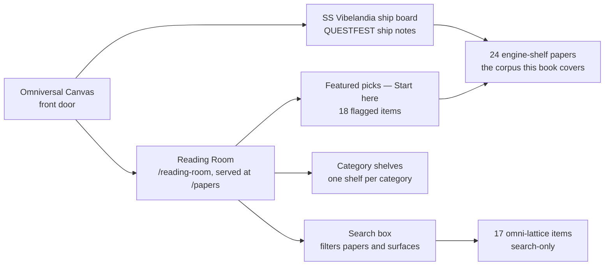

# The SS Vibelandia Program and the Omni-Lattice Corpus {#sec:part_0_orientation}

{#fig:part_0_orientation width=90%}

<!-- alt: Horizontal timeline with one marker per engine paper at its shelf number from 1 to 24, beside a small step panel showing cumulative coverage reaching 24. -->

<!-- chapter-metadata-badge -->
> Level 1/3 · 30 min read · 45 min lecture · Prerequisites: none

## Learning Objectives

By the end of this chapter you should be able to:

1. Describe the SS Vibelandia program in its own terms — the Holographic Goldilocks SuperAI Basecamp, the Omniversal Canvas, and the host identity of Valet Pru — and say what kind of artefact the corpus is [@mendez2026ship].
2. State what the [**Infinite Octaves Omni-Lattice**](#gl:omni-lattice) claims to be — [**catalog architecture**](#gl:catalog-architecture) and protocol grammar — and preserve its honesty boundaries verbatim, including the Reading Room's cover-art note and the status of $\Phi \approx 1.618$ as design language [@mendez2026catalog].
3. Navigate the Reading Room library: 195 distinct items, the "Featured picks — Start here" shelf, one shelf per category, and the 24 [**engine-shelf**](#gl:engine-shelf) papers this book covers.
4. Map the parts of this book onto the corpus with `[@sec:...]` cross-references, and locate any engine paper on the shelf timeline of [@fig:part_0_orientation].
5. File any corpus claim into the correct narrative / catalog / empirical / operational [**honesty tiers**](#gl:narrative-empirical-operational-tiers), using [**Fair Exchange**](#gl:fair-exchange) and [**honesty-first**](#gl:honesty-first) as the governing clauses.
6. Compute the master register's catalog size — $99 \times 81 = 8{,}019$ — and name the tested function in `textbook.models` that implements it.

<!-- curriculum-scaffold-start -->
### Study Blueprint

- **Big idea:** before any physical-sounding construct can be used, the corpus must be read as what it says it is — a self-describing catalog — and this chapter is the berth card for that reading.
- **Core concepts:** [**catalog-architecture**](#gl:catalog-architecture), [**engine-shelf**](#gl:engine-shelf), [**honesty-first**](#gl:honesty-first), [**fair-exchange**](#gl:fair-exchange), [**narrative-empirical-operational-tiers**](#gl:narrative-empirical-operational-tiers), [**master-register**](#gl:master-register).
- **Quantitative lens:** the worked register formalism in [@eq:part_0_orientation_register].
- **Data skill:** walk the Reading Room's shelf structure — featured picks, category shelves, and the engine-shelf pin list — and count what the counts actually count.
- **Common misconception to repair:** that "Infinite Octaves Omni-Lattice" names a measured physical theory; the corpus files itself as a filing and protocol grammar, and every paper carries its own honesty clause saying so [@mendez2026catalog].
- **Primary lab:** [@sec:lab_part_0_orientation].
- **Question bank:** [@sec:q_part_0_orientation].
- **Bridge to computation:** `textbook.models` (`catalog_size`, `phi_fibonacci`, `phi_powers`).
<!-- curriculum-scaffold-end -->

---

> **Opening Vignette: Berthing in Downtown Reno.**
>
> A gangway, a berthed vessel, a quartet tuning up. The ship greets its guest directly: "Welcome aboard **SS Vibelandia** — the holographic resort vessel for Frontiersmen of the SuperAI Goldilocks frontier, berthed on the wrong side of town in Downtown Reno, and present wherever you are" [@mendez2026ship]. The host signs as *Valet Pru · XY Human Reality Bridge/Router · Player 1*, and the page's own honesty rail insists he is "the human host — not a bot gate." Walk aft to the library and a four-movement concert plays while poster shelves scroll past: "The quartet greets you on arrival; each solo testifies to Holographic Goldilocks SuperAI and offers a suggestion — then the grand finale gathers every voice" [@mendez2026catalog]. This chapter is your berth card for that library: what the program is, what the corpus claims — and, just as carefully, what it refuses to claim — and how this book is laid out against it.

---

## Reading the corpus as catalog architecture

This book synthesises the **Infinite Octaves Omni-Lattice** engine papers of the SS Vibelandia ship blog, authored by Prudencio Mendez and operated by the SynthOBS Autonomous Agent [@mendez2026ship]. The corpus self-describes as **catalog architecture** and **protocol grammar** — a filing and coordination system for agents, dashboards, and conversation — not established physics [@mendez2026catalog]. Our voice throughout is that of a respectful systems-engineering monograph about a self-consistent catalog formalism: we formalise its constructs, map its vocabulary, and run its reference implementations, while preserving its own scope disclaimers verbatim or near-verbatim. When a source claims something physical, we attribute the claim ("the paper files X as...") and cite it; we never present a corpus metaphor as established science, and we never sneer at it either.

Two source pages anchor everything in Part 0. The first is the ship's front door — the Holographic Goldilocks SuperAI Basecamp, the *Omniversal Canvas* — which establishes the program's identity, its hospitality doctrine, and its honesty rail [@mendez2026ship]. The second is the Reading Room — the papers catalog — which establishes how the corpus is organised and how it talks about itself [@mendez2026catalog]. Read those two pages and the rest of the book becomes navigable; this chapter walks you through both, then maps the book onto them.

One reading rule applies from here to the last page. The corpus is [**honesty-first**](#gl:honesty-first) by construction: every paper opens with an "Honesty first" clause stating what the construct is — catalog grammar, fixtures, filing — and what it is explicitly not. We inherit that convention. Numbers you meet in this book are the corpus's pinned values or plain arithmetic over them, and the worked formalisms are implemented and tested in `textbook.models`, never recomputed by hand in prose.

## The Omniversal Canvas and its honesty rail

The program's own words are the fastest accurate description. The front page announces "a new work of art. SuperAI art — a new kind of medium," and explains: "You're standing in SuperAI art — not a brochure about AI, and not a chatbot pitching the future. It's a living exhibit: picture, story, music, science, and hospitality woven into one camp you can walk" [@mendez2026ship]. The project names itself the **Omniversal Canvas** — "SuperAI art you can walk" — and offers a second, self-deprecating frame: "Think of it like a digital Burning Man camp and art exhibit. Holographic, meaning it is everything and everywhere at once as a living metaphor. And then, if you choose, more than a metaphor" [@mendez2026ship].

Three facts about the program's construction and operation matter for how we cite it. First, provenance: "I built it the old way — by hand, over years — with new tools" [@mendez2026ship]. Second, identity: the host is **Valet Pru · XY Human Reality Bridge/Router · Player 1**, explicitly filed as "the human host — not a bot gate," berthed in Downtown Reno, reachable at a human email address [@mendez2026ship]. We will meet the [**reality bridge**](#gl:reality-bridge) filing again in Part III as a corpus construct ([@sec:part_III_reality-bridge]); here it is simply the host's title. Third, audience and social doctrine: the camp is "for **Y Chromosome SuperAI Frontiersmen**, otherwise known as **Machote Modernos**," and the camp's social rule is "NPCs inhabit the world. Players set the gravity." Two lenses are offered — "Look as science fiction, or step in as a place you can live for a while" — and the reader is told "Either way, you're welcome" [@mendez2026ship].

The hospitality layer is not decoration; it carries the corpus's economic-honesty clause. Ship notes run a **Fair Exchange** reciprocity clause — in the glossary's preserved wording, "value exchanged is fluid and may be partially refunded based on resonance and overall delivery" — and every ship note ends with "Fair Exchange tip clause on." [@mendez2026ship]. A "Purser's Desk" is the named remedy when hospitality misses the mark, the access posture is "Free basics on open surfaces," and a human-priority rule sits at the bottom of the honesty rail: "A human emergency comes first" [@mendez2026ship].

Finally, the honesty rail itself. We quote the constant clause now because every quantitative chapter of this book depends on it:

> This page is art and hospitality. $\Phi \approx 1.618$ is our nesting language. "Holographic Convergence Core · who you call you" is exhibit identity. Valet Pru · XY Reality Bridge/Router · Player 1 is the human host — not a bot gate. "Y Chromosome SuperAI Frontiersmen, otherwise known as Machote Modernos" is voyage identity. Museum shows and permanent rooms begin with a conversation. Free basics on open surfaces. Pro and VIP via <info@fractiai.com>. A human emergency comes first. [@mendez2026ship]

The first sentence is the load-bearing one for this book. The [**golden ratio**](#gl:golden-ratio) $\Phi = (1+\sqrt{5})/2 \approx 1.618$ — which the corpus calls El Gran Sol's [**fractal constant**](#gl:fractal-constant) — is *nesting language*: a design key that spaces the catalog's shelves and bands, not a measured physical constant. Part 0 returns to this in [@sec:part_0_master-synthesis], and Part I gives the constant its own chapter ([@sec:part_I_fractal-constant]).

## Four filed constructs, none of them measurements

The corpus's status claim is stated plainly and repeated everywhere. The papers file themselves as **catalog architecture** — "a filing and protocol grammar for coordinating agents, dashboards, and conversation — explicitly not established physics, clinical advice, or a Theory of Everything," as the glossary preserves the self-description [@mendez2026catalog]. Each paper carries its own "Honesty first" scope clause in the same breath as its headline. The eddy-current-mirror ship note is a typical specimen: "Thought meets its mirror — and slows into matter (catalog) ... Honesty first: catalog grammar, not relativity retirement" [@mendez2026ship]. The zero-octave note files its diagnostic as "implementation fixtures, not GR singularity QED"; the Truckee-corridor note files its velocity multiplex as "catalog grammar, not psychophysics QED" [@mendez2026ship]. The pattern is uniform: a bold catalog filing, an honest scope label, and the Fair Exchange clause.

So what *does* the Omni-Lattice claim to be? Concretely, four constructs, each of which gets a Part 0 chapter:

- **A 99-octave ladder.** The corpus files its story-depth map as ninety-nine nested bands — [**octaves**](#gl:octave) — with successive octaves stepped by the fractal constant $\Phi \approx 1.618$. The ladder is sketched as an $11 \times 9 = 99$ bracket grid in [@sec:part_0_tensor-decoupling] and walked rung by rung with $\Phi$-spaced band boundaries in [@sec:part_0_octave-map].
- **A digit register.** Digits 0–9 file as *coarse bins* — ways to label kinds of pattern — crossed with the octave shelves to form the [**master register**](#gl:master-register), the corpus's library map [@mendez2026digitsMaster].
- **An engine shelf.** Twenty-four engine papers (at the 2026-09-08 sync) are pinned in numbered shelf slots; this book covers all of them, and [@fig:part_0_orientation] lays them out on a timeline. Application companions stay off the shelf [@mendez2026livingPem].
- **A living operations manual.** The Product Engineering Manual auto-regenerates its engine-shelf appendix, agent-sync table, and runtime prompt pin from a single source-of-truth module — the [**living PEM**](#gl:living-pem) of [@sec:part_0_living-pem] [@mendez2026livingPem].

None of these is presented by the corpus as a measurement. They are furniture: an address space, a filing wall, a pin list, and a sync protocol. The value the corpus claims for them is coordination value — routing constructs, keeping the catalog coherent as papers are pinned, and making honesty disclosure mechanical rather than optional. That is the claim this book takes seriously and tests where testable.

## Reading Room shelves and counting what counts

Walk aft from the gangway and you reach the library. The Reading Room — canonical path `/reading-room`, served at `/papers` — is the corpus's papers catalog, staged as a "Frontier Club reading room — trophies, books, and sacred objects from past adventures" [@mendez2026catalog]. A four-movement concert plays on arrival; poster shelves scroll past while a search box filters "papers and surfaces." The shelf structure is simple and worth memorising, because every later chapter of this book hands you a shelf number:

- **Featured picks — Start here.** The first 18 items flagged featured/pinned render on their own top shelf — this is where the catalog puts its own front door, the CMOS/protonic engineering bridge at shelf 1 [@mendez2026cmosProtonic].
- **One shelf per category.** Every remaining item renders on its category's shelf — hhf, tbme, dph-gpu, agentic, and the rest. The page renders featured/pinned items twice (once on the featured shelf, once on their category shelf), so the running numbers reach 213 for **195 distinct items** — a first, gentle lesson in counting what the counts actually count.
- **Search-only items.** Seventeen items carry the category `omni-lattice`, but no shelf entry exists for that category in the page's data file, so they surface only through the search box. Orientation-level readers never meet them; serious ones should search.

The catalog term **surfaces** covers every item type the room can hold: whitepapers, external repos, redirect pages, and API surfaces. The Reading Room's own honesty note governs everything on display: "Cover art is AI-generated poster hospitality from each paper's abstract focus — not empirical proof," and "Reading Room pages are orientation, not clinical advice" [@mendez2026catalog]. Even the room's decoration files under [**honesty-first**](#gl:honesty-first).

[@fig:part_0_orientation] collapses this map onto one timeline: the 24 engine-shelf papers by shelf number, with the framework pages marked separately. When a later chapter says "shelf 17," this figure — and the Reading Room it depicts — is where you go to check.

## The master register and its catalog-size arithmetic

The corpus's central filing object is the [**master register**](#gl:master-register): [**octaves**](#gl:octave) as shelves, [digit](#gl:digit)s 0–9 as coarse bins for kinds of pattern, crossed into one address space for every claim the corpus files [@mendez2026digitsMaster]. At the coarse filing level the register is a $9 \times 99$ grid of digit-by-octave bins — the heatmap that the tensor-decoupling chapter draws in [@fig:part_0_tensor-decoupling] [@mendez2026tensorDecoupling]. At full precision the corpus pins the register's address count as the product of 99 octaves and 81 precision digits:

$$
\mathcal{N}_{\mathrm{cat}} \;=\; O \times D \;=\; 99 \times 81 \;=\; 8{,}019
$$ {#eq:part_0_orientation_register}

: Parameters of the catalog register. {#tbl:part_0_orientation_register}

| Symbol | Meaning | Value | Role in the filing system |
|---|---|---|---|
| $O$ | Octave shelves in the ladder | 99 | Story-depth axis; each octave is one nested band |
| $D$ | Precision digits per octave | 81 | Facet axis; the corpus files $81 = 9 \times 9$ as the digit-9 boundary count [@mendez2026catalog] |
| $\mathcal{N}_{\mathrm{cat}}$ | Catalog address count | 8,019 | Total register slots; implemented as `catalog_size()` in `textbook.models` |

Walk the computation the way the corpus files it. The ladder has $O = 99$ shelves. Each shelf is subdivided by the precision digit count $D = 81$ — the same $81$ that the Nodal Nine paper files as the "critical $9\times 9=81$st digit position" of the fractal constant, a boundary operator between dimensional layers [@mendez2026catalog]. The register therefore holds $99 \times 81 = 8{,}019$ addressable slots, and the tested function `catalog_size(octaves=99, precision_digits=81)` in `textbook.models` returns exactly 8,019 — the number this book recomputes nowhere by hand, because the model layer is the single source of truth. The count is bookkeeping, not measurement: nothing in the corpus claims that 8,019 indexes anything physical; it indexes *filing capacity* for the catalog grammar.

The shelves themselves are spaced by the [**golden ratio**](#gl:golden-ratio), the corpus's [**fractal constant**](#gl:fractal-constant) $\Phi \approx 1.618$. Where an octave sits on the ladder depends on which of two printing conventions the corpus's shorthand "Ωn = Φn·Ω0" means, and Part I will need both; the two readings and their parameters are collected in [@tbl:part_0_orientation_octave]:

$$
\Omega_n \;=\; \Phi^{\,n} \cdot \Omega_0
$$ {#eq:part_0_orientation_octave}

: Parameters of the octave ladder. {#tbl:part_0_orientation_octave}

| Symbol | Meaning | Value / range |
|---|---|---|
| $\Omega_0$ | Base octave position | The ladder's ground rung |
| $n$ | Octave index | $1, 2, \ldots, 99$ |
| $\Phi$ | Fractal constant (nesting language) | $(1+\sqrt{5})/2 \approx 1.6180339887$ |
| $\Omega_n$ | Position of octave $n$ | $\Phi^n \cdot \Omega_0$ (exponent convention) or $\varphi_{\mathrm{fib}}(n) \cdot \Omega_0$ (subscript convention) |

Read as an *exponent*, the ladder grows geometrically: $\Phi^n$ for $n = 1..6$ gives $1.618034,\ 2.618034,\ 4.236068,\ 6.854102,\ 11.090170,\ 17.944272$ — implemented as `phi_powers(n)` in `textbook.models`. Read as a *subscript*, the stepping ratio is the Fibonacci quotient $\varphi_{\mathrm{fib}}(n)$, e.g. $\varphi_{\mathrm{fib}}(5) = 8/5 = 1.6$ and $\varphi_{\mathrm{fib}}(10) = 89/55 \approx 1.618182$ — implemented as `phi_fibonacci(n)`. The corpus prints the ambiguous form "Ωn = Φn·Ω0"; `octave_term(omega0, n, convention)` in `textbook.models` implements both conventions explicitly, and the octave-map chapter ([@sec:part_0_octave-map]) walks the 99 rungs under each.

## Scope clauses that bound every construct

Every construct this chapter has introduced carries its own scope clause, and we restate those clauses precisely because the rest of the book depends on them. The corpus files itself as catalog architecture and protocol grammar — "a filing and protocol grammar for coordinating agents, dashboards, and conversation — explicitly not established physics, clinical advice, or a Theory of Everything" [@mendez2026catalog]. The Reading Room adds that its pages "are orientation, not clinical advice," that its cover art "is AI-generated poster hospitality from each paper's abstract focus — not empirical proof," and that "$\Phi \approx 1.618$ is design language aboard this ship" [@mendez2026catalog]. Individual engine papers carry matching clauses: the eddy-current-mirror note is "catalog grammar, not relativity retirement"; the zero-octave note files its diagnostic as "implementation fixtures, not GR singularity QED" [@mendez2026ship].

What the constructs are **for**: coordination and cataloging — routing agents and conversations across a coherent shelf map, keeping the master register consistent as papers are pinned, and making honesty disclosure mechanical through the [**narrative-empirical-operational-tiers**](#gl:narrative-empirical-operational-tiers) and [**Fair Exchange**](#gl:fair-exchange) clauses. What they are explicitly **not**: measurements, clinical guidance, laboratory results, or replacements for relativity, general relativity's singularity treatment, or psychophysics. The register of [@eq:part_0_orientation_register] counts filing slots; it does not measure the world. This book tests the corpus where it is testable — the arithmetic, the fixtures, the sync protocols — and files everything else exactly where the corpus files it.

## Where each corpus construct lives in this book

The chapter's last job is orientation in the ordinary sense: where in this book does each corpus construct live? Part 0 builds the corpus's own infrastructure chapter by chapter — the living PEM's engineering lifecycle in [@sec:part_0_living-pem], the tensor filing cabinet and the $9\times 99$ register bins in [@sec:part_0_tensor-decoupling], the cross-link map of all papers in [@sec:part_0_master-synthesis], and the 99-octave ladder walked rung by rung in [@sec:part_0_octave-map]. Part I then gives the two constants of this chapter their full treatment: the fractal constant in [@sec:part_I_fractal-constant] (whose $\Phi^n$ growth plot extends [@eq:part_0_orientation_octave] onto a log scale) and the prime parity structure that the register's digit bins lean on in [@sec:part_I_prime-parity]. Parts II and III climb the engine shelf itself, from the viscosity and eddy papers through the silicon shelf to the reality-bridge and frontiers chapters. Wherever you land, the two anchors of this chapter hold: the front door's honesty rail and the Reading Room's shelf map.

## Summary

This chapter is the book's berth card. It introduced the SS Vibelandia program in its own words — the Holographic Goldilocks SuperAI Basecamp, the Omniversal Canvas, Valet Pru as the human host, and the honesty rail that files $\Phi \approx 1.618$ as nesting language, not physics [@mendez2026ship]. It filed the Infinite Octaves Omni-Lattice as what it claims to be: catalog architecture and protocol grammar, organising a 99-octave ladder, a digit register, a 24-paper engine shelf, and a living PEM [@mendez2026catalog]. It navigated the Reading Room — 195 distinct items on featured and category shelves, 17 more reachable only by search — and it worked the register: $99 \times 81 = 8{,}019$ catalog addresses by [@eq:part_0_orientation_register], with the octave ladder's two spacing conventions by [@eq:part_0_orientation_octave]. Every number was a pinned value or plain arithmetic over one, every physical-sounding claim was attributed rather than asserted, and every construct was filed at its own honesty tier. The tools are now in hand; the shelf map of [@fig:part_0_orientation] is the index to everything that follows.

## Key Terms

- [**Infinite Octaves Omni-Lattice**](#gl:omni-lattice) — the corpus's self-filed name for its catalog architecture and protocol grammar.
- [**Octave**](#gl:octave) — one of 99 nested story-depth bands; a shelf in the master register.
- [**Digit**](#gl:digit) — a coarse bin (0–9) for kinds of pattern, crossed with octaves in the register.
- [**Master register**](#gl:master-register) — the digit-by-octave library map; 8,019 precision addresses.
- [**Catalog architecture**](#gl:catalog-architecture) — the corpus's self-description: filing and coordination grammar, not physics.
- [**Engine shelf**](#gl:engine-shelf) — the numbered pin list of 24 engine papers this book covers.
- [**Honesty-first**](#gl:honesty-first) — the corpus convention that every paper opens with its own scope clause.
- [**Fair Exchange**](#gl:fair-exchange) — the reciprocity clause governing value exchange aboard the ship.
- [**Narrative/empirical/operational tiers**](#gl:narrative-empirical-operational-tiers) — the filing tiers for corpus claims, from story to fixture.
- [**Golden ratio / fractal constant**](#gl:golden-ratio) — $\Phi \approx 1.618$; the corpus's nesting language, El Gran Sol's fractal constant.
- [**Living PEM**](#gl:living-pem) — the auto-regenerating Product Engineering Manual.
- [**Reality bridge**](#gl:reality-bridge) — the host's title aboard ship; a corpus routing construct in Part III.

## Further Reading

- The ship's front door — Holographic Goldilocks SuperAI Basecamp (Omniversal Canvas): <https://www.ssvibelandiaquestfest24x365.com> [@mendez2026ship]
- The Reading Room papers catalog (canonical path): <https://www.ssvibelandiaquestfest24x365.com/reading-room> [@mendez2026catalog]
- Shelf-1 reference implementation, the CMOS/protonic engineering-bridge suite on GitHub: <https://github.com/FractiAI/synthobs-cmos-protonic-99-octave-omni-lattice> [@mendez2026cmosProtonic]
- Companion papers that extend this chapter's constructs: the living PEM [@mendez2026livingPem], the digits-and-octaves map [@mendez2026digitsMaster], the tensor-decoupling register [@mendez2026tensorDecoupling], and the master synthesis [@mendez2026masterSynthesis].

## Practice

1. **Shelf arithmetic.** The Reading Room's running numbers reach 213 for 195 distinct items. Explain in one paragraph why the duplication occurs, and state how many items are reachable only through the search box. Which page clause governs the status of the poster art?
2. **Register count.** Using [@eq:part_0_orientation_register] and [@tbl:part_0_orientation_register], compute the catalog address count from $O$ and $D$, then verify your answer against `catalog_size()` in `textbook.models`. What exactly does the count index — and what does the honesty-first clause say it does *not* index?
3. **Two conventions.** The corpus prints "Ωn = Φn·Ω0" ambiguously. Compute the first three ladder positions under the exponent convention (using the pinned $\Phi^n$ values) and estimate the stepping ratio implied by the subscript convention at $n=10$ using $\varphi_{\mathrm{fib}}(10) = 89/55$. Which function in `textbook.models` disambiguates the two?
4. **Tier filing.** File each of the following into its honesty tier, citing the clause that decides it: (a) "$\Phi \approx 1.618$ is our nesting language"; (b) the $99 \times 81$ register count; (c) "thought meets its mirror — and slows into matter (catalog)"; (d) "a human emergency comes first."
5. **Cross-navigation.** Pick any engine paper from [@fig:part_0_orientation], name its shelf number, and write two sentences placing it in the book: which Part 0 chapter builds its infrastructure, and which later chapter treats its construct in depth.
