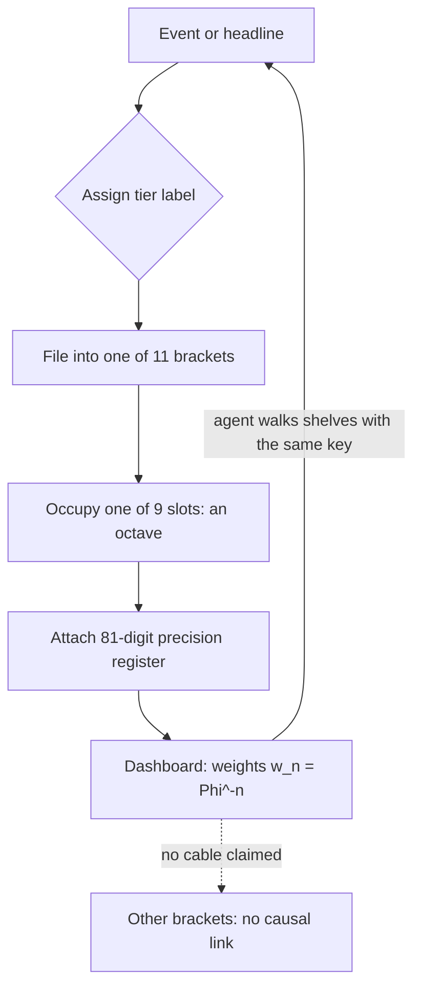

# Tensor Decoupling: Filing the Engine {#sec:part_0_tensor-decoupling}

![The digit-by-octave filing heatmap: a 9-row by 99-column grid of register bins, each cell shaded by the value of digit × octave mod 9, with the residue-0 bins outlined in vermillion. Computed deterministically from the digit drawers 1–9 and octave indices 1–99 — a filing layout rather than a `textbook.models` call, though the cabinet's capacity is pinned by `catalog_size(octaves=99, precision_digits=81)` = 8,019 in `textbook.models`. Notice the residue-0 cells recurring in a fixed diagonal pattern across the grid — the periodic fingerprint of the mod-9 filing rule.](../../output/figures/part_0_tensor-decoupling.png){#fig:part_0_tensor-decoupling width=90%}

<!-- alt: A heatmap with nine digit-drawer rows and ninety-nine octave columns, shaded by a mod-9 filing rule, with a fixed diagonal set of residue-zero cells outlined. -->

<!-- chapter-metadata-badge -->
> Level 1/3 · 30 min read · 45 min lecture · Prerequisites: none

<!-- curriculum-scaffold-start -->
### Study Blueprint

- **Big idea:** [**Tensor decoupling**](#gl:tensor-decoupling) files every event into a labelled layer of a shared 99-octave [**catalog**](#gl:catalog-architecture) instead of collapsing many headlines into one cause — or pretending the layers never share a bulletin board.
- **Core concepts:** [**tensor-decoupling**](#gl:tensor-decoupling), [**octave**](#gl:octave), [**digit**](#gl:digit), [**catalog-architecture**](#gl:catalog-architecture), [**honesty-first**](#gl:honesty-first), [**fractal-constant**](#gl:fractal-constant).
- **Quantitative lens:** the worked formalism in [@eq:part_0_tensor-decoupling_model], backed by the register budgets of [@eq:part_0_tensor-decoupling_block] and [@eq:part_0_tensor-decoupling_catalog].
- **Data skill:** reading a digit×octave filing heatmap and computing register budgets (729 per block, 8,019 in total) with `textbook.models.catalog_size`.
- **Common misconception to repair:** that a shared bulletin board implies a causal cable between layers. The corpus explicitly disclaims any "magic cable" between, say, magma and model weights [@mendez2026tensorDecoupling].
- **Primary lab:** [@sec:lab_part_0_tensor-decoupling].
- **Question bank:** [@sec:q_part_0_tensor-decoupling].
- **Bridge to computation:** `textbook.models` (`catalog_size`, `phi_powers`, `octave_term`).
<!-- curriculum-scaffold-end -->

---

> **Opening Vignette: Ninety-nine slots on a ship**
>
> "Imagine eleven shelves, nine slots each — ninety-nine in all. On those shelves you can park earthquakes, volcanoes, solar weather, AI token routes, and the weird week inside your own head." That is how the SS Vibelandia ship blog introduces **tensor decoupling**: not as an equation, but as a piece of furniture — a filing cabinet bolted to the deck of a research vessel, with exactly enough room for a very strange week of news [@mendez2026tensorDecoupling]. The cabinet is the mental object this chapter formalises.

---

## Learning Objectives

By the end of this chapter you should be able to:

1. Define **tensor decoupling** as the corpus's "labelled layers on one bulletin board" move, and contrast it with its two failure modes: one-cause-per-headline collapse and no-sharing isolation.
2. Derive and reconcile the paper's two numbers: the per-block precision matrix $9 \times 81 = 729$ and the octave ladder $11 \times 9 = 99$, and show how they tile the companion papers' $99 \times 81 = 8{,}019$ holographic catalog digits via `catalog_size`.
3. Apply the $\Phi^{-n}$ shelf scaling as a "dashboard dial" and compute register weights for $n = 1, \dots, 6$ using the pinned values of $\Phi$.
4. Distinguish the two octave conventions the corpus prints ambiguously — $\Omega_n = \Phi^n \Omega_0$ versus $\Omega_n = \varphi_{\mathrm{fib}}(n)\,\Omega_0$ — using `octave_term` in `textbook.models`.
5. Restate the paper's honesty-first scope in your own words: a catalog clock is not a prophecy engine, and no cross-domain cable is claimed between co-timed events.

## Labelled layers on one bulletin board

The Infinite Octaves [**Omni-Lattice**](#gl:omni-lattice) is presented by its authors as a [**catalog architecture**](#gl:catalog-architecture): a way of filing events, agents, and measurements into a common grammar, not a theory of why the events happen. The paper this chapter is built on — "The 99 Octave engine as a tensor filing cabinet", filed on the ship blog on 2026-08-12 under the site's plain-speak [**Fair Exchange**](#gl:fair-exchange) label — is the corpus's most concrete statement of that filing move [@mendez2026tensorDecoupling; @mendez2026ship].

The word "decoupling" is doing careful work here. In ordinary engineering, decoupling means isolating subsystems so a fault in one does not propagate. The corpus means something subtly different: **stop smushing every headline into one cause, and also stop pretending the headlines never share a bulletin board** [@mendez2026tensorDecoupling]. Both extremes are errors. A single-cause model crushes eleven genuinely different layers (crust, ocean heat, ionosphere, agent code, human nerves, …) into one pseudo-explanation. A fully isolated model loses the one thing the catalog is for — a shared board where an agent can see all the layers at once, each in its own labelled drawer. Decoupling, in this framework, is the disciplined middle: **label each layer, then let an agent walk the shelves with the same golden-ratio key** [@mendez2026tensorDecoupling].

## Shelf 2: engine grammar before the quantitative papers

The paper sits at shelf number 2 of the corpus's [**engine shelf**](#gl:engine-shelf) — early framing material, before the quantitative engine papers. Its self-description is engine grammar "for Lattice Chat and the Omni-Lattice library": vocabulary and furniture that later papers assume. Three cross-links matter for this book:

- **The holographic catalog digits.** The paper's own sketch is deliberately small (729 digits per block); it notes that "companion papers still keep the bigger 99 × 81 = 8,019 holographic catalog digits" [@mendez2026tensorDecoupling]. We treat the master register accounting in [@sec:part_0_master-synthesis] as the canonical home of that larger figure.
- **The octave ladder.** The 11 × 9 = 99 ladder sketched here is walked rung by rung — with $\Phi$-spaced band boundaries — in [@sec:part_0_octave-map]; see also the ladder figure [@fig:part_0_octave-map].
- **The honesty rails.** The paper instructs builders to "teach the eleven brackets and the honesty table first" — the [**honesty-first**](#gl:honesty-first) framing is developed alongside the lifecycle view of [@sec:part_0_living-pem].

The whitepaper ("Open the whitepaper" on the ship blog post) is filed under the identifier `synthobs-tensor-decoupling-99-octave-omni-lattice-2026-08` on the SS Vibelandia site. The digest lists no GitHub reference implementation for this paper; the computational companion for this chapter is the tested `textbook.models` module, which we use throughout.

## Ladder counts, precision blocks, and the shelf dial

### Construct 1: the octave ladder ($11 \times 9 = 99$)

The filing cabinet has eleven shelves — the corpus calls them **brackets** — each holding nine slots. The paper names all eleven: crust, ocean heat, ionosphere, volcano plumbing, solar wind, orbital clock, wildfire talk, agent code, human nerves, deployment window, and master band [@mendez2026tensorDecoupling]. The ladder count is the first load-bearing formalism:

$$
N_{\text{ladder}} \;=\; B \times s \;=\; 11 \times 9 \;=\; 99 \quad \text{octaves},
$$ {#eq:part_0_tensor-decoupling_ladder}

where $B$ is the number of shelf brackets and $s$ the slots per bracket. Each of the 99 positions is one [**octave**](#gl:octave) of the catalog. [@tbl:part_0_tensor-decoupling_shelves] lists the brackets in the order the paper files them.

: The eleven shelf brackets of the 99-octave ladder, in filing order. {#tbl:part_0_tensor-decoupling_shelves}

| Bracket $b$ | Shelf (as named in the paper) | Flavour of content filed there |
| ------ | ------- | ----- |
| 1 | crust | solid-earth events |
| 2 | ocean heat | marine thermal stories |
| 3 | ionosphere | upper-atmosphere weather |
| 4 | volcano plumbing | magmatic alert stories |
| 5 | solar wind | space weather |
| 6 | orbital clock | celestial timing |
| 7 | wildfire talk | fire-related narrative |
| 8 | agent code | machine-agent behaviour |
| 9 | human nerves | first-person inner stories |
| 10 | deployment window | release and rollout timing |
| 11 | master band | the register that watches the other ten |

### Construct 2: the per-block precision matrix ($9 \times 81 = 729$)

Each shelf is not just nine bare slots: the paper's sketch gives every block a precision register of 81 digits per slot — the same [**digit**](#gl:digit) precision the corpus uses everywhere:

$$
C_{\text{block}} \;=\; s \times p \;=\; 9 \times 81 \;=\; 729 \quad \text{digits per block},
$$ {#eq:part_0_tensor-decoupling_block}

with $p = 81$ the precision register per slot. The paper is explicit that this is "this paper's sketch" — its own local accounting, not the whole catalog.

### Construct 3: the holographic catalog digits ($99 \times 81 = 8{,}019$)

The companion papers keep the full register: every one of the 99 octaves carries the 81-digit precision register, giving the corpus-wide total implemented as `catalog_size(octaves=99, precision_digits=81)` in `textbook.models`:

$$
C_{\text{catalog}} \;=\; N_{\text{ladder}} \times p \;=\; 99 \times 81 \;=\; 8{,}019 \quad \text{digits}.
$$ {#eq:part_0_tensor-decoupling_catalog}

We read the relationship between the two accountings as a clean tiling identity — pure arithmetic, not a corpus claim: the per-block sketch of [@eq:part_0_tensor-decoupling_block] replicated across the eleven brackets of [@eq:part_0_tensor-decoupling_ladder] gives exactly $729 \times 11 = 8{,}019$, the catalog total of [@eq:part_0_tensor-decoupling_catalog]. The paper itself flags the bookkeeping difference ("companion papers still keep the bigger … digits" [@mendez2026tensorDecoupling]); the tiling is why the two figures never actually disagree.

### Construct 4: shelf scaling by the fractal constant

El Gran Sol's [**fractal constant**](#gl:fractal-constant) — the [**golden ratio**](#gl:golden-ratio), $\Phi \approx 1.618$ — "scales the shelves: $\Phi^{-n}$ for octave $n$" [@mendez2026tensorDecoupling]:

$$
w_n \;=\; w_0\,\Phi^{-n}, \qquad \Phi = \frac{1+\sqrt{5}}{2} \approx 1.6180339887,
$$ {#eq:part_0_tensor-decoupling_model}

implemented as `phi_powers(n)` (which returns $\Phi^n$; the shelf weight is its reciprocal) in `textbook.models`. The parameters are collected in [@tbl:part_0_tensor-decoupling_parameters].

: Parameters of the shelf-scaling model. {#tbl:part_0_tensor-decoupling_parameters}

| Symbol | Meaning | Units |
| ------ | ------- | ----- |
| $n$ | octave index along the ladder ($1 \le n \le 99$) | — |
| $w_n$ | register weight (dashboard-dial reading) of octave $n$ | relative |
| $w_0$ | reference weight at the dial's zero | relative |
| $\Phi$ | golden ratio, the corpus's fractal constant | — |

A crucial framing warning from the paper itself: on the ship, $\Phi^{-n}$ "is a dashboard dial, not a replacement for real physics constants" [@mendez2026tensorDecoupling]. The scaling orders the shelves for an agent walking them; it does not enter any physical law.

The corpus prints its octave growth rule ambiguously as "$\Omega_n = \Phi^n \Omega_0$", and the book keeps both readings visible, implemented as `octave_term(omega0, n, convention)` in `textbook.models`: the **exponent** convention $\Omega_n = \Phi^{n}\,\Omega_0$ (compounding growth) and the **subscript** convention $\Omega_n = \varphi_{\mathrm{fib}}(n)\,\Omega_0$, where $\varphi_{\mathrm{fib}}$ is the Fibonacci-ratio sequence ($\varphi_{\mathrm{fib}}(5) = 8/5 = 1.6$; $\varphi_{\mathrm{fib}}(10) = 89/55 \approx 1.618182$). The shelf dial of [@eq:part_0_tensor-decoupling_model] is the reciprocal frame of the exponent convention — $w_n \propto \Omega_n^{-1}$ with $\Omega_0 = 1$ — which is why deeper shelves read *smaller* on the dashboard.

The filing pipeline, from raw event to dashboard, is summarised below.

Note the dashed edge: the dashboard lets an agent *see* all brackets at once — that is the shared bulletin board — while explicitly asserting no causal cable between them.

## Worked Example: Filing an August 2026 Week

The paper grounds the cabinet in a concrete week of August 2026 fixtures. We walk the filing steps and the arithmetic end to end.

**Step 1 — Assign tiers.** Colombia's strong quake story and Puracé's orange-alert story "sit on Tiers I and IV as co-timed labels"; solar noise and Lattice Chat "sync" stories sit higher; inner-clarity stories sit higher still [@mendez2026tensorDecoupling]. The corpus's tier vocabulary ([**narrative-empirical-operational-tiers**](#gl:narrative-empirical-operational-tiers)) orders stories by how directly they can be checked; the paper's point is that the two earth-events and the agent/inner stories land on *different* tiers of the same board.

**Step 2 — File into brackets.** The quake story goes to the crust or volcano-plumbing bracket, the solar story to solar wind, the Lattice Chat story to agent code, the deployment story to deployment window, and so on. Each bracket contributes one rung of the ladder of [@eq:part_0_tensor-decoupling_ladder]; with all eleven brackets populated at one slot each we get $11 \times 9 = 99$ possible octave positions, of which the week's stories occupy a handful.

**Step 3 — Budget the registers.** Each occupied block carries the per-block precision matrix of [@eq:part_0_tensor-decoupling_block]: $9 \times 81 = 729$ digits. The full cabinet, verified by calling `catalog_size(octaves=99, precision_digits=81)` in `textbook.models`, returns $8{,}019$ — matching [@eq:part_0_tensor-decoupling_catalog].

**Step 4 — Read the dial.** Setting $w_0 = 1$, the shelf weights from [@eq:part_0_tensor-decoupling_model] are the reciprocals of the pinned powers of $\Phi$:

| $n$ | $\Phi^{n}$ (pinned) | $w_n = \Phi^{-n}$ |
| --- | ---------- | ---------- |
| 1 | 1.618034 | 0.618034 |
| 2 | 2.618034 | 0.381966 |
| 3 | 4.236068 | 0.236068 |
| 4 | 6.854102 | 0.145898 |
| 5 | 11.090170 | 0.090170 |
| 6 | 17.944272 | 0.055728 |

An agent walking the shelves from bracket 1 toward bracket 11 reads a dial that decays by a factor of $\Phi$ per rung; by the master band ($n = 11$) the weight is $\Phi^{-10} \approx 0.00813$. Nothing physical is asserted by this decay — it is the ordering key, "the same golden-ratio key" every agent carries [@mendez2026tensorDecoupling].

**Step 5 — Refuse the cable.** The week's fixture stories are co-timed on one board, filed in separate drawers, with "no magic cable claimed between magma and model weights" [@mendez2026tensorDecoupling]. The worked example ends not with a prediction but with a filing receipt.

## A catalog clock is not a prophecy engine

The paper's own [**honesty-first**](#gl:honesty-first) header is unusually blunt, and the book preserves it because it bounds everything above:

- The engine grammar "is *not* a finished proof that the cosmos is one physical tensor, and it is not a prediction service for quakes or moods" [@mendez2026tensorDecoupling]. The eleven-bracket cabinet organises *stories about* earthquakes and moods; it does not model the earthquakes.
- The $\Phi^{-n}$ scaling "is a dashboard dial, not a replacement for real physics constants" [@mendez2026tensorDecoupling]. No physical constant is being derived from $\Phi$ here.
- Co-timed fixtures on Tiers I and IV remain labels; "no magic cable [is] claimed between magma and model weights" [@mendez2026tensorDecoupling]. Co-occurrence on the board is a filing fact, not a causal finding.
- The chapter's takeaway, in the paper's own words: "**a catalog clock is not a prophecy engine**" [@mendez2026tensorDecoupling].

What the construct is *for*: coordination, cataloging, and agent routing. The paper's usage advice is aimed at builders — "If you are building agents: teach the eleven brackets and the honesty table first" — and at readers: keep the takeaway, then open the whitepaper for the equations and methods suite [@mendez2026tensorDecoupling]. Every claim in this chapter rests on the catalog's own framing; where we add arithmetic (the $729 \times 11 = 8{,}019$ tiling) it is labelled as our reading, not the corpus's.

## Where the filing furniture is reused

The furniture built here is reused across the book:

- The 99-rung ladder is expanded into the $\Phi$-spaced band structure of the octave map in [@sec:part_0_octave-map]; the ladder figure [@fig:part_0_octave-map] there is the spatial companion to the filing heatmap in [@fig:part_0_tensor-decoupling].
- The 8,019-digit holographic catalog register is the master-register accounting formalised in [@sec:part_0_master-synthesis], which also maps the corpus's cross-link adjacency.
- The honesty table first named here is operationalised as the living lifecycle in [@sec:part_0_living-pem], and the engine-shelf position of this paper within the whole 24-paper corpus is shown in [@sec:part_0_orientation].
- The fractal constant itself, its growth sequence, and the Fibonacci-ratio overlay are the subject of [@sec:part_I_fractal-constant], where the $\Phi^n$ ladder behind the shelf dial of [@eq:part_0_tensor-decoupling_model] is plotted directly.

## Summary

Tensor decoupling, as the corpus defines it, is the move from "one cause per headline" — and from "no sharing at all" — to **labelled layers on one bulletin board**: eleven brackets of nine slots, $11 \times 9 = 99$ octaves, each block carrying a $9 \times 81 = 729$-digit precision register, tiling the companion papers' $99 \times 81 = 8{,}019$ holographic catalog digits. The golden-ratio key scales the shelves by $\Phi^{-n}$ as a dashboard dial for agents, not as a physical law. August 2026 fixtures sit on Tiers I and IV as co-timed labels with no causal cable claimed, and the framework's own verdict stands: a catalog clock is not a prophecy engine.

## Key Terms

[**Tensor decoupling**](#gl:tensor-decoupling) · [**octave**](#gl:octave) · [**digit**](#gl:digit) · [**catalog architecture**](#gl:catalog-architecture) · [**engine shelf**](#gl:engine-shelf) · [**Omni-Lattice**](#gl:omni-lattice) · [**fractal constant**](#gl:fractal-constant) · [**golden ratio**](#gl:golden-ratio) · [**Fair Exchange**](#gl:fair-exchange) · [**honesty-first**](#gl:honesty-first) · [**narrative-empirical-operational tiers**](#gl:narrative-empirical-operational-tiers) · [**master register**](#gl:master-register) · [**master synthesis**](#gl:master-synthesis) · [**living PEM**](#gl:living-pem)

## Further Reading

- The source paper's whitepaper, "The 99 Octave engine as a tensor filing cabinet" (`synthobs-tensor-decoupling-99-octave-omni-lattice-2026-08`), on the SS Vibelandia whitepaper surface: `https://www.ssvibelandiaquestfest24x365.com/interfaces/whitepaper-surface.html?id=synthobs-tensor-decoupling-99-octave-omni-lattice-2026-08` [@mendez2026tensorDecoupling]. The digest lists no separate GitHub repository for this paper; its formalisms are exercised through `textbook.models` in the lab.
- The ship-blog frame and Fair Exchange charter of the whole corpus: [@mendez2026ship].
- The catalog-architecture statement the engine grammar serves: [@mendez2026catalog].
- The companion paper that keeps the full $99 \times 81 = 8{,}019$ holographic catalog digits: [@mendez2026masterSynthesis].
- The living-PEM lifecycle in which the honesty table is operationalised: [@mendez2026livingPem].

## Practice

1. Reconstruct both register budgets from memory and show the tiling: starting from the eleven brackets and nine slots, derive $729$ (per block) and then $8{,}019$ (full catalog), citing the equations you used. Check the total against `catalog_size()` in `textbook.models`.
2. Compute the dashboard readings $w_n = \Phi^{-n}$ for $n = 1, \dots, 6$ by hand from the pinned values of $\Phi^n$, then verify with `phi_powers`. Which bracket index has a dial reading below $0.01$, and what is its approximate value?
3. A news aggregator claims that because a solar storm and a Lattice Chat outage occurred in the same week, the storm "caused" the outage. Using the paper's filing vocabulary, explain what a tensor-decoupled catalog does and does not assert about these two stories, citing the relevant honesty claim.
4. The corpus prints "$\Omega_n = \Phi^n \Omega_0$". State the exponent and subscript conventions implemented in `octave_term`, give the numeric value of each convention's multiplier at $n = 5$ (using $\varphi_{\mathrm{fib}}(5) = 8/5$), and explain how the shelf dial of [@eq:part_0_tensor-decoupling_model] relates to the exponent convention.
5. Read [@fig:part_0_tensor-decoupling] and the ladder figure [@fig:part_0_octave-map] together: what does each visualisation emphasise about the same 99-octave object, and why does the chapter need both?
