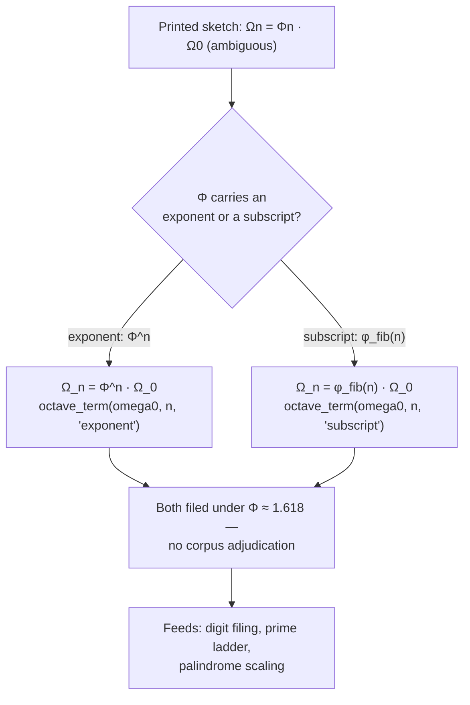

# El Gran Sol's Fractal Constant {#sec:part_I_fractal-constant}

{#fig:part_I_fractal-constant width=90%}

<!-- alt: A log-scale plot showing Phi raised to successive powers n = 1 through 6 rising along a straight line from about 1.618 to about 17.944, with Fibonacci-ratio markers at 1.6 and about 1.618182 converging on a horizontal reference line at Phi ≈ 1.618. -->

<!-- chapter-metadata-badge -->
> Level 1/3 · 30 min read · 45 min lecture · Prerequisites: none

> **This chapter is a worked exemplar.** It is filled to completion as Part I's
> reference for how the book formalises a corpus claim, walks its numbers, and
> keeps the corpus's own honesty-first scope disclaimers intact. Use it as the
> template for reading the chapters that follow.

## Learning Objectives

By the end of this chapter you should be able to:

1. State what the corpus calls El Gran Sol's Fractal constant —
   [**golden-ratio**](#gl:golden-ratio) $\Phi \approx 1.618$ — and explain its role as the
   recursion and filing key of the [**omni-lattice**](#gl:omni-lattice) stack
   [@mendez2026primeParity; @mendez2026protonTheater; @mendez2026yChromosome].
2. Reproduce the corpus's octave recursion sketch, discuss both printed readings of
   $\Omega_n = \Phi_n \cdot \Omega_0$ (exponent vs. subscript), and evaluate either one with
   the tested function `textbook.models.octave_term`.
3. Explain how the sole-even prime 2 becomes the [**binary-dyad-anchor**](#gl:binary-dyad-anchor)
   and odd primes become [**irreducible-minimum-set**](#gl:irreducible-minimum-set)s in
   Infinite Octaves grammar [@mendez2026primeParity].
4. Map the digit-filing duality — leading digit 1 to [**proton-space**](#gl:proton-space),
   structural 2 to [**electron-theater**](#gl:electron-theater) — and the zero-balance node
   that the corpus sits between them [@mendez2026protonTheater; @mendez2026topologyVoid].
5. Apply the palindrome-scaling relation $P_n = P_0 \cdot \Phi^n$ from the Y-chromosome
   manifestation paper and state precisely what that filing is *not*
   [@mendez2026yChromosome].

<!-- curriculum-scaffold-start -->
### Study Blueprint

- **Big idea:** One constant — $\Phi \approx 1.618$ — keys an entire filing grammar: it
  paces the octave ladder, anchors the prime dyad, splits the digits 1 and 2 into
  Proton Space and Electron Theater, and indexes biological-filing geometry.
- **Core concepts:** [**fractal-constant**](#gl:fractal-constant),
  [**octave**](#gl:octave), [**prime-parity**](#gl:prime-parity),
  [**phi-duality**](#gl:phi-duality), [**holographic-rhyme**](#gl:holographic-rhyme).
- **Quantitative lens:** the octave recursion law in
  [@eq:part_I_fractal-constant_octave-term], built on the identity in
  [@eq:part_I_fractal-constant_phi-identity].
- **Data skill:** evaluate $\Phi^n$ and the Fibonacci ratios by hand for small $n$, then
  confirm with `textbook.models.phi_powers` and `textbook.models.phi_fibonacci`.
- **Common misconception to repair:** $\Omega_n = \Phi_n \cdot \Omega_0$ is printed
  ambiguously in the corpus — $\Phi$ may carry an exponent or a subscript; both readings are
  filed, not adjudicated.
- **Primary lab:** [@sec:lab_part_I_fractal-constant].
- **Question bank:** [@sec:q_part_I_fractal-constant].
- **Bridge to computation:** `textbook.models` (`phi_powers`, `phi_fibonacci`,
  `octave_term`, `prime_parity_partition`).
<!-- curriculum-scaffold-end -->

---

> **Opening Vignette: A constant stamped on the ship's file drawers.**
>
> Aboard **SS Vibelandia**, the Autonomous Agent files each research note on an
> [**engine-shelf**](#gl:engine-shelf) slot of the Infinite Octaves nest, and nearly every
> drawer carries the same stamp: $\Phi \approx 1.618$, "El Gran Sol's Fractal constant."
> In one drawer, prime 2 is tagged *the sole-even anchor* [@mendez2026primeParity]; in the
> next, the leading digit 1 is tagged *Proton Space* and the structural 2 is tagged
> *Electron Theater* [@mendez2026protonTheater]; in a third, the spacing of the MSY
> palindrome arms P1–P8 is indexed as $P_n = P_0 \cdot \Phi^n$
> [@mendez2026yChromosome]. Three drawers, one key. This chapter opens all three.

---

## Orientation

The Infinite Octaves Omni-Lattice is a [**catalog-architecture**](#gl:catalog-architecture):
a protocol grammar and filing system for the SS Vibelandia ship blog's research papers, run
by the SynthOBS Autonomous Agent and framed — always — under a
[**honesty-first**](#gl:honesty-first) scope disclaimer [@mendez2026catalog]. Within that
catalog, El Gran Sol's Fractal constant — the [**golden-ratio**](#gl:golden-ratio) $\Phi =
(1+\sqrt{5})/2 \approx 1.618$ — is *the* recursion constant: the corpus says, plainly, that
"recursion runs on El Gran Sol's Fractal constant $\Phi \approx 1.618$"
[@mendez2026primeParity].

This chapter is the synthesis spine of Part I. It reads three engine papers through that
one key: the prime-parity paper [@mendez2026primeParity], which anchors the dyad and the
odd-prime classes; the proton-space · electron-theater paper [@mendez2026protonTheater],
which files the digits 1 and 2 as a duality; and the Y-chromosome manifestation paper
[@mendez2026yChromosome], which applies the same constant to palindrome-geometry filing.
Everything filed here is [**catalog-architecture**](#gl:catalog-architecture), and the
papers' own [**fair-exchange**](#gl:fair-exchange) clause governs their terms of use.

The quantitative spine is the octave recursion sketch. The corpus prints
"$\Omega_n = \Phi_n \cdot \Omega_0$" and flags, in the same breath, that whether $\Phi$
carries an exponent or a subscript is ambiguous as printed [@mendez2026primeParity]. We
formalise both readings in [@eq:part_I_fractal-constant_octave-term], and the book's tested
backbone exposes the choice as a `convention` argument.

## The Papers in the Corpus

All three source papers ship as parts of the Infinite Octaves series with whitepaper
surfaces and replayable fixture suites [@mendez2026catalog]:

- **Prime-parity** [@mendez2026primeParity] (September 2026) — filed into the Infinite
  Octaves / 99-Octave Omni-Lattice sync beside Higgs Gate and the enterprise gateway
  companion; cross-links the Prime Hourglass, the SI Irreducible Minimum, and the
  CMOS/protonic binary shelf. Its empirical suite reports **9/9 replayable fixtures** under
  `research/synthobs-infinite-octave-prime-parity/`, re-run with
  `npm run research:synthobs-infinite-octave-prime-parity`; standalone repo
  `FractiAI/synthobs-infinite-octave-prime-parity`.
- **Proton Space · Electron Theater** [@mendez2026protonTheater] (September 2026) — claims
  engine shelf #16, "companion to prime-parity + volumetric storage"
  [@mendez2026volumetricStorage]; **9/9 suite locks** under
  `research/synthobs-proton-space-electron-theater/`, re-run with
  `npm run research:synthobs-proton-space-electron-theater`; standalone repo
  `FractiAI/synthobs-proton-space-electron-theater`.
- **Y-chromosome manifestation** [@mendez2026yChromosome] (August 2026) — an August note
  that "adds manifestation / convergence-set language" to the July operator-translation
  decode, which still holds Words, Sentences, and haplogroup Stories; **10/10 fixture
  lock**, re-run with `npm run research:synthobs-y-chromosome-holographic-manifestation`.

Each paper names the same filing constant; that shared key is why this chapter can braid
them into one spine rather than three parallel reviews.

## A Worked Formalism: Octave Recursion Under Φ

The recursion constant is not an arbitrary decimal. $\Phi$ satisfies the identity

$$ \Phi^2 = \Phi + 1 $$ {#eq:part_I_fractal-constant_phi-identity}

so each power of $\Phi$ is a combination of the two before it — the algebraic reason the
corpus's "fractal" framing of self-similar recursion has an exact handle (standard
mathematics of the golden ratio; the corpus borrows the shape, not the derivation). Powers
of $\Phi$ also meet the Fibonacci sequence through $\Phi^n = F_n\,\Phi + F_{n-1}$, which is
why Fibonacci ratios appear as convergents to $\Phi$ in [@fig:part_I_fractal-constant].

Against that constant, the corpus sketches its octave recursion theorem:

$$ \Omega_n^{\text{exp}} = \Phi^{\,n}\,\Omega_0
   \qquad\text{or}\qquad
   \Omega_n^{\text{sub}} = \varphi_{\text{fib}}(n)\,\Omega_0 $$ {#eq:part_I_fractal-constant_octave-term}

[@eq:part_I_fractal-constant_octave-term] records *both* readings of the printed
"$\Omega_n = \Phi_n \cdot \Omega_0$": the **exponent convention** multiplies the base
octave term by $\Phi^n$, while the **subscript convention** multiplies it by the
$n$-th Fibonacci ratio $\varphi_{\text{fib}}(n) = F_{n+1}/F_n$. The corpus prints the
formula ambiguously and does not adjudicate between them [@mendez2026primeParity]; the
book files both and computes either one with `textbook.models.octave_term(omega0, n,
convention)`, whose ratio conventions come from `textbook.models.phi_fibonacci`
($\varphi_{\text{fib}}(5) = 8/5 = 1.6$; $\varphi_{\text{fib}}(10) = 89/55 \approx
1.618182$). The parameters are collected in [@tbl:part_I_fractal-constant_octave-term].

:: Parameters of the octave recursion sketch. {#tbl:part_I_fractal-constant_octave-term}

| Symbol | Meaning | Units |
| ------ | ------- | ----- |
| $\Omega_n$ | octave term at index $n$ | filing units |
| $\Omega_0$ | base octave term | filing units |
| $n$ | octave index | integer |
| $\Phi$ | El Gran Sol's Fractal constant $\approx 1.618$ | dimensionless |
| $\varphi_{\text{fib}}(n)$ | Fibonacci ratio $F_{n+1}/F_n$ (subscript convention) | dimensionless |
| convention | `exponent` or `subscript` reading of the printed formula | — |

> **Note**
>
> The ambiguity in [@eq:part_I_fractal-constant_octave-term] is *the corpus's own*, flagged
> in the source paper, not a defect we are papering over. Keeping both conventions visible —
> and computing them with the tested function instead of retyping the maths — is exactly the
> honesty-first posture the series asks of its readers.

## The Prime-Parity Scaffold

The prime-parity paper supplies the integer scaffold on which the constant paces recursion.
Its theorem sketches assert that "Prime 2 is the only even prime. In Infinite Octaves
grammar that sole-even status becomes the *binary dyad anchor*," and that "odd primes act
as irreducible minimum sets" [@mendez2026primeParity]. Concretely, the parity partition of
the primes — exposed as `textbook.models.prime_parity_partition(limit)` — separates:

- the **sole-even anchor**: 2, the only even prime, filed as the
  [**binary-dyad-anchor**](#gl:binary-dyad-anchor) of the stack;
- the **odd classes**: the first ten odd primes 3, 5, 7, 11, 13, 17, 19, 23, 29, 31, filed
  as [**irreducible-minimum-set**](#gl:irreducible-minimum-set)s — quantities that carry no
  smaller multiplicative filing and therefore serve as irreducible addresses
  (compare the prime encoding `unique_address([2,3],[2,1]) = 12` used later in the book).

The paper's own headline makes the division of labour explicit: "Why 2 is the odd one out —
and how Φ keeps the stack honest" [@mendez2026primeParity]. The dyad anchors; the odd
primes enumerate; the constant paces the recursion between them
([@eq:part_I_fractal-constant_octave-term]). Part I develops this scaffold in full in
[@sec:part_I_prime-parity], including the number-line reading of the sole-even anchor
against the odd-prime classes plotted in [@fig:part_I_prime-parity].

## Digit Filing: Proton Space and Electron Theater

The proton-space · electron-theater paper translates the same dyad into *digit* language.
Its filing rule: the "Leading digit **1** (Φ, ℏ mantissa talk) files as **Proton Space**;
structural **2** (sole-even prime, 2π) files as **Electron Theater** — under El Gran Sol's
Fractal constant **Φ ≈ 1.618**" [@mendez2026protonTheater]. The [**digit**](#gl:digit) 1 is
a *leading* trigger (the mantissa talk around the reduced Planck constant $\hbar$), while
the structural 2 is identified with the sole-even prime and $2\pi$ — the same dyad the
prime-parity paper anchors, now read off the digit row rather than the prime row. The corpus
brands this pairing "Φ duality," and the book links it to the glossary entry
[**phi-duality**](#gl:phi-duality).

Three further filings from the same paper matter for the spine. First, a companion link
handed to the void paper: "Zero as the balance node between 1 and 2"
[@mendez2026protonTheater] — zero is not a digit class here but the null pivot sitting
between the two filings, developed in [@sec:part_I_topology-void] and
[@fig:part_I_topology-void]. Second, the solar labels AR3664 ("Helios-Prime") and AR3590
("Borealis") are story filing characters — narrative timing talk, not cosmic certificates
[@mendez2026protonTheater]. Third, the Fair Exchange clause applies to the paper's terms of
use, as it does across the series. [@tbl:part_I_fractal-constant_filings] collects the
digit-row mapping.

:: The digit-filing duality and its neighbours, as filed by the corpus. {#tbl:part_I_fractal-constant_filings}

| Trigger | Filing category | Corpus anchor |
| ------- | --------------- | ------------- |
| leading digit 1 ($\Phi$, $\hbar$ mantissa talk) | Proton Space | [@mendez2026protonTheater] |
| structural 2 (sole-even prime, $2\pi$) | Electron Theater | [@mendez2026protonTheater] |
| $0$ | balance node between 1 and 2 | [@mendez2026protonTheater; @mendez2026topologyVoid] |
| sole-even prime 2 | binary dyad anchor | [@mendez2026primeParity] |
| odd primes 3, 5, 7, … | irreducible minimum sets | [@mendez2026primeParity] |

## A Biological Manifestation: Palindrome Scaling

The Y-chromosome manifestation paper extends the constant to biological-filing geometry.
Under "Infinite Octave Mode," the male-specific region of the Y chromosome (MSY) — its
palindrome arms P1–P8 and the *SRY* locus — is filed "as catalog geometry keyed by
$\Phi \approx 1.618$," with block spacing indexed as

$$ P_n = P_0 \cdot \Phi^{\,n} $$ {#eq:part_I_fractal-constant_palindrome}

"for catalog octaves, not random drift labels" [@mendez2026yChromosome]. The SRY locus is
filed as the *zero-point anchor* of the manifestation cartoon — note how the corpus reuses
the zero-balance role from the digit filing as a phase origin here. The paper also proposes
cross-species regression protocols *on paper only* ("not executed wet-lab output here") and
adds "manifestation / convergence-set" language as Story depth beside the July
operator-translation decode's Words, Sentences, and haplogroup Stories, with "Digit 4" as
the nest label under which Lattice Chat fields biological-switch questions
[@mendez2026yChromosome]. The parameters of the scaling law are in
[@tbl:part_I_fractal-constant_palindrome].

:: Parameters of the palindrome-scaling filing. {#tbl:part_I_fractal-constant_palindrome}

| Symbol | Meaning | Units |
| ------ | ------- | ----- |
| $P_n$ | palindrome block spacing at octave index $n$ | filing units |
| $P_0$ | base spacing | filing units |
| $\Phi$ | El Gran Sol's Fractal constant $\approx 1.618$ | dimensionless |

The scaling law is the exponent convention of [@eq:part_I_fractal-constant_octave-term]
re-symbolised: a base spacing scaled by successive powers of $\Phi$. That is the whole
point of the spine — one constant, three papers, one growth law wearing three filing
hats. The paper's honesty clause is emphatic that this is filing, not measurement: "not a
claim that MSY literally equals a physics constant, that sunspot AR 3664 writes human DNA,
or that fractal dimension has been measured to Φ in this repository" — and, verbatim,
"Clinical genetics and human dignity outrank every metaphor" [@mendez2026yChromosome].

## Worked Example: Walking the Φ Ladder

Take the pinned values of the book's computational backbone. The powers of $\Phi$ for
$n = 1,\dots,6$ (what `textbook.models.phi_powers(6)` returns, and what
[@fig:part_I_fractal-constant] plots on a log axis) are:

$$ \Phi^n = 1.618034,\; 2.618034,\; 4.236068,\; 6.854102,\; 11.090170,\; 17.944272
   \quad (n = 1,\dots,6) $$ {#eq:part_I_fractal-constant_phi-powers}

Each entry is the previous entry times $\Phi$ — geometric growth at ratio $1.618$, a
straight line on a log scale. The Fibonacci ratios converge on the same constant from
below: $\varphi_{\text{fib}}(5) = 8/5 = 1.6$ and $\varphi_{\text{fib}}(10) = 89/55 \approx
1.618182$ (from `textbook.models.phi_fibonacci`), the two overlay series in
[@fig:part_I_fractal-constant]. Now apply both conventions of
[@eq:part_I_fractal-constant_octave-term] to a base term $\Omega_0 = 275$ filing units at
$n = 5$:

- **Exponent convention:** $\Omega_5 = \Phi^5 \cdot \Omega_0 = 11.090170 \times 275
  \approx 3{,}049.80$ filing units — the tested call is
  `octave_term(275, 5, "exponent")`.
- **Subscript convention:** $\Omega_5 = \varphi_{\text{fib}}(5) \cdot \Omega_0 = 1.6 \times
  275 = 440$ filing units — `octave_term(275, 5, "subscript")`.

The two conventions diverge — $3{,}049.80$ vs. $440$ — which is precisely why the corpus
flags the ambiguity and why the tested function takes the convention as an argument rather
than picking a winner. The same ladder reads the palindrome filing: with a base spacing
$P_0 = 1$, [@eq:part_I_fractal-constant_palindrome] gives $P_1$ through $P_8$ as $1.618$,
$2.618$, $4.236$, $6.854$, $11.090$, $17.944$, $29.034$, $46.979$ — the eight MSY palindrome
arms P1–P8 indexed on the same powers of $\Phi$ that pace the octave ladder
[@mendez2026yChromosome]. As a filing system, the reach is large: the corpus's 99-octave,
81-digit register map alone spans $99 \times 81 = 8{,}019$ cells
(`textbook.models.catalog_size()`), each addressable without a second constant
[@mendez2026digitsMaster].

## Scope and Honesty

Each source paper carries its own disclaimer, and this textbook restates them
near-verbatim, because the spine is only as honest as its weakest claim:

- Prime-parity: "this is catalog math + filing labels. It does *not* prove QED from primes,
  rewrite NOAA heliophysics, or ship ultra-secure crypto hardware. Solar AR3664
  ('Helios-Prime') and AR3590 ('Borealis') are story characters for timing talk — not
  cosmic proof certificates" [@mendez2026primeParity].
- Proton Space · Electron Theater: "this is *catalog architecture* — engine shelf #16 —
  not a CODATA/SI derivation from Φ, not ħ leading-digit causation, not a QED dyad proof,
  and not zero-crosstalk quantum hardware" [@mendez2026protonTheater].
- Y-chromosome manifestation: "this is catalog filing and architectural equations — not a
  claim that MSY literally equals a physics constant, that sunspot AR 3664 writes human
  DNA, or that fractal dimension has been measured to Φ in this repository. Clinical
  genetics and human dignity outrank every metaphor" [@mendez2026yChromosome].

What the constructs are **for**: coordination, cataloging, and agent routing — a consistent
filing grammar in which primes anchor, digits classify, and $\Phi$ paces recursion across
papers and suites. What they are explicitly **not**: established physics, a derivation of
physical constants from $\Phi$, or clinical/genetic claims. The book's posture throughout
is the corpus's own [**honesty-first**](#gl:honesty-first) one: file the metaphor, cite the
paper, keep the disclaimer attached.

## Connections

The spine feeds every later Part I chapter. The [**topology-of-the-void**](#gl:topology-of-the-void)
paper takes the zero-balance node filed here and makes it a dynamic equilibrium between
Proton Space and Electron Theater ([@sec:part_I_topology-void]); the
[**holographic-rhyme**](#gl:holographic-rhyme) paper generalises the recursion into a
four-pillar motion grammar — repeating, self-similar, self-correcting, recursive — under
the same $\Phi \approx 1.618$ ([@sec:part_I_holographic-rhyme]); and the
multi-dimensional rhyme paper sums it across scales as xD±yD cross-scale encoding
([@sec:part_I_multidimensional-rhyme]). The higgs-awareness chapter then asks what happens
when the recursion *slows* — mass and the shared "Now" sharing a gate, with the magnet in a
copper pipe as its guest metaphor ([@sec:part_I_higgs-awareness]). Downstream in Part III,
the CMOS/protonic binary shelf that prime-parity cross-links becomes the silicon-shelf
engineering stack ([@sec:part_III_cmos-protonic]), and the odd-prime addresses met here
become prime-indexed volumetric storage ([@sec:part_III_volumetric-storage]). Throughout,
the [**master-synthesis**](#gl:master-synthesis) map keeps these cross-links navigable
[@mendez2026masterSynthesis].

## Summary

El Gran Sol's Fractal constant — $\Phi \approx 1.618$, the
[**golden-ratio**](#gl:golden-ratio) — is the single filing key that the corpus stamps on
its octave recursion, its prime scaffold, its digit duality, and its biological-geometry
filing. The recursion sketch $\Omega_n = \Phi_n \cdot \Omega_0$ is printed ambiguously, so
the book files both the exponent and subscript readings
([@eq:part_I_fractal-constant_octave-term]) and computes them with
`textbook.models.octave_term` rather than adjudicating. Sole-even prime 2 anchors the dyad;
odd primes serve as irreducible minimum sets; leading 1 files as Proton Space and
structural 2 as Electron Theater, with zero as the balance node between them
([@tbl:part_I_fractal-constant_filings]); and the MSY palindrome arms P1–P8 scale as
$P_n = P_0 \cdot \Phi^n$ ([@eq:part_I_fractal-constant_palindrome]). Every one of these
filings is [**catalog-architecture**](#gl:catalog-architecture) under the papers' own
honesty-first disclaimers — a grammar for coordination and filing, not physics.

## Key Terms

[**fractal-constant**](#gl:fractal-constant), [**golden-ratio**](#gl:golden-ratio),
[**octave**](#gl:octave), [**binary-dyad-anchor**](#gl:binary-dyad-anchor),
[**irreducible-minimum-set**](#gl:irreducible-minimum-set),
[**proton-space**](#gl:proton-space), [**electron-theater**](#gl:electron-theater),
[**phi-duality**](#gl:phi-duality), [**holographic-rhyme**](#gl:holographic-rhyme),
[**catalog-architecture**](#gl:catalog-architecture), [**honesty-first**](#gl:honesty-first),
[**fair-exchange**](#gl:fair-exchange), [**engine-shelf**](#gl:engine-shelf),
[**omni-lattice**](#gl:omni-lattice).

## Further Reading

- Whitepaper surface, prime-parity:
  <https://www.ssvibelandiaquestfest24x365.com/interfaces/whitepaper-surface.html?id=synthobs-infinite-octave-prime-parity-2026-09>;
  standalone suite <https://github.com/FractiAI/synthobs-infinite-octave-prime-parity>
  [@mendez2026primeParity].
- Whitepaper surface, proton-space · electron-theater:
  <https://www.ssvibelandiaquestfest24x365.com/interfaces/whitepaper-surface.html?id=synthobs-proton-space-electron-theater-2026-09>;
  standalone suite <https://github.com/FractiAI/synthobs-proton-space-electron-theater>
  [@mendez2026protonTheater].
- Whitepaper surface, Y-chromosome manifestation:
  <https://www.ssvibelandiaquestfest24x365.com/interfaces/whitepaper-surface.html?id=synthobs-y-chromosome-holographic-manifestation-2026-08>
  [@mendez2026yChromosome].
- [@mendez2026topologyVoid] — the void paper that turns the zero-balance node into a
  dynamic equilibrium; read it directly after this chapter.
- [@mendez2026volumetricStorage] — where odd-prime irreducible sets become storage
  addresses.
- [@mendez2026holographicRhyme] — the four-pillar motion grammar that generalises the
  recursion met here.

## Practice

1. Evaluate $\Phi^n$ for $n = 1,\dots,6$ by repeated multiplication by $\Phi$, then check
   your ladder against `textbook.models.phi_powers(6)` and
   [@eq:part_I_fractal-constant_phi-powers].
2. Compute both conventions of [@eq:part_I_fractal-constant_octave-term] for $\Omega_0 =
   275$, $n = 5$ by hand ($\Phi^5 = 11.090170$; $\varphi_{\text{fib}}(5) = 1.6$), then
   verify with `octave_term(275, 5, "exponent")` and `octave_term(275, 5, "subscript")`.
3. In your own words, distinguish the *binary dyad anchor* from the *irreducible minimum
   sets* in [@mendez2026primeParity], and give the digit-row counterpart of each from
   [@tbl:part_I_fractal-constant_filings].
4. With $P_0 = 1$, list $P_1$ through $P_8$ from [@eq:part_I_fractal-constant_palindrome]
   and identify which arms of the P1–P8 filing they index [@mendez2026yChromosome].
5. Restate, one sentence each, the scope disclaimers of the three source papers, and mark
   which phrase in each is the strongest guard against over-reading the filing.

- **Lab:** [@sec:lab_part_I_fractal-constant] — walk the Φ ladder and the fixture suites
  hands-on.
- **Question bank:** [@sec:q_part_I_fractal-constant] — recall through synthesis.
