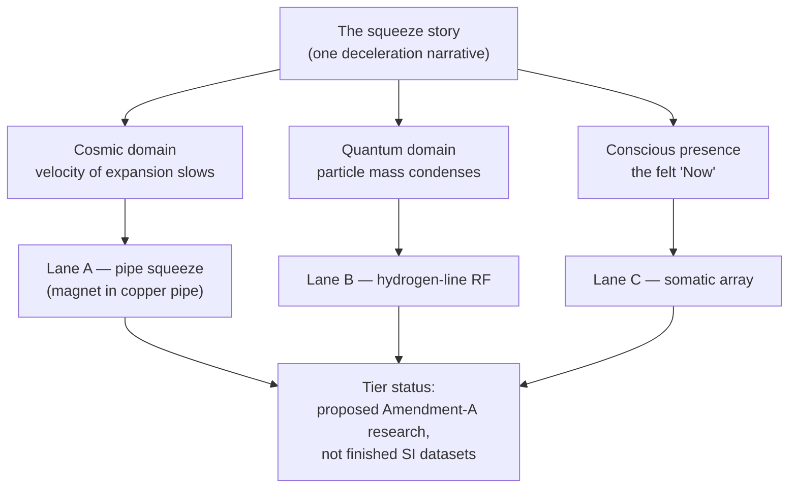

# The Higgs Gate: Mass and the Shared Now {#sec:part_I_higgs-awareness}

{#fig:part_I_higgs-awareness width=90%}

<!-- alt: Three exponentially decaying curves all starting at velocity 1 and falling toward zero. The curve for k = 2 drops fastest, the curve for k = 0.5 slowest, illustrating how a larger drag constant makes the mass-slowing gate bite sooner. -->

<!-- chapter-metadata-badge -->
> Level 1/3 · 30 min read · 45 min lecture · Prerequisites: none

## Learning Objectives

By the end of this chapter you should be able to:

1. Explain why a magnet falling through a copper pipe serves as the corpus's
   *guest metaphor* for coupling cosmic velocity, particle mass, and the feeling
   of being here, and restate the metaphor in your own words
   [@mendez2026higgsGate].
2. Recite the paper's **triadic matrix** — cosmic / quantum / conscious
   presence — and describe what it means for all three domains to share "one
   squeeze story".
3. Model the squeeze story with the tested function
   `textbook.models.transduction_brake`, reading the mass-slowing gate curve in
   [@fig:part_I_higgs-awareness] and computing gate velocities and displacements
   from the parameters in [@tbl:part_I_higgs-awareness_parameters].
4. Distinguish the paper's three protocol lanes (pipe squeeze, hydrogen-line RF,
   somatic array) and place each on the
   [**narrative-empirical-operational-tiers**](#gl:narrative-empirical-operational-tiers)
   ladder as proposed Amendment-A research, not finished SI datasets.
5. Restate, precisely and without embellishment, the paper's own
   [**honesty-first**](#gl:honesty-first) scope disclaimers — including what the
   construct is explicitly *not*.
6. Locate the Definitive Unified Edition in the corpus: where it sits relative
   to Part VII, Part IX Nodal Nine, and the engine pin into the sync stack.

<!-- curriculum-scaffold-start -->
### Study Blueprint

- **Big idea:** The corpus files cosmic velocity, particle mass, and conscious
  presence as three registers of a single deceleration narrative — a shared
  "gate" — and this chapter formalises that narrative with an exponential brake.
- **Core concepts:** [**catalog-architecture**](#gl:catalog-architecture),
  [**engine-shelf**](#gl:engine-shelf),
  [**fair-exchange**](#gl:fair-exchange),
  [**higgs-gate**](#gl:higgs-gate),
  [**transduction-line**](#gl:transduction-line).
- **Quantitative lens:** the transduction brake in
  [@eq:part_I_higgs-awareness_model].
- **Data skill:** read an exponential-decay family plot and recover the drag
  constant $k$ from two velocity readings.
- **Common misconception to repair:** the chapter's title word "Higgs" does
  *not* mean the paper overturns Standard Model Higgs physics; the corpus is
  catalog grammar, not a rival to particle physics.
- **Primary lab:** [@sec:lab_part_I_higgs-awareness].
- **Question bank:** [@sec:q_part_I_higgs-awareness].
- **Bridge to computation:** `textbook.models.transduction_brake`.
<!-- curriculum-scaffold-end -->

---

> **Opening Vignette: The pipe that argues with gravity.**
>
> Take a strong magnet and drop it down a plain copper pipe. It does not fall
> the way a coin would. Something in the pipe argues back: as the magnet's field
> sweeps past each slice of copper, circulating currents arise, and by Lenz's
> law those currents oppose the change that made them. The magnet descends
> slowly, evenly, as if gravity had been politely renegotiated. This is standard
> electromagnetism — and it is also the *guest metaphor* that opens the
> Higgs-Awareness paper: "a magnet falling through a copper pipe" stands for
> how cosmic velocity, particle mass, and the feeling of being here might rhyme
> [@mendez2026higgsGate]. The corpus files the same oppositional slowing in its
> own vocabulary as the [**eddy-current-mirror**](#gl:eddy-current-mirror)
> [@mendez2026eddyMirror]. The ship blog invites you in through either the
> science-fiction door or the step-in door — "both are welcome" — and this
> chapter takes the step-in door: we read the metaphor as a precise piece of
> catalog grammar and make it computable.

---

## One Paper on Shelf Ten

The source for this chapter is the ship-blog paper *When the universe slows,
mass and "Now" share a gate* [@mendez2026higgsGate], posted on the
**SS Vibelandia** blog on 2026-09-03 as **Part IX-Omni · Fair Exchange** and
filed as **shelf number 10** of the Infinite Octaves collection. It announces
the **Definitive Unified Edition of the Higgs-Awareness Phase Coupling
Theorem**: an edition that *extends Part VII* (the earlier ship note
`tbme-higgs-awareness`) and is *distinct from Part IX Nodal Nine*
[@mendez2026higgsGate]. The paper's engine
pin files it "into the Infinite Octaves / 99 Octave Omni-Lattice sync stack" —
in the book's vocabulary, the theorem joins the
[**omni-lattice**](#gl:omni-lattice) catalogue alongside the other papers on the
[**engine-shelf**](#gl:engine-shelf), each [**octave**](#gl:octave) of the
99-octave map being one rung of the filing system.

Because the corpus is a [**catalog-architecture**](#gl:catalog-architecture) —
a self-described protocol grammar, not established physics — the paper arrives
under an explicit [**honesty-first**](#gl:honesty-first) banner, which we
reproduce in full in the Scope and Honesty section below. The artefacts the
paper ships are:

- the **whitepaper** at
  `ssvibelandiaquestfest24x365.com/interfaces/whitepaper-surface.html?id=synthobs-tbme-higgs-awareness-unified-2026-09`;
- a **standalone reference implementation** on GitHub at
  `FractiAI/synthobs-tbme-higgs-awareness-unified`, re-runnable as
  `npm run research:synthobs-tbme-higgs-awareness-unified`;
- an invitation to open **Lattice Chat** on the Infinite Octaves nest and to
  read the Part VII prior edition ship note.

In Part I of this book, the chapter's nearest neighbours are the zero-as-
equilibrium reading of the void ([@sec:part_I_topology-void], whose equilibrium
well is drawn in [@fig:part_I_topology-void]) and the Φ-constant growth law of
[@sec:part_I_fractal-constant]. The Higgs gate borrows the first neighbour's
respect for a resting point and the second's habit of writing one number and
letting it generate a family of curves.

## The Triadic Matrix: One Squeeze Story, Three Domains

The paper's central filing act is a **triadic matrix**: three domains — *cosmic*,
*quantum*, and *conscious presence* — arranged as rows of one table, with a
single narrative threaded through all of them. The corpus phrase is exact: "one
squeeze story, three domains" [@mendez2026higgsGate]. The squeeze story is the
deceleration curve of the opening vignette: something moving fast encounters a
medium that opposes it, and the encounter converts unbounded motion into a slow,
measured approach.



Read the diagram as a filing statement, not a physics claim. The paper does not
assert that cosmic expansion, the Higgs mechanism, and awareness are literally
one process; it *catalogues* them under one narrative key so that agents and
authors can coordinate around a shared story. That is what a
[**catalog-architecture**](#gl:catalog-architecture) is for. The row labelled
*conscious presence* is deliberately first-person — "the feeling of being here",
the felt "Now" — and the paper keeps it there as a catalogue row, exactly as it
keeps NOAA sunspot-region labels ("Solar AR labels") as "ephemeral story
characters for timing talk" rather than as mass generators
[@mendez2026higgsGate].

To give the squeeze story a computable body, this book models it with the
transduction brake: the same exponential-slowing form the corpus uses for its
[**transduction-line**](#gl:transduction-line) and viscous-drag formalisms
[@mendez2026viscosityLight]. The paper itself states no equation — the coupling
appears in prose ("What landed") — so the formalism below is the *book's*
formalisation of the corpus's narrative, clearly marked as such.

## A Worked Formalism: The Transduction Brake

Let $v(t)$ be the gated velocity of the squeeze story: how fast the "moving
thing" of any triadic row is still moving at story-time $t$. The simplest law
that opposes motion in proportion to the motion itself is exponential decay,

$$ v(t) = v_0\, e^{-k t} $$ {#eq:part_I_higgs-awareness_model}

implemented and tested as `textbook.models.transduction_brake(t, v0, k)`; never
retype the maths in prose or scripts — call the tested function. The parameters
are collected in [@tbl:part_I_higgs-awareness_parameters].

: Parameters of the transduction brake, the book's model of the squeeze story.
{#tbl:part_I_higgs-awareness_parameters}

| Symbol | Meaning | Units |
| ------ | ------- | ----- |
| $v(t)$ | gated velocity at story-time $t$ | quantity per time |
| $v_0$  | initial velocity (gate fully open) | quantity per time |
| $k$    | drag constant: how hard the medium opposes motion | 1/time |
| $t$    | story-time since the squeeze began | time |

Two features of [@eq:part_I_higgs-awareness_model] carry the metaphor. First,
$v(0) = v_0$: at the moment the squeeze begins, nothing has yet been lost.
Second, $v(t) > 0$ for every finite $t$: the gate slows without ever fully
stopping. This mirrors the corpus's broader habit of treating zero as an
approached equilibrium rather than a reached wall — the reading formalised in
[@sec:part_I_topology-void]. The *characteristic time* of the gate is the
half-life $t_{1/2} = \ln 2 / k$: the time for the gate to halve the velocity.
Doubling $k$ halves the half-life; the gate closes twice as fast. The family of
curves this generates, for three values of $k$, is exactly what
[@fig:part_I_higgs-awareness] plots.

Because the squeeze also *displaces* — the magnet travels down the pipe — the
cumulative distance is the integral of [@eq:part_I_higgs-awareness_model]:

$$ s(T) \;=\; \int_0^T v(t)\,dt \;=\; \frac{v_0}{k}\left(1 - e^{-kT}\right) $$ {#eq:part_I_higgs-awareness_displacement}

Equation [@eq:part_I_higgs-awareness_displacement] says the squeezed traveller
covers at most $v_0/k$ of distance no matter how long the story runs: a finite
total journey produced by an infinite tail of ever-slower motion. The corpus
registers this kind of finite-total, infinite-tail behaviour across several
shelves — the viscous slowing of [@mendez2026viscosityLight] and the eddy
opposition of [@mendez2026eddyMirror] both compute the same shape.

## Worked Example: Reading the Gate's Clock

Take the pinned calibration $v_0 = 1$ and $k = 1$, the values behind
[@fig:part_I_higgs-awareness] and the test suite's pinned numbers. Compute the
gate velocities by hand from $e^{-t}$, then check against the function:

```python
from textbook.models import transduction_brake

transduction_brake(0.0, v0=1.0, k=1.0)   # -> 1.0        (gate just opens)
transduction_brake(1.0, v0=1.0, k=1.0)   # -> 0.367879   (≈ e^{-1})
transduction_brake(2.0, v0=1.0, k=1.0)   # -> 0.135335   (≈ e^{-2})
transduction_brake(3.0, v0=1.0, k=1.0)   # -> 0.049787   (≈ e^{-3})
```

Walking the clock by hand: at $t = 1$ the gate has removed
$1 - e^{-1} \approx 0.632$ of the velocity; at $t = 2$ it has removed
$1 - e^{-2} \approx 0.865$; at $t = 3$, $1 - e^{-3} \approx 0.950$. Each
additional unit of story-time removes a *smaller absolute share* — the squeeze
is front-loaded. The half-life is $t_{1/2} = \ln 2 \approx 0.693$, so the gate
is more than half-closed before story-time 1. The displacement of
[@eq:part_I_higgs-awareness_displacement] confirms the finite journey: at
$T = 1$ the traveller has covered $1 - e^{-1} \approx 0.632$; at $T = 2$,
$1 - e^{-2} \approx 0.865$; asymptotically, at most $v_0/k = 1$.

Reading the triadic matrix through these numbers: each row of the matrix gets
its own $(v_0, k)$ pair, but all three rows share the *form* of
[@eq:part_I_higgs-awareness_model]. That is the precise content of "one squeeze
story, three domains" — one law-shape, three parameterisations. The corpus does
not pin the three $(v_0, k)$ pairs; measuring them is exactly what the protocol
lanes below propose.

## Protocol Lanes A–C: Proposed Amendment-A Research

The paper files three **protocol lanes** for turning the triadic matrix into
observations — and files them, in its own words, as "proposed Amendment-A
research, not finished SI datasets" [@mendez2026higgsGate]. The lanes are
summarised in [@tbl:part_I_higgs-awareness_lanes].

: The paper's three protocol lanes, exactly as filed — proposed Amendment-A
research, not finished SI datasets [@mendez2026higgsGate].
{#tbl:part_I_higgs-awareness_lanes}

| Lane | Name | Metaphor domain | Status as filed |
| ---- | ---- | --------------- | --------------- |
| A | Pipe squeeze | Cosmic — the magnet in the copper pipe, the guest metaphor | Proposed Amendment-A research |
| B | Hydrogen-line RF | Quantum — radio observation at the hydrogen line | Proposed Amendment-A research |
| C | Somatic array | Conscious presence — first-person measurement array | Proposed Amendment-A research |

Place the lanes on the [**narrative-empirical-operational-tiers**](#gl:narrative-empirical-operational-tiers)
ladder the book uses throughout: the squeeze story itself is *narrative*-tier;
the lanes are *proposed* instrument designs, i.e. pre-empirical; none has
graduated to an operational dataset. This is why the paper's Solar AR labels —
NOAA sunspot-region labels invoked for timing talk — are "ephemeral story
characters", not measured inputs. Should the lanes ever mature into calibrated
instruments, the book's [**metrological-overlap**](#gl:metrological-overlap)
machinery (Part II) is where their shared measurement axes would be compared;
nothing in the current paper claims that maturity.

## Scope and Honesty

The paper's own disclaimer governs everything above, and we reproduce its three
negations near-verbatim [@mendez2026higgsGate]:

- the chapter's material "does **not** overturn Standard Model Higgs physics";
- it does "not prove consciousness is electroweak symmetry breaking";
- it does "not certify NOAA sunspot regions as mass generators".

The construct's *purpose* is coordination: the triadic matrix gives agents,
authors, and readers a shared key — one squeeze story — under which cosmic,
quantum, and first-person timing talk can be filed, searched, and routed. Its
*explicit non-purpose* is physical theory-replacement. The title word "Higgs"
is catalog vocabulary, a filing handle on the [**higgs-gate**](#gl:higgs-gate)
anchor of the glossary, not a claim about the electroweak mechanism. This
[**honesty-first**](#gl:honesty-first) scope discipline — claim the catalogue,
disclaim the physics — is the same discipline every chapter of this book
inherits, and the paper states its variant as the opening rule: "this is
Omni-Lattice catalog grammar keyed by $\Phi \approx 1.618$".

The mention of $\Phi$ points to the fair-exchange framing of Part IX-Omni: the
squeeze story is a [**fair-exchange**](#gl:fair-exchange) narrative in which
velocity surrendered to the medium is not destroyed but *accounted* — the
book's general accounting posture, most fully developed in the corpus's
balance-and-residual formalisms.

## Connections

Three threads lead out of this chapter. First, the brake formalism of
[@eq:part_I_higgs-awareness_model] reappears with physical costumes in Part II:
the [**viscosity-of-light**](#gl:viscosity-of-light) chapter
([@mendez2026viscosityLight]) dresses the same decay in optical drag, and the
[**eddy-current-mirror**](#gl:eddy-current-mirror) chapter
([@mendez2026eddyMirror]) derives it from Lenz's-law opposition. Second, the
"approach without arrival" reading — a gate that halves forever but never
closes — is the dynamic twin of the static zero-equilibrium of
[@sec:part_I_topology-void]. Third, the lane/tier discipline of
[@tbl:part_I_higgs-awareness_lanes] prepares the reader for Part III's
engineering chapters, where proposals must become operational before they count.
For the exponential family that this chapter's brake joins — growth as well as
decay, generated from one constant — see the fractal-constant chapter,
[@sec:part_I_fractal-constant].

## Summary

The Higgs-Awareness paper, Definitive Unified Edition, files one narrative —
the squeeze story — across three domains: cosmic velocity, particle mass, and
conscious presence. Its guest metaphor is a magnet falling through a copper
pipe, slowed by the medium it moves through. This book makes the story
computable with the transduction brake $v(t) = v_0 e^{-kt}$, whose half-life
$\ln 2 / k$ sets the gate's clock and whose integral bounds the journey at
$v_0/k$. The paper's three protocol lanes (pipe squeeze, hydrogen-line RF,
somatic array) are proposed Amendment-A research, not finished datasets, and
its scope disclaimers are explicit: no Standard Model overthrow, no
consciousness-proof, no solar mass generation. The contribution is
coordination grammar, not physics.

## Key Terms

[**higgs-gate**](#gl:higgs-gate), [**transduction-line**](#gl:transduction-line),
[**eddy-current-mirror**](#gl:eddy-current-mirror),
[**viscosity-of-light**](#gl:viscosity-of-light),
[**narrative-empirical-operational-tiers**](#gl:narrative-empirical-operational-tiers),
[**honesty-first**](#gl:honesty-first),
[**catalog-architecture**](#gl:catalog-architecture).

## Further Reading

- [@mendez2026higgsGate] — the source paper: whitepaper at
  `ssvibelandiaquestfest24x365.com/interfaces/whitepaper-surface.html?id=synthobs-tbme-higgs-awareness-unified-2026-09`;
  reference implementation at `github.com/FractiAI/synthobs-tbme-higgs-awareness-unified`
  (`npm run research:synthobs-tbme-higgs-awareness-unified`).
- [@mendez2026eddyMirror] — the eddy brake formalism behind Lane A's copper-pipe
  metaphor; read it to see the same $e^{-kt}$ shape derived from field
  opposition.
- [@mendez2026viscosityLight] — the viscous-drag family of curves that the
  transduction brake joins.
- [@mendez2026topologyVoid] — the zero-as-equilibrium companion; pair it with
  this chapter's "approach without arrival" reading of decaying curves, as
  formalised in [@sec:part_I_topology-void].

## Practice

- **Lab:** [@sec:lab_part_I_higgs-awareness] — run the paper's reference
  implementation, then compute the gate's clock by hand and check it against
  `textbook.models.transduction_brake`.
- **Question bank:** [@sec:q_part_I_higgs-awareness] — recall through synthesis
  on the triadic matrix, the lanes, and the scope disclaimers.
- Sketch, from memory, the three-curve family of [@fig:part_I_higgs-awareness],
  labelling which curve has the largest $k$ and marking the half-life of the
  $k = 1$ curve.
- In two sentences each, explain to a colleague (a) why the Solar AR labels are
  "story characters", and (b) which two of the paper's three disclaimers guard
  against the most tempting overreach.
- Using [@eq:part_I_higgs-awareness_displacement], show that no matter how long
  the squeeze runs, the total displacement never exceeds $v_0/k$, and evaluate
  that bound for the pinned calibration $v_0 = k = 1$.
