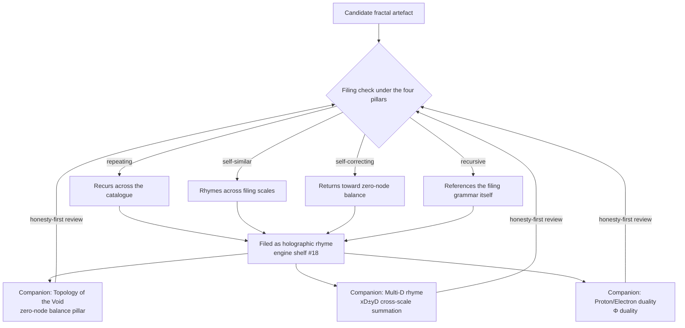

# Holographic Rhyme: The Four-Pillar Fractal {#sec:part_I_holographic-rhyme}

![The four-pillar interference field computed by `textbook.models.holographic_rhyme_field` with $P = 4$ evenly spaced directional pillars and shared wavelength $\lambda$. Bright lattice nodes mark locations where all four plane waves rhyme at once and the field reaches $+4$; dark nodes mark full cancellation at $-4$; between them the field records partial agreement, pillar by pillar. The plot is the spatial face of the filing: a fractal filed as a holographic rhyme is checked for agreement at every catalogue location.](../../output/figures/part_I_holographic-rhyme.png){#fig:part_I_holographic-rhyme width=90%}

<!-- alt: Two-dimensional interference pattern generated by summing four evenly
rotated cosine plane waves; the field oscillates between +4 and -4, with bright
peaks at lattice nodes where all four waves agree and dark troughs where pairs
cancel. -->

<!-- chapter-metadata-badge -->
> Level 1/3 · 30 min read · 45 min lecture · Prerequisites: [@sec:part_0_octave-map]

## Learning Objectives

By the end of this chapter you should be able to:

1. State the four catalog filing labels — repeating · self-similar ·
   self-correcting · recursive — under which the corpus files a fractal as a
   [**holographic rhyme**](#gl:holographic-rhyme), and explain what the
   [**motion grammar**](#gl:holographic-rhyme) framing adds over a static-shape
   reading [@mendez2026holographicRhyme].
2. Locate the holographic-rhyme paper on the [**engine shelf**](#gl:engine-shelf)
   of the [**Infinite Octaves**](#gl:omni-lattice)
   [**catalog architecture**](#gl:catalog-architecture) and name its companion
   engines.
3. Write and evaluate the four-pillar interference field
   ([@eq:part_I_holographic-rhyme_field]) using the tested function
   `textbook.models.holographic_rhyme_field`, including its $P = 4$ closed form
   ([@eq:part_I_holographic-rhyme_pairwise]).
4. Compute sample field values by hand and verify them against the tested
   implementation, as practiced in [@sec:lab_part_I_holographic-rhyme].
5. Restate the paper's Honesty-first clause precisely: what the construct is
   filed *as* and what it explicitly disclaims.

<!-- curriculum-scaffold-start -->
### Study Blueprint

- **Big idea:** the corpus files a fractal not as a picture but as a *grammar
  of motion* — four locked filing labels operative under
  [**Φ ≈ 1.618**](#gl:golden-ratio) — and the four-pillar interference field is
  the book's structural model of that filing.
- **Core concepts:** [**holographic-rhyme**](#gl:holographic-rhyme),
  [**four-pillar-fractal**](#gl:four-pillar-fractal),
  [**catalog-architecture**](#gl:catalog-architecture),
  [**engine-shelf**](#gl:engine-shelf).
- **Quantitative lens:** the four-pillar field in
  [@eq:part_I_holographic-rhyme_field] and its $P=4$ closed form in
  [@eq:part_I_holographic-rhyme_pairwise].
- **Data skill:** evaluate an interference sum at lattice points by hand, then
  confirm each value with `textbook.models.holographic_rhyme_field`.
- **Common misconception to repair:** "holographic" here does **not** claim
  Mandelbrot-set physics, measured 0% ECC error rates, or clinical-homeostasis
  QED — the paper's own Honesty clause disclaims all three.
- **Primary lab:** [@sec:lab_part_I_holographic-rhyme].
- **Question bank:** [@sec:q_part_I_holographic-rhyme].
- **Bridge to computation:** `textbook.models.holographic_rhyme_field`.
<!-- curriculum-scaffold-end -->

---

> **Opening Vignette: Four labels stamped on one card.**
>
> On 5 September 2026 the ship-blog entry lands on the
> [**engine shelf**](#gl:engine-shelf) like a card being stamped four times:
> *repeating*, *self-similar*, *self-correcting*, *recursive*
> [@mendez2026holographicRhyme]. The card does not hold a picture of a fractal.
> It holds a filing decision — under $\Phi \approx 1.618$, a fractal is filed
> as a [**holographic rhyme**](#gl:holographic-rhyme), "the Infinite Octaves
> motion grammar, not just a static shape." Alongside it the filing clerk notes
> a suite locked 9/9 and two neighbouring cards on the shelf: the Void and the
> Proton/Electron duality. This chapter reads that card carefully, then builds
> the interference field that lets us *compute* with the metaphor.

---

## Engine shelf #18 and its four locked pillars

The source paper is *Holographic Rhyme · Four-Pillar Fractal*, published on the
SS Vibelandia ship blog on 2026-09-05 and filed at **engine shelf #18** of the
[**Infinite Octaves**](#gl:omni-lattice) [@mendez2026holographicRhyme]. The
corpus self-describes the whole project as [**catalog
architecture**](#gl:catalog-architecture) and **protocol grammar**; this paper's
contribution is a filing decision plus a locked test suite, not a new physical
measurement. Its "What landed" list records four items verbatim:

- **Four pillars** locked as catalog filing labels.
- **9/9 suite locks** under `research/synthobs-holographic-rhyme-fractal/`.
- **Engine shelf #18** · companion to Void + Proton/Electron duality.
- Standalone → `FractiAI/synthobs-holographic-rhyme-fractal`.

Two of the four neighbours named on the page recur throughout this book. The
[**Topology of the Void**](#gl:topology-of-the-void) paper is characterised as
the "zero-node balance pillar" [@mendez2026topologyVoid] — the pillar of the
four-pillar filing that resonates with self-correction, a system returning to
balance. The [**Multi-D rhyme**](#gl:multidimensional-rhyme) paper extends the
rhyme to "xD±yD cross-scale summation" [@mendez2026mdRhyme], which
[@sec:part_I_multidimensional-rhyme] treats as its own chapter. The
Proton/Electron duality companion is taken up on the Φ-duality chapter at
[@sec:part_II_proton-theater].

The paper ships with a whitepaper surface
(`whitepaper-surface.html?id=synthobs-holographic-rhyme-fractal-2026-09`) and a
standalone repository, `FractiAI/synthobs-holographic-rhyme-fractal`
[@mendez2026holographicRhyme]. The reference implementation can be re-run from
the project root with:

```bash
npm run research:synthobs-holographic-rhyme-fractal
```

and the page invites readers to open **Lattice Chat** on the Infinite Octaves
nest to explore the filing interactively. In this book the formalism is backed
by the tested model function `textbook.models.holographic_rhyme_field`, so the
arithmetic you meet in the worked example is reproducible by construction.

## Four filing pillars and the field that models them

### The four pillars as filing labels

The paper's load-bearing formalism — `F-holographic-rhyme-1` in the source
digest — states no equation at all. It states a *vocabulary*: under
$\Phi \approx 1.618$, a fractal is filed under four catalog pillars,
**repeating · self-similar · self-correcting · recursive**, framed as "the
Infinite Octaves motion grammar, not just a static shape"
[**four-pillar-fractal**](#gl:four-pillar-fractal) filing [@mendez2026holographicRhyme]. The page's own H1
makes the motion reading explicit: "a fractal is how a system moves."

The number four is not incidental: the page reports "**Four pillars** locked
as catalog filing labels" [@mendez2026holographicRhyme], and the book's
companion figure renders exactly four directional pillars as an interference
field ([@fig:part_I_holographic-rhyme]). We read the four directional components of
that field as standing in for the four filing labels — a structural analogy,
not a claim the corpus makes explicitly. [@tbl:part_I_holographic-rhyme_pillars]
records the mapping and how each label is exercised elsewhere in the book.

: The four pillars of the holographic-rhyme filing, as locked in the source
paper, with the reading this book gives each label. The mapping of labels to
field directions is our interpretation; the labels themselves are verbatim
corpus content. {#tbl:part_I_holographic-rhyme_pillars}

| Pillar (verbatim) | What it asserts about a filed fractal | Where the book exercises it |
| ----------------- | ------------------------------------- | --------------------------- |
| repeating | the pattern recurs across the catalogue rather than occurring once | the octave ladder of [@sec:part_0_octave-map] |
| self-similar | structure at one filing scale rhymes with structure at another | Φ-power growth in [@sec:part_I_fractal-constant] and [@fig:part_I_fractal-constant] |
| self-correcting | the pattern returns toward balance when perturbed | the zero-node balance of [@sec:part_I_topology-void] |
| recursive | each filed level references the grammar that files it | the xD±yD cross-scale summation of [@sec:part_I_multidimensional-rhyme] |

### The four-pillar interference field

To give the filing a quantitative lens, the book models each pillar as a
plane wave travelling in its own direction, and the holographic rhyme as the
sum of those waves. Implemented as `holographic_rhyme_field` in
`textbook.models`, the field at a point $(x, y)$ is:

$$
f(x, y) \;=\; \sum_{k=0}^{P-1}
\cos\!\left(\frac{2\pi}{\lambda}\,\bigl(x\cos\theta_k + y\sin\theta_k\bigr)\right),
\qquad \theta_k = \frac{2\pi k}{P},
$$ {#eq:part_I_holographic-rhyme_field}

where $P$ is the number of directional pillars and $\lambda$ the shared
wavelength. Read [@eq:part_I_holographic-rhyme_field] as a filing check: at a
given catalogue location, each pillar contributes $+1$ when its wave is
*in rhyme* (phase aligned) and $-1$ when out of rhyme; the sum $f(x,y)$ counts
how many pillars agree at that location. The parameters are collected in
[@tbl:part_I_holographic-rhyme_parameters].

: Parameters of the four-pillar interference field. {#tbl:part_I_holographic-rhyme_parameters}

| Symbol | Meaning | Units | Tested default |
| ------ | ------- | ----- | -------------- |
| $P$ | number of directional pillars (filing labels) | dimensionless | $4$ |
| $\lambda$ | shared plane-wave wavelength | length | $1.0$ |
| $\theta_k$ | direction of pillar $k$, $k = 0, \dots, P-1$ | radians | $2\pi k / P$ |
| $(x, y)$ | catalogue location being evaluated | length | — |
| $f(x,y)$ | summed field; rhyme score in $[-P,\, P]$ | dimensionless | — |

For the corpus's $P = 4$, the directions are $\theta = 0, \tfrac{\pi}{2}, \pi,
\tfrac{3\pi}{2}$. Standard trigonometry — $\cos(\pi + u) = -\cos u$ pairs the
opposite directions — collapses the sum to a closed form:

$$
f(x, y) \;=\; 2\cos\!\left(\frac{2\pi x}{\lambda}\right)
           \;+\; 2\cos\!\left(\frac{2\pi y}{\lambda}\right).
$$ {#eq:part_I_holographic-rhyme_pairwise}

Equation [@eq:part_I_holographic-rhyme_pairwise] is exactly what
`textbook.models.holographic_rhyme_field` computes for `pillars=4`, and it
exposes the field's structure: the four-pillar rhyme separates into two
independent axis rhymes of doubled amplitude. The field's global bounds are
$[-4, 4]$: the value $+4$ — all four pillars in rhyme — occurs at every
$(m\lambda, n\lambda)$ lattice node, and $-4$ at every
$\bigl((m + \tfrac{1}{2})\lambda,\,(n + \tfrac{1}{2})\lambda\bigr)$ node, for
integers $m, n$.

## Worked example: evaluating the field at $\lambda = \Phi$

The paper frames the filing as operative "under $\Phi \approx 1.618$"
[@mendez2026holographicRhyme], so we take the pinned value
$\Phi = 1.6180339887$ from the book's constant table as the wavelength:
$\lambda = \Phi$. We now evaluate the field by hand at a handful of locations,
using the closed form [@eq:part_I_holographic-rhyme_pairwise], and confirm each
value against the tested function. Because the closed form is periodic in
$x/\lambda$ and $y/\lambda$, only the ratios $x/\lambda$, $y/\lambda$ matter;
[@tbl:part_I_holographic-rhyme_samples] lists six stations on a quarter-wave
grid.

: Worked sample values of the four-pillar field with $\lambda = \Phi =
1.6180339887$, computed from [@eq:part_I_holographic-rhyme_pairwise] and
verified against `textbook.models.holographic_rhyme_field`. {#tbl:part_I_holographic-rhyme_samples}

| Location $(x, y)$ | $x/\lambda$ | $y/\lambda$ | Hand value of $f$ | Function value |
| ----------------- | ----------- | ----------- | ----------------- | -------------- |
| $(0,\, 0)$ | $0$ | $0$ | $2 + 2 = 4$ | $+4.000000$ |
| $(\lambda/4,\, 0) \approx (0.404508,\, 0)$ | $0.25$ | $0$ | $2\cos\tfrac{\pi}{2} + 2 = 2$ | $+2.000000$ |
| $(\lambda/4,\, \lambda/4) \approx (0.404508,\, 0.404508)$ | $0.25$ | $0.25$ | $0 + 0 = 0$ | $0.000000$ |
| $(\lambda/2,\, \lambda/2) \approx (0.809017,\, 0.809017)$ | $0.5$ | $0.5$ | $-2 - 2 = -4$ | $-4.000000$ |
| $(\lambda,\, 0) \approx (1.618034,\, 0)$ | $1$ | $0$ | $2\cos 2\pi + 2 = 4$ | $+4.000000$ |
| $(\lambda,\, \lambda/2) \approx (1.618034,\, 0.809017)$ | $1$ | $0.5$ | $2 - 2 = 0$ | $0.000000$ |

Three observations carry the worked example:

1. **Rhyme is lattice-local.** The maximal agreement $f = +4$ — all four
   pillars filed in rhyme — recurs at every full-wavelength node, including
   $(\Phi, \Phi)$, where both axis rhymes complete a full cycle at once.
2. **Cancellation is real, not failure.** The station
   $(\lambda/4, \lambda/4)$ scores exactly $0$: each axis rhyme stands a
   quarter-period from its own peak, so both contribute zero.
   In the filing reading, a zero marks a location where the pillars
   *disagree*, and the field records it as honestly as it records agreement.
3. **Φ appears as a scale, not a force.** Setting $\lambda = \Phi$ changes
   *where* the nodes land (at $x \approx 1.618034$ rather than $x = 1$) but
   never the values, which depend only on the ratios $x/\lambda$. The paper's
   "under $\Phi \approx 1.618$" is honoured here as the choice of filing
   scale — a structural reading, which is all the source claims.

The full field over $[0, 3\lambda]^2$ reaches exactly $+4$ and $-4$ at the
nodes above and averages near zero elsewhere, which is the pattern drawn in
[@fig:part_I_holographic-rhyme].

## The Honesty clause's three disclaimed readings

The paper's Honesty clause is reproduced near-verbatim, because its
disclaimers are part of the construct:

> **Honesty first:** this is *catalog architecture* — **engine shelf #18** —
> not Mandelbrot retirement, not measured 0% ECC, not clinical homeostasis
> QED. Fair Exchange clause applies. [@mendez2026holographicRhyme]

Each disclaimed reading deserves a precise restatement, in the corpus's own
[**narrative-empirical-operational-tiers**](#gl:narrative-empirical-operational-tiers)
spirit [@mendez2026ship; @mendez2026holographicRhyme]:

- **Not "Mandelbrot retirement."** The filing is not a claim to have solved,
  closed, or retired fractal geometry; the four pillars are filing labels, and
  the field is a structural model of them.
- **Not "measured 0% ECC."** No error-correcting-code measurement is claimed;
  "self-correcting" is a catalog label about balance-seeking filing, echoing
  the zero-node balance of [@sec:part_I_topology-void], not an ECC benchmark.
- **Not "clinical homeostasis QED."** No biological or clinical homeostasis
  result is proved; the "motion grammar" is how the corpus *moves its own
  catalogue*, not a physiology claim.

What the construct is **for**: coordination and cataloging — deciding where a
fractal-shaped artefact sits on the [**engine shelf**](#gl:engine-shelf) and
which companion engines it references, under the project's
[**Fair Exchange**](#gl:fair-exchange)
[**honesty-first**](#gl:honesty-first) disclosure clause
[@mendez2026holographicRhyme]. What it is **not**: a physical theory of
holography, a measured error-correction result, or a medical claim. The suite
status the paper files is "9/9 suite locks" — a test-lock count for its own
research suite, nothing more.

## Where the four-pillar filing hands off to companions

The holographic rhyme is a hub in the engine shelf's cross-link map:

- **Backward.** The Φ scale used in the worked example is the
  [**golden ratio**](#gl:golden-ratio) constant that powers the digits ×
  octaves [**master register**](#gl:master-register) [@mendez2026digitsMaster]
  and the growth law of [@sec:part_I_fractal-constant]; the shelf position
  itself descends from the [**octave**](#gl:octave) ladder of
  [@sec:part_0_octave-map].
- **Sideways.** The xD±yD "cross-scale summation" named on the page becomes
  the combined interference contours of
  [@sec:part_I_multidimensional-rhyme], whose figure
  ([@fig:part_I_multidimensional-rhyme]) overlays the very field built here.
  The self-correcting pillar is carried to its extreme by the zero-node
  balance of [@sec:part_I_topology-void] [@mendez2026topologyVoid].
- **Forward.** The Proton/Electron duality companion — the paper's other named
  neighbour — is formalised as [**Φ duality**](#gl:phi-duality) at
  [@sec:part_II_proton-theater] [@mendez2026protonTheater], where the same
  "two rhymes, one grammar" pattern reappears as multiplication by $\Phi$
  versus division by $\Phi$.



The loop at the bottom of the diagram is deliberate: under the Fair Exchange
clause, every filing remains open to re-review by the honesty-first standards
that produced it.

## Summary

The holographic-rhyme paper contributes a filing, not a formula: under
$\Phi \approx 1.618$, a fractal is filed as *repeating · self-similar ·
self-correcting · recursive* — a motion grammar, not a static shape — with the
four pillars locked as catalog filing labels at engine shelf #18
[@mendez2026holographicRhyme]. The book's structural model of that filing is
the four-pillar interference field of [@eq:part_I_holographic-rhyme_field],
implemented and tested as `textbook.models.holographic_rhyme_field`, whose
$P = 4$ closed form ([@eq:part_I_holographic-rhyme_pairwise]) evaluates to
clean lattice values between $-4$ and $+4$, as tabulated in
[@tbl:part_I_holographic-rhyme_samples]. The paper's own Honesty clause — not
Mandelbrot retirement, not measured 0% ECC, not clinical homeostasis QED —
bounds every reading, and its two named companions, the Void
[@mendez2026topologyVoid] and the Multi-D rhyme [@mendez2026mdRhyme], carry the
self-correcting pillar and the cross-scale summation forward.

## Key Terms

[**holographic-rhyme**](#gl:holographic-rhyme),
[**four-pillar-fractal**](#gl:four-pillar-fractal),
[**motion grammar**](#gl:holographic-rhyme),
[**catalog-architecture**](#gl:catalog-architecture),
[**engine-shelf**](#gl:engine-shelf),
[**multidimensional-rhyme**](#gl:multidimensional-rhyme),
[**topology-of-the-void**](#gl:topology-of-the-void),
[**honesty-first**](#gl:honesty-first),
[**fair-exchange**](#gl:fair-exchange).

## Further Reading

- *Holographic Rhyme · Four-Pillar Fractal* whitepaper surface:
  <https://www.ssvibelandiaquestfest24x365.com/interfaces/whitepaper-surface.html?id=synthobs-holographic-rhyme-fractal-2026-09>
  — the paper's own specification surface [@mendez2026holographicRhyme].
- Standalone suite, `FractiAI/synthobs-holographic-rhyme-fractal`:
  <https://github.com/FractiAI/synthobs-holographic-rhyme-fractal> — the
  reference implementation behind the 9/9 suite locks [@mendez2026holographicRhyme].
- *Topology of the Void* [@mendez2026topologyVoid] — the zero-node balance
  pillar; read its balance construct beside the self-correcting filing label.
- *Multi-D holographic rhyme* [@mendez2026mdRhyme] — xD±yD cross-scale
  summation; the direct continuation of the field built in this chapter.
- *The Proton Theater* [@mendez2026protonTheater] — the Φ-duality formalisation
  of the paper's Proton/Electron companion.

## Practice

- **Lab:** [@sec:lab_part_I_holographic-rhyme] — run the paper's reference
  suite, then evaluate the four-pillar field by hand and by function.
- **Question bank:** [@sec:q_part_I_holographic-rhyme] — recall through
  synthesis on the filing labels, the field, and the honesty clause.
- Re-derive the $P = 4$ closed form ([@eq:part_I_holographic-rhyme_pairwise])
  from [@eq:part_I_holographic-rhyme_field] using the opposite-direction
  pairing $\cos(\pi + u) = -\cos u$, and explain why the amplitude doubles.
- Recompute the six stations of [@tbl:part_I_holographic-rhyme_samples] with
  $\lambda = 1$ instead of $\lambda = \Phi$, and confirm that every $f$ value
  is unchanged — then state, in one sentence, what the choice of $\lambda$
  does and does not control.
- Read the Honesty clause aloud and mark each of its three disclaimers against
  the labels of [@tbl:part_I_holographic-rhyme_pillars]: which pillar, if any,
  could be mistaken for each disclaimer, and why the corpus separates them?
