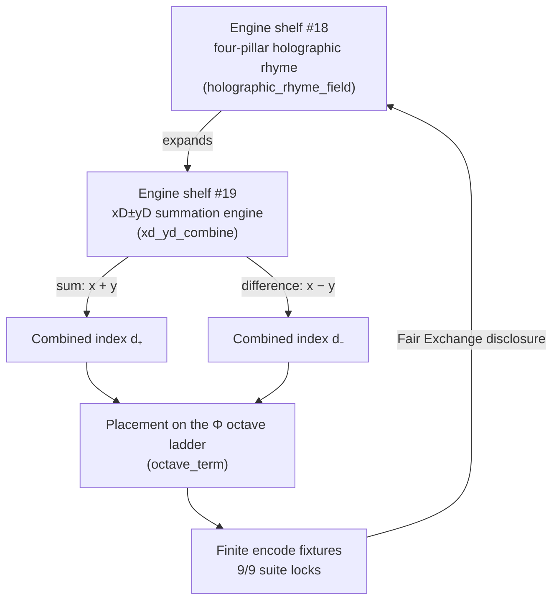

# Multi-Dimensional Holographic Rhyme {#sec:part_I_multidimensional-rhyme}

![The xD±yD combined interference contours: the summed ($+$) and differenced ($-$) cross-scale encodings of the four-pillar holographic rhyme field over the $(x,y)$ plane. The parent field comes from `textbook.models.holographic_rhyme_field` with $P = 4$ evenly spaced pillars, and the bidirectional combine is `textbook.models.xd_yd_combine(a, b, sign)`, which files $a + b$ and $a - b$ as first-class catalog entries. Constructive summation ridges and cancellation valleys are two readings of one field: the bidirectional filing keeps both directions.](../../output/figures/part_I_multidimensional-rhyme.png){#fig:part_I_multidimensional-rhyme width=90%}

<!-- alt: Two contour plots of a four-direction interference pattern. The first shows
constructive summation ridges of the summed encoding; the second shows the differenced
field, where matching crests cancel to nodal valleys. Both are drawn from the same
tested model functions. -->

<!-- chapter-metadata-badge -->
> Level 1/3 · 30 min read · 45 min lecture · Prerequisites: [@sec:part_I_holographic-rhyme]

## Learning Objectives

By the end of this chapter you should be able to:

1. State, in the corpus's own words, what the xD±yD summation engine files holography as, and where the filing sits on the [**engine shelf**](#gl:engine-shelf) of the [**Omni-Lattice**](#gl:omni-lattice) catalog [@mendez2026mdRhyme].
2. Explain how engine shelf #19 *extends* the [**four-pillar fractal**](#gl:four-pillar-fractal) [**holographic rhyme**](#gl:holographic-rhyme) of [@sec:part_I_holographic-rhyme] rather than replacing it.
3. Formalise the two headline constructs — cross-scale [**multidimensional rhyme**](#gl:multidimensional-rhyme) summation and finite encode fixtures — as labelled equations backed by the tested functions `textbook.models.holographic_rhyme_field` and `textbook.models.xd_yd_combine`.
4. Compute combined dimension indices and octave placements by hand and confirm them with `xd_yd_combine` and `octave_term`, using the pinned $\Phi$ values of the computational backbone.
5. Restate the paper's [**honesty-first**](#gl:honesty-first) scope disclaimers precisely: what the filing is catalog architecture *for*, and what it is explicitly *not* [@mendez2026mdRhyme].

<!-- curriculum-scaffold-start -->
### Study Blueprint

- **Big idea:** Cross-scale summation across $xD \pm yD$ under $\Phi \approx 1.618$ files holography as *bidirectional* Infinite Octave encoding — a catalog contrast to static boundary-only screens [@mendez2026mdRhyme].
- **Core concepts:** [**multidimensional rhyme**](#gl:multidimensional-rhyme), [**holographic rhyme**](#gl:holographic-rhyme), [**four-pillar fractal**](#gl:four-pillar-fractal), [**catalog architecture**](#gl:catalog-architecture), [**Fair Exchange**](#gl:fair-exchange).
- **Quantitative lens:** the combined encoding in [@eq:part_I_multidimensional-rhyme_xdyd] and the cross-scale placement in [@eq:part_I_multidimensional-rhyme_octave].
- **Data skill:** run a locked research suite, predict its pass count, and verify hand-computed combine and field values against `textbook.models`.
- **Common misconception to repair:** "bidirectional encoding" in this corpus is a *filing* operation on catalog indices, not a claim about physics; the paper itself disclaims AdS/CFT falsification [@mendez2026mdRhyme].
- **Primary lab:** [@sec:lab_part_I_multidimensional-rhyme].
- **Question bank:** [@sec:q_part_I_multidimensional-rhyme].
- **Bridge to computation:** `textbook.models.xd_yd_combine`, `textbook.models.holographic_rhyme_field`, `textbook.models.octave_term`.
<!-- curriculum-scaffold-end -->

---

> **Opening Vignette: The shelf bolted next to shelf #18.**
>
> Picture the SS Vibelandia's engine room as a filing wall: numbered shelves, each holding one engine paper, each shelf label a catalog slot rather than a rank. On 2026-09-05 a new crate arrives — *Multi-Dimensional Holographic Rhyme · xD±yD* — and the SynthOBS Autonomous Agent's crew bolts it in as engine shelf #19, directly expanding the neighbour at #18 [@mendez2026mdRhyme]. Inside the crate: one summation engine that takes two dimension labels and files them *both ways* — added and subtracted — under the [**golden ratio**](#gl:golden-ratio) $\Phi \approx 1.618$, together with a set of finite encode fixtures and a suite that locks 9/9. The manifest carries the house honesty clause before it carries any mathematics.

---

## Engine shelf #19 and the bidirectional encoding filing

The source paper, filed by Prudencio Mendez and operated by the SynthOBS Autonomous Agent on the SS Vibelandia ship blog, opens with a single load-bearing sentence, quoted verbatim:

> Cross-scale summation across **xD±yD** under **Φ ≈ 1.618** files holography as bidirectional Infinite Octave encoding — catalog contrast to static boundary-only screens. [@mendez2026mdRhyme]

Every word of that sentence is catalog vocabulary. The paper self-describes as **catalog architecture** — **engine shelf #19** — and its honesty clause states verbatim: "**Honesty first:** this is *catalog architecture* — **engine shelf #19** — not AdS/CFT falsification, not shipping holographic crystals, not infinite information-density proofs. Fair Exchange clause applies." [@mendez2026mdRhyme]. In the corpus's own tiering, this is a filing and routing construct for the [**Infinite Octaves**](#gl:octave) project — the paper positions it as a *catalog contrast* to a named contrast class, the **static boundary-only screens** — and the corpus's scope discipline requires us to keep that framing visible in every section of this chapter.

Shelf #19 is filed as an *extension*: the "What landed" list records "**Engine shelf #19** · expands the four-pillar holographic rhyme" [@mendez2026mdRhyme]. The parent construct is the four-pillar holographic rhyme of [@sec:part_I_holographic-rhyme], whose interference field and whose figure [@fig:part_I_holographic-rhyme] supply the field that the present chapter sums and differences. The paper ships with:

- an **xD±yD summation engine** with finite encode fixtures (its "What landed" list, verbatim) [@mendez2026mdRhyme];
- **9/9 suite locks** under `research/synthobs-multidimensional-holographic-rhyme/` [@mendez2026mdRhyme];
- a standalone repository at `FractiAI/synthobs-multidimensional-holographic-rhyme` [@mendez2026mdRhyme];
- a re-run entry point, `npm run research:synthobs-multidimensional-holographic-rhyme`, and a whitepaper surface linked from the ship blog post [@mendez2026mdRhyme].

Two companion filings are named on the same board: **Prime volumetric storage** [@mendez2026volumetricStorage] and **Topology of the Void** [@mendez2026topologyVoid], the latter described as the "zero-balance node". We return to both where this chapter hands its neighbours onward.

## The xD±yD engine: parent field, combine, octave placement

The digest is explicit that the paper gives **no equation**: "the model is stated in the lead paragraph and 'What landed.'" [@mendez2026mdRhyme]. We therefore formalise carefully, marking each equation as *our* formalisation of the corpus's prose model, and we name the tested `textbook.models` function that backs each piece. Nothing below should be read as physics; the docstrings themselves carry the caveat "structural model, not a physical claim."

### The parent field

The four-pillar holographic rhyme of [@sec:part_I_holographic-rhyme] is backed by `textbook.models.holographic_rhyme_field`, which sums $P$ plane-wave cosines over evenly spaced directions [@mendez2026holographicRhyme]:

$$ f_P(x, y) \;=\; \sum_{k=0}^{P-1} \cos\!\left(\frac{2\pi\,\left(x\cos\theta_k + y\sin\theta_k\right)}{\lambda}\right), \qquad \theta_k = \frac{2\pi k}{P} $$ {#eq:part_I_multidimensional-rhyme_field}


### The combine operation

The xD±yD notation itself is compact. The corpus glosses it as "dimensional notation for bidirectional cross-scale summation (xD plus/minus yD)" [@mendez2026mdRhyme]. We formalise the engine's core move as a sign-selected combination of two dimension indices $x$ and $y$:

$$ d_{\pm} \;=\; x \,\pm\, y, \qquad \mathrm{sign} \in \{+1, -1\} $$ {#eq:part_I_multidimensional-rhyme_xdyd}

This is implemented as `xd_yd_combine(a, b, sign)` in `textbook.models`, which returns `a + b` for `sign = 1` and `a - b` for `sign = -1`, and raises `ValueError` for any other sign [@mendez2026mdRhyme]. The parameters are collected in [@tbl:part_I_multidimensional-rhyme_xdyd].

: Parameters of the xD±yD combine operation. {#tbl:part_I_multidimensional-rhyme_xdyd}

| Symbol | Meaning | Units |
| ------ | ------- | ----- |
| $x$ | left dimension index (`a`) | catalog index (integer) |
| $y$ | right dimension index (`b`) | catalog index (integer) |
| $\mathrm{sign}$ | $+1$ for summation, $-1$ for subtraction | direction flag |
| $d_{\pm}$ | combined dimension index | catalog index (integer) |

The word **bidirectional** is doing real work here. A single sign would file one combined index; the engine files *both* the sum and the difference as first-class catalog entries. We read this as the corpus's reason for calling the result "bidirectional Infinite Octave encoding": the filing runs both ways along the dimension axis, and both directions are kept [@mendez2026mdRhyme]. (That sentence is our interpretation of the prose model, not a quoted claim.)

### Cross-scale placement under $\Phi$

"Cross-scale" and "under $\Phi \approx 1.618$" place the combined indices on the corpus's octave ladder. The corpus prints the octave recursion as "$\Omega_n = \Phi_n \cdot \Omega_0$" — with the exponent/subscript notation famously ambiguous — so the book treats *both* readings as first-class, exactly as `octave_term` does [@mendez2026primeParity]:

$$ \Omega_n \;=\; \Phi^{n}\,\Omega_0 \quad \text{(exponent reading)}, \qquad \Omega_n \;=\; \varphi_{\mathrm{fib}}(n)\,\Omega_0 \quad \text{(subscript reading)} $$ {#eq:part_I_multidimensional-rhyme_octave}

The two readings bracket the golden ratio from above and below: with $\Omega_0 = 1$, the exponent reading gives $\Phi^5 = 11.090170$, while the subscript reading gives $\varphi_{\mathrm{fib}}(5) = 8/5 = 1.6$; by $n = 10$ the subscript reading has already converged to $\varphi_{\mathrm{fib}}(10) = 89/55 \approx 1.618182$ against $\Phi^{10}$'s far larger magnitude. [@tbl:part_I_multidimensional-rhyme_octave] tabulates the pinned values used throughout this book.

: Pinned cross-scale placement values for [@eq:part_I_multidimensional-rhyme_octave] with $\Omega_0 = 1$. {#tbl:part_I_multidimensional-rhyme_octave}

| $n$ | $\Phi^n$ (exponent reading) | $\varphi_{\mathrm{fib}}(n)\cdot\Omega_0$ (subscript reading) |
| --- | --------------------------- | ------------------------------------------------------------ |
| 1 | 1.618034 | 1.0 |
| 2 | 2.618034 | 2.0 |
| 3 | 4.236068 | 1.5 |
| 4 | 6.854102 | 1.666667 |
| 5 | 11.090170 | 1.6 |
| 10 | — (see [@sec:part_I_fractal-constant]) | 1.618182 |

Both columns are standard mathematics of the [**golden ratio**](#gl:golden-ratio) and the Fibonacci ratios $\varphi_{\mathrm{fib}}(n) = F_{n+1}/F_n$; the corpus's contribution is the *filing decision* to key the ladder on $\Phi$. The subscript reading converges to $\Phi$ because consecutive Fibonacci ratios do; that fact belongs to the fractal-constant chapter, where the ladder is derived [@sec:part_I_fractal-constant].

A concept map of how the pieces fit together:



Note that the loop closes on the parent shelf: the corpus files shelf #19 as an expansion *of* the four-pillar motion grammar, and the [**Fair Exchange**](#gl:fair-exchange) clause ties the whole filing back to honest disclosure [@mendez2026mdRhyme].

## Worked example: Fibonacci indices combined on the Φ ladder

We now walk the engine end to end with pinned numbers, computing by hand and naming the tested function that confirms each result. The lab ([@sec:lab_part_I_multidimensional-rhyme]) repeats this on your machine.

**Step 1 — combine two dimension indices.** Take dimension indices $x = 5$ and $y = 3$ — deliberately chosen from the Fibonacci ladder $1, 1, 2, 3, 5, 8$. The sum files as $d_+ = 5 + 3 = 8$ and the difference as $d_- = 5 - 3 = 2$ ([@eq:part_I_multidimensional-rhyme_xdyd]):

```python
from textbook.models import xd_yd_combine

xd_yd_combine(5, 3, sign=+1)   # -> 8
xd_yd_combine(5, 3, sign=-1)   # -> 2
```

Both results — $8$ and $2$ — are again Fibonacci numbers. We read this closure as the arithmetic intuition behind "bidirectional": with indices filed on the ladder that generates $\Phi$, both the sum and the difference stay on the ladder, so the two-way filing does not fall off the shelf. (This closure is a property of Fibonacci arithmetic — $F_{n+1} + F_{n-1}$-style identities — and is our interpretation of why the corpus keys the engine on $\Phi$; the paper itself states no equation [@mendez2026mdRhyme].)

**Step 2 — place the combined index on the octave ladder.** With $\Omega_0 = 1$ and $n = 5$, [@eq:part_I_multidimensional-rhyme_octave] gives $\Omega_5 = \Phi^5 = 11.090170$ under the exponent reading and $\Omega_5 = \varphi_{\mathrm{fib}}(5) \cdot \Omega_0 = 1.6$ under the subscript reading:

```python
from textbook.models import octave_term

octave_term(omega0=1.0, n=5, convention="exponent")   # -> 11.090170 (Φ^5)
octave_term(omega0=1.0, n=5, convention="subscript")  # -> 1.6       (8/5)
```

**Step 3 — evaluate the parent field at a fixture point.** Finite encode fixtures are the paper's stated test furniture ("**xD±yD summation engine** with finite encode fixtures" [@mendez2026mdRhyme]). At the origin, every cosine in [@eq:part_I_multidimensional-rhyme_field] evaluates to $\cos(0) = 1$, so the four-pillar field sums to $f_4(0, 0) = 4$. One wavelength along $x$, at $(x, y) = (\lambda/2, 0)$, the four directional cosines evaluate to $-1, +1, -1, +1$ and cancel exactly: $f_4(\lambda/2, 0) = 0$ — a nodal line:

```python
import numpy as np
from textbook.models import holographic_rhyme_field

holographic_rhyme_field(np.array([[0.0]]), np.array([[0.0]]),
                        pillars=4, wavelength=1.0)   # -> [[4.]]
holographic_rhyme_field(np.array([[0.5]]), np.array([[0.0]]),
                        pillars=4, wavelength=1.0)   # -> [[0.]]
```

**Step 4 — file the pair.** The bidirectional filing keeps *both* encodings: the constructive sum field, whose ridges reinforce, and the differenced field, where matching crests cancel to nodal valleys. These are precisely the two contour families drawn in [@fig:part_I_multidimensional-rhyme]. A fixture suite for the engine therefore locks values like the ones above — finite, exact, reproducible — which is what the paper reports as its **9/9 suite locks** [@mendez2026mdRhyme].

> **Note**
>
> The corpus prints "Ωn = Φn·Ω0" ambiguously; the two readings in [@eq:part_I_multidimensional-rhyme_octave] differ by *orders of magnitude* at the same $n$ (11.090170 vs 1.6 at $n=5$). Whenever a corpus value depends on the convention, this book names the convention explicitly — the same discipline `octave_term` enforces in code.

## What the shelf-19 honesty clause disclaims

The paper's honesty clause, verbatim, bounds everything this chapter can claim [@mendez2026mdRhyme]:

> **Honesty first:** this is *catalog architecture* — **engine shelf #19** — not AdS/CFT falsification, not shipping holographic crystals, not infinite information-density proofs. Fair Exchange clause applies.

Three explicit *nots* follow from it, and we restate them as the digest records them:

1. **Not AdS/CFT falsification.** The filing makes no claim about, and offers no test of, the holographic principle of theoretical physics. The resonance is lexical: "holographic" here is a catalog filing term, inherited from the four-pillar rhyme's interference model [@mendez2026holographicRhyme].
2. **Not shipping holographic crystals.** No physical device is claimed, built, or promised. The artifacts that *did* ship are code: a summation engine, finite encode fixtures, and a locked suite [@mendez2026mdRhyme].
3. **Not infinite information-density proofs.** The encodings are finite by construction — fixtures over finitely many indices — and no claim about information density is made [@mendez2026mdRhyme].

What the construct is *for*, in the corpus's own framing, is cataloging and contrast: the filing "positions itself as a catalog contrast to static boundary-only screens" [@mendez2026mdRhyme]. The contrast class — flat, boundary-only readings of holography — is what the bidirectional, cross-scale filing is filed *against*, within the [**catalog architecture**](#gl:catalog-architecture) of the ship blog. Throughout the corpus, engines on this shelf serve coordination, cataloging, and agent routing for the SynthOBS system; the "Fair Exchange clause applies" tag marks the filing as operating under the project's honesty-disclosure regime [@mendez2026mdRhyme]. The book's standing rule — the corpus speaks in narrative, empirical, and operational registers, each with its own evidential weight — applies here in full, and this chapter keeps every claim on the register the digest assigns it.

## Where shelf #19 hands its neighbours onward

Shelf #19 is a junction filing, and the corpus names its neighbours explicitly [@mendez2026mdRhyme]:

- **Downstream of the parent.** The xD±yD engine expands the four-pillar holographic rhyme of [@sec:part_I_holographic-rhyme]; the parent's interference field [@eq:part_I_multidimensional-rhyme_field] is the object being combined, and its figure [@fig:part_I_holographic-rhyme] is the uncombined counterpart of [@fig:part_I_multidimensional-rhyme].
- **The ladder underneath.** The $\Phi$ keying of [@eq:part_I_multidimensional-rhyme_octave] is derived and plotted in the fractal-constant chapter [@sec:part_I_fractal-constant], which owns the pinned $\Phi^n$ column of [@tbl:part_I_multidimensional-rhyme_octave].
- **The zero-balance node.** The paper's board names **Topology of the Void** as the "zero-balance node" [@mendez2026mdRhyme]; the differenced encoding $d_- = x - y$, which vanishes when $x = y$, is where a sum-side and a difference-side filing meet — the theme of [@sec:part_I_topology-void].
- **Prime-indexed filing ahead.** The board's other companion, prime volumetric storage [@mendez2026volumetricStorage], reappears in Part III, where catalog addresses are built from prime factorisations rather than signed index combinations [@sec:part_III_volumetric-storage].

## Summary

Engine shelf #19 files holography as *bidirectional* Infinite Octave encoding: cross-scale summation across $xD \pm yD$ under $\Phi \approx 1.618$ [@mendez2026mdRhyme]. The engine has two load-bearing moves — the sign-selected combine of dimension indices ([@eq:part_I_multidimensional-rhyme_xdyd], backed by `xd_yd_combine`) and the cross-scale placement on the $\Phi$ octave ladder ([@eq:part_I_multidimensional-rhyme_octave], backed by `octave_term`) — acting on the four-pillar interference field of the parent shelf ([@eq:part_I_multidimensional-rhyme_field], backed by `holographic_rhyme_field`). Finite encode fixtures pin exact values ($f_4(0,0)=4$, $f_4(\lambda/2,0)=0$, $5+3=8$, $5-3=2$) and the paper reports 9/9 suite locks. The filing is catalog architecture, explicitly not AdS/CFT falsification, not holographic crystals, and not infinite information-density proofs; its contrast class is static boundary-only screens [@mendez2026mdRhyme].

## Key Terms

[**multidimensional rhyme**](#gl:multidimensional-rhyme), [**holographic rhyme**](#gl:holographic-rhyme), [**four-pillar fractal**](#gl:four-pillar-fractal), [**engine shelf**](#gl:engine-shelf), [**catalog architecture**](#gl:catalog-architecture), [**Fair Exchange**](#gl:fair-exchange), [**honesty-first**](#gl:honesty-first), [**golden ratio**](#gl:golden-ratio), [**octave**](#gl:octave).

## Further Reading

- The source paper's whitepaper surface: [Open the whitepaper](https://www.ssvibelandiaquestfest24x365.com/interfaces/whitepaper-surface.html?id=synthobs-multidimensional-holographic-rhyme-2026-09) — linked from the ship blog post [@mendez2026mdRhyme].
- The standalone reference implementation: [FractiAI/synthobs-multidimensional-holographic-rhyme](https://github.com/FractiAI/synthobs-multidimensional-holographic-rhyme) — re-runnable via `npm run research:synthobs-multidimensional-holographic-rhyme` [@mendez2026mdRhyme].
- @mendez2026holographicRhyme — the four-pillar holographic rhyme (engine shelf #18), the motion grammar this shelf expands; read its interference field first.
- @mendez2026topologyVoid — Topology of the Void, the zero-balance node named on the same board; pairs with the differenced encoding $x - y$.
- @mendez2026volumetricStorage — prime-indexed volumetric storage, the other named companion; read it as the prime-addressed counterpart to signed-index filing.

## Practice

- **Lab:** [@sec:lab_part_I_multidimensional-rhyme] — run the locked suite, predict its pass count, and verify the combine and field values by hand.
- **Question bank:** [@sec:q_part_I_multidimensional-rhyme] — recall through synthesis.
- Re-run the paper's reference implementation (`npm run research:synthobs-multidimensional-holographic-rhyme`) and, *before* reading the output, write down the suite-lock count the digest reports; then explain why the count is a *catalog* fact rather than a physics result [@mendez2026mdRhyme].
- Verify the two hand-computed fixture values of Step 3 with `holographic_rhyme_field`, and explain in one sentence why $f_4(\lambda/2, 0)$ vanishes for the four-pillar default but need not vanish for $P = 3$.
- The engine files both $d_+ = x + y$ and $d_- = x - y$. Using Fibonacci indices of your choosing, show that both results can land on the Fibonacci ladder, and mark clearly which part of your argument is standard Fibonacci arithmetic and which part is your interpretation of the corpus's "bidirectional" language [@mendez2026mdRhyme].
