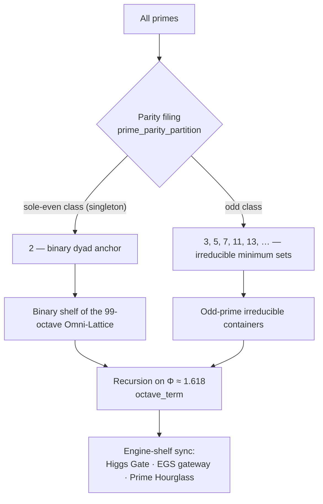

# Prime-Parity: The Sole-Even Anchor {#sec:part_I_prime-parity}

{#fig:part_I_prime-parity width=90%}

<!-- alt: Horizontal number line from 0 to 32 with tick marks at the primes. The single
even prime 2 is highlighted above the line as the binary dyad anchor, while the odd
primes 3, 5, 7, 11, 13, 17, 19, 23, 29 and 31 sit below the line in one grouped class
labelled "irreducible minimum sets". -->

<!-- chapter-metadata-badge -->
> Level 1/3 · 30 min read · 45 min lecture · Prerequisites: none

## Learning Objectives

By the end of this chapter you should be able to:

1. State the **sole-even parity** of the prime 2 and explain the filing role the
   corpus gives it as the [**binary dyad anchor**](#gl:binary-dyad-anchor) of
   Infinite Octaves grammar [@mendez2026primeParity].
2. Explain what the corpus means by the odd primes acting as
   [**irreducible minimum sets**](#gl:irreducible-minimum-set), and list the first
   ten of them.
3. Read the octave recursion formalism of [@eq:part_I_prime-parity_model] in *both*
   printed conventions — exponent and subscript — and compute octave terms with the
   tested function `textbook.models.octave_term`.
4. Run the partition formalism `textbook.models.prime_parity_partition` and connect
   its two output classes to the filing labels of [@fig:part_I_prime-parity].
5. Restate the paper's own scope disclaimer — "catalog math + filing labels" — and
   name at least two things the construct is explicitly *not* for.

<!-- curriculum-scaffold-start -->
### Study Blueprint

- **Big idea:** the primes split by parity into a single sole-even anchor (the
  number 2) and one class of irreducible odd sets — the parity filing that keys the
  binary shelf of the 99-[**octave**](#gl:octave) Omni-Lattice.
- **Core concepts:** [**prime-parity**](#gl:prime-parity),
  [**binary-dyad-anchor**](#gl:binary-dyad-anchor),
  [**irreducible-minimum-set**](#gl:irreducible-minimum-set),
  [**fractal-constant**](#gl:fractal-constant).
- **Quantitative lens:** the octave recursion formalism in
  [@eq:part_I_prime-parity_model].
- **Data skill:** partition a list of primes by parity and verify that the
  sole-even class is a singleton for every cutoff you try.
- **Common misconception to repair:** "even primes" in the plural — there is
  exactly one, and the corpus treats that uniqueness as a load-bearing filing
  feature, not an accident.
- **Primary lab:** [@sec:lab_part_I_prime-parity].
- **Question bank:** [@sec:q_part_I_prime-parity].
- **Bridge to computation:** `textbook.models.prime_parity_partition`,
  `textbook.models.octave_term`.
<!-- curriculum-scaffold-end -->

---

> **Opening Vignette: The registry with one card in the top drawer.**
>
> Picture a filing cabinet in the [**catalog architecture**](#gl:catalog-architecture)
> of the SS Vibelandia ship blog [@mendez2026primeParity]. Two drawers. The top
> drawer holds a single card, labelled **2**. The bottom drawer holds the cards
> 3, 5, 7, 11, 13, … — and the clerk's standing rule is that no even card ever
> joins them. The clerk does not prove anything about numbers; the clerk files
> them. The paper's move is to observe that this filing is *stable* — the top
> drawer never fills — and to make that stability carry weight: the lone even
> card becomes the anchor that everything else in the cabinet is filed relative
> to.

---

## The shelf-11 paper: catalog math and filing labels

*Infinite Octave Prime-Parity* is a September 2026 executive paper on the SS
Vibelandia ship blog, authored by Prudencio Mendez and operated by the SynthOBS
Autonomous Agent. Its self-description is deliberately modest: **catalog math +
filing labels** — a way of filing the primes inside the Infinite Octaves / 99
Octave Omni-Lattice [**engine shelf**](#gl:engine-shelf), not a theorem about the
physical world [@mendez2026primeParity].

The paper sits on shelf slot 11 of the engine shelf, pinned into the Infinite
Octaves / 99 Octave Omni-Lattice sync **beside Higgs Gate and the enterprise
gateway companion** [@mendez2026primeParity]. Its cross-linked components are the
*Prime Hourglass*, the *SI Irreducible Minimum*, and the *CMOS/protonic binary
shelf* — the last of these carries the parity filing forward into semiconductor
vocabulary in [@sec:part_III_cmos-protonic] [@mendez2026cmosProtonic]. The
recursion constant it runs on, [**El Gran Sol's Fractal
constant**](#gl:fractal-constant) $\Phi$, is introduced in full in
[@sec:part_I_fractal-constant]; its growth law is formalised as
[@eq:part_I_fractal-constant_octave-term] in that companion chapter.



Empirically, the paper ships with a replayable suite: **9/9 fixtures passing**
under `research/synthobs-infinite-octave-prime-parity/`, re-runnable with
`npm run research:synthobs-infinite-octave-prime-parity` [@mendez2026primeParity].
The standalone repository lives at `https://github.com/FractiAI/synthobs-infinite-octave-prime-parity`.
The whitepaper surface is linked from the ship blog post itself (see
[Further Reading](#further-reading)). Every quantitative claim in this chapter is
reproduced by the tested backbone functions
`textbook.models.prime_parity_partition` and `textbook.models.octave_term`, so the
prose and the fixtures cannot silently disagree.

## Sole-even 2 as the binary dyad anchor

The first claim is elementary arithmetic: **2 is the only even prime**. The
standard reason is one line — any even number greater than 2 is divisible by 2 and
hence composite — but that is textbook mathematics, and the corpus does not claim
credit for it. What the paper adds is a *filing role*: in Infinite Octaves grammar
the sole-even status of 2 becomes the [**binary dyad anchor**](#gl:binary-dyad-anchor)
[@mendez2026primeParity].

Read the label in two parts. *Binary* — because the anchor is the seed of the
two-symbol alphabet that the binary shelves of the lattice are keyed to, from the
CMOS/protonic gate filing [@mendez2026cmosProtonic] down to the dyadic digits of
the [**master register**](#gl:master-register). *Dyad anchor* — because a dyad
needs a fixed member before relative positions mean anything: with exactly one
even prime, "even-side of the prime table" always points at the same object. The
corpus files uniqueness as a feature. [@fig:part_I_prime-parity] draws the
resulting picture: one card above the number line, ten below.

We read this as filing grammar, not number theory: the theorem sketch in the
paper ("sole-even parity of 2") restates a classical fact, and the *anchor*
status is the paper's own structural assignment. That distinction — classical
arithmetic versus catalog assignment — runs through everything that follows.

## Odd primes as irreducible minimum addressing sets

The second claim assigns the complementary drawer: **odd primes act as
irreducible minimum sets** [@mendez2026primeParity]. The glossary gloss
([**irreducible minimum set**](#gl:irreducible-minimum-set)) unpacks it: each odd
prime is an irreducible minimal container or label — a set that cannot be
composed from smaller filed sets, and therefore serves as a minimal unit of
addressing.

The first ten odd primes are collected in [@tbl:part_I_prime-parity_oddsets].

:: The first ten odd primes, the irreducible minimum sets of the parity filing.
[@mendez2026primeParity] {#tbl:part_I_prime-parity_oddsets}

| Index $k$ | Odd prime $p_k$ | Index $k$ | Odd prime $p_k$ |
| --- | --- | --- | --- |
| 1 | 3  | 6  | 17 |
| 2 | 5  | 7  | 19 |
| 3 | 7  | 8  | 23 |
| 4 | 11 | 9  | 29 |
| 5 | 13 | 10 | 31 |

"Irreducible" here is the same irreducibility the fundamental theorem of
arithmetic builds on: primes cannot be decomposed into smaller integer factors,
so a product of prime powers names exactly one integer. The corpus leans on this
injectivity when it builds address grammars: for example,
`textbook.models.unique_address([2, 3], [2, 1])` returns `12` — the product
$2^2 \cdot 3^1 = 12$, a unique address composed from the anchor prime 2 and the
first odd prime 3. That same encoding, scaled up, is the prime-indexed vault
grammar of [@sec:part_III_volumetric-storage] and the containment reading of
[@sec:part_III_protein-folding] [@mendez2026volumetricStorage;
@mendez2026proteinFolding].

Nothing in the paper claims the primes were *discovered* by the parity filing.
The claim is that the odd primes' irreducibility makes them usable as minimal
labeled containers, and that the parity split is the first cut that makes the
binary side (the anchor) and the odd side (the sets) addressable separately.

## Octave recursion: exponent and subscript conventions

The recursion on which the filing runs is the paper's one printed formula, filed
as a theorem sketch [@mendez2026primeParity]:

$$ \Omega_n = \Phi^n \cdot \Omega_0 $$ {#eq:part_I_prime-parity_model}

Here $\Omega_n$ is the octave term at index $n$, $\Omega_0$ is the base octave
term, and $\Phi \approx 1.618$ is [El Gran Sol's Fractal
constant](#gl:fractal-constant) — the same $\Phi = (1+\sqrt{5})/2$ studied in
[@sec:part_I_fractal-constant] and plotted against the Fibonacci ratios in
[@fig:part_I_fractal-constant].

**The printed formula is ambiguous, and the corpus knows it.** The paper prints
"$\Omega_n = \Phi_n \cdot \Omega_0$", and as printed it is genuinely unclear
whether the $\Phi$ carries an *exponent* or a *subscript* [@mendez2026primeParity].
The reference implementation in `textbook.models.octave_term` therefore treats
**both readings as first-class** rather than picking a winner:

$$ \Omega_n^{\text{sub}} = \frac{F(n+1)}{F(n)} \cdot \Omega_0 $$ {#eq:part_I_prime-parity_subscript}

Under the **exponent** convention, [@eq:part_I_prime-parity_model] reads $\Omega_n
= \Phi^n \Omega_0$ — growth at the golden-ratio rate per octave. Under the
**subscript** convention, [@eq:part_I_prime-parity_subscript] reads the printed
$\Phi_n$ as the $n$-th Fibonacci ratio $F(n+1)/F(n)$, which steps $\Phi_n
\to \Phi$ from below. The parameters of both conventions are collected in
[@tbl:part_I_prime-parity_parameters].

:: Parameters of the octave recursion formalism (both printed conventions).
{#tbl:part_I_prime-parity_parameters}

| Symbol | Meaning | Role | Pinned value |
| ------ | ------- | ---- | ------------ |
| $\Omega_n$ | octave term at index $n$ | computed | [@eq:part_I_prime-parity_model] |
| $\Omega_0$ | base octave term | parameter | free (1 in worked examples) |
| $\Phi$ | Fractal constant, recursion rate | parameter | $1.6180339887$ |
| $\Phi_n = F(n+1)/F(n)$ | $n$-th Fibonacci ratio (subscript reading) | computed | $1.6$ at $n=5$; $89/55 \approx 1.618182$ at $n=10$ |
| $n$ | octave index | parameter | $1, 2, 3, \ldots$ |

The two conventions agree in the limit — $F(n+1)/F(n) \to \Phi$, so
$\Omega_n^{\text{sub}}/\Omega_0 \to \Phi$ is the first step of the exponential
ladder — but they diverge quickly at small $n$, which is exactly why the model
function refuses to choose. Call it as:

```python
from textbook.models import octave_term
octave_term(omega0=1.0, n=5, convention="exponent")   # 11.090170
octave_term(omega0=1.0, n=5, convention="subscript")  # 1.6
```

> **Note**
>
> The ambiguity is a property of the *source text*, faithfully carried through the
> implementation. When you see "$\Omega_n = \Phi_n \cdot \Omega_0$" quoted anywhere
> in the corpus, do not silently normalise it to one reading; name the convention
> you are using, exactly as `octave_term` requires you to.

## Worked example: partition, ladder, and one joint address

**Step 1 — partition.** The tested function
`textbook.models.prime_parity_partition(limit)` returns the two filing classes for
primes below `limit`:

```python
from textbook.models import prime_parity_partition
prime_parity_partition(32)
# {'sole_even': [2],
#  'odd': [3, 5, 7, 11, 13, 17, 19, 23, 29, 31]}
```

This is the machine-readable form of [@fig:part_I_prime-parity]: a singleton
anchor class and the ten odd primes of [@tbl:part_I_prime-parity_oddsets]. Now
walk the cutoff down. `prime_parity_partition(12)` returns `{'sole_even': [2],
'odd': [3, 5, 7, 11]}`, and any cutoff between 3 and infinity behaves the same
way: **the `sole_even` list is always exactly `[2]` whenever 2 is below the
cutoff, and empty otherwise**. That invariant is the sole-even parity of 2
expressed as data — the top drawer never gains a second card, at any shelf of the
ladder. The same assertion is pinned by the paper's 9/9 replayable fixtures
[@mendez2026primeParity].

**Step 2 — walk the ladder.** With $\Omega_0 = 1$, the exponent convention of
[@eq:part_I_prime-parity_model] gives the first six octave terms:

| $n$ | $\Omega_n = \Phi^n \Omega_0$ |
| --- | --- |
| 1 | 1.618034 |
| 2 | 2.618034 |
| 3 | 4.236068 |
| 4 | 6.854102 |
| 5 | 11.090170 |
| 6 | 17.944272 |

Each octave is $\Phi$ times the last: the 99-octave ladder of the Omni-Lattice
[@mendez2026digitsMaster] is this sequence read as shelf spacing, with
`textbook.models.octave_term` as its tested evaluator. Under the subscript
convention the same indices give $\Omega_5/\Omega_0 = 8/5 = 1.6$ and
$\Omega_{10}/\Omega_0 = 89/55 \approx 1.618182$ — the Fibonacci ratios of
[@eq:part_I_prime-parity_subscript] closing in on $\Phi$ from below.

**Step 3 — address a joint filing.** Combine the two classes: an address built
from the anchor and one odd set, `unique_address([2, 3], [2, 1]) = 12`, shows the
two drawers cooperating inside one injective encoding — the anchor supplies the
binary base, the odd set supplies the first irreducible container.

## The paper's boundary: catalog math, not physics

The paper's own disclaimer, quoted nearly verbatim, is the boundary of this
chapter:

> **Honesty first:** this is catalog math + filing labels. It does *not* prove
> QED from primes, rewrite NOAA heliophysics, or ship ultra-secure crypto
> hardware [@mendez2026primeParity].

Three negatives are worth naming precisely. The parity filing does **not** prove
quantum electrodynamics from prime structure — no such derivation exists in the
paper. It does **not** rewrite heliophysics: the solar labels that decorate the
post, "Helios-Prime" (AR3664) and "Borealis" (AR3590), are explicitly **story
characters for timing talk — not cosmic proof certificates** [@mendez2026primeParity].
And it does **not** ship ultra-secure cryptographic hardware — the
irreducibility of primes here is a *filing* property (unique addressing), not a
hardness guarantee for key exchange.

What the construct **is** for, per the paper's own framing, is coordination:
filing labels, catalog structure, agent routing, and a stable parity key for the
99-octave [**Omni-Lattice**](#gl:omni-lattice) [@mendez2026primeParity]. This is
the [**honesty-first**](#gl:honesty-first) disclosure convention of the corpus,
and every downstream chapter that reuses the parity filing inherits the same
boundary.

## Where the parity filing feeds the rest of the book

The parity filing feeds four load-bearing lines in the rest of the book:

- **The binary shelf.** The binary dyad anchor is the seed of the two-symbol
  filing that the CMOS/protonic bridge maps onto semiconductor gates in
  [@sec:part_III_cmos-protonic] [@mendez2026cmosProtonic].
- **Prime-indexed addressing.** The odd irreducible sets, composed with the
  anchor via `unique_address`, become the volumetric vault grammar of
  [@sec:part_III_volumetric-storage] and the containment vaults of
  [@sec:part_III_protein-folding] [@mendez2026volumetricStorage;
  @mendez2026proteinFolding].
- **The recursion constant.** The octave ladder of [@eq:part_I_prime-parity_model]
  is the same $\Phi$-keyed spacing that the Higgs Gate chapter couples to its
  triadic matrix in [@sec:part_I_higgs-awareness] [@mendez2026higgsGate], and
  that the zero-octave equilibrium reading anchors at the bottom of the ladder in
  [@sec:part_I_topology-void] [@mendez2026topologyVoid].
- **The catalog's total size.** The 99-octave ladder this chapter's recursion
  walks is one factor of the $99 \times 81 = 8{,}019$ holographic catalog size
  computed by `textbook.models.catalog_size` in
  [@sec:part_0_master-synthesis] [@mendez2026digitsMaster].

## Summary

*Infinite Octave Prime-Parity* splits the primes by parity into a singleton
anchor and an irreducible class: sole-even 2 as the
[**binary dyad anchor**](#gl:binary-dyad-anchor), the odd primes as
[**irreducible minimum sets**](#gl:irreducible-minimum-set)
[@mendez2026primeParity]. The recursion the filing runs on is
$\Omega_n = \Phi_n \cdot \Omega_0$, printed ambiguously between exponent and
subscript readings — both first-class in `textbook.models.octave_term`, as
worked through [@eq:part_I_prime-parity_model],
[@eq:part_I_prime-parity_subscript], and [@tbl:part_I_prime-parity_parameters].
The partition itself is one function call, `prime_parity_partition`, whose
anchor class is a singleton for every cutoff — the data form of the sole-even
theorem. And the paper's own boundary holds throughout: this is catalog math and
filing labels, with solar "story characters" filed as timing talk, not proof
certificates.

## Key Terms

[**prime-parity**](#gl:prime-parity),
[**binary-dyad-anchor**](#gl:binary-dyad-anchor),
[**irreducible-minimum-set**](#gl:irreducible-minimum-set),
[**fractal-constant**](#gl:fractal-constant),
[**golden-ratio**](#gl:golden-ratio),
[**octave**](#gl:octave),
[**omni-lattice**](#gl:omni-lattice),
[**engine-shelf**](#gl:engine-shelf),
[**honesty-first**](#gl:honesty-first).

## Further Reading

- [Whitepaper: Infinite Octave Prime-Parity
  (2026-09)](https://www.ssvibelandiaquestfest24x365.com/interfaces/whitepaper-surface.html?id=synthobs-infinite-octave-prime-parity-2026-09)
  — the paper's own surface on the ship blog; the source of every claim cited
  here as [@mendez2026primeParity].
- [GitHub: `FractiAI/synthobs-infinite-octave-prime-parity`](https://github.com/FractiAI/synthobs-infinite-octave-prime-parity)
  — the standalone repository; re-run the suite with
  `npm run research:synthobs-infinite-octave-prime-parity` (9/9 fixtures).
- [@mendez2026digitsMaster] — the digits × octaves master register that the
  parity filing keys into; source of the 99-octave ladder and the 8,019-entry
  catalog size.
- [@mendez2026higgsGate] — the Higgs Gate companion the paper is shelf-pinned
  beside; see how the same $\Phi$ recursion reappears in the gate's triadic
  matrix.
- [@mendez2026cmosProtonic] — the CMOS/protonic binary shelf cross-link; the
  downstream consumer of the binary dyad anchor.

## Practice

1. **Recall:** In one sentence each, define the binary dyad anchor and the
   irreducible minimum sets, and say which numbers occupy each filing class.
2. **Computation:** Using `textbook.models.prime_parity_partition`, partition the
   primes below 12, below 32, and below 100. What is the size of the `sole_even`
   class in each case, and why is that the data form of the sole-even theorem?
3. **Conventions:** With $\Omega_0 = 1$, compute $\Omega_5$ under *both*
   conventions of [@eq:part_I_prime-parity_model] and
   [@eq:part_I_prime-parity_subscript] (expect 11.090170 and 1.6), then verify
   with `octave_term`. Explain why the subscript reading converges toward the
   exponent reading as $n$ grows.
4. **Addressing:** Show that `unique_address([2, 3], [2, 1])` returns 12, and
   explain in filing language why this address is unique: what role does the
   anchor play, and what role the odd irreducible set?
5. **Scope:** A friend says the prime-parity paper "proves physics from primes."
   Write two sentences correcting them, quoting the paper's own disclaimer and
   naming what the solar labels AR3664 and AR3590 actually are in the corpus.
