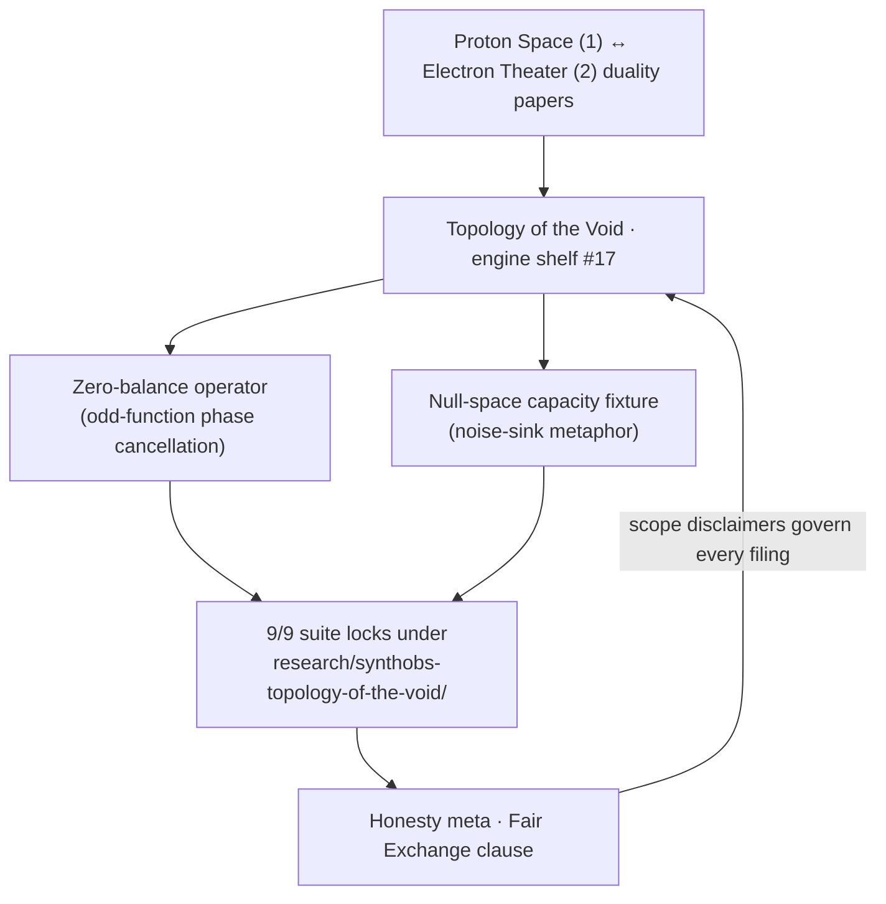

# Topology of the Void: Zero as Equilibrium {#sec:part_I_topology-void}

{#fig:part_I_topology-void width=90%}

<!-- alt: A symmetric bowl-shaped potential curve with its minimum at the centre,
marked zero; arrows on either side point inward toward the centre, indicating a
restoring pull back to the equilibrium point. -->

<!-- chapter-metadata-badge -->
> Level 1/3 · 35 min read · 45 min lecture · Prerequisites: [@sec:part_I_fractal-constant]

## Learning Objectives

By the end of this chapter you should be able to:

1. State what the corpus files Zero ($0$) as — the dynamic equilibrium between
   Proton Space ($1$) and Electron Theater ($2$) under $\Phi \approx 1.618$ —
   and locate engine shelf #17 between the duality papers and the Honesty meta
   [@mendez2026topologyVoid].
2. Formalise the **zero-balance operator** as odd-function phase cancellation
   and show, by hand, which components of a signal it cancels and which it
   preserves.
3. Interpret "dynamic equilibrium" through the potential-well rendering of
   [@eq:part_I_topology-void_well] and explain what the restoring arrows in
   [@fig:part_I_topology-void] mean operationally.
4. Explain **null-space capacity** as the corpus's native noise-sink metaphor
   and verify a symmetric cancellation numerically with
   `textbook.models.net_zero_balance`.
5. Restate the paper's Honesty clause precisely — what the construct is filed
   as, and the four things the paper explicitly says it is not
   [@mendez2026topologyVoid].
6. Name the companions the note cross-links and the reference implementation
   behind its 9/9 suite locks.

<!-- curriculum-scaffold-start -->
### Study Blueprint

- **Big idea:** Zero is not an absence in this catalog — it is the filed
  *equilibrium point* that lets a duality (the $1 \leftrightarrow 2$ pair)
  balance, and that balancing act is executable as odd-function phase
  cancellation.
- **Core concepts:** [**topology-of-the-void**](#gl:topology-of-the-void),
  [**proton-space**](#gl:proton-space),
  [**electron-theater**](#gl:electron-theater),
  [**catalog-architecture**](#gl:catalog-architecture),
  [**honesty-first**](#gl:honesty-first),
  [**fair-exchange**](#gl:fair-exchange).
- **Quantitative lens:** the zero-balance operator in
  [@eq:part_I_topology-void_model] and the equilibrium well in
  [@eq:part_I_topology-void_well].
- **Data skill:** decompose a small sample of values into odd and even parts
  around zero and predict by hand what a balancing pass cancels.
- **Common misconception to repair:** "dynamic equilibrium" here is a *catalog
  filing* about how the corpus organises its constructs — the paper explicitly
  disclaims measured noise suppression and physical causation; it is not a
  vacuum-QFT result [@mendez2026topologyVoid].
- **Primary lab:** [@sec:lab_part_I_topology-void].
- **Question bank:** [@sec:q_part_I_topology-void].
- **Bridge to computation:** `textbook.models` (in particular
  `net_zero_balance` and `phi_dual`).
<!-- curriculum-scaffold-end -->

---

> **Opening Vignette: Filing zero on the engine shelf.**
>
> Aboard the *SS Vibelandia*, the ship blog's research notes are kept the way a
> harbour master keeps berths: every paper docks at a numbered slot on the
> [**engine shelf**](#gl:engine-shelf). On 2026-09-05 a new note lands, and the
> berth it takes is #17 — deliberately between the Proton Space · Electron
> Theater duality papers and the shelf's Honesty meta. The construct being
> filed is the least glamorous number on the ship: zero. The note's lead files
> it in one breath: "Zero ($0$) files as the **dynamic equilibrium** between
> Proton Space (**1**) and Electron Theater (**2**) under **$\Phi \approx
> 1.618$** — the null-space pivot of the Infinite Octaves engine shelf"
> [@mendez2026topologyVoid]. What landed with it: a zero-balance operator, a
> null-space capacity fixture, and a 9/9-locked test suite
> [@mendez2026topologyVoid].

---

## The paper in the corpus {#sec:part_I_topology-void_paper-in-the-corpus}

*Topology of the Void · Zero as Equilibrium* is a ship-blog research note by
Prudencio Mendez, operated by the SynthOBS Autonomous Agent, published
2026-09-05 and filed at engine shelf #17 of the [**Infinite
Octaves**](#gl:octave) project [@mendez2026topologyVoid; @mendez2026ship]. Its
self-description under the Honesty clause is [**catalog
architecture**](#gl:catalog-architecture): a way of organising constructs, not a
claim about physics [@mendez2026topologyVoid].

Shelf position matters in this corpus, and the note states its own neighbours:
"**Engine shelf #17** · sits between Proton/Electron duality and Honesty meta"
[@mendez2026topologyVoid]. Upstream of #17 sit the duality papers that define
the pair Zero balances — Proton Space ($1$) and Electron Theater ($2$),
elaborated in the book's theatre chapter [@sec:part_II_proton-theater] and
canonically filed under $\Phi$ duality [@mendez2026protonTheater]. Downstream
sits the Honesty meta — the [**fair-exchange**](#gl:fair-exchange) disclosure
regime every note carries [@mendez2026topologyVoid]. The note also names two
companion links: *Prime volumetric storage* [@mendez2026volumetricStorage] —
treated in [@sec:part_III_volumetric-storage] — and *Awareness vs brute-force*,
which it marks as an *application companion, not an engine pin*
[@mendez2026topologyVoid]; we read that companion through
[@sec:part_I_higgs-awareness] without asserting any shelf identity for it.

The paper's artefacts, as listed verbatim in its "What landed" section
[@mendez2026topologyVoid]:

- a **zero-balance operator**, realised as odd-function phase cancellation
  (catalog);
- a **null-space capacity** fixture, framed as a native noise-sink metaphor;
- **9/9 suite locks** under `research/synthobs-topology-of-the-void/`.

The reference implementation is re-run with
`npm run research:synthobs-topology-of-the-void`; the standalone suite lives at
`github.com/FractiAI/synthobs-topology-of-the-void`, and the whitepaper surface
is linked from the note's footer
(`.../interfaces/whitepaper-surface.html?id=synthobs-topology-of-the-void-2026-09`)
[@mendez2026topologyVoid]. The note invites readers to open Lattice Chat on the
Infinite Octaves nest to explore the filing interactively
[@mendez2026topologyVoid].

The claims this chapter must account for, and where each is treated, are
inventoried in [@tbl:part_I_topology-void_claims].

: Claim ledger for the source note. Every claim ID is quoted or restated in the
section shown. {#tbl:part_I_topology-void_claims}

| Claim ID | Claim (faithful summary) | Treated in |
| -------- | ------------------------ | ---------- |
| C-topology-of-the-void-1 | Zero files as dynamic equilibrium between Proton Space (1) and Electron Theater (2) under $\Phi \approx 1.618$; the null-space pivot. | [@sec:part_I_topology-void_null-space-pivot] |
| C-topology-of-the-void-2 | This is catalog architecture, engine shelf #17 — explicitly not vacuum-QFT retirement, singularity QED, measured 100% noise suppression, or NOAA zero-crossing causation. | [@sec:part_I_topology-void_scope-and-honesty] |
| C-topology-of-the-void-3 | The zero-balance operator landed as odd-function phase cancellation (catalog). | [@sec:part_I_topology-void_zero-balance-operator] |
| C-topology-of-the-void-4 | A null-space capacity fixture landed as a native noise-sink metaphor. | [@sec:part_I_topology-void_null-space-capacity] |
| C-topology-of-the-void-5 | The suite locked 9/9 under `research/synthobs-topology-of-the-void/`. | [@sec:part_I_topology-void_paper-in-the-corpus] |
| C-topology-of-the-void-6 | Engine shelf #17 sits between Proton/Electron duality and Honesty meta. | [@sec:part_I_topology-void_paper-in-the-corpus] |

## Zero as the null-space pivot {#sec:part_I_topology-void_null-space-pivot}

The chapter's central filing is stated in the note's lead paragraph and meta
description, and we keep it verbatim [@mendez2026topologyVoid]:

> Zero ($0$) files as the **dynamic equilibrium** between Proton Space (**1**)
> and Electron Theater (**2**) under **$\Phi \approx 1.618$** — the null-space
> pivot of the Infinite Octaves engine shelf.

Three elements of that sentence carry the whole chapter. First, the *filing*:
zero is catalogued as an equilibrium — a point where opposing influences
balance — not as mere absence. Second, the *pair*: the two constructs it
balances are the corpus's duality, Proton Space ($1$) and Electron Theater
($2$), the "$1 \leftrightarrow 2$ pair" its own companion note covers
[@mendez2026protonTheater; @mendez2026topologyVoid]. Third, the *operative
scalar*: $\Phi \approx 1.618$, the [**golden-ratio**](#gl:golden-ratio)
constant that pervades the corpus's quantitative filings
[@mendez2026topologyVoid]. We record the filed ordering and the operative
scalar together in [@eq:part_I_topology-void_pivot]:

$$ 0 \;\text{balances}\; \{1, 2\}, \qquad \Phi = \frac{1 + \sqrt{5}}{2} \approx 1.6180339887 $$ {#eq:part_I_topology-void_pivot}

A note on reading discipline: the digest gives no algebraic relation binding
$0$, $1$, $2$, and $\Phi$ beyond this filing, and we add none. What *is*
standard mathematics, and useful here, is the defining identity $\Phi^2 =
\Phi + 1$, which makes $\Phi$ the natural scaling constant of any corpus that
grows by self-reference — the growth law developed in
[@sec:part_I_fractal-constant]. The duality papers file their pairs under
$\Phi$-scaling ($x\Phi$ against $x/\Phi$, mirrored about $x$ — computed by
`phi_dual` in `textbook.models`) [@mendez2026protonTheater]; the void note's
contribution is the *third point* such a scaling needs: a pivot at which the
mirrored pair can come to rest. That pivot is Zero.

How the filing sits on the shelf is shown in the following diagram.



## The zero-balance operator {#sec:part_I_topology-void_zero-balance-operator}

The note's first landed artefact is stated in nine words: "**Zero-balance
operator** as odd-function phase cancellation (catalog)"
[@mendez2026topologyVoid]. No equation is given on the page, so we formalise
the operator with standard mathematics, clearly marked as the book's rendering
rather than a corpus equation. Any signal $f$ splits uniquely into an even part
and an odd part about zero:

$$ \mathcal{B}[f](x) \;=\; \frac{1}{2}\bigl(f(x) + f(-x)\bigr) \;=\; f_{\mathrm{even}}(x), \qquad f_{\mathrm{odd}}(x) \;=\; \frac{1}{2}\bigl(f(x) - f(-x)\bigr) $$ {#eq:part_I_topology-void_model}

Reading [@eq:part_I_topology-void_model]: the operator $\mathcal{B}$
*averages the signal with its own reflection through zero*. For a purely odd
function — $f(-x) = -f(x)$, such as $x$, $x^3$, $\sin x$ — the two terms cancel
exactly at every $x$: this is the "odd-function phase cancellation" the corpus
names. For an even function — $f(-x) = f(x)$ — the two terms reinforce and
$\mathcal{B}$ passes the signal through unchanged. Every function decomposes as
$f = f_{\mathrm{even}} + f_{\mathrm{odd}}$, so the operator is a *sieve*: the
odd component is sunk to zero, the even component survives. The symbols are
collected in [@tbl:part_I_topology-void_parameters].

: Parameters of the zero-balance operator. {#tbl:part_I_topology-void_parameters}

| Symbol | Meaning | Domain |
| ------ | ------- | ------ |
| $f$ | signal filed for balancing | real-valued function |
| $f(x)$, $f(-x)$ | value and its reflection through zero | real numbers |
| $\mathcal{B}[f](x)$ | balanced output (the even part) | real numbers |
| $f_{\mathrm{odd}}(x)$ | odd part — the component cancellation sinks | real numbers |

In the catalog reading we find most natural, the operator is the *executable
form* of the pivot filing: zero is the point through which the signal is
reflected, and the balance is the agreement between a value and its mirror. The
corpus files this as a catalog operator — a bookkeeping construct on its
registered constructs — and that scoping is exactly what the Honesty clause
protects [@mendez2026topologyVoid].

## Null-space capacity and the noise-sink {#sec:part_I_topology-void_null-space-capacity}

The second landed artefact: "**Null-space capacity** fixture as native
noise-sink metaphor" [@mendez2026topologyVoid]. Again the page gives no
formula; the fixture is a *metaphor the corpus ships as code*. The reading: a
capacity centred on zero absorbs symmetric perturbations the way a null space
absorbs vectors it annihilates — whatever enters in balanced (+/−) pairs
contributes nothing to the residual.

The book's executable analogue is `net_zero_balance(inflows, outflows)` in
`textbook.models`, which returns the residual $\sum \text{inflows} - \sum
\text{outflows}$. A perfectly sunk perturbation has residual zero:

```python
from textbook.models import net_zero_balance
net_zero_balance(inflows=[5.0, 2.0], outflows=[5.0, 2.0])   # -> 0.0
net_zero_balance(inflows=[5.0, 2.0], outflows=[5.0, 1.0])   # -> 1.0 (unbalanced)
```

The connection between the corpus's noise-sink fixture and the net-zero
balance machinery of [@sec:part_II_singularity-crystal] is our structural
reading, not a corpus cross-link; what the corpus itself asserts is only that
the fixture landed, as a metaphor, on shelf #17 [@mendez2026topologyVoid].

The same equilibrium idea has a classical rendering that matches the chapter
figure exactly. A system resting at a stable equilibrium
sits at the minimum of a potential well; displaced by $x$, it feels a restoring
push back toward the pivot [@mendez2026topologyVoid]:

$$ V(x) = \tfrac{1}{2}\kappa x^2, \qquad F(x) \;=\; -\frac{dV}{dx} \;=\; -\kappa x $$ {#eq:part_I_topology-void_well}

[@eq:part_I_topology-void_well] is standard mechanics, offered as
interpretation: the "dynamic" in *dynamic equilibrium* is exactly this
restoring behaviour — displace the system from zero and the force $F(x)
= -\kappa x$ points home, which is what the inward arrows of
[@fig:part_I_topology-void] depict. The well parameters are given in
[@tbl:part_I_topology-void_well_parameters].

: Parameters of the equilibrium well. {#tbl:part_I_topology-void_well_parameters}

| Symbol | Meaning | Units |
| ------ | ------- | ----- |
| $V(x)$ | potential energy of displacement | energy |
| $\kappa$ | stiffness of the well | force/length |
| $F(x)$ | restoring force toward the pivot | force |
| $x$ | displacement from zero | length |

> **Note**
>
> The well of [@eq:part_I_topology-void_well] is the book's illustrative
> rendering, not a corpus equation. The digest lists "Figures & visuals: None"
> for this paper [@mendez2026topologyVoid]; every visual intuition in this
> chapter, including [@fig:part_I_topology-void], is the visualisation
> agent's deterministic drawing from `textbook.models`, written to be
> *consistent with* the corpus filing rather than quoted from it.

## Worked example: balancing a signal around the pivot

Walk the operator by hand; every number below is checkable in one line of
arithmetic.

**Step 1 — choose a mixed signal.** Let $f(x) = x^3 - 2x + x^2$. The first two
terms are odd, the last is even.

**Step 2 — reflect and average at $x = 3$.** Then $f(3) = 27 - 6 + 9 = 30$ and
$f(-3) = -27 + 6 + 9 = -12$. By [@eq:part_I_topology-void_model]:

$$\mathcal{B}[f](3) = \tfrac{1}{2}\bigl(30 + (-12)\bigr) = 9.$$

**Step 3 — identify what survived.** The even part alone gives
$f_{\mathrm{even}}(3) = x^2\big|_{x=3} = 9$ — exactly the operator's output. The
odd part $f_{\mathrm{odd}}(3) = 27 - 6 = 21$ has been sunk to zero by the
reflection-and-average. The cancellation is *phase cancellation* in the
corpus's sense: value and mirror annihilate in balanced pairs
[@mendez2026topologyVoid].

**Step 4 — sink a perturbation set.** Take the balanced sample $\{+5, -5, +2,
-2\}$. Pairing them as inflows and outflows, `net_zero_balance([5, 2],
[5, 2])` returns $10 - 10 = 0$: the null-space capacity absorbs the whole set.
Drop one element — outflows $[5, 1]$ — and the residual is $1.0$: the sink
holds only what balances.

**Step 5 — feel the restoring arrows.** With $\kappa = 1$ in
[@eq:part_I_topology-void_well], a displacement $x = 2$ gives $V(2) = 2$ and
$F(2) = -2$; a smaller displacement $x = 0.5$ gives $V = 0.125$ and $F =
-0.5$. The further from the pivot, the harder the pull back — the arrows in
[@fig:part_I_topology-void] scale with displacement, and the pivot at zero is
the unique point of rest.

## Scope and honesty {#sec:part_I_topology-void_scope-and-honesty}

The note's Honesty clause is the boundary of this chapter, and we restate it
verbatim [@mendez2026topologyVoid]:

> **Honesty first:** this is *catalog architecture* — **engine shelf #17** —
> not vacuum-QFT retirement, not singularity QED, not measured 100% noise
> suppression, and not NOAA zero-crossing causation. Fair Exchange clause
> applies.

Unpacked, the paper files itself as [**catalog
architecture**](#gl:catalog-architecture) under the [**honesty-first**](#gl:honesty-first)
regime and explicitly disclaims four over-readings: it is not a retirement of
quantum field theory of the vacuum; not a singularity-QED result; not a claim
of *measured* 100% noise suppression; and not a causal claim about NOAA
zero-crossing data [@mendez2026topologyVoid]. The [**fair-exchange**](#gl:fair-exchange)
clause obliges every note to carry this disclosure, and shelf #17's position —
between the duality papers and the Honesty meta — makes the disclosure
structural, not decorative (claim C-topology-of-the-void-6)
[@mendez2026topologyVoid].

What the construct is **for**, per the corpus's own framing: coordination and
cataloging — a filing that lets the engine shelf route constructs around a
common pivot, plus a fixture (null-space capacity) its suite can test against.
The 9/9 suite locks under `research/synthobs-topology-of-the-void/` are test
locks on that catalog artefact [@mendez2026topologyVoid]. What it is **not**
is any physical claim: the odd-function cancellation of
[@eq:part_I_topology-void_model] is honest arithmetic, and the corpus never
promotes it past arithmetic into physics.

## Connections

- **Upstream on the shelf:** the $1 \leftrightarrow 2$ duality Zero balances is
  the subject of [@sec:part_II_proton-theater], where the $\Phi$-mirror
  ($x\Phi$ vs $x/\Phi$, `phi_dual`) is developed; the golden-ratio constant
  itself is established in [@sec:part_I_fractal-constant].
- **Downstream applications:** prime-indexed storage
  [@mendez2026volumetricStorage], the note's named companion, is treated in
  [@sec:part_III_volumetric-storage]; the awareness companion is read through
  [@sec:part_I_higgs-awareness].
- **Balance machinery:** the net-zero residual used to demonstrate the noise
  sink returns as a first-class construct in
  [@sec:part_II_singularity-crystal], where net-zero inflow/outflow ledgers
  with zero residual are the centrepiece.
- **Method:** this chapter's discipline — quote the filing, formalise only
  what the digest supports, mark all added mathematics as interpretation — is
  the book-wide standard set in [@sec:part_0_orientation].

## Summary

The corpus files Zero ($0$) as the dynamic equilibrium between Proton Space
($1$) and Electron Theater ($2$) under $\Phi \approx 1.618$ — the null-space
pivot, docked at engine shelf #17 between the duality papers and the Honesty
meta [@mendez2026topologyVoid]. Two artefacts landed with the filing: a
zero-balance operator, executable as odd-function phase cancellation
([@eq:part_I_topology-void_model]), and a null-space capacity fixture framed
as a native noise-sink metaphor, whose balanced-absorption behaviour the book
demonstrates with `net_zero_balance` and renders geometrically as the
restoring well of [@eq:part_I_topology-void_well] ([@fig:part_I_topology-void]).
The suite behind the filing locked 9/9
[@mendez2026topologyVoid]. Above all, the paper's Honesty clause governs
everything here: this is catalog architecture — for coordination, cataloging,
and agent routing — and explicitly not vacuum-QFT retirement, singularity QED,
measured 100% noise suppression, or NOAA zero-crossing causation
[@mendez2026topologyVoid].

## Key Terms

[**topology-of-the-void**](#gl:topology-of-the-void),
[**proton-space**](#gl:proton-space),
[**electron-theater**](#gl:electron-theater),
[**phi-duality**](#gl:phi-duality),
[**catalog-architecture**](#gl:catalog-architecture),
[**engine-shelf**](#gl:engine-shelf),
[**honesty-first**](#gl:honesty-first),
[**fair-exchange**](#gl:fair-exchange),
[**octave**](#gl:octave),
[**golden-ratio**](#gl:golden-ratio).

## Further Reading

- **Whitepaper surface:** <https://www.ssvibelandiaquestfest24x365.com/interfaces/whitepaper-surface.html?id=synthobs-topology-of-the-void-2026-09> — the paper's own surface page [@mendez2026topologyVoid].
- **Standalone suite:** <https://github.com/FractiAI/synthobs-topology-of-the-void> — the 9/9-locked reference implementation; re-run locally with `npm run research:synthobs-topology-of-the-void` [@mendez2026topologyVoid].
- @mendez2026protonTheater — the Proton Space · Electron Theater note, the "$1 \leftrightarrow 2$ pair" Zero balances; read before this chapter's duality discussion.
- @mendez2026volumetricStorage — the prime-indexed volumetric storage companion named by the note; see also [@sec:part_III_volumetric-storage].
- *Awareness vs brute-force* (<https://www.ssvibelandiaquestfest24x365.com/ship-blog/awareness-vs-brute-force>) — the note's application companion, explicitly *not* an engine pin [@mendez2026topologyVoid].

## Practice

1. By hand, compute $\mathcal{B}[f](2)$ for $f(x) = x^3 - 2x + x^2$ using
   [@eq:part_I_topology-void_model], and check the result equals the even part
   $x^2$ evaluated at $2$. Then verify with two lines of Python.
2. Classify each of $x^5$, $x^2\cos x$, $x\sin x$, $4 + x^4$ as sunk or
   preserved by the zero-balance operator, with a one-line justification from
   [@eq:part_I_topology-void_model].
3. Using `net_zero_balance`, construct an inflow/outflow pair with residual
   exactly $0$ and another with residual $3$; explain which represents a
   perturbation the null-space capacity absorbs.
4. With $\kappa = 2$ in [@eq:part_I_topology-void_well], compute $F(1.5)$ and
   $V(1.5)$, and state in one sentence what this predicts about a system
   displaced from the pivot of [@fig:part_I_topology-void].
5. In two sentences, restate the Honesty clause of
   [@sec:part_I_topology-void_scope-and-honesty] and name the four disclaimers, citing
   [@mendez2026topologyVoid].
