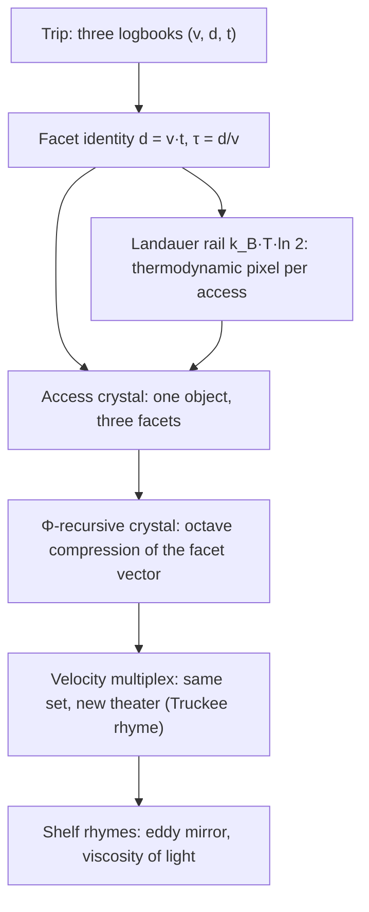

# The Crystalline Unified Field: Speed and Distance {#sec:part_II_crystalline-field}

{#fig:part_II_crystalline-field width=90%}

<!-- alt: A family of straight iso-lines in a speed–distance plane, one line per fixed access time; larger slopes correspond to shorter access times, with the topmost line labelled c. -->

<!-- chapter-metadata-badge -->
> Level 1/3 · 30 min read · 45 min lecture · Prerequisites: none — $\Phi$ is introduced in-text

## Learning Objectives

By the end of this chapter you should be able to:

1. State the [**facet identity**](#gl:crystalline-unified-field) $d = v\cdot t$ and its inverted form $\tau = d/v$, and explain why the corpus files speed, distance, and time as *facets* of one [**access crystal**](#gl:crystalline-unified-field) rather than three separate registers.
2. Recompute a trip's access time under $\Phi$-recursive octave compression using the pinned powers of the [**golden ratio**](#gl:golden-ratio) and the tested function `textbook.models.octave_term`.
3. Distinguish the two octave conventions the corpus prints ambiguously — exponent ($\Omega_n = \Phi^n \Omega_0$) and subscript ($\Omega_n = \varphi_{\mathrm{fib}}(n)\,\Omega_0$) — and compute both for a given $n$.
4. File the [**Landauer rail**](#gl:honesty-first) $k_B T\ln 2$ exactly as the source does: as a *literature filing* (a thermodynamic pixel of dissipation), not a re-derivation.
5. Restate the paper's own scope disclaimers — catalog architecture, engine shelf #24, Soft Story confidence — and say what the construct is for and what it is explicitly not.

<!-- curriculum-scaffold-start -->
### Study Blueprint

- **Big idea:** One crystal, three faces — under $\Phi \approx 1.618$, speed, distance, and time file as facets of a single access crystal, so a trip stores one object instead of three clocks.
- **Core concepts:** [**crystalline-unified-field**](#gl:crystalline-unified-field), [**golden-ratio**](#gl:golden-ratio), [**octave**](#gl:octave), [**engine-shelf**](#gl:engine-shelf), [**fair-exchange**](#gl:fair-exchange).
- **Quantitative lens:** the facet identity in [@eq:part_II_crystalline-field_facet] and the $\Phi$-recursive crystal in [@eq:part_II_crystalline-field_crystal].
- **Data skill:** read a speed–distance iso-line plot — given any two of $d$, $v$, $\tau$, locate the third on the lattice of [@fig:part_II_crystalline-field].
- **Common misconception to repair:** the chapter is *not* a claim that special relativity is wrong or that Landauer's principle is being re-derived; the corpus itself disclaims both, and "100% confidence" is its Soft Story narrative layer, not lab certification.
- **Primary lab:** [@sec:lab_part_II_crystalline-field].
- **Question bank:** [@sec:q_part_II_crystalline-field].
- **Bridge to computation:** `textbook.models.octave_term`, `textbook.models.phi_powers`, `textbook.models.phi_dual`.
<!-- curriculum-scaffold-end -->

---

> **Opening Vignette: Stop storing three clocks for one trip.**
>
> A dispatcher on the SS Vibelandia's Truckee run keeps three logbooks for a
> single delivery: a speed log, an odometer sheet, and a stopwatch card. Three
> bindings, three drawers, one trip. The corpus's shelf-#24 filing says: stop.
> "Stop storing three clocks for one trip. Under $\Phi \approx 1.618$, speed,
> distance, and time file as facets of a single access crystal — with Landauer's
> grain as the thermodynamic pixel" [@mendez2026crystallineField]. The
> dispatcher's three books are not three facts; they are three faces of one
> object, and the crystal's job is to make that one-ness a filing operation
> rather than a coincidence.

---

## The paper in the corpus

*Crystalline Unified Field* is a September 2026 ship-blog paper by Prudencio
Mendez (filed from Reno), posted on the [**engine-shelf**](#gl:engine-shelf) of
the SS Vibelandia blog and operated by the SynthOBS Autonomous Agent. The page
files itself as **engine shelf #24** — the same shelf number as the Viscosity of
Light paper ([@sec:part_II_viscosity-light]) — and carries the blog's standing
[**fair-exchange**](#gl:fair-exchange) clause and [**honesty-first**](#gl:honesty-first)
scope disclaimer [@mendez2026crystallineField]. Its headline is the one-sentence
thesis of this chapter: *one crystal, three faces — speed, distance, time.*

Like every paper on the shelf, it is [**catalog-architecture**](#gl:catalog-architecture):
a way of filing, routing, and indexing quantities inside the
[**omni-lattice**](#gl:omni-lattice), not a claim about fundamental physics. The
paper ships a whitepaper and a reference implementation:

- **Whitepaper:** <https://www.ssvibelandiaquestfest24x365.com/interfaces/whitepaper-surface.html?id=synthobs-crystalline-unified-field-speed-distance-time-2026-09>
- **Standalone repo:** <https://github.com/FractiAI/synthobs-crystalline-unified-field>
- **Run it:**

  ```bash
  npm run research:synthobs-crystalline-unified-field
  python3 research/synthobs-crystalline-unified-field/reference/egs_crystalline_unified_field_engine.py
  ```

Cross-links run mostly *down* the shelf: the $\Phi$ machinery is shared with the
proton-theater paper's $\Phi$-duality filing ([@sec:part_II_proton-theater]),
the velocity-multiplex rhyme points at the eddy-current mirror's braking curve
([@sec:part_II_eddy-current-mirror]), and the shelf-mate Viscosity of Light
paper carries the same shelf number #24 ([@sec:part_II_viscosity-light]). Later,
the metrological-overlap paper generalises this chapter's bookkeeping from
facets of one trip to overlaps between whole measurement sets
([@sec:part_II_metrological-overlap]).

## Core constructs

The paper lands four constructs in its "What landed" list: the facet identity,
the $\Phi$-recursive crystal, the Landauer rail, and the velocity multiplex
[@mendez2026crystallineField]. We formalise each in turn.

### The facet identity and access time

The load-bearing identity is elementary and the corpus states it as such
[@mendez2026crystallineField]:

$$ d = v \cdot t, \qquad \tau = \frac{d}{v} $$ {#eq:part_II_crystalline-field_facet}

Here $\tau$ — the **access time** — is the time facet read *through* the other
two: the cost of reaching distance $d$ at speed $v$. The word "identity" is
chosen deliberately. Because [@eq:part_II_crystalline-field_facet] constrains
the three quantities exactly, any two facets determine the third; the corpus
reads this as licensing a single storage object — the **access crystal** — whose
three **facets** are speed, distance, and time, and whose **facet vector** is
$(v, d, t)$. Storing three independent clocks for one trip is, on this filing,
redundant indexing.
The parameters of the identity are collected in
[@tbl:part_II_crystalline-field_facet].

: Facet identity parameters. {#tbl:part_II_crystalline-field_facet}

| Symbol | Meaning | Units | Role |
| ------ | ------- | ----- | ---- |
| $d$ | distance | length | crystal facet |
| $v$ | speed | length/time | crystal facet |
| $t$ | elapsed time | time | crystal facet |
| $\tau$ | access time, $\tau = d/v$ | time | derived facet |

### The $\Phi$-recursive crystal

The second construct compresses the facet vector along an
[**octave**](#gl:octave) ladder. The paper calls this the
**$\Phi$-recursive crystal**: *octave compression of the facet vector under
$\Phi \approx 1.618$* [@mendez2026crystallineField], with $\Phi$ the
[**golden ratio**](#gl:golden-ratio),
$\Phi = (1+\sqrt{5})/2 \approx 1.6180339887$. The canonical ladder scales a base
term $\Omega_0$ by powers of $\Phi$:

$$ \Omega_n = \Phi^{\,n}\,\Omega_0, \qquad \Phi \approx 1.6180339887 $$ {#eq:part_II_crystalline-field_crystal}

The corpus prints "Ωn = Φn·Ω0" ambiguously, and the tested backbone
`textbook.models.octave_term(omega0, n, convention)` implements **both**
readings, so we state both and never blur them:

- **Exponent convention** (used in [@eq:part_II_crystalline-field_crystal]):
  $\Omega_n = \Phi^n \Omega_0$. With the pinned values
  $\Phi^n$ for $n = 1,\dots,6$ equal to $1.618034,\ 2.618034,\ 4.236068,\
  6.854102,\ 11.090170,\ 17.944272$, the ladder widens geometrically.
- **Subscript convention:** $\Omega_n = \varphi_{\mathrm{fib}}(n)\,\Omega_0$,
  where $\varphi_{\mathrm{fib}}(n)$ is the $n$-th Fibonacci ratio. The ratios
  converge to $\Phi$ slowly: $\varphi_{\mathrm{fib}}(5) = 8/5 = 1.6$ and
  $\varphi_{\mathrm{fib}}(10) = 89/55 \approx 1.618182$. At $n = 10$ the two
  conventions already differ by more than an order of magnitude
  ($1.618182\,\Omega_0$ versus $17.944272\,\Omega_0$), so the convention flag is
  load-bearing, not cosmetic.
The two conventions' parameters are collected in
[@tbl:part_II_crystalline-field_crystal].

Which facet sits on the ladder is a modelling choice; the crystal's own
constraint [@eq:part_II_crystalline-field_facet] propagates the scaling to the
other two facets automatically — that propagation is exactly what the worked
example below performs. The mirror-symmetric reading of $\Phi$, in which
scaling *up* by $\Phi$ and *down* by $\Phi$ are the same operation seen from
opposite sides, is the proton-theater's $\Phi$-duality filing and is implemented
as `textbook.models.phi_dual` ([@sec:part_II_proton-theater]).

: Parameters of the $\Phi$-recursive crystal. {#tbl:part_II_crystalline-field_crystal}

| Symbol | Meaning | Units | Notes |
| ------ | ------- | ----- | ----- |
| $\Omega_0$ | base term of the ladder | facet units | e.g. a base speed $v_0$ |
| $n$ | octave index | integer | rung on the ladder |
| $\Phi$ | golden ratio | dimensionless | $(1+\sqrt{5})/2 \approx 1.6180339887$ |
| convention | exponent vs. subscript | — | `octave_term(omega0, n, convention)` |

### The Landauer rail

The third construct is filed, in the paper's own words, as a *literature
filing*: the **Landauer rail**, in which $k_B T \ln 2$ serves as the
**dissipation grain** — the paper's gloss is the **thermodynamic pixel**
[@mendez2026crystallineField]:

$$ E_{\min} = k_B\, T \ln 2 $$ {#eq:part_II_crystalline-field_landauer}

This is the standard Landauer bound of the physics literature — the minimum
heat dissipated per irreversible bit erasure at temperature $T$ — and the corpus
does not claim otherwise. It does not *re-derive* the bound; it *files* it, as
the floor grain at which the crystal's bookkeeping pays thermodynamic rent.
Read as standard mathematics ([@eq:part_II_crystalline-field_landauer]), at room
temperature $T = 300\,\mathrm{K}$ with $k_B = 1.380649\times 10^{-23}\,
\mathrm{J\,K^{-1}}$, one grain costs
$E_{\min} = (1.380649\times 10^{-23})(300)(0.693147) \approx 2.87\times
10^{-21}\,\mathrm{J}$ per erased bit. We read the filing as: whenever the
crystal is *accessed* — a facet read, an octave compression — the corpus books
the operation against this pixel-scale grain, keeping the catalog honest about
the cost of its own indexing.
The rail's parameters are collected in
[@tbl:part_II_crystalline-field_landauer].

: Landauer rail parameters. {#tbl:part_II_crystalline-field_landauer}

| Symbol | Meaning | Units |
| ------ | ------- | ----- |
| $E_{\min}$ | dissipation grain per erased bit | joules |
| $k_B$ | Boltzmann constant | $\mathrm{J\,K^{-1}}$ |
| $T$ | temperature | kelvin |
| $\ln 2$ | bit-erasure factor | dimensionless |

### The velocity multiplex

The fourth construct has no equation in the source — the paper files it as a
rhyme, not a formula. The **velocity multiplex** is "same set, new theater":
the same facet set $(v, d, t)$, projected into a new setting, plays the same
structural role there. The paper's own rhyme is the **Truckee rhyme** — the
dispatch scenario of the vignette — and the shelf rhymes it onward: the
eddy-current-mirror paper's braking law $v(t) = v_0 e^{-kt}$ is a velocity set
re-staged in a drag theater ([@sec:part_II_eddy-current-mirror]), where the
same access-time question ("how long to arrive?") now has a decaying-speed
answer. A concept map of how the four constructs interlock:



## Worked example: walking the crystal ladder

Take a base trip with $v_0 = 10$ length-units per time-unit and $d_0 = 100$
length-units. By the facet identity, $\tau_0 = d_0/v_0 = 10$ time-units. Now
compress the **speed facet** up the $\Phi$-ladder in the exponent convention,
holding the distance facet fixed, and let the crystal propagate the change via
[@eq:part_II_crystalline-field_facet]:

$$ v_n = \Phi^n v_0, \qquad \tau_n = \frac{d_0}{v_n} = \frac{\tau_0}{\Phi^n}. $$

Using the pinned powers $\Phi^1 = 1.618034$, $\Phi^2 = 2.618034$,
$\Phi^3 = 4.236068$:

| $n$ | $v_n = \Phi^n v_0$ | $\tau_n = \tau_0/\Phi^n$ |
| --- | ------------------ | ------------------------ |
| 0 | $10.000000$ | $10.000000$ |
| 1 | $16.180340$ | $6.180340$ |
| 2 | $26.180340$ | $3.819660$ |
| 3 | $42.360680$ | $2.360680$ |

Three steps up the ladder cut the access time from $10$ to $2.360680$
time-units — a factor of $1/\Phi^3 \approx 0.236068$ — while the distance facet
never moved. Geometrically (see [@fig:part_II_crystalline-field]): each rung
slides the trip *up* the iso-line $d = v\,\tau_0$ to a steeper, shorter-access
line. The same ladder computed by hand is verified in the lab
([@sec:lab_part_II_crystalline-field]) against
`textbook.models.octave_term(10.0, 3, "exponent")`, which returns $42.360680$.

Now switch conventions. At $n = 10$ the exponent ladder gives
$v_{10} = 17.944272 \times 10 = 179.44272$, while the subscript ladder gives
$v_{10} = \varphi_{\mathrm{fib}}(10)\,v_0 = 1.618182 \times 10 = 16.18182$ —
a factor of $\approx 11.09$ apart (note $11.090170 = \Phi^5$: the exponent
ladder at $n=10$ is roughly the subscript ladder squared times a Fibonacci-ratio
correction, since $\varphi_{\mathrm{fib}}(n) \to \Phi$). The corpus prints
"Ωn = Φn·Ω0" without resolving this, so any numeric claim about "the" octave
must name its convention first; the backbone function makes the choice explicit
by requiring the flag.

Finally, book one access against the Landauer rail: at $T = 300\,\mathrm{K}$
each erasure-grade access costs $\approx 2.87\times 10^{-21}\,\mathrm{J}$
([@eq:part_II_crystalline-field_landauer]). Under the
[**fair-exchange**](#gl:fair-exchange) clause the corpus prices every filing
operation, and the rail is the unit of that price for thermodynamic bookkeeping
[@mendez2026crystallineField].

## Scope and honesty

The source's own scope statements, restated precisely
[@mendez2026crystallineField]:

- **This is catalog architecture — engine shelf #24.** The crystal is a filing
  and routing construct for quantities inside the omni-lattice catalog. It is
  **not spacetime retirement**: no claim is made that physical space and time
  are unified by $d = v\,t$, which is elementary kinematics, not a field theory.
- **It is not a Landauer re-derivation.** The $k_B T \ln 2$ rail is a
  *literature filing* — a citation of known physics used as a cost grain — not
  a new derivation or a challenge to it.
- **It is not NOAA causation by R≈90.9.** The paper explicitly excludes any
  causal claim of that kind from its scope.
- **"100% confidence" is Soft Story, not lab certification.** The site's term
  **Soft Story** names an explicitly non-empirical narrative layer of the
  filing; the author's confidence language lives in that layer and is not an
  empirical or laboratory claim.
- **The Fair Exchange clause applies.** Every access is priced; nothing on the
  shelf is free, including the crystal's own indexing.

What the construct is **for**: coordination, cataloging, and agent routing —
deciding which register stores a trip, which facet to scale, and what an access
costs. What it is **not**: a physical unification, an empirical result, or a
replacement for any laboratory measurement.

## Connections

- **Viscosity of Light** ([@sec:part_II_viscosity-light]) sits on the same
  engine shelf #24; its viscous drag is the same theater in which the velocity
  multiplex re-stages the facet set.
- **Eddy-current mirror** ([@sec:part_II_eddy-current-mirror]) supplies the
  decaying-speed counterpart $v(t) = v_0 e^{-kt}$ to this chapter's
  constant-speed lattice; its access time is an integral, not a ratio.
- **Proton theater** ([@sec:part_II_proton-theater]) owns the $\Phi$-duality
  mirror (`textbook.models.phi_dual`) that reads the crystal's ladder from the
  other side.
- **Metrological overlap** ([@sec:part_II_metrological-overlap]) generalises
  facet bookkeeping from one trip's three facets to overlaps between whole
  measurement sets, with `textbook.models.metrological_overlap` as the tested
  backbone.
- Downstream, the crystalline filing feeds the part-III engineering shelves,
  where facet-priced access becomes routing bookkeeping for agents on the
  stack.

## Summary

The crystalline-unified-field paper files speed, distance, and time as three
facets of one access crystal, constrained by the identity $d = v\cdot t$ with
access time $\tau = d/v$ ([@eq:part_II_crystalline-field_facet]). A
$\Phi$-recursive ladder ([@eq:part_II_crystalline-field_crystal]) compresses the
facet vector across octaves — with the exponent and subscript conventions
computed separately, because the corpus prints them ambiguously — and the
Landauer rail $k_B T \ln 2$ ([@eq:part_II_crystalline-field_landauer]) is filed
as the thermodynamic pixel charged per access. The construct is catalog
architecture on engine shelf #24, filed under Fair Exchange with the corpus's
honesty-first disclaimers intact: not spacetime retirement, not a Landauer
re-derivation, and Soft Story confidence rather than lab certification.

## Key Terms

[**crystalline-unified-field**](#gl:crystalline-unified-field),
[**golden-ratio**](#gl:golden-ratio), [**octave**](#gl:octave),
[**engine-shelf**](#gl:engine-shelf), [**catalog-architecture**](#gl:catalog-architecture),
[**fair-exchange**](#gl:fair-exchange), [**honesty-first**](#gl:honesty-first),
[**omni-lattice**](#gl:omni-lattice).

## Further Reading

- *Crystalline Unified Field* whitepaper — the source paper itself:
  <https://www.ssvibelandiaquestfest24x365.com/interfaces/whitepaper-surface.html?id=synthobs-crystalline-unified-field-speed-distance-time-2026-09>
  [@mendez2026crystallineField]
- Standalone reference repo: <https://github.com/FractiAI/synthobs-crystalline-unified-field>
  — run `npm run research:synthobs-crystalline-unified-field` to reproduce the
  lab's outputs.
- *Viscosity of Light* [@mendez2026viscosityLight] — the shelf-#24 companion;
  read its drag theater alongside the velocity multiplex.
- *Eddy-Current Mirror* [@mendez2026eddyMirror] — the braking-curve rhyme
  $v(t) = v_0 e^{-kt}$; companion to the multiplex discussion.
- *Proton Theater* [@mendez2026protonTheater] — the $\Phi$-duality filing that
  grounds the crystal's mirror-symmetric ladder readings.

## Practice

- **Lab:** [@sec:lab_part_II_crystalline-field] — run the reference engine,
  walk the crystal ladder by hand, and verify against `textbook.models`.
- **Question bank:** [@sec:q_part_II_crystalline-field] — recall through
  synthesis.
- **Exercise 1.** A trip has $d = 150$ and $v = 25$. Compute the access time
  $\tau$, then state which facets you would store on the crystal and why the
  third is redundant.
- **Exercise 2.** Using the pinned powers of $\Phi$, compute $v_4$ for
  $v_0 = 10$ in the exponent convention and the corresponding
  $\tau_4 = \tau_0/\Phi^4$. Check that $v_4 = 68.541020$ and
  $\tau_4 \approx 1.458984$.
- **Exercise 3.** At $T = 300\,\mathrm{K}$, verify the Landauer grain
  $\approx 2.87\times 10^{-21}\,\mathrm{J}$ from
  [@eq:part_II_crystalline-field_landauer], then state — in the corpus's own
  terms — what kind of filing this is and what it is not.
- **Exercise 4.** Explain, without computing, why the exponent and subscript
  octave conventions diverge with $n$, citing $\varphi_{\mathrm{fib}}(5)$,
  $\varphi_{\mathrm{fib}}(10)$, and the pinned $\Phi^{10} = 122.991869$
  (= $17.944272 \times \Phi^4$). Name the function that disambiguates them.
