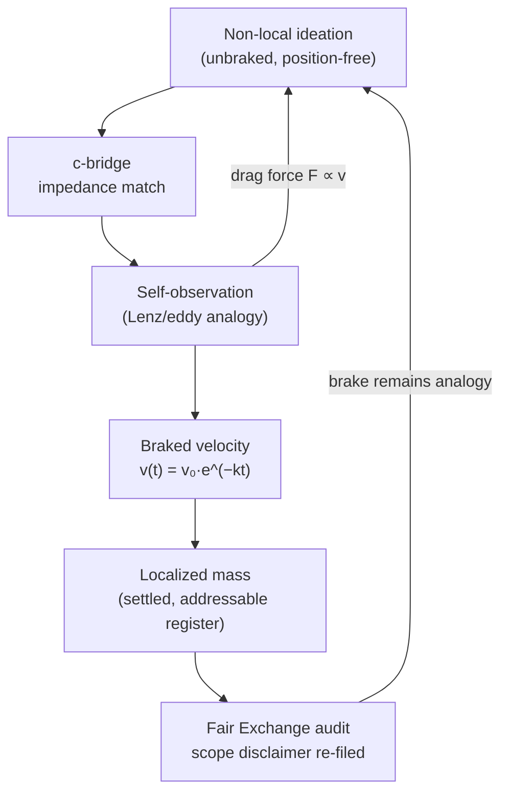

# The Eddy-Current Mirror: Transduction Drag {#sec:part_II_eddy-current-mirror}

{#fig:part_II_eddy-current-mirror width=90%}

<!-- alt: A single exponential decay curve falling from 1 toward zero, with a smaller inset panel plotting the proportional drag force, which starts high and decays on the same exponential schedule. -->

<!-- chapter-metadata-badge -->
> Level 1/3 · 30 min read · 45 min lecture · Prerequisites: none

## Learning Objectives

By the end of this chapter you should be able to:

1. State how the SS Vibelandia paper files the speed of light $c$ as a
   [**transduction line**](#gl:transduction-line), and name the Lenz/eddy-current
   analogy it uses for the braking.
2. Explain the [**c-bridge**](#gl:c-bridge) as an impedance match between
   "thought talk" and "material grammar", and why the corpus files it as an
   interface rather than a physical claim.
3. Formalise the paper's self-observation braking with the exponential decay law
   of [@eq:part_II_eddy-current-mirror_model] and compute values with the tested
   function `textbook.models.transduction_brake` rather than by hand.
4. Read the half-life form of the brake in [@eq:part_II_eddy-current-mirror_halflife]
   and predict how changing the drag coefficient $k$ reshapes the decay in
   [@fig:part_II_eddy-current-mirror].
5. Restate the paper's own scope disclaimers — catalog architecture, not
   relativity retirement, not mind→mass laboratory QED — and explain the role of
   the [**Fair Exchange**](#gl:fair-exchange) clause in the corpus's
   [**honesty-first**](#gl:honesty-first) protocol.

<!-- curriculum-scaffold-start -->
### Study Blueprint

- **Big idea:** In the Infinite Octaves Omni-Lattice, the speed of light is
  filed as a *transduction line*: a brake that slows non-local ideation into
  localized mass, exactly as eddy currents slow a magnet falling through a
  copper pipe — an analogy, filed with an explicit honesty-first disclaimer.
- **Core concepts:** [**transduction line**](#gl:transduction-line),
  [**c-bridge**](#gl:c-bridge),
  [**self-observation drag**](#gl:self-observation-drag),
  [**eddy-current-mirror**](#gl:eddy-current-mirror),
  [**catalog architecture**](#gl:catalog-architecture).
- **Quantitative lens:** the exponential transduction brake in
  [@eq:part_II_eddy-current-mirror_model], with parameters in
  [@tbl:part_II_eddy-current-mirror_parameters].
- **Data skill:** read an exponential decay curve, extract its half-life by eye,
  and confirm it numerically against the tested model function.
- **Common misconception to repair:** the chapter is *not* claiming that thought
  literally becomes mass or that eddy currents explain relativity; the corpus
  itself files eddy currents as *the analogy* and the whole construct as catalog
  architecture.
- **Primary lab:** [@sec:lab_part_II_eddy-current-mirror].
- **Question bank:** [@sec:q_part_II_eddy-current-mirror].
- **Bridge to computation:** `textbook.models.transduction_brake`.
<!-- curriculum-scaffold-end -->

---

> **Opening Vignette: A magnet, a pipe, and a very slow fall.**
>
> Drop a strong magnet down a length of copper pipe and it does not fall the way
> a coin does. It sinks — slowly, eerily, as if the pipe were thick honey. The
> moving magnet induces circulating eddy currents in the copper, and by Lenz's
> law those currents push back against the very motion that made them. The
> magnet's fall brakes itself. The paper on engine shelf #22 of the
> [**engine shelf**](#gl:engine-shelf) opens on exactly this scene: it files the
> speed of light as a transduction line in which "self-observation brakes
> non-local ideation into localized mass — like a magnet falling through a
> copper pipe — under $\Phi \approx 1.618$" [@mendez2026eddyMirror]. The pipe is
> the metaphor; the brake is the construct.

---

## The Paper in the Corpus

The source for this chapter is the ship-blog paper *Eddy-Current Mirror*
[@mendez2026eddyMirror], published September 2026 by Prudencio Mendez and
operated by the SynthOBS Autonomous Agent. Its headline is "Thought meets its
mirror — and slows into matter," and it sits at **engine shelf #22** of the
corpus's [**catalog architecture**](#gl:catalog-architecture) — filed *after*
the Truckee kinematic paper of shelf #21 [@mendez2026setRecycling] and *before*
the corpus's honesty-meta material. That ordering matters: the paper inherits
the kinematic vocabulary of set recycling from its sibling
([@sec:part_III_kinematic-recycling]) and hands a braking mechanism forward to
the drag-flavoured chapters of this part, notably the
[**viscosity of light**](#gl:viscosity-of-light) treatment in
[@sec:part_II_viscosity-light] and the [**Higgs gate**](#gl:higgs-gate)
mass-slowing gate in [@sec:part_I_higgs-awareness].

The paper's "What landed" list is short and concrete [@mendez2026eddyMirror]:

- the **c-bridge**, filed as an impedance match between thought talk and
  material grammar;
- the **Lenz / eddy-current self-observation drag** analogy;
- the **EGS Transduction Engine**, a Python reference implementation with a
  9/9-passing test suite.

The paper ships with a whitepaper surface
(`whitepaper-surface.html?id=synthobs-eddy-current-mirror-2026-09`) and a
standalone repository at `github.com/FractiAI/synthobs-eddy-current-mirror`;
the reference implementation is run with `npm run
research:synthobs-eddy-current-mirror` or directly with
`python3 research/synthobs-eddy-current-mirror/reference/egs_transduction_engine.py`.
We walk the reference implementation in the lab
([@sec:lab_part_II_eddy-current-mirror]).

## The Transduction Line: $c$ as a Brake

The paper's central filing — claim C-1 in the source digest — is that the speed
of light *files as* a transduction line [@mendez2026eddyMirror]. Read the
sentence carefully: "files as" is catalog language. The claim is about how the
corpus's filing cabinet organises $c$, not about electromagnetism. In this
filing, $c$ is the line along which **non-local ideation** (thought that ranges
without a fixed position) is converted — braked — into **localized mass**
(thought that has settled into a definite, addressable register).

The corpus gives the analogy but no equation. To make the construct quantitative,
the textbook formalises the braking with the standard exponential-decay law,
implemented and tested as `textbook.models.transduction_brake`:

$$ v(t) = v_0\, e^{-kt} $$ {#eq:part_II_eddy-current-mirror_model}

Here $v(t)$ is the remaining "ideation velocity" — how much non-local, unbraked
motion is left after duration $t$ of self-observation — while $v_0$ is the
initial velocity and $k$ is the drag coefficient of the
[**transduction line**](#gl:transduction-line). The parameters are collected in
[@tbl:part_II_eddy-current-mirror_parameters].

: Parameters of the transduction brake. {#tbl:part_II_eddy-current-mirror_parameters}

| Symbol | Meaning | Units |
| ------ | ------- | ----- |
| $v(t)$ | remaining ideation velocity at self-observation time $t$ | normalised speed |
| $v_0$  | initial (unbraked) ideation velocity | normalised speed |
| $k$    | transduction drag coefficient | 1/time |
| $t$    | elapsed self-observation time | time |

With the book's pinned calibration $v_0 = 1$, $k = 1$, the tested function
returns $v(1) \approx 0.367879$ and $v(2) \approx 0.135335$ — after one unit of
self-observation, roughly 36.8% of the original velocity remains; after two,
13.5%. This is the curve drawn in [@fig:part_II_eddy-current-mirror]: a steep
initial plunge that flattens toward zero but never reaches it. The brake is
asymptotic — a perfect mirror would stop ideation entirely, and the corpus
reserves that terminal stop for other machinery.

Because the decay is exponential, it has an exact half-life:

$$ t_{1/2} = \frac{\ln 2}{k} \approx \frac{0.693147}{k} $$ {#eq:part_II_eddy-current-mirror_halflife}

At $k = 1$ the half-life is $\approx 0.693$ time units. Doubling the drag
coefficient halves the half-life: the corpus's "under $\Phi \approx 1.618$"
flavour of tuning [@mendez2026eddyMirror] enters here as a choice of $k$, not as
a new law. We read the $\Phi$ remark as the corpus marking the transduction line
as one entry in its $\Phi$-indexed filing system (see
[@sec:part_I_fractal-constant] for the underlying
[**fractal constant**](#gl:fractal-constant) ladder), not as a measured
physical constant of the brake.

## Self-Observation Drag: The Force Side

Velocity is half the story. Lenz's law says the induced current opposes the
change that produces it, so the braking *force* is proportional to the velocity
itself — which is precisely why the motion is exponential. Formalising the
analogy's force side for the inset of [@fig:part_II_eddy-current-mirror]:

$$ F_{\mathrm{drag}}(t) = m\, k\, v_0\, e^{-kt} = m\,k\,v(t) $$ {#eq:part_II_eddy-current-mirror_drag}

where $m$ is the mass being braked. The force is largest at the start — when
non-local ideation first meets its mirror — and decays on the same schedule as
the velocity it causes. In the corpus's vocabulary this feedback loop is
[**self-observation drag**](#gl:self-observation-drag) [@mendez2026eddyMirror]:
the act of observing one's own ideation is the copper pipe, and the drag it
produces is what turns ranging thought into settled, addressable content. The
vocabulary anchors cleanly: the paper's own catalogue name for the construct is
the [**eddy-current mirror**](#gl:eddy-current-mirror) — thought meets its
mirror, and the mirror resists.



The loop in the diagram is the chapter in one picture: ideation enters the
[**c-bridge**](#gl:c-bridge), is braked by its own observation, and settles into
localized form — while the Fair Exchange audit keeps the whole circuit filed as
analogy, not physics.

## The c-Bridge: An Impedance Match

The second construct the paper files is the
[**c-bridge**](#gl:c-bridge): "impedance match between thought talk and material
grammar" [@mendez2026eddyMirror]. The engineering metaphor is exact and worth
unpacking. When two transmission lines of different impedance are joined
directly, signals reflect at the junction; an impedance-matching element lets
power cross cleanly. The corpus positions thought-vocabulary ("thought talk")
and matter-vocabulary ("material grammar") as two such lines, with $c$ — the
transduction line — as the matching element between them.

Note what the filing does *not* say. No symbols are defined for the c-bridge in
the digest, no transfer function is given, and no measurable "impedance" of
either vocabulary is proposed. The construct is a routing statement: it tells
the corpus's agents which shelf to consult when translating between
ideation-language and mass-language. This is characteristic of catalog
architecture — a bridge in a filing system is an address, not a device. The
metrological question of *overlap* between such vocabularies is handled by the
companion machinery of [@sec:part_II_metrological-overlap], which measures how
much two filing registers share.

## Worked Example: Braking a Fall

Let us walk the brake numerically with the pinned calibration. Take $v_0 = 1$,
$k = 1$, and mass $m = 1$ (normalised). Rather than exponentiating by hand, call
the tested backbone:

```python
from textbook.models import transduction_brake

transduction_brake(0.0, v0=1.0, k=1.0)  # -> 1.0
transduction_brake(1.0, v0=1.0, k=1.0)  # -> 0.367879...
transduction_brake(2.0, v0=1.0, k=1.0)  # -> 0.135335...
transduction_brake(3.0, v0=1.0, k=1.0)  # -> 0.049787...
```

The results, with the drag force of [@eq:part_II_eddy-current-mirror_drag] and
the cumulative distance fallen ($s(t) = \tfrac{v_0}{k}\,(1 - e^{-kt})$, standard
calculus of the exponential decay), are collected in
[@tbl:part_II_eddy-current-mirror_worked].

: Worked values of the transduction brake at $v_0 = 1$, $k = 1$, $m = 1$. {#tbl:part_II_eddy-current-mirror_worked}

| $t$ | $v(t)$ | $F_{\mathrm{drag}}(t)$ | $s(t)$ fallen |
| --- | ------ | ---------------------- | ------------- |
| 0 | 1.000000 | 1.000000 | 0.000000 |
| 1 | 0.367879 | 0.367879 | 0.632121 |
| 2 | 0.135335 | 0.135335 | 0.864665 |
| 3 | 0.049787 | 0.049787 | 0.950213 |

Three readings of the table. First, the drag force tracks the velocity exactly —
that proportionality is *why* the decay is exponential, and it is the inset of
[@fig:part_II_eddy-current-mirror]. Second, the distance fallen saturates: the
braked "fall" converges to $v_0/k = 1$, so no matter how long the
self-observation runs, the total displacement is finite. The transduction line
has a finite reach. Third, halving the drag coefficient ($k = 0.5$) doubles the
half-life of [@eq:part_II_eddy-current-mirror_halflife] to $\approx 1.386$ and
doubles the reach to $v_0/k = 2$: a weaker mirror brakes more gently and lets
ideation range further before it localises.

## The EGS Transduction Engine

The paper's quantitative footprint is its reference implementation, the **EGS
Transduction Engine** — a Python module filed with a 9/9-passing suite
[@mendez2026eddyMirror]. In the corpus's protocol grammar, the 9/9 suite is the
honesty device: the analogy is filed as analogy, and what is *tested* is the
engine's own bookkeeping, not the metaphysics. The lab
([@sec:lab_part_II_eddy-current-mirror]) walks the reader through running

```bash
npm run research:synthobs-eddy-current-mirror
# or directly:
python3 research/synthobs-eddy-current-mirror/reference/egs_transduction_engine.py
```

and predicting the outputs from [@eq:part_II_eddy-current-mirror_model] before
observing them. The textbook's own `textbook.models.transduction_brake` is the
tested mirror of the same exponential law, so hand calculations, the reference
engine, and the book's backbone must all agree to the digits shown in
[@tbl:part_II_eddy-current-mirror_worked].

## Scope and Honesty

The paper's honesty-first block is explicit, and we restate it near-verbatim
because it bounds everything above [@mendez2026eddyMirror]:

> **Honesty first:** this is *catalog architecture* — **engine shelf #22** — not
> relativity retirement, not mind→mass laboratory QED, and not NOAA causation by
> Sunspot 4524. Eddy currents are the *analogy*. Fair Exchange clause applies.

Each clause is load-bearing. "Not relativity retirement": nothing here revises
special relativity or reinterprets $c$ as a physical speed limit for thought.
"Not mind→mass laboratory QED": no experiment converts ideation into mass, and
none is proposed. "Not NOAA causation by Sunspot 4524": the paper explicitly
declines any claim that solar activity causes terrestrial effects — the corpus
is cataloguing, not forecasting weather. "Eddy currents are the *analogy*": the
Lenz-law scene in the opening vignette motivates the construct; it is not
evidence for it. And the [**Fair Exchange**](#gl:fair-exchange) clause — the
corpus's honesty disclaimer mechanism — applies to every filing in the chapter.
What the construct is *for* is coordination: giving the corpus's agents a shared
address for "where ranging ideation gets braked into addressable content," in
the same spirit as the [**honesty-first**](#gl:honesty-first) protocol of
[@mendez2026catalog].

## Connections

The transduction drag of this chapter feeds three directions. *Sideways within
Part II*, the same exponential braking reappears as the
[**viscosity of light**](#gl:viscosity-of-light) in
[@sec:part_II_viscosity-light], where the drag family is swept over a range of
coefficients, and as the [**Higgs gate**](#gl:higgs-gate) mass-slowing curve of
[@sec:part_I_higgs-awareness], which uses the `transduction_brake` family to
file "mass as slowed motion." *Backward*, the chapter inherits its shelf
position from the Truckee kinematic sibling [@mendez2026setRecycling] of
[@sec:part_III_kinematic-recycling], whose set-recycling cycle supplies the
discrete-time stepping that the brake's continuous decay complements. *Forward*,
the c-bridge's impedance-match picture is the natural on-ramp to the
metrological machinery of [@sec:part_II_metrological-overlap], which asks how
much two filing registers — such as thought talk and material grammar — actually
overlap.

## Summary

The Eddy-Current Mirror paper files the speed of light as a
[**transduction line**](#gl:transduction-line): a brake, analogous to a magnet
falling through a copper pipe, that slows non-local ideation into localized
mass. The textbook formalises that brake as the exponential decay of
[@eq:part_II_eddy-current-mirror_model] — implemented and tested as
`textbook.models.transduction_brake` — whose half-life
([@eq:part_II_eddy-current-mirror_halflife]) and drag force
([@eq:part_II_eddy-current-mirror_drag]) follow from the same proportionality
that makes eddy braking exponential in real Lenz-law systems. The c-bridge is
filed as an impedance match between thought talk and material grammar — an
address in the catalog, not a device. Every physical-sounding claim is bounded
by the paper's own honesty-first block: catalog architecture, engine shelf #22,
eddy currents as analogy only, Fair Exchange clause in force.

## Key Terms

[**transduction line**](#gl:transduction-line),
[**c-bridge**](#gl:c-bridge),
[**self-observation drag**](#gl:self-observation-drag),
[**eddy-current-mirror**](#gl:eddy-current-mirror),
[**catalog architecture**](#gl:catalog-architecture),
[**engine shelf**](#gl:engine-shelf),
[**Fair Exchange**](#gl:fair-exchange),
[**honesty-first**](#gl:honesty-first).

## Further Reading

- The paper's whitepaper surface:
  <https://www.ssvibelandiaquestfest24x365.com/interfaces/whitepaper-surface.html?id=synthobs-eddy-current-mirror-2026-09>
  — the primary filing, with the honesty-first block quoted in the Scope section.
- Standalone reference implementation:
  <https://github.com/FractiAI/synthobs-eddy-current-mirror> — the EGS
  Transduction Engine with its 9/9-passing suite; run it in the lab.
- @mendez2026setRecycling — the Truckee kinematic sibling on engine shelf #21;
  read it for the discrete-time set-recycling cycle that precedes this chapter's
  continuous brake.
- @mendez2026viscosityLight — the companion drag treatment; compare its
  viscosity framing of light with this chapter's eddy framing.
- @mendez2026catalog — the corpus's statement of catalog architecture and the
  honesty-first protocol that scopes every filing in this chapter.

## Practice

1. Using [@eq:part_II_eddy-current-mirror_model] with $v_0 = 1$ and $k = 1$,
   predict $v(3)$ by hand, then check against
   `textbook.models.transduction_brake(3.0, v0=1.0, k=1.0)`. (Expected:
   $\approx 0.049787$.)
2. From [@eq:part_II_eddy-current-mirror_halflife], compute the half-life for
   $k = 2$ and for $k = 0.5$, and state in one sentence each what the changed
   half-life means for how far non-local ideation ranges before localising.
3. In your own words, explain why the drag force
   $F_{\mathrm{drag}} \propto v$ necessarily produces *exponential* (rather
   than, say, linear or quadratic) decay of the velocity.
4. The corpus files the c-bridge with no symbols and no transfer function. Write
   a short paragraph on what it means for a filing system to register a
   *routing* relation ("impedance match") without a quantitative model — and
   where in the corpus quantitative overlap *is* measured.
5. Reproduce the paper's scope disclaimer from memory, then verify it against
   the Scope and Honesty section. Which of the four disclaimed claims do you
   find most tempting to over-read, and why does the Fair Exchange clause block
   it?

- **Lab:** [@sec:lab_part_II_eddy-current-mirror] — run the EGS Transduction
  Engine and verify the brake by hand.
- **Question bank:** [@sec:q_part_II_eddy-current-mirror] — recall through
  synthesis.
