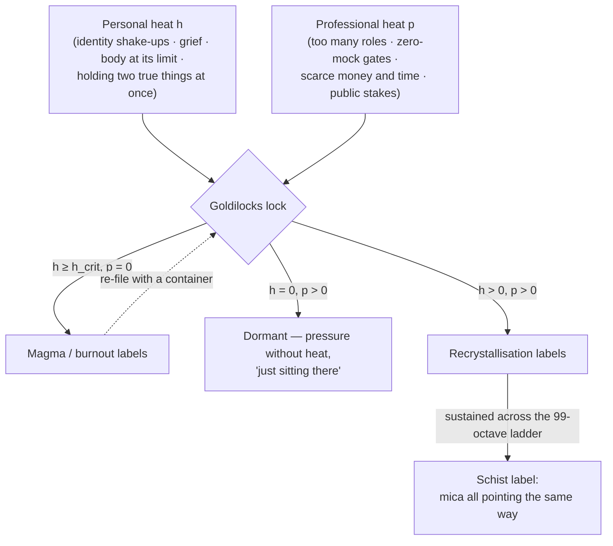

# Metamorphic Octaves: Densification {#sec:part_II_metamorphic-octaves}

{#fig:part_II_metamorphic-octaves width=90%}

<!-- alt: A single rising curve of densification against exposure, steep near the origin and flattening logarithmically. The worked checkpoints at exposures 1, 2, 4 and 8 are marked on the curve, and the marginal gain 1/(1+x) shrinks as exposure grows. -->

<!-- chapter-metadata-badge -->
> Level 1/3 · 30 min read · 45 min lecture · Prerequisites: none — the [**octave**](#gl:octave) ladder of [@sec:part_0_octave-map] helps but is not required

## Learning Objectives

By the end of this chapter you should be able to:

1. Explain how the metamorphic-octaves paper borrows the mud → shale → schist
   story as a [**filing cabinet**](#gl:catalog-architecture) for people and
   software under Φ, and why the paper insists it is neither a geology theorem
   nor medical advice [@mendez2026metamorphic].
2. State the two furnaces — personal heat and professional heat — and use the
   Goldilocks lock to file a scenario as magma/burnout, dormant, or
   recrystallisation.
3. Formalise the paper's dual-axis filing rule as the labelled map of
   [@eq:part_II_metamorphic-octaves_filing] and place the "schist" label within it.
4. Compute the densification curve of [@eq:part_II_metamorphic-octaves_densification]
   with `textbook.models.densification`, including the pinned value
   $D(4) = 1 + \ln 5 \approx 2.609438$, and reason about its decreasing marginal
   gain using [@eq:part_II_metamorphic-octaves_marginal].
5. Restate, precisely, what the paper claims and refuses to claim, and connect
   the filing cartoon to the other [**engine-shelf**](#gl:engine-shelf) papers
   it names as siblings.

<!-- curriculum-scaffold-start -->
### Study Blueprint

- **Big idea:** The corpus files transformation — of people, of software — the
  way a geologist files rock: heat plus directional pressure across the
  99-octave [**omni-lattice**](#gl:omni-lattice) yields a "schist" label, and
  the book reads that accumulation as a logarithmic densification curve.
- **Core concepts:** [**catalog-architecture**](#gl:catalog-architecture),
  [**octave**](#gl:octave), [**fair-exchange**](#gl:fair-exchange),
  [**honesty-first**](#gl:honesty-first), the two furnaces, the Goldilocks lock.
- **Quantitative lens:** the densification model of
  [@eq:part_II_metamorphic-octaves_densification].
- **Data skill:** evaluate a logarithmic model at given exposures by hand and
  confirm against `textbook.models.densification`; read marginal change off
  $1/(1+x)$.
- **Common misconception to repair:** that the schist label is a promise that
  "pressure makes you unbreakable." The paper explicitly files it as a way to
  sort experience, not a prophecy — and heat *without* a container files as
  melt/burnout, not growth.
- **Primary lab:** [@sec:lab_part_II_metamorphic-octaves].
- **Question bank:** [@sec:q_part_II_metamorphic-octaves].
- **Bridge to computation:** `textbook.models.densification`.
<!-- curriculum-scaffold-end -->

---

> **Opening Vignette: A rock that remembers being soft.**
>
> Mud settles in quiet water — formless, layered, anonymous. Buried, it
> hardens into shale. And if the crust cooks and squeezes it long enough,
> something new appears: glittering schist, its mica flakes all pointing the
> same way, a record of every direction the pressure came from. The ship-blog
> paper takes precisely that story and borrows it — not as geology, but as a
> **filing cabinet** for people and software under Φ [@mendez2026metamorphic].
> The filing question it asks is disarmingly practical: when life cooks you,
> what label does the catalog put on the result?

---

## Shelf placement and the three honesty markers

This chapter sits on shelf 5 of the [**engine-shelf**](#gl:engine-shelf), as
Part XIII of the SS Vibelandia ship blog — a plain-speak note filed under the
site's [**fair-exchange**](#gl:fair-exchange) framing, titled "When life cooks
you, you can come out denser" [@mendez2026metamorphic]. Its raw material is a
story every reader already owns: soft mud, then shale, then — under sustained
crustal heat *and* directional pressure — schist with mica all pointing the
same way. The paper's move is to borrow that story as a filing cabinet for
people and software under Φ, the [**golden-ratio**](#gl:golden-ratio) constant
that threads the corpus.

Three honesty markers frame everything that follows, and we restate them now so
they are impossible to lose [@mendez2026metamorphic]:

- "It is not a new geology theorem, and it is not a doctor's note."
- "Heat without a container is melt / burnout talk. Pressure without heat is
  just sitting there. Both together, across 99 catalog octaves, is the
  'schist' label."
- "Nobody here is claiming you become unbreakable rock."

Our job as textbook authors is the corpus's own job: formalise the filing rule,
map its vocabulary, and run its reference implementation — while preserving
those disclaimers exactly.

## The metamorphic-octaves note and its corpus placement

The metamorphic-octaves note loads into Lattice Chat on nest **Infinite
Octaves** through the engine map **Digits × 01–99** [@mendez2026metamorphic]:
the same Digits × 01–99 lattice that the [**omni-lattice**](#gl:omni-lattice)
chapter [@sec:part_0_octave-map] develops, in which every filing lives at a
digit row of the [**master-register**](#gl:master-register) and an octave
column — $99 \times 81 = 8{,}019$ register bins as computed by
`catalog_size(octaves=99, precision_digits=81)`. On Synthio the paper is used
as *companion grammar*, with the corpus's MRI-sandbox honesty kept intact
[@mendez2026metamorphic].

The paper explicitly names its siblings: it is the "same cartoon as the 99
Octave engine's other shelves — CMOS, tensors, digits — a way to file, not a
prophecy" [@mendez2026metamorphic]. Those shelf-mates are treated in
[@mendez2026cmosProtonic] (CMOS), [@mendez2026tensorDecoupling] (tensors), and
[@mendez2026digitsMaster] (digits). The note ships with a runnable reference
implementation: the whitepaper lives at
`ssvibelandiaquestfest24x365.com/interfaces/whitepaper-surface.html?id=synthobs-tbme-metamorphic-octaves-2026-08`,
the standalone repo is `github.com/FractiAI/synthobs-tbme-metamorphic-octaves`,
and `npm run research:synthobs-tbme-metamorphic-octaves` returns the suite's
**9/9 fixture lock** [@mendez2026metamorphic]. The lab
([@sec:lab_part_II_metamorphic-octaves]) walks that run.



## Core construct I: the two furnaces and the filing map

The paper's first formalism (digest F-synthobs-tbme-metamorphic-octaves-1) is a
*dual-axis heat model*. Two furnaces supply the axes, and the corpus is
specific about what each contains [@mendez2026metamorphic]:

- **Personal heat** ($h$): identity shake-ups, grief, the body at its limit,
  holding two true things at once.
- **Professional heat** ($p$): too many roles, zero-mock gates, scarce money
  and time, public stakes.

The catalog "needs both axes — not that you should seek either as a lifestyle"
[@mendez2026metamorphic]. We formalise the corpus's filing rule as a labelled
map over the two axes; every branch below is a direct restatement of the
paper's own filings (digest claims C-3 and C-6), arranged into one construct:

$$
L(h, p) \;=\;
\begin{cases}
\textsf{magma / burnout}, & h \ge h_{\text{crit}},\; p = 0,\\[2pt]
\textsf{dormant}, & h = 0,\; p > 0,\\[2pt]
\textsf{recrystallisation}, & h > 0,\; p > 0,\\[2pt]
\textsf{schist}, & h > 0,\; p > 0 \ \text{sustained across the octave ladder}.
\end{cases}
$$ {#eq:part_II_metamorphic-octaves_filing}

Read [@eq:part_II_metamorphic-octaves_filing] branch by branch. Heat above the
threshold $h_{\text{crit}}$ with no container — no directional pressure — files
as **magma / burnout labels**: "heat without a container is melt / burnout
talk." Pressure with no heat is the dormant branch: "pressure without heat is
just sitting there." Heat *plus constraint* files as **recrystallisation
labels**; and when that dual-axis state is sustained "across 99 catalog
octaves," the filing matures into the **schist label** — the mica-all-one-way
result. The parameters of the map are collected in
[@tbl:part_II_metamorphic-octaves_filing].

:: Parameters of the filing map $L(h,p)$. {#tbl:part_II_metamorphic-octaves_filing}

| Symbol | Meaning | Domain |
| ------ | ------- | ------ |
| $h$ | personal heat: identity shake-ups, grief, the body at its limit, holding two true things at once | $\mathbb{R}_{\ge 0}$, ordinal filing axis |
| $p$ | professional heat / directional pressure: too many roles, zero-mock gates, scarce money and time, public stakes | $\mathbb{R}_{\ge 0}$, ordinal filing axis |
| $h_{\text{crit}}$ | heat level beyond which unconstrained heat files as magma / burnout rather than melt-talk avoided | ordinal threshold |
| $L$ | the filed label | {magma/burnout, dormant, recrystallisation, schist} |

The map is deliberately a *cartoon* — the paper's own word for the shared
filing device of its sibling shelves — and the Goldilocks lock is its gating
rule (digest F-2): too much heat with no directional pressure files one way;
heat plus constraint files another. The lock gets its name from the same
too-much / just-right gating the corpus uses elsewhere; in this book the
nearest cousin is the goldilocks band of the planetary-core chapter, drawn as
band shading in [@fig:part_II_planetary-core] and formalised in
[@sec:part_II_planetary-core].

## Core construct II: densification under exposure

The rock story is cumulative — mud does not become schist in one event but
under sustained exposure. The book gives that accumulation a quantitative lens:
we read the borrowed story as a **densification curve**, implemented as
`textbook.models.densification(exposure, density0, rate)`:

$$
D(x) \;=\; D_0 \left( 1 + k \, \ln\!\left(1 + x\right) \right)
$$ {#eq:part_II_metamorphic-octaves_densification}

This is *our* formalisation, marked as interpretation: the digest's rock story
names no equation. What makes the logarithm the honest choice is its shape —
early exposure transforms a soft, formless filing quickly, while later
exposure still changes the result but ever more slowly. That is exactly the
corpus's moral ordering of "cooking": the paper never claims unbounded
hardening, and a logarithm never reaches an "unbreakable" asymptote of
invulnerability. The parameters are given in
[@tbl:part_II_metamorphic-octaves_densification].

:: Parameters of the densification model. {#tbl:part_II_metamorphic-octaves_densification}

| Symbol | Meaning | Units | Reference value |
| ------ | ------- | ----- | --------------- |
| $x$ | accumulated exposure (time under dual-axis heat and pressure) | exposure units | — |
| $D_0$ | baseline density of the filing before exposure | density units | $1$ |
| $k$ | densification rate per unit exposure | 1/exposure | $1$ |
| $D(x)$ | filed density after exposure $x$ | density units | computed |

The marginal effect of exposure follows immediately by differentiating
[@eq:part_II_metamorphic-octaves_densification]:

$$
\frac{\mathrm{d}D}{\mathrm{d}x} \;=\; \frac{k\, D_0}{1 + x}
$$ {#eq:part_II_metamorphic-octaves_marginal}

[@eq:part_II_metamorphic-octaves_marginal] is strictly decreasing in $x$: the
*next* unit of exposure always buys less than the previous one, yet it never
buys zero. Densification is honest compounding — front-loaded, never finished.
This is the curve drawn in [@fig:part_II_metamorphic-octaves], and it is the
numbered sequence the reader verifies by hand in the lab.

## Worked example: walking the densification curve

Take the pinned reference values $D_0 = 1$, $k = 1$ and evaluate
[@eq:part_II_metamorphic-octaves_densification] at four exposures. By hand,
using $\ln 2 \approx 0.693147$, $\ln 3 \approx 1.098612$,
$\ln 5 \approx 1.609438$, $\ln 9 \approx 2.197225$. The four checkpoints are
collected in [@tbl:part_II_metamorphic-octaves_checkpoints]:

: Worked densification checkpoints for $D_0 = 1$, $k = 1$, matching the curve
: in [@fig:part_II_metamorphic-octaves]. {#tbl:part_II_metamorphic-octaves_checkpoints}

| Exposure $x$ | $1 + x$ | $\ln(1+x)$ | $D(x) = 1 + \ln(1+x)$ | Filing reading |
| --- | --- | --- | --- | --- |
| 1 | 2 | 0.693147 | 1.693147 | first dual-axis season: fast early densification |
| 2 | 3 | 1.098612 | 2.098612 | still steep — shale-forming |
| 4 | 5 | 1.609438 | 2.609438 | the pinned fixture value `densification(4, 1, 1)` |
| 8 | 9 | 2.197225 | 3.197225 | late-stage: slower, still accumulating |

The exposure-4 row is the corpus-pinned checkpoint: with $D_0 = 1$ and $k = 1$,
`densification(4, density0=1, rate=1)` returns $1 + \ln 5 \approx 2.609438$,
exactly the value in the book's computational backbone. Confirm the others the
same way — never by retyping the maths, but by calling the tested function:

```python
from textbook.models import densification

[densification(x, density0=1, rate=1) for x in (1, 2, 4, 8)]
# -> [1.693147..., 2.098612..., 2.609438..., 3.197225...]
```

Now read the sequence through [@eq:part_II_metamorphic-octaves_marginal]. The
marginal gain falls from $k D_0/(1+1) = 0.5$ per unit exposure at $x=1$, to
$0.2$ at $x=4$, to $0.1\overline{1}$ at $x=8$. Equal *absolute* exposures buy
less and less; only *doubling* exposure holds its value, and even that gain
approaches $\ln 2 \approx 0.693147$ from below ($\Delta(1{\to}2) = 0.405465$
versus $\Delta(4{\to}8) = 0.587787$). This is the quantitative face of the
honesty-first framing: sustained exposure densifies the filing, but no
exposure makes it "unbreakable rock" — $D(x)$ grows without bound yet with
vanishing marginal return, and the paper claims no asymptote of invulnerability
[@mendez2026metamorphic].

> **Note**
>
> Why does the filing live "across 99 catalog octaves" rather than in one
> drawer? Because the engine map is Digits × 01–99: a filing is placed at a
> digit row and an octave column, and the schist label is a property of a
> *sustained run* through that ladder — $99 \times 81 = 8{,}019$ register bins
> per `catalog_size()`. The schist label is therefore a *trajectory* filing,
> not a snapshot filing.

## What the densification filing does not claim

The metamorphic-octaves paper is unusually explicit about its own edges, and we
restate each disclaimer precisely [@mendez2026metamorphic]:

- **Not geology, not medicine.** "This note borrows that story as a filing
  cabinet for people and software under Φ. It is not a new geology theorem,
  and it is not a doctor's note."
- **No invulnerability claim.** "Nobody here is claiming you become unbreakable
  rock."
- **No lifestyle prescription.** "The paper says the catalog needs both axes —
  not that you should seek either as a lifestyle." Neither furnace is to be
  sought; they are axes of the filing grid, not goals.
- **Heat without a container is a warning, not a stage.** The magma/burnout
  branch of [@eq:part_II_metamorphic-octaves_filing] is the paper's own
  guard-rail: uncontained heat files as burnout, not as progress.
- **A way to file, not a prophecy.** The cartoon is shared with the CMOS,
  tensor, and digits shelves [@mendez2026cmosProtonic;
  @mendez2026tensorDecoupling; @mendez2026digitsMaster] precisely because its
  job is cataloguing — agent routing, coordination, shared vocabulary —
  consistent with the corpus's [**honesty-first**](#gl:honesty-first) scope
  disclaimers across the [**catalog-architecture**](#gl:catalog-architecture).

What the construct is *for*: a shared grammar on QUESTFEST — open Lattice Chat
on nest Infinite Octaves and ask about shale, schist, or dual-axis heat; use it
on Synthio as companion grammar, keeping MRI sandbox honesty
[@mendez2026metamorphic]. What it is *not*: a physical model of rock, a
clinical instrument, or a promise about people.

## Neighbouring filings: bands, balances, and overlap measures

The Goldilocks lock is one instance of the corpus's too-much / just-right
gating; the planetary-core chapter draws the same idea as a goldilocks band
over a value trace in [@fig:part_II_planetary-core]
([@sec:part_II_planetary-core]). The densification curve of
[@eq:part_II_metamorphic-octaves_densification] is a *cumulative* lens, and its
natural companion is the *conservation* lens of the singularity-crystal
chapter, where inflows and outflows are balanced to a zero residual
([@fig:part_II_singularity-crystal]; [@sec:part_II_singularity-crystal]):
one asks how much a filing has accumulated, the other whether its books
balance. On the measurement side, the pairwise-overlap machinery of
[@sec:part_II_metrological-overlap] is what lets two agents compare their
filing vocabularies — the same companion-grammar role this paper plays on
Synthio. Looking forward, the shelf cartoon reappears when Part III climbs the
stack onto silicon in [@sec:part_III_cmos-protonic] and when the moving-up-stack
chapter files whole agents onto the lattice.

## Summary

The metamorphic-octaves paper borrows the mud → shale → schist story as a
[**catalog-architecture**](#gl:catalog-architecture) filing cabinet for people
and software under Φ, filed on engine shelf 5 through the Digits × 01–99 map
[@mendez2026metamorphic]. Its dual-axis model weighs personal heat against
professional heat, and its Goldilocks lock files unconstrained heat as
magma/burnout, pressure without heat as dormant, and heat plus constraint as
recrystallisation — maturing across 99 octaves into the schist label, formalised
in [@eq:part_II_metamorphic-octaves_filing]. The book reads the cumulative
story as the densification curve of
[@eq:part_II_metamorphic-octaves_densification], whose marginal gain
$D'(x) = kD_0/(1+x)$ in [@eq:part_II_metamorphic-octaves_marginal] shrinks but
never vanishes — an honest picture of transformation with no "unbreakable rock"
asymptote. The paper's own disclaimers hold throughout: not geology, not
medicine, not a lifestyle prescription — a way to file, not a prophecy.

## Key Terms

[**catalog-architecture**](#gl:catalog-architecture),
[**octave**](#gl:octave), [**digit**](#gl:digit),
[**omni-lattice**](#gl:omni-lattice), [**engine-shelf**](#gl:engine-shelf),
[**master-register**](#gl:master-register),
[**fair-exchange**](#gl:fair-exchange),
[**honesty-first**](#gl:honesty-first),
[**golden-ratio**](#gl:golden-ratio).

## Further Reading

- [Whitepaper surface — *synthobs-tbme-metamorphic-octaves-2026-08*](https://www.ssvibelandiaquestfest24x365.com/interfaces/whitepaper-surface.html?id=synthobs-tbme-metamorphic-octaves-2026-08) — the source note itself, with its honesty-first block intact.
- [Standalone repo — `FractiAI/synthobs-tbme-metamorphic-octaves`](https://github.com/FractiAI/synthobs-tbme-metamorphic-octaves) — reference implementation; `npm run research:synthobs-tbme-metamorphic-octaves` yields the 9/9 fixture lock.
- [@mendez2026ship] — the ship-blog series frame in which this Part XIII note sits; read for the Fair Exchange plain-speak convention.
- [@mendez2026zeroOctave] — the octave ladder's origin note; pairs with [@sec:part_0_octave-map] for the Digits × 01–99 map.
- [@mendez2026cmosProtonic] — the named sibling shelf (CMOS), same filing cartoon on a hardware substrate.
- [@mendez2026digitsMaster] — the named sibling shelf (digits), the register-row half of the engine map.

## Practice

- **Lab:** [@sec:lab_part_II_metamorphic-octaves] — run the 9/9 fixture lock,
  compute the densification checkpoints by hand, and verify them against
  `textbook.models.densification`.
- **Question bank:** [@sec:q_part_II_metamorphic-octaves] — recall through
  synthesis.
- **Exercise 1.** File each of the following with the Goldilocks lock, citing
  the branch of [@eq:part_II_metamorphic-octaves_filing]: (a) a team with
  three concurrent roles and public deadlines but no identity shake-ups;
  (b) a person in sustained grief *and* a zero-mock-gated project; (c) an
  agent holding two contradictory true states with no external constraint.
- **Exercise 2.** Without a calculator, order $D(3)$, $D(7)$, and $D(15)$ for
  the pinned parameters, then justify the ordering using
  [@eq:part_II_metamorphic-octaves_marginal].
- **Exercise 3.** Show that doubling the exposure from $x$ to $2x$ adds
  $D_0 k \ln\!\bigl(\tfrac{1+2x}{1+x}\bigr)$ to the filing, and evaluate the
  limit of that increment as $x \to \infty$. What does the limit say about the
  schist label's honest reading?
- **Exercise 4.** Explain, in one paragraph each, why the paper's disclaimers
  rule out (a) reading $D(x)$ as a hardening curve toward an invulnerability
  asymptote, and (b) prescribing either furnace as a goal.
