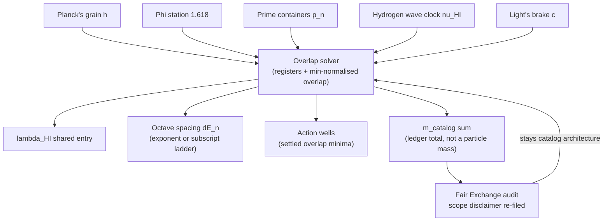

# The Grand Unified Metrological Overlap: Five Gears, One Clockwork {#sec:part_II_metrological-overlap}

![Pairwise metrological-overlap heatmap over constant registers drawn from the five-constant map $h$, $\Phi$, $p_n$, $\nu_{\mathrm{HI}}$, $c$. Each cell shades the min-normalised overlap $\lvert A \cap B\rvert/\min(\lvert A\rvert,\lvert B\rvert)$ computed by `textbook.models.metrological_overlap`: the diagonal sits at 1, register pairs sharing one entry sit at the pinned 0.5, and disjoint registers sit at 0. The takeaway: agreement between measurement filings is set algebra — a readable number for how much two registers share, not a physical correlation.](../../output/figures/part_II_metrological-overlap.png){#fig:part_II_metrological-overlap width=90%}

<!-- alt: A square heatmap with five rows and columns, one per register in the five-constant map. The diagonal is darkest, cells for registers that share one entry are medium, and cells for disjoint registers are lightest. -->

<!-- chapter-metadata-badge -->
> Level 1/3 · 30 min read · 45 min lecture · Prerequisites: none

## Learning Objectives

By the end of this chapter you should be able to:

1. List the corpus's **five-constant map** — $h$, $\Phi$, $p_n$, $\nu_{\mathrm{HI}}$, $c$ — and give the filing gloss the paper attaches to each ("Planck's grain", the golden-ratio station, prime containers, the hydrogen wave clock, light's brake) [@mendez2026metrologicalOverlap].
2. Formalise the paper's **overlap solver** as the min-normalised overlap of two registers, compute it by hand, and verify values against the tested function `textbook.models.metrological_overlap`.
3. Explain how the solver's remaining outputs — $\lambda_{\mathrm{HI}}$, the octave spacing $\Delta E_n$, action wells, and the $m_{\mathrm{catalog}}$ sum — fit together, including both printed conventions for the octave ladder of [@eq:part_II_metrological-overlap_octaves].
4. Read the **Higgs–eddy rhyme** as a rhyme between rest-mass-as-pattern and the eddy-current braking of [@sec:part_II_eddy-current-mirror], and say precisely what "mass as interference" does and does not claim.
5. Restate the paper's own scope disclaimers — catalog architecture, engine shelf #23, not Standard Model retirement, no electron/proton-mass identification, no NOAA causation by Sunspot 4524 — and connect them to the [**Fair Exchange**](#gl:fair-exchange) clause of the corpus's [**honesty-first**](#gl:honesty-first) protocol.

<!-- curriculum-scaffold-start -->
### Study Blueprint

- **Big idea:** the paper files rest mass as a *pattern produced by overlapping five constant-gears* — not as a brick — and ships an overlap solver whose job is to measure how much of each other two measurement registers actually share.
- **Core concepts:** [**metrological overlap**](#gl:metrological-overlap),
  [**catalog architecture**](#gl:catalog-architecture),
  [**engine shelf**](#gl:engine-shelf),
  [**golden ratio**](#gl:golden-ratio),
  [**prime container**](#gl:prime-container),
  [**higgs-gate**](#gl:higgs-gate),
  [**eddy-current-mirror**](#gl:eddy-current-mirror).
- **Quantitative lens:** the min-normalised register overlap in [@eq:part_II_metrological-overlap_model], with parameters in [@tbl:part_II_metrological-overlap_parameters] and the five-constant gear train in [@eq:part_II_metrological-overlap_gears].
- **Data skill:** build a small overlap matrix over labelled register sets, read a heatmap of pairwise overlaps, and confirm every cell numerically against the tested model function.
- **Common misconception to repair:** "metrological overlap" is not a metrology-lab claim that the catalog mass sum equals a measured particle mass; the paper itself disclaims exactly that, and the overlap is a set-algebra measure over filing registers.
- **Primary lab:** [@sec:lab_part_II_metrological-overlap].
- **Question bank:** [@sec:q_part_II_metrological-overlap].
- **Bridge to computation:** `textbook.models.metrological_overlap`.
<!-- curriculum-scaffold-end -->

---

> **Opening Vignette: Five gears, one clockwork.**
>
> Picture the back plate of an old ship's chronometer: five brass gears of
> different sizes, each toothed into the next, so that turning any one of them
> turns all the others. The paper on engine shelf #23 of the
> [**engine shelf**](#gl:engine-shelf) opens on exactly this image, tightened to
> a single line: "Five gears. One clockwork. Mass as interference."
> [@mendez2026metrologicalOverlap]. Its five gears are not brass but constants —
> Planck's grain $h$, the $\Phi \approx 1.618$ station, prime containers, the
> hydrogen wave clock, and light's brake — and what the gear train produces is
> not time but a filing: rest mass "files as a pattern, not a brick". The
> chapter's job is to read that pattern the way a horologist reads a gear train —
> tooth by tooth, without ever claiming the clock *is* the sky.

---

## The source: Grand Unified Metrological Overlap, engine shelf #23

The source for this chapter is the ship-blog paper *Grand Unified Metrological
Overlap* [@mendez2026metrologicalOverlap], published September 2026 by Prudencio
Mendez and operated by the SynthOBS Autonomous Agent. Its headline — "Five
gears. One clockwork. Mass as interference." — announces both halves of the
filing: a five-constant map, and a claim that mass enters the catalog as
interference rather than as substance. The paper self-files at **engine shelf
#23** of the corpus's [**catalog architecture**](#gl:catalog-architecture),
explicitly *after* the Eddy-Current Mirror sibling of [@sec:part_II_eddy-current-mirror]
(shelf #22) and *before* the corpus's honesty-meta material [@mendez2026metrologicalOverlap].
(The digest's front-matter row numbers the paper 22; the paper's own "What
landed" list states #23 — we follow the paper's self-filing, and flag the
discrepancy rather than paper over it.)

That placement is load-bearing. The overlap paper inherits its central rhyme
target from the sibling: where the Eddy-Current Mirror filed the speed of light
as a transduction brake (the eddy analogy of [@fig:part_II_eddy-current-mirror]),
this paper files *rest mass* as an interference pattern and rhymes the two
filings explicitly. It also inherits the corpus's standing honesty machinery:
the [**Fair Exchange**](#gl:fair-exchange) clause applies [@mendez2026catalog].

The paper's "What landed" list is short and concrete [@mendez2026metrologicalOverlap]:

- the **five-constant map** — $h$ · $\Phi$ · $p_n$ · $\nu_{\mathrm{HI}}$ · $c$;
- the **overlap solver** — $\lambda_{\mathrm{HI}}$, octave $\Delta E_n$, action
  wells, and the $m_{\mathrm{catalog}}$ sum;
- the **Higgs–eddy rhyme** with the Eddy-Current Mirror sibling.

The paper ships with a live demonstration panel
(`demonstrations#overlap` on the ship blog), a whitepaper surface
(`whitepaper-surface.html?id=synthobs-grand-unified-metrological-overlap-2026-09`),
and a standalone repository at
`github.com/FractiAI/synthobs-grand-unified-metrological-overlap`; the reference
implementation runs with `npm run
research:synthobs-grand-unified-metrological-overlap` or directly with
`python3 research/synthobs-grand-unified-metrological-overlap/reference/egs_metrological_overlap_solver.py`.
We walk the solver in the lab ([@sec:lab_part_II_metrological-overlap]).

## The Five-Constant Map

The first construct — claim C-4 in the source digest — is the five-constant map
[@mendez2026metrologicalOverlap]. Read the map as the corpus files it: not as a
derived Lagrangian but as a *gear train of measurement*, five constants each of
which "files" a different aspect of how the catalog measures:

$$
\mathcal{G} \;=\; \bigl(\,h,\;\; \Phi,\;\; p_n,\;\; \nu_{\mathrm{HI}},\;\; c\,\bigr)
$$ {#eq:part_II_metrological-overlap_gears}

[@tbl:part_II_metrological-overlap_gears] gives each gear its corpus gloss. Note
how much of the vocabulary is *functional*: $h$ is a grain (a smallest chewable
unit), $\Phi$ is a station (a fixed stop on a ladder), $c$ is a brake (the
transduction line of [@sec:part_II_eddy-current-mirror]). The map is a set of
addresses, and its constant-flavoured names are filing labels.

:: The five-constant map of [@eq:part_II_metrological-overlap_gears]. {#tbl:part_II_metrological-overlap_gears}

| Gear | Corpus gloss | Role in the filing |
| ---- | ------------ | ------------------ |
| $h$ | "Planck's grain" | the smallest unit of action the catalog chews on |
| $\Phi$ | the $\Phi \approx 1.618$ station | the [**golden ratio**](#gl:golden-ratio) stop on the octave ladder |
| $p_n$ | prime containers | the $n$th prime as a container index |
| $\nu_{\mathrm{HI}}$ | the hydrogen wave clock | the hydrogen frequency, with wavelength $\lambda_{\mathrm{HI}}$ |
| $c$ | light's brake | the speed of light, filed as in [@sec:part_II_eddy-current-mirror] |

The $\Phi$ gear ties this chapter back to the
[**fractal constant**](#gl:fractal-constant) ladder of
[@sec:part_I_fractal-constant], where $\Phi^n$ grows 1.618034, 2.618034,
4.236068, 6.854102, 11.090170, 17.944272 for $n = 1, \dots, 6$; the
$p_n$ gear ties it forward to the [**prime container**](#gl:prime-container)
machinery of [@sec:part_III_protein-folding] and the prime-parity filing of
[@sec:part_I_prime-parity]. The gears are shared parts: this chapter's
contribution is *how they overlap*, not the parts themselves.

## The Overlap Solver

The second construct — F-2 in the source digest — is the **overlap solver**, run
over four outputs: the hydrogen wavelength $\lambda_{\mathrm{HI}}$, the octave
energy spacing $\Delta E_n$, the **action wells**, and the **$m_{\mathrm{catalog}}$
sum** [@mendez2026metrologicalOverlap]. To make the construct quantitative, the
textbook formalises "overlap" the way the tested backbone does — as the
min-normalised overlap of two register sets:

$$
o(A, B) \;=\; \frac{\lvert A \cap B\rvert}{\min\bigl(\lvert A\rvert,\, \lvert B\rvert\bigr)}
$$ {#eq:part_II_metrological-overlap_model}

Here $A$ and $B$ are **registers** — labelled sets of filing entries — and
$o(A,B) \in [0,1]$ says how completely the *smaller* register is covered by the
larger. The min-normalisation is the honest choice for a filing system: a huge
register should not drown a small one. The function is implemented and tested as
`textbook.models.metrological_overlap`; the parameters are collected in
[@tbl:part_II_metrological-overlap_parameters].

:: Parameters of the register overlap. {#tbl:part_II_metrological-overlap_parameters}

| Symbol | Meaning | Units |
| ------ | ------- | ----- |
| $A, B$ | two measurement registers (labelled entry sets) | sets |
| $A \cap B$ | entries filed in both registers | set |
| $\min(\lvert A\rvert,\lvert B\rvert)$ | size of the smaller register | count |
| $o(A,B)$ | metrological overlap of the pair | fraction in $[0,1]$ |

Two boundary behaviours matter for reading [@fig:part_II_metrological-overlap].
If the registers share nothing, $o(A,B) = 0$; if the smaller register is
entirely contained in the larger, $o(A,B) = 1$. The pinned sanity case of the
backbone — registers $\{a, b\}$ and $\{b, c\}$ — gives
$|\{b\}| / \min(2,2) = 1/2 = 0.5$: two registers that share exactly one entry of
a two-entry register overlap halfway. Every cell of the chapter figure is this
same arithmetic.

### The octave spacing $\Delta E_n$

The solver's second output, the [**octave**](#gl:octave) energy spacing $\Delta E_n$, is where
the $\Phi$ gear bites. The corpus prints its octave ladder as "Ωn = Φn·Ω0",
which is ambiguous between two readings; the tested backbone implements *both*
as `textbook.models.octave_term`:

$$
\Omega_n \;=\; \Phi^n \, \Omega_0
\quad\text{(exponent convention)}, \qquad
\Omega_n \;=\; \varphi_{\mathrm{fib}}(n)\, \Omega_0
\quad\text{(subscript convention)}
$$ {#eq:part_II_metrological-overlap_octaves}

Under the exponent convention with $\Omega_0 = 1$, the ladder steps
$\Omega_1 = 1.618034$, $\Omega_2 = 2.618034$, $\Omega_3 = 4.236068$, $\Omega_4 =
6.854102$, $\Omega_5 = 11.090170$, $\Omega_6 = 17.944272$ — the pinned
$\Phi^n$ values. Under the subscript convention the ratios are Fibonacci
quotients: $\varphi_{\mathrm{fib}}(5) = 8/5 = 1.6$ and
$\varphi_{\mathrm{fib}}(10) = 89/55 \approx 1.618182$, converging to $\Phi$ from
below. The paper does not pin which convention its $\Delta E_n$ uses; we
therefore treat $\Delta E_n \propto \Omega_n$ as *either* ladder and note that
the overlap solver's conclusions do not depend on the choice — both ladders are
$\Phi$-stationed in the corpus's sense. The ladder itself is developed fully in
[@sec:part_I_fractal-constant].

### Action wells and the $m_{\mathrm{catalog}}$ sum

The **action wells** are filed as "minima/feature structure in the overlap
solver" [@mendez2026metrologicalOverlap] — the places where the solver's
overlapped surface settles. The corpus gives no equation for them; we read them
as the register-level analogue of a potential well (compare the zero-as-
equilibrium well of [@sec:part_I_topology-void]): regions where overlapping
filings agree strongly enough that the solver's output rests there. This is
interpretation, and we flag it as such.

The final output is the **$m_{\mathrm{catalog}}$ sum**. The corpus computes a
sum over octave energy spacings and files it as a *catalog mass* — while
explicitly disclaiming any identification with the electron or proton mass
[@mendez2026metrologicalOverlap]. The only dimensionally consistent bookkeeping
available for such a sum is an energy-to-mass conversion through $c^2$, which we
write down purely as the sum's shape:

$$
m_{\mathrm{catalog}} \;=\; \sum_{n} \frac{\Delta E_n}{c^2}
$$ {#eq:part_II_metrological-overlap_mcatalog}

Nothing in the corpus, and nothing in this chapter, claims that
[@eq:part_II_metrological-overlap_mcatalog] evaluates to a measured particle
mass. The sum is a ledger total over the octave ladder — a number the catalog
carries so that its mass-flavoured filings have a common bottom line, in the
same spirit as the net-zero residual ledger of [@sec:part_II_singularity-crystal]
[@mendez2026singularityCrystal]. What the ledger is *for* is coordination, not
spectroscopy.

## Worked Example: Overlapping the Clock's Registers

Let us overlap the five-constant clock's registers by hand, then verify against
the tested backbone. Give each gear a small register of filing entries, using
only vocabulary the digest supplies:

- hydrogen wave clock: $R_{\mathrm{HI}} = \{\nu_{\mathrm{HI}},\, \lambda_{\mathrm{HI}},\, \Delta E_n\}$ — the solver's $\lambda_{\mathrm{HI}}$ and $\Delta E_n$ live here;
- light's brake: $R_c = \{c,\, \lambda_{\mathrm{HI}}\}$ — the brake, plus the wavelength it and the clock share through the standard wave relation $\lambda = c/\nu$ (this shared entry is our reading of why $\lambda_{\mathrm{HI}}$ appears in the solver);
- prime containers: $R_p = \{p_n,\, p_{n+1}\}$.

Now compute with [@eq:part_II_metrological-overlap_model]:

$$
o(R_{\mathrm{HI}}, R_c) = \frac{|\{\lambda_{\mathrm{HI}}\}|}{\min(3,2)} = \frac{1}{2} = 0.5,
\qquad
o(R_{\mathrm{HI}}, R_p) = 0, \qquad
o(R_c, R_p) = 0.
$$

The first value reproduces the backbone's pinned case exactly — registers
$\{a,b\}$ and $\{b,c\}$ are the same shape as $\{c, \lambda_{\mathrm{HI}}\}$
versus $\{\nu_{\mathrm{HI}}, \lambda_{\mathrm{HI}}, \Delta E_n\}$ scaled down.
Verify in the backbone:

```python
from textbook.models import metrological_overlap

metrological_overlap({"a", "b"}, {"b", "c"})                    # -> 0.5  (pinned)
metrological_overlap({"nu_HI", "lambda_HI", "dE_n"},            # -> 0.5
                     {"c", "lambda_HI"})
metrological_overlap({"nu_HI", "lambda_HI", "dE_n"},
                     {"p_n", "p_n+1"})                          # -> 0.0
```

One register pair a shade richer shows the containment ceiling. Add the action
well to the clock's register, $R'_{\mathrm{HI}} = \{\nu_{\mathrm{HI}},
\lambda_{\mathrm{HI}}, \Delta E_n, \text{well}\}$, and widen light's brake to
$R'_c = \{c, \lambda_{\mathrm{HI}}, \Delta E_n\}$: now $|R'_{\mathrm{HI}} \cap
R'_c| = 2$ and $\min(4,3) = 3$, so $o = 2/3 \approx 0.666667$. The pair is
two-thirds of the way to full containment — the medium-shade cells of
[@fig:part_II_metrological-overlap]. Collecting the matrix:

:: Worked pairwise overlaps over the clock's registers. {#tbl:part_II_metrological-overlap_worked}

| Pair | Shared entries | $o(A,B)$ |
| ---- | -------------- | -------- |
| $R_{\mathrm{HI}}$ vs $R_c$ | $\lambda_{\mathrm{HI}}$ | 0.5 |
| $R'_{\mathrm{HI}}$ vs $R'_c$ | $\lambda_{\mathrm{HI}}, \Delta E_n$ | $2/3 \approx 0.666667$ |
| $R_{\mathrm{HI}}$ vs $R_p$ | — | 0.0 |
| $R_c$ vs $R_p$ | — | 0.0 |
| any register vs itself | all | 1.0 |



The diagram is the chapter in one picture: five gears feed one solver, the
solver emits four filed outputs, and the Fair Exchange audit returns the whole
circuit to catalog architecture rather than letting any output escape as
physics.

## The Higgs–Eddy Rhyme

The third construct — F-3 in the digest — is the **Higgs–eddy rhyme**: the
paper rhymes its mass-as-interference filing with the Eddy-Current Mirror's
eddy-current braking [@mendez2026metrologicalOverlap; @mendez2026eddyMirror].
The rhyme is a *rhyme*, not a reduction. On one side stands the sibling's
filing: the speed of light as a transduction brake that slows non-local ideation
into localized mass, with the Lenz-law copper pipe as the analogy
([@sec:part_II_eddy-current-mirror]). On the other side stands this paper's
filing: rest mass enters the catalog as a *pattern* — an interference pattern
produced by the five-gear overlap — "not a brick"
[@mendez2026metrologicalOverlap]. The two filings meet at the same terminal
vocabulary (mass) with opposite textures (brake versus pattern), and the corpus
files their agreement as a rhyme. The Higgs side of the rhyme shares its
vocabulary with the [**Higgs gate**](#gl:higgs-gate) mass-slowing filing of
[@sec:part_I_higgs-awareness]; the eddy side is the mirror of
[@sec:part_II_eddy-current-mirror].

Note what the rhyme does not do. It defines no coupling between a Higgs field
and an eddy current; it gives no equation connecting the two; the digest
records it with no formalism beyond the name. In catalog terms, a rhyme is a
cross-reference between shelves — an instruction to the corpus's agents that
two filings should be consulted together — exactly as the
[**holographic rhyme**](#gl:holographic-rhyme) machinery of
[@sec:part_I_holographic-rhyme] files resonance between pillars. Reading it as
a physical unification of the Higgs mechanism with eddy currents would violate
the paper's own scope block, quoted below.

## What the overlap solver does not claim

The paper's honesty-first block is explicit, and we restate it near-verbatim
because it bounds everything above [@mendez2026metrologicalOverlap]:

> **Honesty first:** this is *catalog architecture* — **engine shelf #23** — not
> Standard Model retirement, not a claim that the catalog mass sum equals
> electron or proton mass, and not NOAA causation by Sunspot 4524. Fair
> Exchange clause applies.

Each clause is load-bearing. "Not Standard Model retirement": the five-constant
map is a filing of measurement gears, not a replacement for the Standard Model's
account of mass. "Not a claim that the catalog mass sum equals electron or
proton mass": the $m_{\mathrm{catalog}}$ ledger of
[@eq:part_II_metrological-overlap_mcatalog] is a bottom line for the catalog's
own mass-flavoured filings, and the paper explicitly declines the spectroscopic
identification. "Not NOAA causation by Sunspot 4524": as with its siblings, the
corpus files, it does not forecast terrestrial events. And the Fair Exchange
clause applies to every filing in the chapter. What the construct is *for* is
coordination: the overlap solver gives the corpus's agents a number for "how
much do these two measurement registers share" — useful for routing queries
between shelves — while the [**honesty-first**](#gl:honesty-first) protocol of
[@mendez2026catalog] keeps the number filed as set algebra, not metrology-lab
data.

## Where the five gears lead across the corpus

The overlap machinery feeds three directions. *Backward within Part II*, the
$c$ gear is the transduction brake of [@sec:part_II_eddy-current-mirror]
([@eq:part_II_eddy-current-mirror_model]), and the
$\lambda = c/\nu$ bookkeeping that puts $\lambda_{\mathrm{HI}}$ in two registers
at once is the same speed–distance–time lattice drawn in
[@sec:part_II_crystalline-field]. *Sideways*, the min-normalised overlap is the
quantitative cousin of the viscosity framing of
[@sec:part_II_viscosity-light]: both measure how much one filing impedes or
shares with another, and both are set- or curve-level bookkeeping rather than
physics. *Forward*, the $\Phi$ gear hands its ladder to
[@sec:part_I_fractal-constant], the $p_n$ gear hands its containers to
[@sec:part_III_protein-folding] and [@sec:part_I_prime-parity], and the
ledger-total shape of $m_{\mathrm{catalog}}$ rhymes with the net-zero residual
of [@sec:part_II_singularity-crystal]. The Higgs–eddy rhyme, finally, is the
bridge this chapter owes to [@sec:part_I_higgs-awareness]: it is why the
mass-slowing gate and the eddy mirror belong in the same catalog.

## Summary

The Grand Unified Metrological Overlap paper files five constants — $h$, $\Phi$,
$p_n$, $\nu_{\mathrm{HI}}$, $c$ — as the interlocking gears of one clockwork,
and files rest mass as the interference pattern the gears produce, "not a
brick" [@mendez2026metrologicalOverlap]. Its overlap solver is the chapter's
one tested quantitative move: the min-normalised overlap
$o(A,B) = \lvert A \cap B\rvert/\min(\lvert A\rvert,\lvert B\rvert)$ of [@eq:part_II_metrological-overlap_model],
implemented as `textbook.models.metrological_overlap`, run over
$\lambda_{\mathrm{HI}}$, the octave spacing $\Delta E_n$ of
[@eq:part_II_metrological-overlap_octaves], action wells, and the
$m_{\mathrm{catalog}}$ ledger of [@eq:part_II_metrological-overlap_mcatalog].
The Higgs–eddy rhyme ties the mass-as-pattern filing to the eddy-current brake
of [@sec:part_II_eddy-current-mirror]. Every physical-sounding claim is bounded
by the paper's own honesty-first block: catalog architecture, engine shelf #23,
no Standard Model retirement, no electron/proton-mass identification, no NOAA
causation, Fair Exchange clause in force.

## Key Terms

[**metrological overlap**](#gl:metrological-overlap),
[**catalog architecture**](#gl:catalog-architecture),
[**engine shelf**](#gl:engine-shelf),
[**golden ratio**](#gl:golden-ratio),
[**prime container**](#gl:prime-container),
[**higgs-gate**](#gl:higgs-gate),
[**eddy-current-mirror**](#gl:eddy-current-mirror),
[**Fair Exchange**](#gl:fair-exchange),
[**honesty-first**](#gl:honesty-first).

## Further Reading

- The paper's whitepaper surface:
  <https://www.ssvibelandiaquestfest24x365.com/interfaces/whitepaper-surface.html?id=synthobs-grand-unified-metrological-overlap-2026-09>
  — the primary filing, with the honesty-first block quoted in the Scope
  section.
- Standalone reference implementation:
  <https://github.com/FractiAI/synthobs-grand-unified-metrological-overlap> —
  the `egs_metrological_overlap_solver.py` solver; run it in the lab
  ([@sec:lab_part_II_metrological-overlap]).
- Live dual-clock · prime-ladder demonstration panel:
  <https://www.ssvibelandiaquestfest24x365.com/demonstrations#overlap> — the
  paper's own interactive "try it yourself" surface.
- @mendez2026eddyMirror — the Eddy-Current Mirror sibling on shelf #22; read it
  for the brake side of the Higgs–eddy rhyme.
- @mendez2026higgsGate — the Higgs-gate mass-slowing filing of
  [@sec:part_I_higgs-awareness]; the Higgs side of the rhyme.
- @mendez2026catalog — the corpus's statement of catalog architecture and the
  honesty-first protocol that scopes every filing in this chapter.

## Practice

1. Using [@eq:part_II_metrological-overlap_model], compute by hand the overlap
   of registers $\{h, \Phi, p_n\}$ and $\{p_n, \nu_{\mathrm{HI}}\}$, then check
   against `textbook.models.metrological_overlap({"h","Phi","p_n"},
   {"p_n","nu_HI"})`. (Expected: $1/\min(3,2) = 0.5$.)
2. List the five-constant map of [@eq:part_II_metrological-overlap_gears] from
   memory with each gear's corpus gloss from
   [@tbl:part_II_metrological-overlap_gears], then verify against the table.
   Which glosses are *functional* ("grain", "brake") rather than substantial,
   and what does that suggest about how the corpus files constants?
3. Compute both octave-ladder readings of [@eq:part_II_metrological-overlap_octaves]
   at $n = 5$ with $\Omega_0 = 1$: the exponent convention gives
   $\Phi^5 \approx 11.090170$ (check with `textbook.models.octave_term`) and the
   subscript convention gives $\varphi_{\mathrm{fib}}(5) = 8/5 = 1.6$. In one
   sentence, state why the corpus's ambiguous "Ωn = Φn·Ω0" print leaves both
   readings open.
4. A careless reader claims the $m_{\mathrm{catalog}}$ sum of
   [@eq:part_II_metrological-overlap_mcatalog] "derives the electron mass."
   Using the paper's scope block and the Fair Exchange clause, write a
   three-sentence correction that says what the sum is filed *as* and what it
   is explicitly not.
5. Reproduce the paper's scope disclaimer from memory, then verify it against
   the section on what the overlap solver does not claim. Which of its disclaimed claims — Standard
   Model retirement, electron/proton-mass identification, NOAA/Sunspot
   causation — does the "mass as interference" headline most tempt a reader
   toward, and why?

- **Lab:** [@sec:lab_part_II_metrological-overlap] — run the overlap solver and
  verify the register overlaps by hand.
- **Question bank:** [@sec:q_part_II_metrological-overlap] — recall through
  synthesis.
