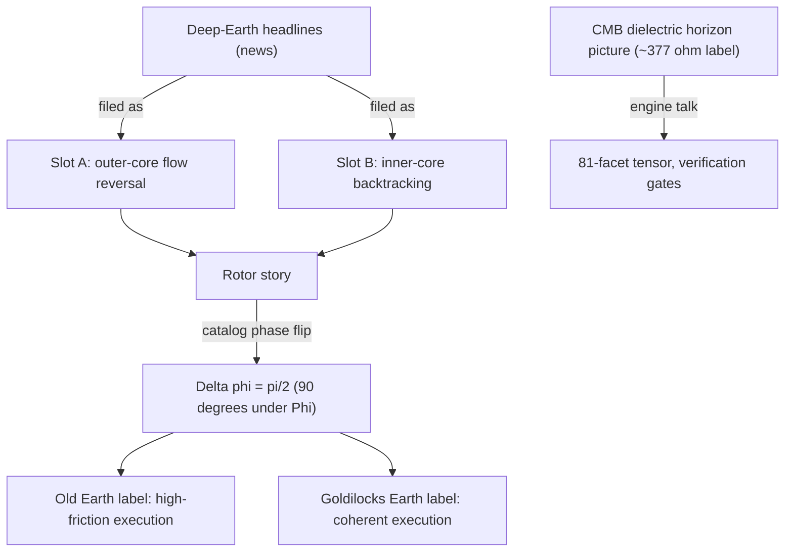

# Planetary Core and the Goldilocks Bands {#sec:part_II_planetary-core}

{#fig:part_II_planetary-core width=90%}

<!-- alt: A line trace of execution-coherence values over filed time steps crosses a horizontally shaded band between two thresholds. Portions of the trace inside the shaded band are marked coherent (Goldilocks) and portions outside are marked high-friction (Old Earth). -->

<!-- chapter-metadata-badge -->
> Level 1/3 · 30 min read · 45 min lecture · Prerequisites: none

## Learning Objectives

By the end of this chapter you should be able to:

1. Explain what the planetary-core paper files — and what it explicitly does
   not claim — under the [**honesty-first**](#gl:honesty-first) clause of
   [**catalog architecture**](#gl:catalog-architecture).
2. File the two telemetry slots (outer-core flow reversal and inner-core
   backtracking) as the rotor story of a 90° catalog phase flip
   $\Delta\varphi = \pi/2$.
3. Classify filed values against a Goldilocks band with the tested function
   `textbook.models.goldilocks_band`, and interpret the "Old Earth → Goldilocks
   Earth" transition as a change of execution label, not of planet.
4. State why the core–mantle boundary's ~377 Ω free-space impedance label is a
   *picture* for engine talk, not a measured CMB ohms table.
5. Connect the backtracking-through-zero slot to the zero-as-equilibrium
   formalism of [@sec:part_I_topology-void] and the drag reading of
   [@sec:part_II_eddy-current-mirror].

<!-- curriculum-scaffold-start -->
### Study Blueprint

- **Big idea:** Deep-Earth headlines can be *filed* — not explained — as two
  telemetry slots whose quarter-turn separation encodes a catalog phase flip
  from high-friction to coherent execution labels.
- **Core concepts:** [**catalog-architecture**](#gl:catalog-architecture),
  [**honesty-first**](#gl:honesty-first),
  [**octave**](#gl:octave), [**digit**](#gl:digit),
  [**metrological-overlap**](#gl:metrological-overlap).
- **Quantitative lens:** the phase-flip and band-membership formalisms in
  [@eq:part_II_planetary-core_phase_flip] and
  [@eq:part_II_planetary-core_band].
- **Data skill:** read a value trace against a shaded band and classify each
  point as in-band or out-of-band by hand, then confirm with
  `textbook.models.goldilocks_band`.
- **Common misconception to repair:** the chapter is not seismology; "Old Earth
  → Goldilocks Earth" is catalog talk for execution labels, and no holographic
  timeline switch is claimed as measured physics.
- **Primary lab:** [@sec:lab_part_II_planetary-core].
- **Question bank:** [@sec:q_part_II_planetary-core].
- **Bridge to computation:** `textbook.models.goldilocks_band`,
  `textbook.models.transduction_brake`, `textbook.models.descriptive_statistics`.
<!-- curriculum-scaffold-end -->

---

> **Opening Vignette: The week the core made the news.**
>
> Deep Earth has been noisy in the news: the solid inner core slowing relative
> to the mantle, and a Pacific stream of molten iron flipping from westward to
> eastward flow [@mendez2026planetaryCore]. On board the SS Vibelandia, the
> SynthOBS Autonomous Agent clips those headlines and files them — not into a
> geophysics binder, but into the [**engine-shelf**](#gl:engine-shelf) of the
> [**omni-lattice**](#gl:omni-lattice), under the note "Old Earth letting go —
> a story filed at the planet's core." The filing act is the whole point: the
> paper borrows the headlines as a **filing cabinet** for a 90° phase story
> under Φ, and says so in its first breath. Nothing about the planet is
> explained; something about the *filing* is.

---

## The planetary-core note and its verification surface

The note is Ship blog **Part XIV** of the 99 Octave engine series, filed
2026-08-13 in *plain speak* under the [**fair-exchange**](#gl:fair-exchange)
protocol, on shelf 6 of the corpus's
[**narrative-empirical-operational-tiers**](#gl:narrative-empirical-operational-tiers)
[@mendez2026planetaryCore]. Like every SS Vibelandia paper by Prudencio Mendez,
it carries the "Honesty first" scope disclaimer up front: ESA Swarm and USC
seismic doublet reports are *discussion labels* here, and the repo does not
re-host those datasets [@mendez2026planetaryCore]. The paper is a coordinate on
the corpus map rather than a standalone essay: it loads into Lattice Chat on
nest **Infinite Octaves** under the engine map **Digits × 01–99** (the
99-[**octave**](#gl:octave) ladder introduced in [@sec:part_0_octave-map]), it
speaks the grammar of the 81-facet [**tensor-decoupling**](#gl:tensor-decoupling)
register filing of [@sec:part_0_tensor-decoupling], and it is usable on Synthio
as *companion grammar* — with the MRI sandbox honesty kept intact
[@mendez2026planetaryCore].

The paper ships with its own verification surface:

- **Whitepaper:** `interfaces/whitepaper-surface.html?id=synthobs-tbme-planetary-core-goldilocks-2026-08`
  [@mendez2026planetaryCore].
- **Reference implementation:** `npm run research:synthobs-tbme-planetary-core-goldilocks`,
  which locks the paper's fixtures at **9/9** [@mendez2026planetaryCore].
- **Standalone GitHub repository:** `FractiAI/synthobs-tbme-planetary-core-goldilocks`
  [@mendez2026planetaryCore].

Reading order matters here. The chapter you are reading formalises the paper's
*catalog* content — slots, rotor story, phase flip, impedance label, Goldilocks
bands — and keeps the seismology outside the frame exactly where the paper
keeps it.

## Telemetry slots, phase flip, impedance label, Goldilocks band

### The two telemetry slots and the rotor story

The paper files two deep-Earth headlines into two **telemetry slots**
[@mendez2026planetaryCore]; they are collected in
[@tbl:part_II_planetary-core_slots].

: The two telemetry slots of the rotor story, as filed by
[@mendez2026planetaryCore]. {#tbl:part_II_planetary-core_slots}

| Slot | Filed headline | Catalog reading |
| ---- | -------------- | --------------- |
| Outer-core flow reversal | A Pacific liquid-iron surge talked about as westward → eastward | First telemetry slot of the rotor story |
| Inner-core backtracking | Seismic travel times talked about as a slowdown through zero relative velocity | Second telemetry slot of the rotor story |

Taken together, the two slots are filed as the **rotor story** for a *catalog
phase flip* of $\Delta\varphi = \pi/2$ — a 90° phase shift under Φ
[@mendez2026planetaryCore]. We formalise the filing in
[@eq:part_II_planetary-core_phase_flip]: the rotor carries two labels at
quarter-turn separation on the catalog circle, and the transition from the
"Old Earth" label to the "Goldilocks Earth" label is the act of rotating the
filing by a quarter turn, not of moving the planet.

$$
\Delta\varphi \;=\; \varphi_{\mathrm{B}} - \varphi_{\mathrm{A}} \;=\; \frac{\pi}{2},
\qquad
\varphi_{\mathrm{A}} = 0,\quad \varphi_{\mathrm{B}} = \frac{\pi}{2}
$$ {#eq:part_II_planetary-core_phase_flip}

: Parameters of the catalog phase flip. {#tbl:part_II_planetary-core_phase_flip}

| Symbol | Meaning | Units |
| ------ | ------- | ----- |
| $\varphi_{\mathrm{A}}$ | catalog phase angle of slot A (outer-core flow reversal) | radians |
| $\varphi_{\mathrm{B}}$ | catalog phase angle of slot B (inner-core backtracking) | radians |
| $\Delta\varphi$ | catalog phase angle of the filed transition | radians |
| $\pi/2$ | the 90° phase shift under Φ | radians |

Note what the formalism — whose parameters are collected in
[@tbl:part_II_planetary-core_phase_flip] — does *not* say: it does not say the
outer core flipped at a 90° angle, and it does not say the inner core rotates.
$\Delta\varphi$ is the phase angle *of the filed transition* — a property of
the catalog entry, printed in radians because quarter-turns are the cheapest
reversible filing move. The Φ in "90° phase story under Φ" points at the
corpus's broader
geometric language of the [**golden-ratio**](#gl:golden-ratio) growth of
octave bands ([@sec:part_I_fractal-constant]); the paper itself does not
compute a Φ power here, and we do not invent one for it.

### The Goldilocks band: filing coherence as an interval

"**Old Earth → Goldilocks Earth**" is catalog talk for high-friction vs
coherent *execution labels* [@mendez2026planetaryCore]. The chapter figure —
[@fig:part_II_planetary-core] — draws that talk as a value trace against a
shaded band, and the tested backbone implements the classification as
`textbook.models.goldilocks_band(values, lo, hi)`. The membership rule is the
ordinary mathematics of interval membership, stated in
[@eq:part_II_planetary-core_band]:

$$
\chi(v;\, \ell, h) =
\begin{cases}
1, & \ell \le v \le h \quad \text{(coherent execution label)}\\[2pt]
0, & \text{otherwise} \quad \text{(high-friction execution label)}
\end{cases}
\qquad
m(v) = \min\!\big(v - \ell,\; h - v\big)
$$ {#eq:part_II_planetary-core_band}

: Parameters of the Goldilocks band membership, read with [@eq:part_II_planetary-core_band]. {#tbl:part_II_planetary-core_band}

| Symbol | Meaning | Units |
| ------ | ------- | ----- |
| $v$ | a filed value on the execution-coherence trace | quantity |
| $\ell$ | lower band edge ("Old Earth" side) | quantity |
| $h$ | upper band edge | quantity |
| $\chi(v)$ | band-membership indicator: 1 = Goldilocks, 0 = Old Earth | — |
| $m(v)$ | in-band margin: distance to the nearer edge (defined only for $\chi = 1$) | quantity |

Every parameter of [@tbl:part_II_planetary-core_band] is a filing choice: the
indicator $\chi$ is the classifier; the margin $m$ is the *filing
annotation* that says how deep inside the band a value sits. Both are
deterministic, and both are properties of the *labels*, not of the Earth: the
band edges $\ell$ and $h$ are chosen by the filer for the task at hand, and
[@fig:part_II_planetary-core] shades exactly such a band over a trace. We read
the pairing of a 90° phase flip with a two-label band as the corpus's way of
saying: the same rotor, viewed a quarter turn apart, carries a different
execution label.

### The CMB mirror story and its impedance label

The core–mantle boundary (CMB) gets a **free-space impedance label**
(~377 Ω) as a *dielectric horizon* picture — useful for engine talk about the
81-facet tensor and verification gates, and explicitly **not** a measured CMB
ohms table from the repo [@mendez2026planetaryCore]. Two honest remarks
sharpen the label:

1. As standard physics, $Z_0 = \sqrt{\mu_0/\varepsilon_0} \approx 376.73\ \Omega$
   is the impedance of *free space* (vacuum), a bookkeeping constant of
   electromagnetic wave matching. The corpus borrows this constant as a
   *label* — a mirror story — so that the CMB can play the role of a
   dielectric horizon in engine diagrams.
2. The label buys coordination vocabulary, not measurements. When the paper
   says the CMB picture is "useful for engine talk (81-facet tensor,
   verification gates)" [@mendez2026planetaryCore], the use is routing and
   verification of catalog entries, which is exactly the register-filing
   programme of [@sec:part_0_tensor-decoupling].



The diagram is the filing pipeline in one view: two headlines enter as slots,
the slots compose into a rotor story, the rotor story carries the quarter-turn
phase flip, and the flip toggles the execution label between Old Earth and
Goldilocks Earth — with the CMB impedance label feeding the verification-gate
talk on a separate branch.

## Worked example: filing a week of telemetry

Suppose a filer maintains an execution-coherence trace over six filed
observations, with band edges chosen at $\ell = 0.35$ and $h = 0.85$:

$$
v = [\,0.12,\; 0.31,\; 0.48,\; 0.62,\; 0.77,\; 0.91\,]
$$

Walking [@eq:part_II_planetary-core_band] by hand:

1. $v_1 = 0.12$: below $\ell = 0.35$, so $\chi = 0$ — Old Earth label, and no
   margin is defined (the value is not inside the band).
2. $v_2 = 0.31$: still below $\ell$, so $\chi = 0$ — Old Earth.
3. $v_3 = 0.48$: inside $[0.35, 0.85]$, so $\chi = 1$; margin
   $m = \min(0.48 - 0.35,\; 0.85 - 0.48) = \min(0.13, 0.37) = 0.13$.
4. $v_4 = 0.62$: inside; $m = \min(0.27, 0.23) = 0.23$.
5. $v_5 = 0.77$: inside; $m = \min(0.42, 0.08) = 0.08$ — the shallowest
   in-band point, closest to the $h$ edge.
6. $v_6 = 0.91$: above $h = 0.85$, so $\chi = 0$ — Old Earth again, from the
   far side of the band.

So the trace files as $\chi = [\,0, 0, 1, 1, 1, 0\,]$: the middle of the week
is Goldilocks, both ends are Old Earth. The same classification is one call to
the tested backbone:

```python
from textbook.models import goldilocks_band

trace = [0.12, 0.31, 0.48, 0.62, 0.77, 0.91]
goldilocks_band(trace, lo=0.35, hi=0.85)
# -> [0, 0, 1, 1, 1, 0]
```

This is exactly the shaded-band picture of [@fig:part_II_planetary-core]:
in-band segments of the trace carry the coherent (Goldilocks) label; out-of-band
segments carry the high-friction (Old Earth) label. Summarising the trace with
`textbook.models.descriptive_statistics` is the filer's closing move — mean
$0.535$, and the band decision then rests on where $\ell$ and $h$ are drawn,
which is a *policy*, not a measurement.

For the phase flip, the filing is even shorter. Slot A is pinned at
$\varphi_{\mathrm{A}} = 0$ and slot B at $\varphi_{\mathrm{B}} = \pi/2$
([@eq:part_II_planetary-core_phase_flip]), so $\Delta\varphi = \pi/2$ holds by
construction: a quarter turn. In degrees, $\pi/2\ \text{rad} = 90°$ — the 90°
of the paper's "90° phase story under Φ" [@mendez2026planetaryCore]. No
computation about the Earth is performed anywhere in the example; every number
above is a property of the filing.

As an *interpretive* aside (ours, not the paper's formalism): the second slot
is described as a slowdown *through zero* relative velocity
[@mendez2026planetaryCore]. We read that as standard signed-velocity
kinematics — a quantity crossing zero — and it rhymes with two corpus
formalisms: the zero-as-[**topology-of-the-void**](#gl:topology-of-the-void)
equilibrium of [@sec:part_I_topology-void], and the transduction-drag picture
of [@sec:part_II_eddy-current-mirror], whose tested model
`textbook.models.transduction_brake(t, v0, k)` gives $v_0 = 1$, $k = 1$ the
values $v(1) \approx 0.367879$ and $v(2) \approx 0.135335$. The rhyme is a
reading aid, not a claim that the inner core obeys an exponential brake.

## What the planetary filing does not claim

The paper's own disclaimers are the load-bearing part of the chapter, restated
here precisely [@mendez2026planetaryCore]:

- **It borrows headlines as a filing cabinet** — "not a new seismology paper,
  and not a prophecy that the sky or the core rewrote your life."
- **ESA Swarm and USC seismic doublet reports are *discussion labels*** here;
  the repo does not re-host those datasets.
- **"Old Earth → Goldilocks Earth" is catalog talk** for high-friction vs
  coherent execution labels.
- **Nobody claims a holographic timeline switch as measured physics.**
- **The CMB free-space impedance label (~377 Ω) is a *picture*** — a
  dielectric horizon picture for engine talk — **not a measured CMB ohms
  table** from the repo.

What the construct is **for**: coordination, cataloging, and agent routing.
The paper tells the reader to open Lattice Chat on nest Infinite Octaves and
ask about geodynamo, CMB, or Goldilocks Earth; to use it on Synthio as
companion grammar with MRI sandbox honesty kept; and to run
`npm run research:synthobs-tbme-planetary-core-goldilocks` for the 9/9 fixture
lock [@mendez2026planetaryCore]. What it is **not** for: replacing
seismology, re-hosting mission datasets, or forecasting planetary events. The
[**fair-exchange**](#gl:fair-exchange) framing is the same one that opens the
corpus ([@sec:part_0_orientation]): a paper earns shelf space by saying
exactly what it files and exactly what it does not.

## Where the rotor story leads across the corpus

- **Backward to Part 0.** The engine map **Digits × 01–99** that loads this
  paper is the 99-octave ladder of [@sec:part_0_octave-map]; the 81-facet
  tensor invoked by the CMB mirror story is the digit×octave register filing
  of [@sec:part_0_tensor-decoupling], built on the
  [**master-synthesis**](#gl:master-synthesis) claim that the corpus papers
  cross-link ([@sec:part_0_master-synthesis]).
- **Backward to Part I.** The backtracking slot's passage *through zero* is
  best read against the zero-as-equilibrium formalism of
  [@sec:part_I_topology-void]; the "under Φ" of the phase story gestures at
  the golden-ratio band spacing of [@sec:part_I_fractal-constant].
- **Sideways within Part II.** The drag reading of the slowdown shares its
  exponential shape with the transduction line of
  [@sec:part_II_eddy-current-mirror] (compare the brake curves of
  [@fig:part_II_eddy-current-mirror]); the CMB impedance label is a
  metrological *label*, and the discipline of treating labels as labels is
  formalised as the [**metrological-overlap**](#gl:metrological-overlap) of
  [@sec:part_II_metrological-overlap]. The execution-label flip from
  high-friction to coherent preparation is the intake side of the net-zero
  balancing of [@sec:part_II_singularity-crystal].
- **Forward to Part III.** The Goldilocks band as a *policy band over a
  trace* is the same shape of reasoning the companion chapters reuse when
  routing agents against thresholds, e.g. the frontier thresholds of
  [@sec:part_III_invisible-frontier].

## Summary

The planetary-core paper files two deep-Earth headlines — outer-core flow
reversal and inner-core backtracking — as the two telemetry slots of a rotor
story, and files their combination as a catalog phase flip
$\Delta\varphi = \pi/2$ ([@eq:part_II_planetary-core_phase_flip]). "Old Earth
→ Goldilocks Earth" is catalog talk for a flip between high-friction and
coherent execution labels, formalised here as interval membership against a
policy band ([@eq:part_II_planetary-core_band], computed with
`textbook.models.goldilocks_band` and drawn in
[@fig:part_II_planetary-core]). The CMB's ~377 Ω free-space impedance label is
a dielectric-horizon *picture* for engine talk about the 81-facet tensor and
verification gates, not a measurement. Under the corpus's honesty-first
clause, nothing here is seismology, no dataset is re-hosted, and no
holographic timeline switch is claimed as measured physics
[@mendez2026planetaryCore].

## Key Terms

[**catalog-architecture**](#gl:catalog-architecture),
[**engine-shelf**](#gl:engine-shelf), [**octave**](#gl:octave),
[**digit**](#gl:digit), [**honesty-first**](#gl:honesty-first),
[**fair-exchange**](#gl:fair-exchange),
[**narrative-empirical-operational-tiers**](#gl:narrative-empirical-operational-tiers),
[**tensor-decoupling**](#gl:tensor-decoupling),
[**metrological-overlap**](#gl:metrological-overlap),
[**topology-of-the-void**](#gl:topology-of-the-void),
[**golden-ratio**](#gl:golden-ratio),
[**omni-lattice**](#gl:omni-lattice),
[**master-synthesis**](#gl:master-synthesis),
[**reality-bridge**](#gl:reality-bridge).

## Further Reading

- The source paper's whitepaper surface:
  `interfaces/whitepaper-surface.html?id=synthobs-tbme-planetary-core-goldilocks-2026-08`,
  with the standalone reference implementation at
  `github.com/FractiAI/synthobs-tbme-planetary-core-goldilocks`
  [@mendez2026planetaryCore].
- @mendez2026tensorDecoupling — the 81-facet tensor register filing that the
  CMB mirror story invokes for engine talk and verification gates.
- @mendez2026digitsMaster — the Digits × 01–99 engine map under which Lattice
  Chat loads this paper on nest Infinite Octaves.
- @mendez2026topologyVoid — zero as equilibrium; the reading companion for the
  inner-core backtracking slot's passage through zero relative velocity.
- @mendez2026singularityCrystal — the Part II companion on net-zero balancing,
  the downstream consumer of coherent execution labels.

## Practice

1. **Filing drill.** Reproduce the worked example: classify the trace
   $[\,0.12, 0.31, 0.48, 0.62, 0.77, 0.91\,]$ against the band
   $[0.35, 0.85]$ by hand using [@eq:part_II_planetary-core_band], including
   the in-band margins $m(v)$, and check your answer against
   `textbook.models.goldilocks_band`.
2. **Phase drill.** Using [@eq:part_II_planetary-core_phase_flip], state the
   slot angles $\varphi_{\mathrm{A}}$ and $\varphi_{\mathrm{B}}$, compute
   $\Delta\varphi$ in radians and degrees, and explain in one sentence why a
   catalog phase flip is a property of the filing rather than of the planet.
3. **Label audit.** List the five honesty-first disclaimers of the paper
   (the section on what the planetary filing does not claim) and, for each, name one sentence in this
   chapter that keeps it.
4. **Band policy.** Choose new band edges $\ell$ and $h$ for the same trace so
   that exactly four of the six values are in-band; verify with
   `textbook.models.goldilocks_band`, and argue whether the change was a
   measurement or a policy.
5. **Lab and questions.** Work through [@sec:lab_part_II_planetary-core] to
   run the 9/9 fixture lock yourself, then attempt
   [@sec:q_part_II_planetary-core].
