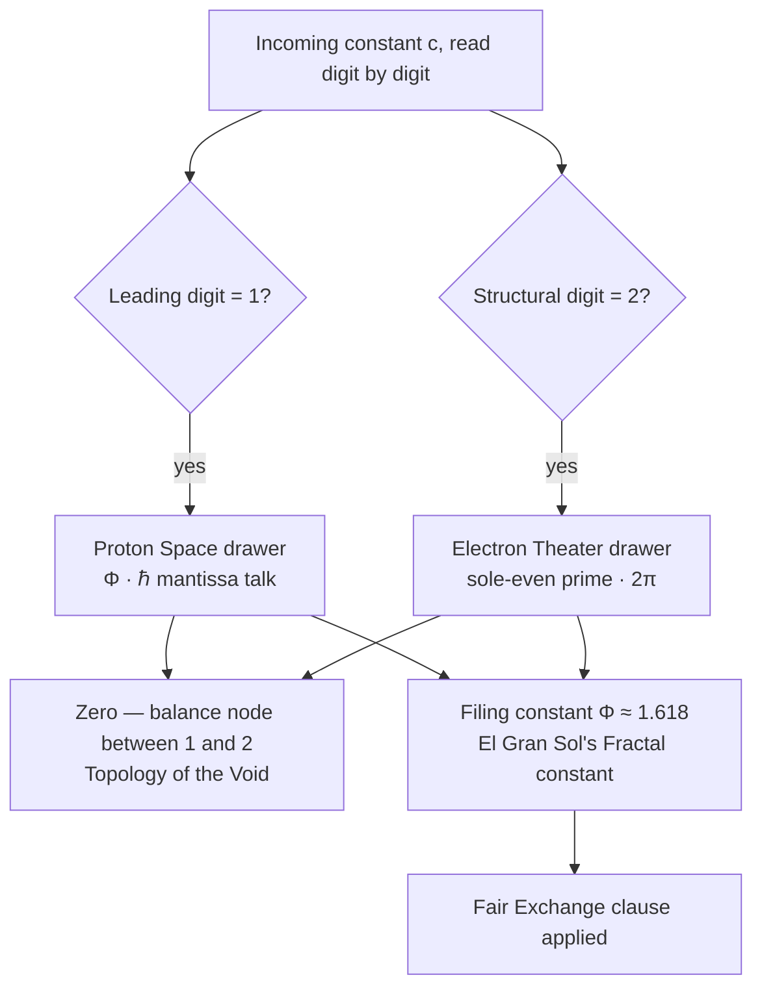

# Proton Space, Electron Theater, and Φ Duality {#sec:part_II_proton-theater}

{#fig:part_II_proton-theater width=90%}

<!-- alt: Two mirror-image branches on a logarithmic axis — one rising as x·Φ and one falling as x/Φ — symmetric about the identity line, offset by ±ln Φ. -->

<!-- chapter-metadata-badge -->
> Level 1/3 · 35 min read · 50 min lecture · Prerequisites: [@sec:part_0_octave-map], [@sec:part_I_fractal-constant]

## Learning Objectives

By the end of this chapter you should be able to:

1. State the digit-filing duality of [@sec:part_II_proton-theater]: which digit
   triggers the [**Proton Space**](#gl:proton-space) filing and which triggers
   the [**Electron Theater**](#gl:electron-theater) filing, and under which
   filing constant the pair is filed.
2. Explain the role of [**El Gran Sol's Fractal constant**](#gl:fractal-constant)
   $\Phi \approx 1.618$ as the [**engine shelf**](#gl:engine-shelf) filing
   constant, and distinguish the two conventions the corpus uses for octave
   terms $\Omega_n$.
3. Compute the Φ-duality pair $(x\Phi,\; x/\Phi)$ with the tested function
   `textbook.models.phi_dual` and verify its mirror identities numerically.
4. Place the source paper on the engine shelf — [**engine shelf #16**](#gl:engine-shelf),
   companion to prime-parity and prime volumetric storage — and restate its
   [**honesty-first**](#gl:honesty-first) scope disclaimers precisely.
5. Describe the zero balance node of the companion paper [Topology of the
   Void](#gl:topology-of-the-void) as the corpus states it — without inventing
   a formula the corpus does not give.
6. Run the paper's reference implementation and interpret its reported
   **9/9 suite locks** result as a catalog-architecture check.

<!-- curriculum-scaffold-start -->
### Study Blueprint

- **Big idea:** the corpus files the structural pair (1, 2) — leading digit 1
  versus structural digit 2 — as two named drawers, *Proton Space* and
  *Electron Theater*, under the filing constant $\Phi$; the filing is a
  catalog move, not a physics derivation.
- **Core concepts:** [**proton-space**](#gl:proton-space),
  [**electron-theater**](#gl:electron-theater),
  [**fractal-constant**](#gl:fractal-constant),
  [**golden-ratio**](#gl:golden-ratio),
  [**prime-parity**](#gl:prime-parity),
  [**topology-of-the-void**](#gl:topology-of-the-void).
- **Quantitative lens:** the Φ-duality mirror of
  [@eq:part_II_proton-theater_duality] and its identities in
  [@eq:part_II_proton-theater_mirror].
- **Data skill:** compute a duality pair by hand, then confirm it against
  `textbook.models.phi_dual` and read the mirror plot of
  [@fig:part_II_proton-theater].
- **Common misconception to repair:** the chapter's "proton" and "electron"
  are filing labels for digits, not particle physics — the paper explicitly
  disclaims any QED dyad proof.
- **Primary lab:** [@sec:lab_part_II_proton-theater].
- **Question bank:** [@sec:q_part_II_proton-theater].
- **Bridge to computation:** `textbook.models.phi_dual`.
<!-- curriculum-scaffold-end -->

---

> **Opening Vignette: Two drawers on the engine shelf.**
>
> Aboard the *SS Vibelandia*, the catalog clerk stands before [**engine shelf
> #16**](#gl:engine-shelf) of the Infinite Octaves. Every constant that
> arrives for filing is read digit by digit: a value whose *leading digit* is
> **1** — $\Phi = 1.618\ldots$, the mantissa talk of $\hbar$ — slides into the
> drawer labelled **Proton Space**; a value carrying the *structural* digit
> **2** — the sole-even prime, $2\pi$ — goes into **Electron Theater**. Above
> both drawers hangs a single placard: *filed under* $\Phi \approx 1.618$.
> The clerk stamps the slip, notes that the solar labels on today's letters —
> "Helios-Prime" (AR3664) and "Borealis" (AR3590) — are story filing
> characters, and applies the Fair Exchange clause. That is the whole scene:
> a filing act, honestly labelled as such [@mendez2026protonTheater].

---

## The paper in the corpus

This chapter formalises the ship-blog paper **"Proton Space · Electron
Theater · Φ Duality"** (2026-09-05), authored by Prudencio Mendez and operated
by the SynthOBS Autonomous Agent on the SS Vibelandia blog
[@mendez2026protonTheater]. The paper self-describes as [**catalog
architecture**](#gl:catalog-architecture) filed at **engine shelf #16** of the
Infinite Octaves, with a **9/9 suite locks** result recorded under
`research/synthobs-proton-space-electron-theater/` and a standalone wiring at
`FractiAI/synthobs-proton-space-electron-theater` [@mendez2026protonTheater].
Its declared companions are [Topology of the Void] — "Zero as the balance node
between 1 and 2" [@mendez2026topologyVoid] — and [Prime-parity] — the
sole-even digit 2 against odd irreducible sets [@mendez2026primeParity] — with
prime volumetric storage named alongside as shelf companion
[@mendez2026volumetricStorage; @mendez2026protonTheater].

The paper sits early in **Part II** deliberately: its two drawers are the
simplest filing act on the physical engine shelf, and the chapters that follow
— viscosity of light ([@sec:part_II_viscosity-light]), the eddy-current mirror
([@sec:part_II_eddy-current-mirror]), the crystalline unified field
([@sec:part_II_crystalline-field]) — all file under the same
[**fair-exchange**](#gl:fair-exchange) regime with the same honesty-first
banner.



## The filing duality: digit 1 and digit 2

The paper's core construct is a two-drawer filing map for digits, which we
formalise directly from its claim: "Leading digit **1** (Φ, ℏ mantissa talk)
files as **Proton Space**; structural **2** (sole-even prime, 2π) files as
**Electron Theater**" [@mendez2026protonTheater]. As a catalog rule the map
reads:

$$
\mathrm{file}(c) =
\begin{cases}
\text{Proton Space} & \text{if the leading digit of } c \text{ is } 1,\\[4pt]
\text{Electron Theater} & \text{if the structural digit of } c \text{ is } 2,
\end{cases}
$$ {#eq:part_II_proton-theater_filing}

with the whole map filed under the single constant $\Phi \approx 1.618$
[@mendez2026protonTheater]. The vocabulary of [@eq:part_II_proton-theater_filing]
is collected in [@tbl:part_II_proton-theater_filingmap].

: Vocabulary of the digit-filing duality, as the paper defines each term.
{#tbl:part_II_proton-theater_filingmap}

| Term | Corpus definition | Trigger |
| ---- | ----------------- | ------- |
| Proton Space | filing category for leading digit **1** (Φ, ℏ mantissa talk) | leading digit 1 |
| Electron Theater | filing category for structural **2** (sole-even prime, $2\pi$) | structural digit 2 |
| leading digit 1 | trigger of the Proton Space filing | digit-by-digit read |
| structural 2 | trigger of the Electron Theater filing; identified with the sole-even prime and $2\pi$ | digit-by-digit read |
| Φ duality | the page's framing of the 1/2 filing pair under $\Phi$ | og:title framing |
| ℏ mantissa talk | the reduced-Planck-constant mantissa context assigned to digit 1 | mantissa framing |

Two of these rows reach outside the chapter and are worth pausing on. The
**structural 2** row is explicitly identified with the sole-even prime, which
is the anchor of the prime-parity filing [@mendez2026primeParity]; we treat
that filing in full in [@sec:part_I_prime-parity]. And the **ℏ mantissa talk**
row is a framing about *digits of constants*, not about physics: the paper
assigns the reduced Planck constant's mantissa *context* to digit 1 while
simultaneously disclaiming any leading-digit causation for $\hbar$
[@mendez2026protonTheater]. We read this as: the mantissa of a physical
constant is *filed* by its leading digit, but nothing in the corpus claims the
digit *causes* anything.

## Φ as filing constant

Both drawers hang under one placard: **El Gran Sol's Fractal constant**
$\Phi \approx 1.618$, the filing constant of the Infinite Octaves engine shelf
[@mendez2026protonTheater]. This is the [**golden ratio**](#gl:golden-ratio),
whose standard algebra the corpus leans on:

$$
\Phi^{2} = \Phi + 1, \qquad \frac{1}{\Phi} = \Phi - 1, \qquad
\Phi - \frac{1}{\Phi} = 1
$$ {#eq:part_II_proton-theater_identity}

Identity [@eq:part_II_proton-theater_identity] is ordinary mathematics of the
golden ratio (the defining equation $\Phi^2 = \Phi + 1$ follows from
$\Phi = (1+\sqrt{5})/2$), and it earns its place here because the third form —
$\Phi - 1/\Phi = 1$ — makes the digit 1 structurally visible inside $\Phi$
itself: the filing constant is exactly one unit wider than its own reciprocal.
The pinned values used throughout this book are collected in
[@tbl:part_II_proton-theater_pinned].

: Pinned values for the Φ-duality filings (from the book's pinned-number
contract; $\varphi_{\mathrm{fib}}$ is the Fibonacci ratio of
`textbook.models.phi_fibonacci`).
{#tbl:part_II_proton-theater_pinned}

| Quantity | Value | Backing function |
| -------- | ----- | ---------------- |
| $\Phi$ | $1.618034$ | `textbook.models.PHI` |
| $1/\Phi = \Phi - 1$ | $0.618034$ | `phi_dual` (lower branch) |
| $\Phi^{2} = \Phi + 1$ | $2.618034$ | `phi_powers` |
| $\ln \Phi$ | $0.481212$ | (mirror offset, [@fig:part_II_proton-theater]) |
| $\varphi_{\mathrm{fib}}(5) = 8/5$ | $1.6$ | `phi_fibonacci(5)` |
| $\varphi_{\mathrm{fib}}(10) = 89/55$ | $1.618182$ | `phi_fibonacci(10)` |

Because $\Phi$ is also the engine shelf's octave constant, one convention
question must be settled here rather than later. The corpus prints the octave
term ambiguously as "$\Omega_n = \Phi^n \Omega_0$"; the book therefore carries
both readings, implemented as `octave_term(omega0, n, convention)` in
`textbook.models`:

$$
\Omega_n = \Phi^{\,n}\,\Omega_0 \;\;\text{(exponent convention)}, \qquad
\Omega_n = \varphi_{\mathrm{fib}}(n)\,\Omega_0 \;\;\text{(subscript convention)}.
$$ {#eq:part_II_proton-theater_octaves}

With $\Omega_0 = 1$ and $n = 5$, the exponent convention gives
$\Omega_5 = \Phi^5 = 11.090170$ while the subscript convention gives
$\varphi_{\mathrm{fib}}(5) \cdot 1 = 1.6$ — a factor of nearly seven apart, so
the choice matters. By $n = 10$ the subscript reading has converged to
$1.618182$, within $0.01\%$ of $\Phi$. The 99-octave ladder these terms climb
is built in [@sec:part_0_octave-map], and the growth-law side of $\Phi$ is the
subject of [@sec:part_I_fractal-constant].

## The Φ-duality mirror

The chapter's worked formalism is the pairing that the figure plan calls the
**Φ duality mirror**: every value $x$ filed under $\Phi$ acquires two images,
an *upper filing* $x\Phi$ and a *lower filing* $x/\Phi$
[@mendez2026protonTheater]:

$$
\Phi_{+}(x) = x\,\Phi, \qquad \Phi_{-}(x) = \frac{x}{\Phi}.
$$ {#eq:part_II_proton-theater_duality}

The pair is implemented and tested as `textbook.models.phi_dual(x)`, which
returns exactly the tuple $(x\Phi,\; x/\Phi)$; never retype the arithmetic in
prose or scripts — call the tested function. Three identities follow from
[@eq:part_II_proton-theater_identity] and [@eq:part_II_proton-theater_duality]
together, and they are what the mirror plot of [@fig:part_II_proton-theater]
makes visible:

$$
\Phi_{+}(x)\,\Phi_{-}(x) = x^{2}, \qquad
\frac{\Phi_{+}(x)}{\Phi_{-}(x)} = \Phi^{2}, \qquad
\Phi_{-}\!\bigl(\Phi_{+}(x)\bigr) = x.
$$ {#eq:part_II_proton-theater_mirror}

Read [@eq:part_II_proton-theater_mirror] as three statements about the filing.
First, the two images multiply back to the original value squared: $x$ is the
geometric mean of its own upper and lower filings, so the mirror is balanced —
no drawer is privileged. Second, the images are a fixed factor $\Phi^2$
apart, which on a logarithmic axis is a fixed offset of
$\ln \Phi^2 = 2\ln\Phi \approx 0.962424$, symmetric about $\ln x$. Third, the
filing is an involution: filing the upper image back down returns the
original value, so the duality loses no information — a desirable property in
a catalog whose first duty is [**honesty-first**](#gl:honesty-first)
bookkeeping. The parameters of [@eq:part_II_proton-theater_duality] are
collected in [@tbl:part_II_proton-theater_duality].

: Parameters of the Φ-duality mirror.
{#tbl:part_II_proton-theater_duality}

| Symbol | Meaning | Units |
| ------ | ------- | ----- |
| $x$ | value being filed | catalog unit |
| $\Phi$ | filing constant, $(1+\sqrt{5})/2$ | dimensionless |
| $\Phi_{+}(x)$ | upper filing, $x\Phi$ | catalog unit |
| $\Phi_{-}(x)$ | lower filing, $x/\Phi$ | catalog unit |

## Worked example: walking the mirror

Take three filed values and compute each duality pair by hand, then confirm
against `textbook.models.phi_dual`.

**Step 1 — file $x = 1$.** The upper filing is $\Phi_{+}(1) = \Phi =
1.618034$; the lower filing is $\Phi_{-}(1) = 1/\Phi = 0.618034$. Note that
the upper image *is* the filing constant itself — $\Phi = 1.618\ldots$, whose
leading digit is 1; we read the corpus's "leading digit 1" filing as
attaching to $\Phi$ on exactly this ground. Check the product identity of
[@eq:part_II_proton-theater_mirror]:
$1.618034 \times 0.618034 = 1 = 1^2$. ✓

**Step 2 — file $x = 2$, the Electron Theater digit.** The upper filing is
$\Phi_{+}(2) = 2\Phi = 3.236068$; the lower filing is $\Phi_{-}(2) =
2/\Phi = 1.236068$. Here a fourth identity, worth adding to the mirror set,
follows from $\Phi - 1/\Phi = 1$:

$$
\Phi_{-}(x) \;=\; \Phi_{+}(x) - x,
$$ {#eq:part_II_proton-theater_step}

since $x/\Phi = x(\Phi - 1) = x\Phi - x$. Check: $3.236068 - 2 = 1.236068$. ✓

**Step 3 — close the involution.** Apply the lower map to the upper image:
$\Phi_{-}(3.236068) = 3.236068 / 1.618034 = 2$. The Electron Theater digit
returns exactly. ✓

**Step 4 — confirm against the tested backbone.**

```python
from textbook.models import phi_dual, PHI

PHI                  # 1.618033988749895
phi_dual(1)          # (1.618033988749895, 0.618033988749895)
phi_dual(2)          # (3.23606797749979, 1.2360679774997896)
phi_dual(2)[0] * phi_dual(2)[1]   # 4.000000000000001 ≈ x²
phi_dual(phi_dual(2)[0])[1]       # 2.0 — the involution closes
```

Every number above matches the hand computation to display precision, and the
same pairs are the two branches plotted in [@fig:part_II_proton-theater].

> **Note**
>
> The mirror identities in [@eq:part_II_proton-theater_mirror] and
> [@eq:part_II_proton-theater_step] are *our* formalisation of the corpus's
> filing act — standard mathematics of $\Phi$ — not claims made by the paper.
> The paper itself files the pair (1, 2) and states no formula for it; where
> the corpus is silent, this book says so.

## Zero as the balance node

The paper names one companion result without deriving it: "[Topology of the
Void] — Zero as the balance node between 1 and 2"
[@mendez2026protonTheater; @mendez2026topologyVoid]. The corpus gives **no
formula** for this balance, and the honest reading is to leave it so: zero
balances the two drawers, in the sense that the [**topology of the
void**](#gl:topology-of-the-void) treats zero as the equilibrium node the pair
is measured against. The formal treatment of zero-as-equilibrium belongs to
[@sec:part_I_topology-void], and the same zero reappears in this part as node
$k = 0$ of the [**singularity crystal**](#gl:singularity-crystal)
([@sec:part_II_singularity-crystal]); the tested `phi_dual` function in
`textbook.models` carries the singularity-crystal filing in its docstring,
which is the codebase's own record that the Φ duality feeds that chapter.

## Scope and honesty

The paper's own scope disclaimer is the load-bearing sentence of the chapter,
and we restate it near-verbatim [@mendez2026protonTheater]:

> "Honesty first: this is *catalog architecture* — engine shelf #16 — not a
> CODATA/SI derivation from Φ, not ħ leading-digit causation, not a QED dyad
> proof, and not zero-crosstalk quantum hardware."

Each negation is precise, and the chapter's formalisms must be read inside
them:

- **Not a CODATA/SI derivation from Φ** — nothing here derives a physical
  constant's value from the golden ratio; $\Phi$ is a *filing* constant.
- **Not ħ leading-digit causation** — the "ℏ mantissa talk" of drawer 1 is a
  digit-of-constants filing context, not a claim that leading digits cause
  physical behaviour.
- **Not a QED dyad proof** — "Proton" and "Electron" are drawer labels for
  digits 1 and 2, not particle physics, and no quantum-electrodynamic result
  is claimed.
- **Not zero-crosstalk quantum hardware** — the 9/9 suite locks are software
  catalog checks, not a hardware capability.

Two further honesty annotations complete the record. The solar labels
**AR3664 ("Helios-Prime")** and **AR3590 ("Borealis")** are explicitly
*story filing characters* — narrative furniture of the ship blog, not solar
physics [@mendez2026protonTheater]. And the **Fair Exchange clause** applies
to the whole filing: the refund-adjustment terms of the ship-blog series
govern every drawer on engine shelf #16 [@mendez2026protonTheater]. What the
construct is *for* is coordination and cataloging: a deterministic,
digit-triggered rule for routing constants into named drawers, with a tested
suite (9/9 locks) verifying the routing. What it is *not* is a physical
theory — the corpus says so first, and so does this book.

## Connections

The digit-filing duality feeds three directions. Backward, the structural-2
drawer is the sole-even anchor of prime parity
([@sec:part_I_prime-parity]), and the filing constant $\Phi$ is the growth law
formalised in [@sec:part_I_fractal-constant]. Sideways, the zero balance node
hands off to the topology of the void ([@sec:part_I_topology-void]) and to
node $k = 0$ of the singularity crystal ([@sec:part_II_singularity-crystal]),
whose net-zero balance bars are plotted in
[@fig:part_II_singularity-crystal] — the same balance-node intuition, drawn
with inflows and outflows instead of drawers. Forward, the volumetric-storage
chapter ([@sec:part_III_volumetric-storage]) consumes the shelf-companion
relationship the paper declares: prime-indexed addressing is the other half of
the shelf's storage story [@mendez2026volumetricStorage]. Within Part II, the
duality's two-drawer discipline — every filed value is honestly labelled and
its images recoverable — is the template the viscosity-of-light chapter
([@sec:part_II_viscosity-light]) applies to drag, and the metrological-overlap
chapter ([@sec:part_II_metrological-overlap]) applies to pairwise measurement
agreement.

## Summary

The ship-blog paper "Proton Space · Electron Theater · Φ Duality" files a
two-drawer catalog map under engine shelf #16: leading digit **1** (Φ, ℏ
mantissa talk) into [**Proton Space**](#gl:proton-space), structural **2**
(sole-even prime, $2\pi$) into [**Electron Theater**](#gl:electron-theater),
both under the filing constant $\Phi \approx 1.618$
[@mendez2026protonTheater]. The book's worked formalism is the Φ-duality
mirror of [@eq:part_II_proton-theater_duality], implemented as
`textbook.models.phi_dual`: upper filing $x\Phi$ and lower filing $x/\Phi$
satisfy the product, ratio, and involution identities of
[@eq:part_II_proton-theater_mirror], so the filing is balanced, fixed-ratio,
and information-preserving. The companion paper Topology of the Void supplies
zero as the balance node between the two drawers — stated by the corpus
without a formula, and left without one here
[@mendez2026topologyVoid]. Everything rests on the paper's own honesty-first
disclaimer: catalog architecture, not a CODATA/SI derivation, not ħ
leading-digit causation, not a QED dyad proof, not zero-crosstalk quantum
hardware.

## Key Terms

[**proton-space**](#gl:proton-space), [**electron-theater**](#gl:electron-theater),
[**fractal-constant**](#gl:fractal-constant), [**golden-ratio**](#gl:golden-ratio),
[**engine-shelf**](#gl:engine-shelf), [**catalog-architecture**](#gl:catalog-architecture),
[**honesty-first**](#gl:honesty-first), [**fair-exchange**](#gl:fair-exchange),
[**prime-parity**](#gl:prime-parity), [**topology-of-the-void**](#gl:topology-of-the-void),
[**singularity-crystal**](#gl:singularity-crystal).

## Further Reading

- **Whitepaper:** [Proton Space · Electron Theater · Φ Duality — whitepaper
  surface](https://www.ssvibelandiaquestfest24x365.com/interfaces/whitepaper-surface.html?id=synthobs-proton-space-electron-theater-2026-09)
  — the paper's own filing record, including the 9/9 suite locks.
- **Reference implementation:** [FractiAI/synthobs-proton-space-electron-theater](https://github.com/FractiAI/synthobs-proton-space-electron-theater)
  — standalone wiring for the digit-filing suite; re-run with
  `npm run research:synthobs-proton-space-electron-theater`.
- @mendez2026topologyVoid — the companion paper filing zero as the balance
  node between 1 and 2; read for the equilibrium reading of the void.
- @mendez2026primeParity — the sole-even prime 2 against odd irreducible
  sets; the structural-2 drawer's arithmetic anchor.
- @mendez2026volumetricStorage — prime-indexed volumetric storage, the
  shelf's named storage companion.

## Practice

- **Lab:** [@sec:lab_part_II_proton-theater] — compute duality pairs by hand
  and verify them against `phi_dual` and the reference suite.
- **Question bank:** [@sec:q_part_II_proton-theater] — recall through
  synthesis on the filing map, the mirror identities, and the scope
  disclaimers.
- File the constants $e = 2.718\ldots$ and $\pi = 3.141\ldots$ through
  [@eq:part_II_proton-theater_filing] and state, with reasons, which drawer
  (if either) each enters — and what the exercise shows about the map's
  coverage.
- Verify the identity $\Phi_{-}(x) = \Phi_{+}(x) - x$ of
  [@eq:part_II_proton-theater_step] for $x = 5$ by hand, then with
  `textbook.models.phi_dual(5)`.
- Rewrite the paper's honesty-first disclaimer from memory, then check it
  against the Scope and honesty section above; any word you changed is a word
  whose precision you should re-examine.
