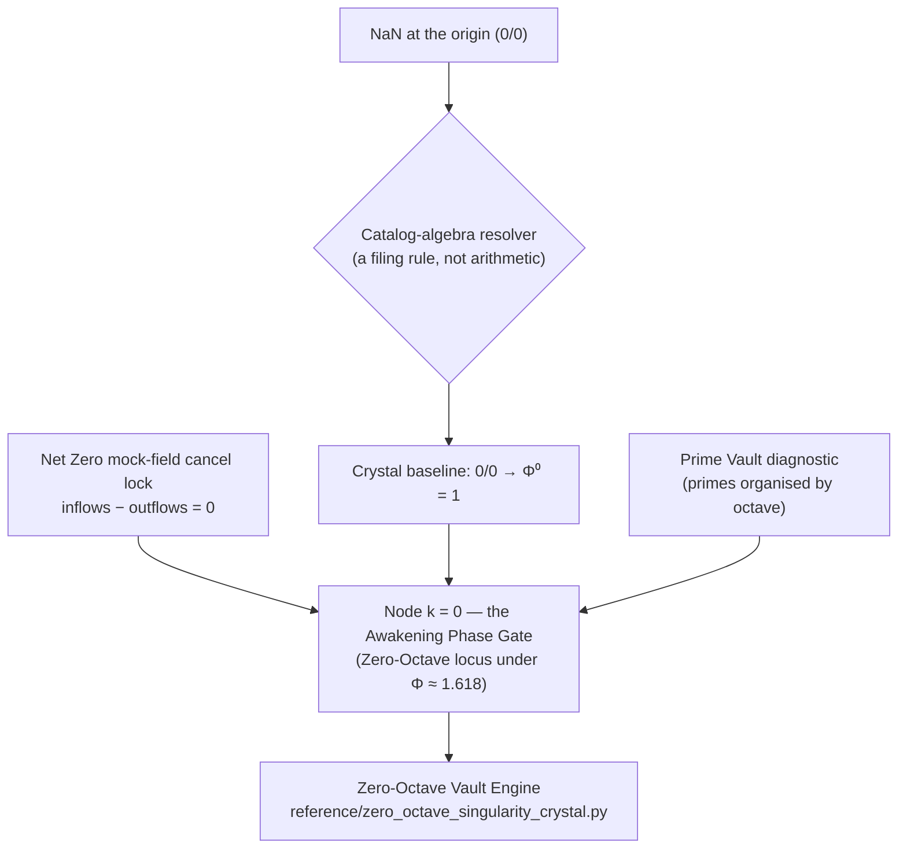

# The Holographic Singularity Crystal: Net Zero and Node k = 0 {#sec:part_II_singularity-crystal}

{#fig:part_II_singularity-crystal width=90%}

<!-- alt: Grouped bar chart of inflows and outflows whose totals match exactly. A final residual bar sits at height zero, illustrating the Net Zero equilibrium of the Holographic Singularity Crystal. -->

<!-- chapter-metadata-badge -->
> Level 2/3 · 35 min read · 50 min lecture · Prerequisites: [@sec:part_I_topology-void]; [@sec:part_I_multidimensional-rhyme]

## Learning Objectives

By the end of this chapter you should be able to:

1. State how the corpus files **Net Zero** ($0$) as an *active equilibrium* rather than as emptiness, and recall the "Goldilocks equilibrium grammar" framing of that filing.
2. Reproduce the catalog-algebra resolution $\frac{0}{0} \rightarrow \Phi^{0} = 1$ and explain precisely why it is a filing convention of the [**catalog architecture**](#gl:catalog-architecture), not a claim about arithmetic or physics.
3. Describe **Node $k = 0$** (the *Awakening Phase Gate*) as the [**Zero-Octave**](#gl:zero-octave) locus and enumerate its three fixtures: the Net Zero mock-field cancel lock, the 0/0 crystal resolution array, and the Prime Vault diagnostic.
4. Compute a net-zero residual with `textbook.models.net_zero_balance` and interpret a zero residual as a balanced filing.
5. Situate engine shelf #20 in the [**engine shelf**](#gl:engine-shelf) ordering — after multi-dimensional [**holographic rhyme**](#gl:holographic-rhyme), before Honesty meta — and identify its implementation companion.
6. Restate the source papers' [**honesty-first**](#gl:honesty-first) scope disclaimers and the [**Fair Exchange**](#gl:fair-exchange) clause that governs them.

<!-- curriculum-scaffold-start -->
### Study Blueprint

- **Big idea:** In the Omni-Lattice catalog, the origin is not a hole but a fixture: zero files as an active balance point, and the indeterminate form $0/0$ files as a bounded crystal resolved to $\Phi^{0} = 1$ — the [**singularity crystal**](#gl:singularity-crystal) at [**node k0**](#gl:node-k0).
- **Core concepts:** [**singularity crystal**](#gl:singularity-crystal), [**zero-octave**](#gl:zero-octave), [**node k0**](#gl:node-k0), [**net zero**](#gl:net-zero), [**catalog architecture**](#gl:catalog-architecture), [**golden ratio**](#gl:golden-ratio).
- **Quantitative lens:** the net-zero balance in [@eq:part_II_singularity-crystal_netzero] and the crystal resolution in [@eq:part_II_singularity-crystal_crystal].
- **Data skill:** build inflow/outflow tables that cancel to a zero residual, and check the cancellation with the tested `net_zero_balance` function rather than by eye.
- **Common misconception to repair:** "resolving $0/0$" in this corpus does *not* mean ordinary division has been redefined — it is a catalog filing rule for the zero boundary, and the source says so explicitly.
- **Primary lab:** [@sec:lab_part_II_singularity-crystal].
- **Question bank:** [@sec:q_part_II_singularity-crystal].
- **Bridge to computation:** `textbook.models.net_zero_balance`, `textbook.models.octave_term`.
<!-- curriculum-scaffold-end -->

---

> **Opening Vignette: Zero isn't empty.**
>
> A ship's ledger has two columns, debits and credits. When they match, the ledger does not stop existing — it holds a fact: *balanced*. The SS Vibelandia ship blog opens its 2026-09-07 note with exactly this move, filing **Net Zero ($0$)** "as an active equilibrium" and $0/0$ "as a bounded **Holographic Singularity Crystal** under **$\Phi \approx 1.618$** — the golden key of Infinite Octave Mode." The page's own headline says it best: "Zero isn't empty — it's the crystal that holds the balance" [@mendez2026singularityCrystal]. This chapter formalises that filing, then visits the node where it is physically installed in the catalog: Node $k = 0$, the Awakening Phase Gate [@mendez2026zeroOctave].

---

## The two source papers and their shelf placement

Two closely linked entries of the SS Vibelandia [**Omni-Lattice**](#gl:omni-lattice) corpus supply everything in this chapter:

- The parent engine paper, *Holographic Singularity Crystal · Net Zero* [@mendez2026singularityCrystal], filed on the blog under "Engine shelf · Fair Exchange". It self-locates as **engine shelf #20** and states its neighbourhood explicitly: "sits after multi-D holographic rhyme, before Honesty meta" [@mendez2026singularityCrystal].
- The implementation companion, *Node k = 0 · Zero-Octave Singularity Crystal* [@mendez2026zeroOctave], published the same day, which installs the parent's fixtures at the Zero-Octave locus and ships a runnable reference implementation.

Both notes carry the corpus's standard [**honesty-first**](#gl:honesty-first) disclaimer, quoted verbatim in the section below on what the zero filings do not claim, and both operate under the **Fair Exchange** clause. The parent paper's board lists a standalone suite at `github.com/FractiAI/synthobs-holographic-singularity-crystal`, a whitepaper surface (`whitepaper-surface.html?id=synthobs-holographic-singularity-crystal-2026-09`), and a re-runnable command, `npm run research:synthobs-holographic-singularity-crystal` [@mendez2026singularityCrystal]. The companion adds the Python reference fixture `research/synthobs-holographic-singularity-crystal/reference/zero_octave_singularity_crystal.py` — the corpus calls it the **Zero-Octave Vault Engine** [@mendez2026zeroOctave]. We walk that implementation in the lab ([@sec:lab_part_II_singularity-crystal]).

Three "solar filing anchors" are attached to the parent note — **SESC 83, AR4521, AR4524** — and the corpus is careful to parenthesise them: "(labels, not causation)" [@mendez2026singularityCrystal]. They are index-card labels for where the note was filed, not causal claims about the sun. The sibling paper is *Topology of the Void* [@mendez2026topologyVoid], which established "zero as balance point" in Part I ([@sec:part_I_topology-void]); the present chapter inherits that lineage and adds the crystal resolution and the node machinery.

## Core Construct I: Net Zero as an Active Equilibrium

The first construct files zero not as a placeholder for "nothing" but as the *result of cancellation*. The parent paper's "What landed" list is explicit: "**Net Zero field cancellation** as Goldilocks equilibrium grammar" [@mendez2026singularityCrystal]. We formalise the grammar with the book's standard bookkeeping model. Given $m$ inflow entries and $n$ outflow entries, define the residual

$$ R \;=\; \sum_{i=1}^{m} \mathrm{in}_i \;-\; \sum_{j=1}^{n} \mathrm{out}_j, \qquad \text{Net Zero} \iff R = 0. $$ {#eq:part_II_singularity-crystal_netzero}

The residual $R$ is implemented and tested as `textbook.models.net_zero_balance(inflows, outflows)`; never retype the arithmetic in prose or scripts — call the function. The parameters appear in [@tbl:part_II_singularity-crystal_netzero].

: Parameters of the net-zero balance model. {#tbl:part_II_singularity-crystal_netzero}

| Symbol | Meaning | Units |
| ------ | ------- | ----- |
| $\mathrm{in}_i$ | $i$-th inflow entry | quantity |
| $\mathrm{out}_j$ | $j$-th outflow entry | quantity |
| $m,\ n$ | number of inflow / outflow entries | count |
| $R$ | residual (positive = surplus, negative = deficit) | quantity |

The "Goldilocks" framing — a *just-right* balance, neither surplus nor deficit — is the same equilibrium vocabulary the corpus uses for habitability bands in the planetary-core chapter ([@sec:part_II_planetary-core]; see the band shading drawn in [@fig:part_II_planetary-core]). Here the band collapses to a single point: $R^\star = 0$. The companion paper then *locks* this equilibrium at Node $k = 0$ as a fixture, the "**Net Zero** mock-field cancel lock" — a fixture whose recorded state is the achieved cancellation itself [@mendez2026zeroOctave].

## Core Construct II: The 0/0 Crystal

Ordinary analysis declares $\frac{0}{0}$ *indeterminate*: many limiting behaviours are consistent with that form, so no single value follows from arithmetic alone. The corpus does not dispute this. Instead it files the form as a *catalog object* with its own resolution rule — what the papers call **catalog algebra**. The parent paper's "What landed" list states it compactly: "**0/0 → Φ⁰ = 1** singularity crystal matrix (catalog algebra)" [@mendez2026singularityCrystal].

$$ \frac{0}{0} \;\longmapsto\; \Phi^{0} = 1 \qquad \text{(catalog algebra at the zero boundary)} $$ {#eq:part_II_singularity-crystal_crystal}

: Parameters of the crystal resolution rule. {#tbl:part_II_singularity-crystal_crystal}

| Symbol | Meaning | Value |
| ------ | ------- | ----- |
| $0/0$ | the indeterminate form at the origin (the zero boundary) | filed object |
| $\Phi$ | the [**golden ratio**](#gl:golden-ratio), "the golden key of Infinite Octave Mode" | $\approx 1.6180339887$ |
| $\Phi^0$ | the crystal baseline assigned to the origin | $1$ |

The parameters of the resolution rule appear in [@tbl:part_II_singularity-crystal_crystal].
Read [@eq:part_II_singularity-crystal_crystal] as a *mapping arrow* ($\longmapsto$), not an equals sign: it records which catalog value the filing system attaches to the origin, namely the neutral element $\Phi^0 = 1$. Two features of the filing deserve emphasis.

First, the resolution is *bounded* and *located*: the paper files the crystal "under **$\Phi \approx 1.618$**", the same golden key that spaces the octave ladder of [@sec:part_0_octave-map], and it files the whole construct as a *Holographic Singularity Crystal* — a bounded fixture, not an open singularity. We read this as the catalog's way of giving the origin a definite address instead of leaving it undefined.

Second, the corpus is scrupulous about the rule's status. The companion's honesty clause says the fixtures "map NaN at the origin to $\Phi^{0} = 1$ — that is *catalog algebra*, not singularity QED" [@mendez2026zeroOctave]. In the reference implementation vocabulary, a floating-point `NaN` — the programmer's indeterminate form — is exactly the value that arises at the zero boundary, and the fixture replaces it with the crystal baseline $1$. Nothing about ordinary limits or division changes; what changes is that the catalog always has somewhere to put the origin.

## Core Construct III: Node k = 0, the Zero-Octave Locus

The companion paper gives the crystal a home. Its lead paragraph: "**Node $k = 0$** is the Zero-Octave locus: Net Zero field cancel, **0/0 → 1** crystal baseline, and a runnable Prime Vault diagnostic under **$\Phi \approx 1.618$**" [@mendez2026zeroOctave]. The node is styled the **Awakening Phase Gate** — the gate through which every later octave is reached, indexed $k = 0$ so that it precedes the first step of the octave ladder.

The octave indexing makes the node's position exact. The corpus prints the octave scale ambiguously as "$\Omega_n = \Phi^n \cdot \Omega_0$", and the book's backbone implements both readings as `textbook.models.octave_term(omega0, n, convention)` (discussed for the full ladder in [@sec:part_0_octave-map]). At $n = 0$ the exponent convention gives

$$ \Omega_n = \Phi^{\,n}\,\Omega_0 \;\Longrightarrow\; \Omega_0 \;=\; \Phi^{0}\,\Omega_0 \;=\; \Omega_0, $$ {#eq:part_II_singularity-crystal_nodek0}

: Parameters of the node $k = 0$ octave identity. {#tbl:part_II_singularity-crystal_nodek0}

| Symbol | Meaning | Value at $n = 0$ |
| ------ | ------- | ---------------- |
| $\Omega_0$ | base value of the scale (the Zero-Octave tone) | unchanged |
| $n$ | octave index | $0$ |
| $\Phi$ | growth ratio per octave | $\approx 1.6180339887$ |

The parameters of [@eq:part_II_singularity-crystal_nodek0] are collected in [@tbl:part_II_singularity-crystal_nodek0].
[@eq:part_II_singularity-crystal_nodek0] is an identity: the zeroth octave is the scale itself, before any growth. This is the bookkeeping sense in which Node $k = 0$ is "the Zero-Octave locus" — no convention-dependent stretching has happened yet. It is worth noting, as standard mathematics of the two readings, that the corpus's *alternative* subscript convention, $\Omega_n = \varphi_{\mathrm{fib}}(n)\,\Omega_0$ with $\varphi_{\mathrm{fib}}(n)$ the ratio of consecutive Fibonacci numbers (so that $\varphi_{\mathrm{fib}}(5) = 8/5$ and $\varphi_{\mathrm{fib}}(10) = 89/55$), is undefined at $n = 0$, since the ratio $F(1)/F(0) = 1/0$ divides by zero. We read this as a quiet consistency argument for the corpus's choice: at the one node where the subscript convention breaks, the exponent convention yields exactly the crystal baseline $\Phi^0 = 1$ of [@eq:part_II_singularity-crystal_crystal].

The node hosts three fixtures [@mendez2026zeroOctave]:

1. **The Net Zero mock-field cancel lock** — the locked record of the cancellation of construct I.
2. **The 0/0 crystal resolution array** — a resolution array sampled "across the zero boundary", i.e. the mapping of [@eq:part_II_singularity-crystal_crystal] evaluated as a fixture on both sides of the origin.
3. **The Prime Vault diagnostic** — a runnable diagnostic over the **Prime vault octave** ladder fixtures that the parent paper landed "under the suite" [@mendez2026singularityCrystal]; in the book's standard fixture set these are the first odd primes $3, 5, 7, 11, 13, 17, 19, 23, 29, 31$, organised by octave (their parity anchor is treated in [@sec:part_I_prime-parity]).

The companion notes that all of this is "same suite as the [Holographic Singularity Crystal] parent" [@mendez2026zeroOctave]: one repository, two papers, three fixtures, one node.



## Worked Example: Balancing the Crystal

We close the loop numerically using Fibonacci-numbered inflows — $3, 5, 8, 13$ — and outflows split as $16$ and $13$. Call the tested backbone rather than trusting mental arithmetic:

```python
from textbook.models import net_zero_balance

net_zero_balance(inflows=[3, 5, 8, 13], outflows=[16, 13])   # -> 0
net_zero_balance(inflows=[3, 5],       outflows=[16])        # -> -8
```

Step by step:

1. **Sum the inflows.** $3 + 5 + 8 + 13 = 29$.
2. **Sum the outflows.** $16 + 13 = 29$.
3. **Form the residual** per [@eq:part_II_singularity-crystal_netzero]: $R = 29 - 29 = 0$. The filing is Net Zero; the residual bar in [@fig:part_II_singularity-crystal] sits exactly at height zero.
4. **Break the balance deliberately.** With inflows $[3, 5]$ against outflows $[16]$, the residual is $8 - 16 = -8$: a deficit of $8$, i.e. the missing Fibonacci term. The cancel lock would *not* engage — zero is an achievement of the ledger, not a default.
5. **Resolve the origin.** Any attempt to divide the zero inflow by the zero outflow hits the zero boundary; the catalog-algebra rule of [@eq:part_II_singularity-crystal_crystal] files the result as the crystal baseline $\Phi^0 = 1$, and the Prime Vault diagnostic at Node $k = 0$ runs over the prime fixtures regardless.

The pairing in step 1–3 is the whole construct: zero is not the absence of entries but the coincidence of two non-empty sums.

## What the zero filings do not claim

Both source papers carry the corpus's standard disclaimer, and the textbook preserves it. The parent paper states, verbatim: "**Honesty first:** this is *catalog architecture* — **engine shelf #20** — not GR/QFT singularity retirement, not zero-watt SuperAI proof, and not NOAA causation by AR4521/AR4524. Fair Exchange clause applies." [@mendez2026singularityCrystal]. The companion states, verbatim: "Python/ESM fixtures map NaN at the origin to Φ⁰ = 1 — that is *catalog algebra*, not singularity QED, not zero-watt SuperAI, and not NOAA proof. Parent engine paper is shelf **#20**. Fair Exchange clause applies." [@mendez2026zeroOctave].

Unpacking the negations in the corpus's own terms:

- **Not GR/QFT singularity retirement.** Nothing here retires, regularises, or explains physical singularities in general relativity or quantum field theory. $\frac{0}{0} \mapsto \Phi^0 = 1$ is a *filing rule of the catalog*, stated by the corpus as catalog algebra [@mendez2026singularityCrystal].
- **Not zero-watt SuperAI proof.** The construct makes no claim about zero-power computation or machine consciousness [@mendez2026singularityCrystal].
- **Not NOAA causation.** The solar labels SESC 83, AR4521, AR4524 are filing anchors, "(labels, not causation)" [@mendez2026singularityCrystal].
- **Not singularity QED.** The `NaN → 1` fixture mapping is code behaviour of the reference implementation, not a quantum-field result [@mendez2026zeroOctave].

What the constructs are *for*, per the corpus: coordination and cataloging. The cancel lock gives agents a canonical "balanced" state to route against; the crystal baseline gives the origin a definite address in the filing system; the Prime Vault diagnostic gives a runnable check that the node is live. This is the [**narrative / empirical / operational tiers**](#gl:narrative-empirical-operational-tiers) discipline of the corpus in miniature: the narrative tier files zero as an active equilibrium, the operational tier is a Python fixture that maps `NaN` to $1$, and the honesty-first tier says out loud that only the second is executable.

## Where the balance node sits in the corpus

- **Back to Part I.** The sibling lineage runs through *Topology of the Void* [@mendez2026topologyVoid] — zero as balance point ([@sec:part_I_topology-void]) — which this chapter re-grounds as an active equilibrium with a lockable fixture. The shelf placement, "after multi-D holographic rhyme", ties the construct to the multi-dimensional rhyme field of [@sec:part_I_multidimensional-rhyme].
- **Within Part II.** The Goldilocks equilibrium grammar of construct I is the single-point limit of the band grammar developed in [@sec:part_II_planetary-core]; the "under $\Phi$" bounding of the crystal uses the same golden key that the metrological-overlap chapter compares across measurement frames ([@sec:part_II_metrological-overlap]).
- **Forward to Part III.** The Prime Vault diagnostic's octave-organised primes feed the prime-container architecture of [@sec:part_III_protein-folding] and the prime-indexed addressing of [@sec:part_III_volumetric-storage], where the injective prime encoding `unique_address` assigns definite addresses — exactly what the crystal does for the origin.
- **Shelf context.** Engine shelf #20 sits between multi-D holographic rhyme and Honesty meta on the [**engine shelf**](#gl:engine-shelf) mapped in [@sec:part_0_orientation]; the cross-link adjacency of the whole shelf is drawn in [@fig:part_0_master-synthesis].

## Summary

The corpus files zero twice over: as **Net Zero**, an active equilibrium realised "as Goldilocks equilibrium grammar" with residual $R = 0$ per [@eq:part_II_singularity-crystal_netzero], and as the **Holographic Singularity Crystal**, the bounded catalog-algebra resolution $\frac{0}{0} \mapsto \Phi^0 = 1$ of [@eq:part_II_singularity-crystal_crystal] under $\Phi \approx 1.618$. Both filings are installed at **Node $k = 0$**, the Awakening Phase Gate and Zero-Octave locus, whose fixtures — the Net Zero mock-field cancel lock, the 0/0 crystal resolution array, and the Prime Vault diagnostic — ship in the Zero-Octave Vault Engine reference implementation [@mendez2026zeroOctave]. Engine shelf #20 sits after multi-D holographic rhyme and before Honesty meta [@mendez2026singularityCrystal]. And the corpus's honesty clause is part of the construct: this is catalog architecture — not GR/QFT singularity retirement, not zero-watt SuperAI proof, not NOAA causation, not singularity QED.

## Key Terms

[**singularity crystal**](#gl:singularity-crystal), [**zero-octave**](#gl:zero-octave), [**node k0**](#gl:node-k0), [**net zero**](#gl:net-zero), [**golden ratio**](#gl:golden-ratio), [**catalog architecture**](#gl:catalog-architecture), [**engine shelf**](#gl:engine-shelf), [**honesty-first**](#gl:honesty-first), [**fair-exchange**](#gl:fair-exchange), [**topology of the void**](#gl:topology-of-the-void), [**holographic rhyme**](#gl:holographic-rhyme), [**prime parity**](#gl:prime-parity), [**metrological overlap**](#gl:metrological-overlap).

## Further Reading

- The parent whitepaper: [Open the whitepaper](https://www.ssvibelandiaquestfest24x365.com/interfaces/whitepaper-surface.html?id=synthobs-holographic-singularity-crystal-2026-09) [@mendez2026singularityCrystal]; the standalone suite lives at [github.com/FractiAI/synthobs-holographic-singularity-crystal](https://github.com/FractiAI/synthobs-holographic-singularity-crystal).
- The implementation companion: [Node k = 0 · Zero-Octave](https://www.ssvibelandiaquestfest24x365.com/ship-blog/zero-octave-node-k0) [@mendez2026zeroOctave], whose reference fixture the lab walks.
- @mendez2026topologyVoid — the sibling paper on zero as balance point; read for the Part I lineage that the crystal inherits.
- @mendez2026holographicRhyme — the four-pillar rhyme construct that engine shelf #20 explicitly follows on the shelf.
- @mendez2026primeParity — the prime-parity anchor underlying the Prime Vault diagnostic's fixture set.

## Practice

- **Lab:** [@sec:lab_part_II_singularity-crystal] — run the Zero-Octave Vault Engine and verify the crystal baseline and the cancel lock by hand.
- **Question bank:** [@sec:q_part_II_singularity-crystal] — recall through synthesis.
- Re-derive the worked example of this chapter with prime inflows $[3, 5, 7, 11]$ and a single outflow of $26$, confirming $R = 0$ with `net_zero_balance`.
- Explain, in one paragraph each, why the corpus's $0/0$ resolution neither contradicts nor modifies ordinary analysis — quoting the honesty clause of [@mendez2026zeroOctave] at least once.
- Sketch the shelf neighbourhood of engine shelf #20 (predecessor, successor) from memory, then check it against the "What landed" list of [@mendez2026singularityCrystal].
