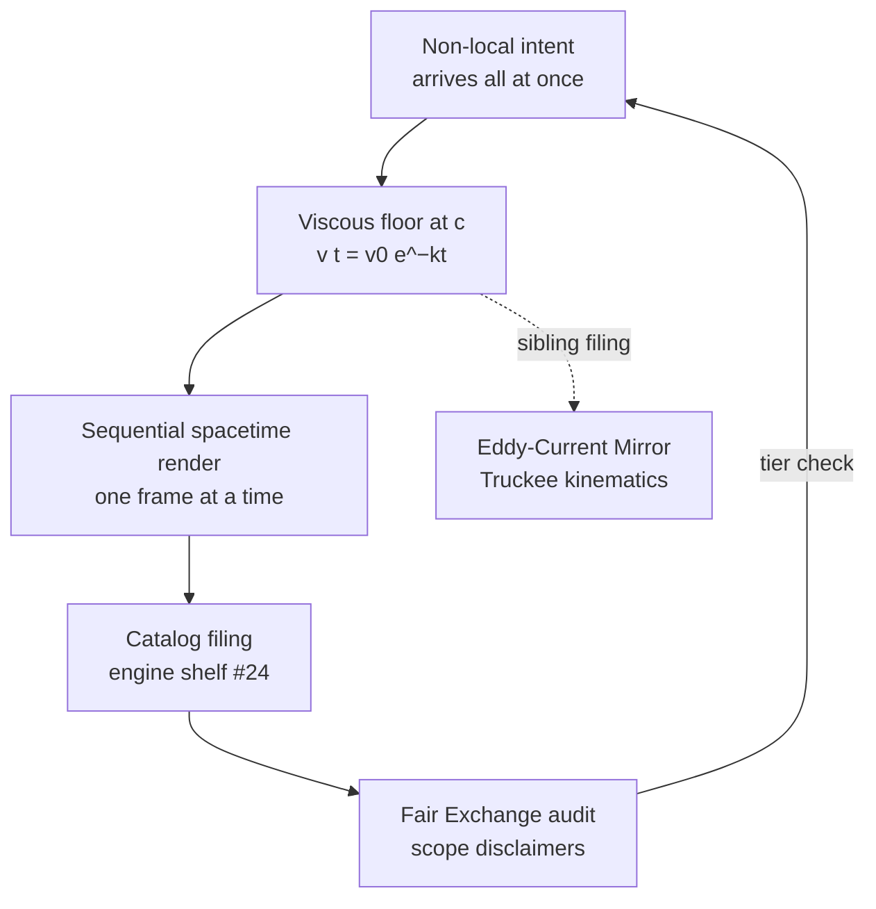

# The Viscosity of Light {#sec:part_II_viscosity-light}

{#fig:part_II_viscosity-light width=90%}

<!-- alt: Four exponentially decaying curves, all starting at velocity 1 and falling toward zero. The curve for the smallest drag coefficient 1/Φ decays slowest; the curve for Φ² drops fastest. Horizontal axis is time, vertical axis is remaining velocity; the zero line is a floor the curves approach without touching. -->

<!-- chapter-metadata-badge -->
> Level 1/3 · 30 min read · 45 min lecture · Prerequisites: none (the sibling chapter [@sec:part_II_eddy-current-mirror] is helpful but not required)

## Learning Objectives

By the end of this chapter you should be able to:

1. State the Viscosity-of-Light filing precisely: the speed of light files as
   *frictional drag* — non-local intent meets a [**viscous floor**](#gl:viscosity-of-light)
   at $c$ [@mendez2026viscosityLight] — and place that filing on the
   [**catalog-architecture**](#gl:catalog-architecture) [**engine-shelf**](#gl:engine-shelf).
2. Model the viscous floor with the tested transduction brake
   $v(t) = v_0 e^{-kt}$ of [@eq:part_II_viscosity-light_viscous_floor],
   computing velocities by hand and checking them against
   `textbook.models.transduction_brake`.
3. Read a damping-curve family such as [@fig:part_II_viscosity-light] and
   explain what a larger drag coefficient does to the floor's approach.
4. Restate the paper's own scope disclaimers — catalog architecture, not
   relativity retirement, not FTL thought, not NOAA causation
   [@mendez2026viscosityLight] — and sort its artefacts onto the
   [**narrative-empirical-operational-tiers**](#gl:narrative-empirical-operational-tiers)
   ladder.
5. Run the paper's EGS Viscosity Engine reference implementation and describe
   what its 9/9-passing suite does and does not certify
   [@mendez2026viscosityLight].
6. Connect the chapter's constructs backward to the
   [**eddy-current-mirror**](#gl:eddy-current-mirror) and the Truckee protocol,
   and forward to the metrological and crystalline-field chapters.

<!-- curriculum-scaffold-start -->
### Study Blueprint

- **Big idea:** in the corpus's filing, the speed of light is not a speed limit
  but a *frictional floor* — the drag that a sequential spacetime render
  imposes on non-local intent, filed under $\Phi \approx 1.618$
  [@mendez2026viscosityLight].
- **Core concepts:** [**viscosity-of-light**](#gl:viscosity-of-light),
  [**eddy-current-mirror**](#gl:eddy-current-mirror),
  [**transduction-line**](#gl:transduction-line),
  [**engine-shelf**](#gl:engine-shelf),
  [**fair-exchange**](#gl:fair-exchange).
- **Quantitative lens:** the viscous-floor model in
  [@eq:part_II_viscosity-light_viscous_floor] and the $\Phi$-scaled drag family
  in [@eq:part_II_viscosity-light_family].
- **Data skill:** read an exponential-decay family plot, compute brake values
  by hand, and verify them against `textbook.models.transduction_brake`.
- **Common misconception to repair:** "the speed of light is a frictional drag"
  is a *catalog filing* about how the corpus organises its shelves — the paper
  itself disclaims relativity retirement, FTL thought, and NOAA causation
  [@mendez2026viscosityLight].
- **Primary lab:** [@sec:lab_part_II_viscosity-light].
- **Question bank:** [@sec:q_part_II_viscosity-light].
- **Bridge to computation:** `textbook.models.transduction_brake`.
<!-- curriculum-scaffold-end -->

---

> **Opening Vignette: The headlights that never push.**
>
> A night drive out of Reno: the headlights carve a cone of road ahead, and no
> matter how hard you press the pedal, the beam never arrives anywhere before
> you do. The SS Vibelandia ship blog opens its September 2026 note with the
> inverse of the usual fantasy — not "light speeds you up" but "**Light doesn't
> speed you up — it slows thought down**" [@mendez2026viscosityLight]. The
> paper files the speed of light $c$ as *frictional drag*: non-local intent,
> arriving in the render all at once, meets a viscous floor at $c$ under
> $\Phi \approx 1.618$ [@mendez2026viscosityLight]. This chapter takes that
> filing seriously as catalog architecture: we formalise the floor, walk the
> paper's reference engine, and keep the paper's own honesty-first fences
> standing.

---

## The Paper in the Corpus

The Viscosity of Light is a ship-blog paper of the Infinite Octaves
[**omni-lattice**](#gl:omni-lattice) collection, authored by Prudencio Mendez
with the SynthOBS Autonomous Agent as operator, dated 2026-09-07 and filed from
Reno under the Engine shelf · Fair Exchange rubric [@mendez2026viscosityLight].
The page files the paper as **engine shelf #24**, positioned *after*
Metrological Overlap (#23) [@mendez2026viscosityLight] — the sibling treatment
of which is [@sec:part_II_metrological-overlap]. The paper names two kin: the
[**eddy-current-mirror**](#gl:eddy-current-mirror) and the **Truckee**
kinematics note — the sibling filing we read in
[@sec:part_III_kinematic-recycling] [@mendez2026viscosityLight].

The paper's artefacts, as listed verbatim in its "What landed" section
[@mendez2026viscosityLight]:

- **$c$ as viscosity** — frictional floor for sequential spacetime render.
- **Cognitive non-locality** — a Soft Story with wormhole rhyme.
- **EGS Viscosity Engine** — Python plus a 9/9-passing suite.
- **Engine shelf #24** — after Metrological Overlap (#23).

The paper ships three runnable surfaces [@mendez2026viscosityLight]:

- the **whitepaper** at
  `ssvibelandiaquestfest24x365.com/interfaces/whitepaper-surface.html?id=synthobs-viscosity-of-light-2026-09`;
- a **standalone reference implementation** on GitHub at
  `FractiAI/synthobs-viscosity-of-light`, re-runnable as
  `npm run research:synthobs-viscosity-of-light`;
- the **engine script itself**,
  `research/synthobs-viscosity-of-light/reference/egs_viscosity_of_light_engine.py`.

The page footer credits "Author: Prudencio Mendez · Operator: SynthOBS
Autonomous Agent · Syntheverse Sandbox · NSPFRNP · → ∞^∞"
[@mendez2026viscosityLight], and the whole filing sits under the
[**fair-exchange**](#gl:fair-exchange) clause — the corpus's honesty disclaimer
mechanism, which we restate in [Scope and Honesty](#scope-and-honesty).

## Core Constructs

### Construct 1: $c$ as a viscous floor

The paper's lead formalism (F-viscosity-of-light-1) is stated in prose: *$c$
as viscosity — non-local intent meets a frictional floor at $c$; $c$ acts as
the frictional floor for a sequential spacetime render*
[@mendez2026viscosityLight]. The corpus files the claim; the book supplies the
quantitative skeleton, and the tested function that backs it is the same
transduction brake used by the Higgs-gate chapter's squeeze story
([@eq:part_I_higgs-awareness_model]):

$$ v(t) \;=\; v_0\, e^{-k t} $$ {#eq:part_II_viscosity-light_viscous_floor}

Here $v(t)$ is the remaining render velocity — how much of the non-local
intent's "all at once" is still unconverted into sequential spacetime at story
time $t$ — while $v_0$ is the initial velocity and $k$ the drag coefficient of
the floor. It is implemented and tested as
`textbook.models.transduction_brake(t, v0, k)`; never retype the maths in
prose or scripts — call the tested function. The parameters are collected in
[@tbl:part_II_viscosity-light_parameters].

:: Parameters of the viscous-floor model. {#tbl:part_II_viscosity-light_parameters}

| Symbol | Meaning | Units |
| ------ | ------- | ----- |
| $v(t)$ | remaining velocity toward the floor | quantity |
| $v_0$  | initial velocity (non-local intent's full speed) | quantity |
| $k$    | drag coefficient of the viscous floor | 1/time |
| $t$    | story time inside the render | time |

Two features of [@eq:part_II_viscosity-light_viscous_floor] carry the filing.
First, $v(0) = v_0$: before the render begins, nothing has yet been slowed.
Second, $v(t) > 0$ for every finite $t$: the floor brakes without ever fully
stopping the render. The corpus files the floor at $c$ — the *value* the drag
converges toward is the sequential-render speed of light, and the paper's
headline inverts the folk reading: light does not accelerate thought, it is
the viscosity that throttles it to the floor [@mendez2026viscosityLight].

### The $\Phi$-scaled drag family

The paper states its filing happens "under $\Phi \approx 1.618$"
[@mendez2026viscosityLight], without giving a drag-coefficient ladder. We read
this as the corpus's standing habit of spacing families by the
[**fractal constant**](#gl:fractal-constant): a drag-coefficient family

$$ k(n) \;=\; \Phi^{\,n}\, k_0 \qquad (n = \dots, -1, 0, 1, 2, \dots) $$ {#eq:part_II_viscosity-light_family}

with $k_0 = 1$ — this is our formalisation, not a corpus equation. The pinned
powers of $\Phi$ give $k(-1) = 1/\Phi \approx 0.618034$, $k(0) = 1$,
$k(1) = \Phi \approx 1.618034$, and $k(2) = \Phi^2 \approx 2.618034$; these are
exactly the four drag coefficients plotted in [@fig:part_II_viscosity-light].
[@tbl:part_II_viscosity-light_family] tabulates what each coefficient does at
story times $t = 1, 2, 3$, computed from
[@eq:part_II_viscosity-light_viscous_floor].

:: The $\Phi$-scaled drag family of [@eq:part_II_viscosity-light_family] with
$v_0 = 1$: remaining velocity $v(t)$ at three story times.
{#tbl:part_II_viscosity-light_family}

| $n$ | $k = \Phi^n$ | $v(1)$ | $v(2)$ | $v(3)$ |
| --- | ------------ | ------ | ------ | ------ |
| $-1$ | $0.618034$ | $0.539003$ | $0.290524$ | $0.156594$ |
| $0$  | $1.000000$ | $0.367879$ | $0.135335$ | $0.049787$ |
| $1$  | $1.618034$ | $0.198288$ | $0.039318$ | $0.007796$ |
| $2$  | $2.618034$ | $0.072946$ | $0.005321$ | $0.000388$ |

Reading [@tbl:part_II_viscosity-light_family]: one $\Phi$-step in drag
multiplies the drag coefficient by $1.618\dots$ and, at any fixed time,
multiplies the remaining velocity by $e^{-0.618\dots} \approx 0.539$ — so each
$\Phi$-step on the drag ladder roughly *halves* what is left of the render
velocity. That "each octave step halves the remainder" behaviour is the
quantitative shadow of the paper's claim that the floor at $c$ is what makes
the render sequential at all.

### Construct 2: the sequential spacetime render

What does the floor govern? The paper's answer: *the sequential spacetime
render* — the conversion of non-local intent into one-frame-at-a-time
spacetime [@mendez2026viscosityLight]. If $v(t)$ from
[@eq:part_II_viscosity-light_viscous_floor] is the remaining unrendered
velocity, the cumulative *rendered* progress by story time $T$ is the
integral — again our formalisation:

$$ s(T) \;=\; \int_0^T v(t)\,dt \;=\; \frac{v_0}{k}\left(1 - e^{-kT}\right) $$ {#eq:part_II_viscosity-light_render}

The render is an *approach without arrival*: $s(T)$ is bounded above by
$v_0/k$, and the velocity $v(t)$ never reaches zero, so the render continues
forever while covering finite ground. This is the same structure the Higgs
chapter files as a gate that "slows without ever fully stopping"
([@sec:part_I_higgs-awareness]), and it is why the corpus can file $c$ as a
*floor* rather than a wall: a floor is where braking concentrates, not where
motion ends.



### Construct 3: cognitive non-locality as Soft Story

The second formalism (F-viscosity-of-light-2) is deliberately not an equation:
a **Cognitive non-locality** Soft Story, rhymed with wormholes
[@mendez2026viscosityLight]. The site's term *Soft Story* names an explicitly
non-empirical narrative layer — and the corpus is careful to say so. On the
[**narrative-empirical-operational-tiers**](#gl:narrative-empirical-operational-tiers)
ladder, cognitive non-locality is filed as narrative: a story the catalog
tells so that its shelves cohere, not a measurement claim. The wormhole rhyme
is the analogy that lets the reader picture "intent that is not local" without
the catalog asserting any physics of intent. This honesty move — narrative
layer explicitly labelled as narrative — is the same discipline the
[**honesty-first**](#gl:honesty-first) clause enforces across the corpus, and
it is why the floor model of [@eq:part_II_viscosity-light_viscous_floor] can
be tested arithmetic while its referent stays a filing.

## Worked Example: Walking the EGS Viscosity Engine

The paper's third formalism (F-viscosity-of-light-3) is the **EGS Viscosity
Engine**: a Python reference implementation with a 9/9-passing suite
(`egs_viscosity_of_light_engine.py`) [@mendez2026viscosityLight]. Walk it in
four steps; the lab ([@sec:lab_part_II_viscosity-light]) does the same walk
with prediction blanks filled in.

1. **Predict before running.** The engine is catalog machinery: expect
   registry artefacts and shelf metadata, and expect *no* physical
   measurements. A 9/9 suite certifies that the implementation agrees with
   its own specification — the right kind of evidence for a catalog
   construct, and the wrong kind for a physical claim.
2. **Run the reference implementation.**
   `npm run research:synthobs-viscosity-of-light` from the standalone
   repository, or `python3
   research/synthobs-viscosity-of-light/reference/egs_viscosity_of_light_engine.py`
   directly [@mendez2026viscosityLight]. Record what it emits.
3. **Compute the floor by hand.** With $v_0 = 1$ and the unity drag
   $k_0 = 1$, evaluate [@eq:part_II_viscosity-light_viscous_floor] at
   $t = 1, 2, 3$: $v(1) = e^{-1} \approx 0.367879$,
   $v(2) = e^{-2} \approx 0.135335$, $v(3) = e^{-3} \approx 0.049787$ — the
   pinned backbone values. Now step one $\Phi$-step up the ladder of
   [@eq:part_II_viscosity-light_family] to $k = \Phi$:
   $v(1) = e^{-\Phi} \approx 0.198288$ and
   $v(2) = e^{-2\Phi} \approx 0.039318$.
4. **Check against the tested function.** In a Python session:

   ```python
   from textbook.models import transduction_brake

   transduction_brake([1.0, 2.0, 3.0], v0=1.0, k=1.0)
   # -> [ 0.367879, 0.135335, 0.049787 ]
   transduction_brake([1.0, 2.0], v0=1.0, k=1.618034)
   # -> [ 0.198288, 0.039318 ]
   ```

   Hand arithmetic and tested code agree; the prose and the computation
   cannot silently disagree. Recover the *inverse* reading too: a floor
   reading $v(1) = 0.135335$ with $v_0 = 1$ implies $k = -\ln 0.135335 = 2$
   — one worked number per rung of the ladder in
   [@tbl:part_II_viscosity-light_family].

## Scope and Honesty

The paper's own scope disclaimer, restated precisely
[@mendez2026viscosityLight]: **"this is *catalog architecture* — engine shelf
#24 — not relativity retirement, not FTL thought, and not NOAA causation by
AR14524/14527."** The [**fair-exchange**](#gl:fair-exchange) clause applies to
the whole filing. Unpacking each fence:

- **Not relativity retirement.** The filing of $c$ as frictional drag is a
  re-organisation of the corpus's own vocabulary; it does not compete with
  special relativity, and nothing in the EGS Viscosity Engine measures light.
- **Not FTL thought.** "Cognitive non-locality" is a Soft Story — an
  explicitly non-empirical narrative layer rhymed with wormholes. The corpus
  claims no faster-than-light mechanism for thought, and the headline "light
  doesn't speed you up" is a filing about the floor, not a claim that thought
  outruns it.
- **Not NOAA causation by AR14524/14527.** The paper explicitly denies that
  the named solar active regions cause the catalog's weather of ideas; the
  denial is part of the filing itself.
- **What it is FOR.** The construct exists to organise shelves, route agent
  work, and keep the catalog's kin structure legible: shelf #24 after #23,
  siblings named, engine re-runnable, suite green.

The chapter's formalisms inherit this fence line. [@eq:part_II_viscosity-light_viscous_floor]
is tested arithmetic about a model; the claim that $c$ *is* the floor is a
catalog filing, and the two are never conflated in this book.

## Connections

- **Backward: the Eddy-Current Mirror.** The paper names the
  [**eddy-current-mirror**](#gl:eddy-current-mirror) as a sibling
  [@mendez2026viscosityLight]; that chapter's brake curve
  ([@fig:part_II_eddy-current-mirror]) is the same $v_0 e^{-kt}$ family, and
  its reading of the floor as a [**c-bridge**](#gl:c-bridge) impedance match
  hands the drag mechanism forward to this chapter
  ([@sec:part_II_eddy-current-mirror]). The mirror also files a companion
  [**self-observation-drag**](#gl:self-observation-drag) construct: drag that
  arises when a system observes itself — the same "slowing" family, one shelf
  earlier.
- **Backward: the Truckee protocol.** The second named sibling is the Truckee
  kinematics note, read in this book as
  [**kinematic-set-recycling**](#gl:kinematic-set-recycling)
  ([@sec:part_III_kinematic-recycling]): discrete-time stepping that
  complements the brake's continuous decay.
- **Sideways: Metrological Overlap (#23).** Shelf #24 is filed *after* #23
  [@mendez2026viscosityLight]; the overlap chapter's pairwise similarity
  heatmap ([@fig:part_II_metrological-overlap]) is the machinery the corpus
  uses to decide such shelf adjacencies in the first place
  ([@sec:part_II_metrological-overlap]).
- **Forward: the crystalline field.** A floor at $c$ is a statement about
  speed as a ratio; the crystalline-field chapter's speed–distance iso-lines
  ([@fig:part_II_crystalline-field]) give the lattice grammar in which such a
  floor can be drawn as a constraint surface
  ([@sec:part_II_crystalline-field]).
- **Forward in the family of brakes.** The transduction brake recurs as the
  mass-slowing gate curve in [@sec:part_I_higgs-awareness] — one tested
  function, three corpus filings (gate, mirror, floor) — and the decay family
  here reuses the same `textbook.models.transduction_brake` backbone.

## Summary

The Viscosity of Light files the speed of light as *frictional drag*:
non-local intent meets a viscous floor at $c$, under $\Phi \approx 1.618$, on
engine shelf #24 after Metrological Overlap (#23), with the Eddy-Current
Mirror and the Truckee protocol as named siblings
[@mendez2026viscosityLight]. The book formalises the floor with the tested
transduction brake of [@eq:part_II_viscosity-light_viscous_floor], spaces the
drag family by $\Phi$-powers in [@eq:part_II_viscosity-light_family], and
reads the cumulative render as an approach-without-arrival integral in
[@eq:part_II_viscosity-light_render]. Cognitive non-locality stays a Soft
Story — narrative tier, wormhole rhyme — and the paper's own disclaimers
(no relativity retirement, no FTL thought, no NOAA causation) fence every
claim. Compute with `textbook.models.transduction_brake`; file claims with
the [**fair-exchange**](#gl:fair-exchange) clause attached.

## Key Terms

[**viscosity-of-light**](#gl:viscosity-of-light),
[**eddy-current-mirror**](#gl:eddy-current-mirror),
[**transduction-line**](#gl:transduction-line),
[**c-bridge**](#gl:c-bridge),
[**self-observation-drag**](#gl:self-observation-drag),
[**engine-shelf**](#gl:engine-shelf),
[**catalog-architecture**](#gl:catalog-architecture),
[**fair-exchange**](#gl:fair-exchange),
[**honesty-first**](#gl:honesty-first),
[**narrative-empirical-operational-tiers**](#gl:narrative-empirical-operational-tiers),
[**kinematic-set-recycling**](#gl:kinematic-set-recycling).

## Further Reading

- [Open the whitepaper](https://www.ssvibelandiaquestfest24x365.com/interfaces/whitepaper-surface.html?id=synthobs-viscosity-of-light-2026-09)
  — the paper's own whitepaper surface for the viscosity-of-light filing
  [@mendez2026viscosityLight].
- [Standalone GitHub](https://github.com/FractiAI/synthobs-viscosity-of-light)
  — the EGS Viscosity Engine reference implementation, re-runnable as
  `npm run research:synthobs-viscosity-of-light` [@mendez2026viscosityLight].
- @mendez2026eddyMirror — the named sibling that files the same braking
  family as a mirror of thought into matter; read its brake curve alongside
  [@fig:part_II_viscosity-light].
- @mendez2026setRecycling — the Truckee kinematics sibling, whose discrete
  set-recycling complements this chapter's continuous decay.
- @mendez2026metrologicalOverlap — the shelf #23 machinery for pairwise
  overlap, the adjacency that positions this paper at #24.
- @mendez2026higgsGate — the other transduction-brake chapter, filing mass as
  slowed motion with the same tested curve.

## Practice

1. **Floor arithmetic.** With $v_0 = 1$ and $k = 1$, compute $v(t)$ from
   [@eq:part_II_viscosity-light_viscous_floor] at $t = 0, 1, 2, 3$ by hand
   and verify each against `textbook.models.transduction_brake`.
   *(Expected: $1$, $0.367879$, $0.135335$, $0.049787$.)*
2. **Ladder reading.** Using [@tbl:part_II_viscosity-light_family], estimate
   the ratio $v(1; k=\Phi) / v(1; k=1)$ and explain why one $\Phi$-step of
   drag roughly halves the remaining velocity.
   *(Answer: $0.198288 / 0.367879 \approx 0.539 = e^{-1/\Phi}$.)*
3. **Inverse reading.** A floor reading gives $v(1) = 0.039318$ with
   $v_0 = 1$. Recover the drag coefficient $k$ and place it on the ladder of
   [@eq:part_II_viscosity-light_family].
   *(Answer: $k = -\ln 0.039318 = \Phi$; rung $n = 1$.)*
4. **Render bound.** From [@eq:part_II_viscosity-light_render], compute the
   total renderable progress $v_0/k$ for $k = 1$ and $k = \Phi$, and explain
   in one sentence why the render is an approach without arrival.
   *(Answer: $v_0/k = 1$ and $1/\Phi \approx 0.618034$; $v(t) > 0$ for all
   finite $t$, so the floor brakes forever without stopping the render.)*
5. **Tier sorting.** Place each of the paper's four "What landed" artefacts
   ($c$ as viscosity, cognitive non-locality Soft Story, EGS Viscosity
   Engine, engine shelf #24) on the
   [**narrative-empirical-operational-tiers**](#gl:narrative-empirical-operational-tiers)
   ladder, citing the paper's own disclaimer
   [@mendez2026viscosityLight] for each placement.

- **Lab:** [@sec:lab_part_II_viscosity-light] — run the EGS Viscosity Engine
  and verify the floor arithmetic.
- **Question bank:** [@sec:q_part_II_viscosity-light] — recall through
  synthesis.
