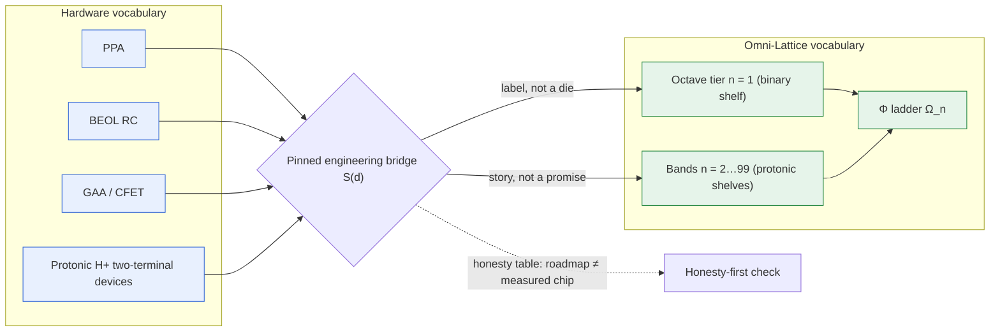

# CMOS/Protonic: The Silicon Shelf {#sec:part_III_cmos-protonic}

{#fig:part_III_cmos-protonic width=90%}

<!-- alt: Stacked bar chart of the silicon shelf: one short bar for the binary CMOS gate at tier 1 and a long stacked bar for protonic multi-state devices covering bands 2 through 99 of the 99-octave ladder. -->

<!-- chapter-metadata-badge -->
> Level 1/3 · 30 min read · 45 min lecture · Prerequisites: [@sec:part_0_octave-map]

## Learning Objectives

By the end of this chapter you should be able to:

1. Explain what the corpus calls the **engineering bridge**: a translation between
   hardware vocabulary (PPA, BEOL, GAA, CFET, protonic) and Omni-Lattice
   vocabulary (octaves, Φ) — and state precisely why it is a vocabulary bridge,
   not a shipped-hardware claim [@mendez2026cmosProtonic].
2. Apply the silicon-shelf tier map of [@eq:part_III_cmos-protonic_shelf-map]:
   a binary CMOS gate labels octave tier $n = 1$; hydrogen-regulated protonic
   multi-state devices label bands $n = 2, \ldots, 99$.
3. Compute ladder positions for the shelf with `textbook.models.octave_term`,
   under both the exponent and subscript conventions of
   [@eq:part_III_cmos-protonic_ladder].
4. Quantify the state capacity that distinguishes a two-state gate from a
   multi-state weight, using the capacity reading of
   [@eq:part_III_cmos-protonic_capacity].
5. Restate the source paper's own honesty-first scope disclaimers — roadmap
   language is not a measured chip, and a grammar sketch is not an orderable
   package — without softening them.

<!-- curriculum-scaffold-start -->
### Study Blueprint

- **Big idea:** The 99-octave [**engine-shelf**](#gl:engine-shelf) can be put on
  a silicon shelf by labelling, not by inventing new physics: the proven binary
  gate is the coarsest tier, and protonic multi-state devices sketch the wider
  bands — a filing exercise, explicitly not a tape-out.
- **Core concepts:** [**cmos-protonic**](#gl:cmos-protonic),
  [**silicon-shelf**](#gl:silicon-shelf), [**octave**](#gl:octave),
  [**honesty-first**](#gl:honesty-first).
- **Quantitative lens:** the silicon-shelf tier map in
  [@eq:part_III_cmos-protonic_shelf-map], read against the Φ ladder of
  [@eq:part_III_cmos-protonic_ladder].
- **Data skill:** translate between two vocabularies for the same artefact
  without letting the translation smuggle in unproven claims; compute tier
  positions and state capacities with `textbook.models.octave_term`.
- **Common misconception to repair:** "degenerate" in Omni-Lattice language
  means *simplest resolution*, not *worthless* — tier 1 is the proven,
  load-bearing shelf, not a failed one [@mendez2026cmosProtonic].
- **Primary lab:** [@sec:lab_part_III_cmos-protonic].
- **Question bank:** [@sec:q_part_III_cmos-protonic].
- **Bridge to computation:** `textbook.models.octave_term`, `phi_powers`,
  `catalog_size`.
<!-- curriculum-scaffold-end -->

---

> **Opening Vignette: The label card on the filing cabinet.**
>
> Two engineers stand at the same filing cabinet. One says "PPA", "BEOL", "GAA",
> "CFET"; the other says "octave tier $n=1$" and "Φ". The ship's note of
> 2026-08-12 is the label card taped between them: *same filing cabinet, silicon
> vocabulary on the labels* [@mendez2026cmosProtonic]. The pinned note exists so
> that PPA and BEOL evaluators can open any drawer of the [**Omni-Lattice**](#gl:omni-lattice)
> [**catalog architecture**](#gl:catalog-architecture) and find the drawer named
> in their own language — while the card's honesty table reminds everyone that
> a label is not a die.

---

## The Bridge Note and Its Place in the Corpus

The source paper — shelf number 1 of the SS Vibelandia ship blog, filed
2026-08-12 under the site's plain-speak [**Fair Exchange**](#gl:fair-exchange)
framing — is a *pinned engineering bridge for linear systems*
[@mendez2026cmosProtonic]. It does two things and refuses to do a third. It
translates: hardware people speak PPA, BEOL, GAA, and CFET; Omni-Lattice people
speak [**octaves**](#gl:octave) and Φ, and the note lines the two vocabularies
up against the same shelf. And it positions: protonic devices —
hydrogen-regulated two-terminal devices with continuous H$^+$ motion through
layers such as a-IGZO — are given a story for multi-state weights on the wider
bands of the ladder. What it refuses to do is claim hardware: "not a claim that
we already shipped the die" [@mendez2026cmosProtonic].

Within the corpus, the note sits downstream of the filing-cabinet formalism of
[@sec:part_0_tensor-decoupling]: the tensor operator that files digits by
octave is the cabinet, and this note stamps silicon labels on two of its
shelves [@mendez2026tensorDecoupling]. It also feeds forward into the
stack-level argument of [@sec:part_III_moving-up-stack] — if the lattice is to
be proposed as the next AI layer, someone must be able to talk about it in a
foundry's language [@mendez2026stack]. The companion whitepaper (linked in
Further Reading) carries the dual-domain table, the formal sketch, and the
suite locks; the ship-blog note is the pinned, evaluators-facing summary.

## The First Shelf: Binary as Tier One

The corpus's first labelling move is deliberately unheroic
[@mendez2026cmosProtonic]. A normal CMOS gate — on or off, $V_{dd}$ or zero —
is labelled octave tier $n = 1$: the coarsest shelf of the 99-octave ladder.
The note is careful about the word used for this tier in Omni-Lattice language:
calling the two-state gate *degenerate* means *simplest resolution*, not
*"worthless."* The gate is useful, proven, and — the note adds — crowded:
as features shrink, the binary shelf presses against interconnect heat and
memory-bus traffic. The two-state anchor of the ladder (the
[**binary-dyad-anchor**](#gl:binary-dyad-anchor) idea: everything above is
built over a two-valued floor) is here the physical device that already ships
in billions.

## The Wider Shelves: Protonic as Bands 2…99

The second labelling move gives the wider shelves a device story. Hydrogen-
regulated two-terminal devices — in which protons (H$^+$) move continuously
through layers such as a-IGZO, as described in the device literature — support
*continuous conductivity gradients* rather than only hard snaps between two
states. On this ship, those stories live on bands $n = 2 \ldots 99$
[@mendez2026cmosProtonic]: multi-state weights instead of two-state switches.
The note flags these as *physics-class devices*: real, published device
behaviour that *could* carry a multi-state weight — not a promise of ten
thousand perfect Φ-scaled cycles baked into the repository. The distinction
matters for everything downstream: the gradient is what a protonic device
*offers*, and the ladder is the catalogue the gradient gets filed into.

## A Worked Formalism: The Silicon-Shelf Tier Map

The note's two labelling moves compress into one map. Let
$\mathcal{G}_2$ denote the class of two-state CMOS gates and
$\mathcal{G}_{H^+}$ the class of hydrogen-regulated two-terminal protonic
devices. The shelf map $S$ assigns each device class its octave tier:

$$ S(d) \;=\;
\begin{cases}
1, & d \in \mathcal{G}_2 \quad \text{(binary CMOS gate: on/off, $V_{dd}$ or zero)},\\[6pt]
n \in \{2, 3, \ldots, 99\}, & d \in \mathcal{G}_{H^+} \quad \text{(protonic multi-state bands)}.
\end{cases} $$ {#eq:part_III_cmos-protonic_shelf-map}

This is the formalisation of the digest's two formalism entries
(F-cmos-protonic-99-octave-1 and -2). Its parameters are collected in
[@tbl:part_III_cmos-protonic_shelf-map].

: Parameters of the silicon-shelf tier map. {#tbl:part_III_cmos-protonic_shelf-map}

| Symbol | Meaning | Units |
| ------ | ------- | ----- |
| $d$ | a device class (CMOS gate or protonic two-terminal device) | — |
| $\mathcal{G}_2$ | two-state gate class $\{$on/off$\}$ | — |
| $\mathcal{G}_{H^+}$ | protonic device class with continuous H$^+$ motion | — |
| $S(d)$ | assigned octave tier or band | octave index $n \in \{1,\ldots,99\}$ |
| $n$ | octave tier index on the 99-octave ladder | dimensionless |

Two properties of the map are worth stating plainly. First, it is a
*labelling*, not a *transduction* claim: $S$ says where a device class sits on
the catalogue, and nothing about how efficiently it traverses the ladder.
Second, it is total over the two classes the note names and silent about
everything else — the note does not claim, for example, that optical or
superconducting devices have assigned tiers [@mendez2026cmosProtonic].

The mapping workflow, including its honesty-first gate, is summarised in the
diagram below.

> **Note**
>
> The bridge is *for* coordination and evaluation: the note is pinned "for PPA
> / BEOL evaluators" and is meant to be used on QUESTFEST — talk to hardware
> folks with their words, keep the honesty table visible, and open the
> whitepaper for the dual-domain table, formal sketch, and suite locks
> [@mendez2026cmosProtonic]. A catalogue label that lets two professions file
> the same object is doing real work even before any tape-out exists.

## The Ladder Beneath the Shelf

The tiers of [@eq:part_III_cmos-protonic_shelf-map] are indices into the
99-octave ladder formalised in [@sec:part_0_octave-map]. Because the corpus
prints the ladder rule "Ωn = Φn·Ω0" ambiguously, this book maintains both
readings, implemented as `textbook.models.octave_term(omega0, n, convention)`
[@mendez2026cmosProtonic]:

$$ \Omega_n \;=\; \Phi^{\,n}\,\Omega_0
\quad\text{(exponent convention)}, \qquad
\Omega_n \;=\; \varphi_{\mathrm{fib}}(n)\,\Omega_0
\quad\text{(subscript convention)}, $$ {#eq:part_III_cmos-protonic_ladder}

where $\Phi = (1+\sqrt{5})/2 \approx 1.6180339887$ is the
[**fractal constant**](#gl:fractal-constant) and $\varphi_{\mathrm{fib}}(n)$
denotes a Fibonacci ratio (e.g. $\varphi_{\mathrm{fib}}(5) = 8/5 = 1.6$,
$\varphi_{\mathrm{fib}}(10) = 89/55 \approx 1.618182$). The parameters of
[@eq:part_III_cmos-protonic_ladder] are in [@tbl:part_III_cmos-protonic_ladder].

: Parameters of the octave ladder beneath the silicon shelf. {#tbl:part_III_cmos-protonic_ladder}

| Symbol | Meaning | Units |
| ------ | ------- | ----- |
| $\Omega_0$ | base octave (set $\Omega_0 = 1$ for the worked values) | — |
| $n$ | octave tier index, $1 \le n \le 99$ | dimensionless |
| $\Phi$ | golden-ratio base, $(1+\sqrt{5})/2 \approx 1.6180339887$ | dimensionless |
| $\varphi_{\mathrm{fib}}(n)$ | Fibonacci-ratio base for the subscript convention | dimensionless |
| $\Omega_n$ | ladder position of tier $n$ | tier units |

With $\Omega_0 = 1$, the first six exponent-convention rungs are
$\Phi^n = 1.618034,\ 2.618034,\ 4.236068,\ 6.854102,\ 11.090170,\ 17.944272$
for $n = 1,\ldots,6$ (`textbook.models.phi_powers`). The silicon shelf of
[@eq:part_III_cmos-protonic_shelf-map] hangs off this ladder: tier $n=1$ is
the binary gate, and bands $2$–$99$ are the protonic shelves
([@fig:part_0_octave-map] draws the full ladder with Φ-spaced band
boundaries). We read the geometry this way: the wider the band a device class
can occupy, the finer the resolution of the weights it can file — but the
corpus does not claim that a protonic device *achieves* Φ-spacing in hardware;
that is exactly what "not a promise of ten thousand perfect Φ-scaled cycles"
withholds [@mendez2026cmosProtonic].

## Worked Example: Counting States on the Shelf

The practical difference between tier 1 and the protonic bands is the number
of distinguishable states a device offers. The corpus says it qualitatively:
"multi-state weights instead of only hard snaps" [@mendez2026cmosProtonic]. To
make the comparison quantitative we use a standard information-theoretic
reading (our interpretation, not a corpus formula): a device whose channel
resolves $m$ distinguishable levels carries

$$ C \;=\; \log_2 m \quad \text{[bits per device]} $$ {#eq:part_III_cmos-protonic_capacity}

with the parameters of [@tbl:part_III_cmos-protonic_capacity].

: Parameters of the state-capacity reading. {#tbl:part_III_cmos-protonic_capacity}

| Symbol | Meaning | Units |
| ------ | ------- | ----- |
| $m$ | number of distinguishable conductivity levels the channel resolves | levels |
| $C$ | state capacity per device | bits |

Walk the shelf:

1. **Binary gate, tier 1.** $m = 2$ (on/off), so
   $C = \log_2 2 = 1$ bit. The gate resolves exactly the two-state anchor; it
   is tier 1 under [@eq:part_III_cmos-protonic_shelf-map] and is *degenerate*
   only in the sense of *simplest resolution* [@mendez2026cmosProtonic].
2. **A protonic device with four resolvable levels.** If the H$^+$-regulated
   gradient is discretised at $m = 4$ distinguishable levels,
   $C = \log_2 4 = 2$ bits — twice the capacity of the binary shelf, filed on
   a band $n \ge 2$.
3. **A protonic device with sixteen resolvable levels.** $m = 16$ gives
   $C = \log_2 16 = 4$ bits per device. In a weight matrix, this is the
   "multi-state weight" dividend: more of the weight stored per device, fewer
   devices per weight.
4. **The continuity caveat.** The protonic gradient is continuous, so $m$ is
   set by how finely the surrounding circuit can *resolve* it (sense
   circuitry, noise, drift) — not by the ladder. Choosing $m$ is an
   engineering act; the ladder only supplies the filing index.

The tier picture for the first six rungs of the ladder, with pinned values, is
[@tbl:part_III_cmos-protonic_tiers].

: The first six ladder rungs beneath the silicon shelf (exponent convention, $\Omega_0 = 1$). {#tbl:part_III_cmos-protonic_tiers}

| Tier / band $n$ | Substrate class | $\Phi^n$ | States the shelf story allows |
| ---: | --- | ---: | --- |
| 1 | binary CMOS gate (two-state) | 1.618034 | $m = 2$: on/off |
| 2 | protonic band | 2.618034 | $m > 2$: graded H$^+$ motion |
| 3 | protonic band | 4.236068 | $m > 2$: graded H$^+$ motion |
| 4 | protonic band | 6.854102 | $m > 2$: graded H$^+$ motion |
| 5 | protonic band | 11.090170 | $m > 2$: graded H$^+$ motion |
| 6 | protonic band | 17.944272 | $m > 2$: graded H$^+$ motion |

Note what the table does *not* say: it does not pair tier $n$ with
$m = \lceil \Phi^n \rceil$ states, or with any other hardware-count. The note
files protonic devices on bands 2–99; it does not measure how many states any
band delivers. Keeping those two sentences apart is the whole discipline of
this chapter.

## Scope and Honesty

The source paper carries one of the corpus's
[**honesty-first**](#gl:honesty-first) scope disclaimers, and its clauses are
specific enough to quote nearly verbatim [@mendez2026cmosProtonic]:

- It is *architectural talk* for Lattice Chat and the library. "It does *not*
  disarm corporate skepticism by magic, and it is not a foundry tape-out or
  measured power-win table."
- It is "same filing cabinet, silicon vocabulary on the labels — not a claim
  that we already shipped the die."
- The companion whitepaper's sketch of how drift–diffusion and BEOL RC talk
  can sit next to the tensor operator "without throwing Maxwell out the
  window" is a **grammar sketch**: "It is not a CoWoS package you can order
  tomorrow with Omni-Lattice stamped on the lid."
- Protonic devices are "still physics-class devices — not a promise of ten
  thousand perfect Φ-scaled cycles baked into this repo."

What the construct is *for*: coordination and evaluation — giving hardware
evaluators a drawer name they recognise, keeping the honesty table visible
(roadmap language ≠ measured chip), and routing QUESTFEST conversations
through Fair Exchange framing [@mendez2026cmosProtonic]. What it is explicitly
*not*: a fabricated device, a measured power result, or a claim that the
ladder's Φ-structure has been reproduced in silicon. Readers coming from
[@sec:part_II_proton-theater] should note the division of labour: that part
supplies the corpus's proton-space stage metaphor, while this chapter supplies
only the device-class filing — the note itself defines "Φ-scaled cycles" no
further than naming them.

## Connections

The silicon shelf is the first implementation-facing chapter of Part III, and
it hands off in three directions. Upward, it rests on the 99-octave ladder of
[@sec:part_0_octave-map] and the filing formalism of
[@sec:part_0_tensor-decoupling]; the full catalogue those papers open —
99 octaves by 81 digit drawers, 8,019 register slots per
`textbook.models.catalog_size()` — is what the silicon labels attach to
[@mendez2026catalog]. Sideways, the filing habit continues in
[@sec:part_III_protein-folding] and [@sec:part_III_volumetric-storage], where
prime-container capacity and prime-indexed addressing take over the role this
chapter's tier map plays for devices (see [@fig:part_III_protein-folding] for
the capacity-growth sequence). Forward, the bridge becomes an argument in
[@sec:part_III_moving-up-stack]: a lattice that can be discussed in PPA and
BEOL vocabulary is a lattice that can be proposed as infrastructure, and in
[@sec:part_III_reality-bridge] the human-as-router frame takes over where the
device-level filing ends. The honesty discipline practiced here — label
without claiming — is the same discipline the frontier chapters of
[@sec:part_III_frontiers] apply to open problems.

## Summary

The CMOS/protonic note is a pinned **engineering bridge**: a vocabulary map,
not a hardware claim. Its tier map files the proven two-state CMOS gate at
octave tier $n = 1$ — *degenerate* meaning *simplest resolution*, not
worthless — and files hydrogen-regulated protonic two-terminal devices, with
their continuous H$^+$ conductivity gradients, on bands $n = 2 \ldots 99$ as a
story for multi-state weights ([@fig:part_III_cmos-protonic]). The ladder
those tiers index is the Φ ladder of [@eq:part_III_cmos-protonic_ladder],
computable with `textbook.models.octave_term` under either convention, and the
state-capacity reading of [@eq:part_III_cmos-protonic_capacity] makes the
two-state/multi-state contrast quantitative without pretending the corpus
measured it. Every claim in the note sits under its honesty table: grammar
sketch, not CoWoS package; roadmap language, not measured chip.

## Key Terms

[**cmos-protonic**](#gl:cmos-protonic), [**silicon-shelf**](#gl:silicon-shelf),
[**octave**](#gl:octave), [**binary-dyad-anchor**](#gl:binary-dyad-anchor),
[**honesty-first**](#gl:honesty-first), [**fair-exchange**](#gl:fair-exchange).

## Further Reading

- The companion whitepaper, *synthobs-cmos-protonic-99-octave-omni-lattice-2026-08*,
  with the dual-domain table, formal sketch, and suite locks:
  <https://www.ssvibelandiaquestfest24x365.com/interfaces/whitepaper-surface.html?id=synthobs-cmos-protonic-99-octave-omni-lattice-2026-08>
  (ship-blog page: <https://www.ssvibelandiaquestfest24x365.com/ship-blog/cmos-protonic-99-octave>).
  No reference implementation is listed for this paper in the corpus digest.
- @mendez2026tensorDecoupling — the tensor filing cabinet whose operator the
  whitepaper's drift–diffusion/BEOL RC sketch sits beside.
- @mendez2026catalog — the catalogue architecture that fixes what a "shelf"
  and an "octave" index in this corpus.
- @mendez2026ship — the SS Vibelandia program frame and the ship-blog's
  pinned-note convention.
- @mendez2026stack — where the bridge becomes the "lattice as the next AI
  layer" argument.

## Practice

- **Lab:** [@sec:lab_part_III_cmos-protonic] — compute the first ladder rungs
  under both conventions and test the capacity arithmetic by hand.
- **Question bank:** [@sec:q_part_III_cmos-protonic] — recall through
  synthesis.
- Translate three hardware terms (PPA, BEOL, CFET) into Omni-Lattice
  vocabulary using only what this chapter and [@mendez2026cmosProtonic]
  license — and mark explicitly where the translation has no licensed target.
- A colleague reads "bands $n = 2\ldots99$" as "protonic devices achieve
  Φ-spaced conductivity levels." Write the two-sentence correction, citing the
  honesty clauses of the source.
- Using `textbook.models.octave_term`, list $\Omega_n$ for $n = 1 \ldots 6$ in
  both conventions and state which convention the corpus's printed form
  "Ωn = Φn·Ω0" is ambiguous between.
