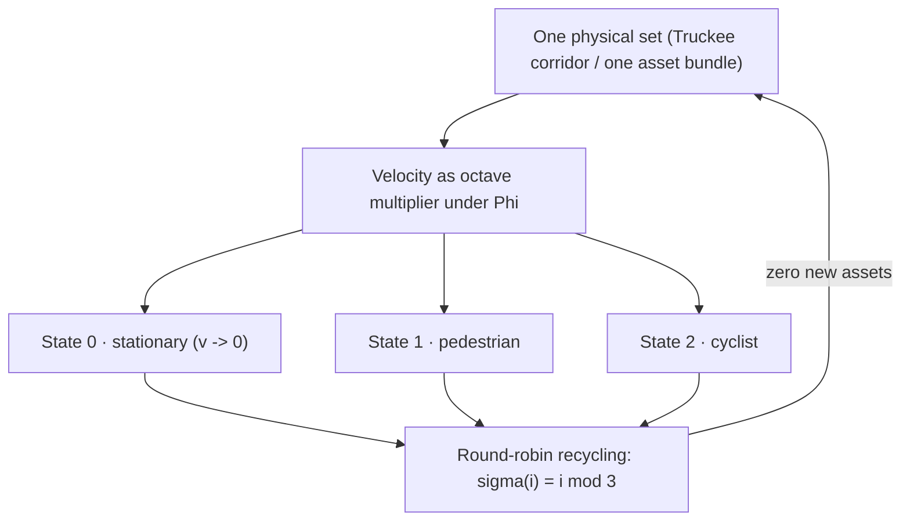

# Kinematic Set-Recycling: The Truckee Protocol {#sec:part_III_kinematic-recycling}

{#fig:part_III_kinematic-recycling width=90%}

<!-- alt: A discrete-time cycle diagram in which nine numbered items flow round-robin into three columns labelled stationary, pedestrian, and cyclist, each column receiving items 0/3/6, 1/4/7, and 2/5/8 respectively, with a return arrow labelled zero new assets. -->

<!-- chapter-metadata-badge -->
> Level 1/3 · 30 min read · 45 min lecture · Prerequisites: [@sec:part_II_singularity-crystal], [@sec:part_I_topology-void]

## Learning Objectives

By the end of this chapter you should be able to:

1. State the paper's central filing: one physical set yields multiple experiential
   realities through velocity, which the corpus files as an **octave multiplier**
   under $\Phi \approx 1.618$ [@mendez2026setRecycling].
2. Write and use the [**Fourier velocity scale**](#gl:kinematic-set-recycling)
   fixture — spectrum argument $\omega/v$ with amplitude $1/\lvert v\rvert$ — and
   evaluate it numerically for a $\Phi$-spaced family of speeds.
3. Recite the three experiential octave states (**stationary · pedestrian ·
   cyclist**) and place them on the $\Phi$-power octave ladder of
   [@eq:part_III_kinematic-recycling_octave-ladder].
4. Apply the round-robin recycling rule of [@eq:part_III_kinematic-recycling_round-robin]
   — implemented as `textbook.models.round_robin` — to partition one asset set
   into $n$ recycled sets with zero new assets.
5. Restate the paper's own scope disclaimers precisely: catalog architecture on
   engine shelf #21, *not* psychophysics lab QED, *not* infinite XR memory
   savings, and *not* NOAA causation by AR14524/AR14527.
6. Explain where the Truckee protocol sits in the engine shelf ordering and which
   companion chapters consume its constructs.

<!-- curriculum-scaffold-start -->
### Study Blueprint

- **Big idea:** One physical set, recycled through velocity states, yields many
  experiential octaves without buying a single new asset — the corpus files this
  as [**kinematic set-recycling**](#gl:kinematic-set-recycling) [@mendez2026setRecycling].
- **Core concepts:** [**kinematic-set-recycling**](#gl:kinematic-set-recycling),
  [**octave**](#gl:octave), [**catalog-architecture**](#gl:catalog-architecture),
  [**engine-shelf**](#gl:engine-shelf), [**fair-exchange**](#gl:fair-exchange).
- **Quantitative lens:** the Fourier velocity scale fixture
  ([@eq:part_III_kinematic-recycling_velocity-scale]), the octave ladder
  ([@eq:part_III_kinematic-recycling_octave-ladder]), and the round-robin
  recycling rule ([@eq:part_III_kinematic-recycling_round-robin]).
- **Data skill:** partition a finite asset set round-robin by hand and verify the
  partition against `textbook.models.round_robin`; evaluate $1/\lvert v\rvert$
  amplitudes for $\Phi$-spaced speeds.
- **Common misconception to repair:** reading "velocity becomes an octave
  multiplier" as a psychophysical law. The paper itself files it as catalog
  architecture, and the Fair Exchange clause applies.
- **Primary lab:** [@sec:lab_part_III_kinematic-recycling].
- **Question bank:** [@sec:q_part_III_kinematic-recycling].
- **Bridge to computation:** `textbook.models.round_robin`, `octave_term`,
  `descriptive_statistics`.
<!-- curriculum-scaffold-end -->

---

> **Opening Vignette: Same river. Different speed. New theater.**
>
> Along the [**Truckee River corridor**](#gl:reality-bridge) — the paper's
> opening scene — the same stretch of water and trail is one physical set, yet
> standing beside it, walking it, and riding it are three unmistakably different
> experiences. The ship blog files this plainly: walk, stand, or ride, and
> velocity becomes an octave multiplier under $\Phi \approx 1.618$ — "you don't
> need infinite worlds to feel infinite realities"
> [@mendez2026setRecycling]. The set is recycled; the theater changes; nothing
> new was built.

---

## Orientation

This chapter formalises *Kinematic Set-Recycling* (ship blog, September 2026,
engine shelf #21), the paper in which the corpus extends its [**octave**](#gl:octave)
vocabulary from static filing structures — the digit×octave register bins of
[@sec:part_0_tensor-decoupling] — to *kinematic* states of a single physical
set [@mendez2026setRecycling]. The headline filing is C-kinematic-set-recycling-1:
one physical set yields multiple experiential realities via velocity. Where
earlier shelf entries catalogued what a set *is* (its prime address, its
net-zero balance), this entry catalogues what a set *can be experienced as*
when the mover's speed changes.

The paper is deliberately modest about mechanism. It defines no new physics; it
files a vocabulary — octave multiplier, experiential octave states, Fourier
velocity scale — and a workflow claim: a [**Lattice Chat**](#gl:omni-lattice) /
XR pipeline can present multiple "theaters" from one asset set, a
**zero-new-asset** framing [@mendez2026setRecycling]. Our job as textbook
authors is to formalise those filings precisely, work them numerically with the
book's tested model functions, and preserve the paper's own honesty-first
scope disclaimers verbatim.

Three constructs carry the chapter. First, the **Fourier velocity scale**
fixture ([@eq:part_III_kinematic-recycling_velocity-scale]): the spectrum
argument is $\omega/v$ and the amplitude is $1/\lvert v\rvert$, so velocity
enters the formalism twice — once as a stretching of the spectral argument and
once as a scaling of amplitude. Second, the **octave ladder**
([@eq:part_III_kinematic-recycling_octave-ladder]): the three experiential
states are indexed by powers of $\Phi$, the corpus's
[**fractal constant**](#gl:fractal-constant). Third, the **round-robin
recycling rule** ([@eq:part_III_kinematic-recycling_round-robin]): the
deterministic, asset-free partition that lets one set serve many states.

## The Paper in the Corpus

*Kinematic Set-Recycling* sits at **engine shelf #21** — filed *after* the
[**Singularity Crystal**](#gl:singularity-crystal) paper (#20)
[@mendez2026singularityCrystal] and *before* the corpus's Honesty meta entries
[@mendez2026setRecycling]. That placement matters: the recycling protocol
consumes the Singularity Crystal's net-zero discipline (a recycled set is an
inflow that cancels the outflow of new-asset procurement, exactly the
ledger shape of `net_zero_balance` in [@sec:part_II_singularity-crystal]) and
it inherits the [**Topology of the Void**](#gl:topology-of-the-void) reading of
zero as a live state rather than an absence [@mendez2026topologyVoid] — the
stationary mover is the $v \to 0$ state *of the same set*, not a different set.

The paper's self-designation is **catalog architecture** — explicitly *not*
psychophysics lab QED, *not* infinite XR memory savings, and *not* NOAA
causation by the active regions AR14524/AR14527 mentioned on the page
[@mendez2026setRecycling]. The [**Fair Exchange clause**](#gl:fair-exchange)
— the corpus's standing honesty mechanism (see
[@sec:part_0_orientation]) — applies in full. The paper ships with a
whitepaper surface (`whitepaper-surface.html?id=synthobs-kinematic-set-recycling-truckee-2026-09`)
and a standalone reference implementation at
`github.com/FractiAI/synthobs-kinematic-set-recycling-truckee`, re-runnable as
`npm run research:synthobs-kinematic-set-recycling-truckee`
[@mendez2026setRecycling]. Within this book, the recycling rule is backed by
the tested function `textbook.models.round_robin`.

[@fig:part_III_kinematic-recycling] draws the recycling cycle as the
round-robin partition it computes: nine indexed items of one set, three
experiential sets, item $i$ in set $i \bmod 3$.

## Core Constructs

### The Fourier velocity scale

The paper's "What landed" list files a **Fourier velocity scale** fixture:
the spectrum argument is $\omega/v$ and the amplitude is $1/\lvert v\rvert$,
with $\omega$ the spectral (frequency) argument and $v$ the velocity of the
mover [@mendez2026setRecycling]. We formalise the fixture by factoring out an
unspecified base spectral profile $F$, which the corpus leaves abstract:

$$ \tilde{S}_v(\omega) \;=\; \frac{1}{\lvert v \rvert}\; F\!\left(\frac{\omega}{v}\right) $$ {#eq:part_III_kinematic-recycling_velocity-scale}

[@tbl:part_III_kinematic-recycling_velocity-scale] collects the parameters. The
fixture is structural: velocity rescales *both* the argument and the amplitude,
so any $\Phi$-ratio between two speeds moves the fixture by one $\Phi$-step in
each factor simultaneously.

: Parameters of the Fourier velocity scale. {#tbl:part_III_kinematic-recycling_velocity-scale}

| Symbol | Meaning | Units |
| ------ | ------- | ----- |
| $\omega$ | spectral (frequency) argument | 1/time |
| $v$ | velocity of the mover | length/time |
| $F(\cdot)$ | base spectral profile (corpus leaves it abstract) | arbitrary |
| $\tilde{S}_v(\omega)$ | velocity-scaled spectrum value | arbitrary |

*Worked numerically.* Take the unit-base profile $F(x) = \cos x$ (a standard,
plainly illustrative choice — the corpus does not pin $F$) and evaluate at
$\omega = 1$ for the $\Phi$-spaced speed family $v \in \{1,\ \Phi,\ \Phi^2\}$,
using the pinned values $\Phi \approx 1.618034$ and $\Phi^2 \approx 2.618034$:

- $v = 1$: argument $\omega/v = 1$, amplitude $1/\lvert v\rvert = 1$, so
  $\tilde{S}_1(1) = \cos 1 \approx 0.540302$.
- $v = \Phi$: argument $1/\Phi \approx 0.618034$, amplitude $\approx 0.618034$,
  so $\tilde{S}_\Phi(1) \approx 0.503710$.
- $v = \Phi^2$: argument $1/\Phi^2 \approx 0.381966$, amplitude
  $\approx 0.381966$, so $\tilde{S}_{\Phi^2}(1) \approx 0.354439$.

We read this as the formal content of "velocity becomes an octave multiplier":
because $1/\Phi = \Phi - 1 \approx 0.618034$ (the familiar $\Phi$-dual of
[@sec:part_II_proton-theater]), a speed step by a factor of $\Phi$ shifts
*both* the argument and the amplitude of
[@eq:part_III_kinematic-recycling_velocity-scale] by exactly one
$\Phi$-fraction. The corpus asserts the multiplier role; the fixture supplies
the rescaling bookkeeping. Note also that the fixture is defined for
$\lvert v \rvert > 0$: the corpus files stationary as one of the three states
of the same set but assigns it no numerical limit here, and we do not invent
one.

### The octave ladder of experiential states

The paper files **stationary · pedestrian · cyclist** as three experiential
octave states on one set [@mendez2026setRecycling]. The corpus's standing
octave recursion (discussed in both conventions in
[@sec:part_0_octave-map]) gives the indexing. In the *exponent* convention the
$k$-th octave above base $\Omega_0$ is

$$ \Omega_k \;=\; \Phi^{\,k}\,\Omega_0 \qquad (k = 0, 1, 2, \dots) $$ {#eq:part_III_kinematic-recycling_octave-ladder}

implemented as `octave_term(omega0, k, convention="exponent")` in
`textbook.models`; in the *subscript* convention the same slot holds
$\Omega_k = \varphi_{\mathrm{fib}}(k)\,\Omega_0$ with Fibonacci ratios
$\varphi_{\mathrm{fib}}(5) = 8/5 = 1.6$ and $\varphi_{\mathrm{fib}}(10) = 89/55 \approx 1.618182$
approaching $\Phi$. The corpus prints "Ωn = Φn·Ω0" ambiguously between the two;
this chapter uses the exponent convention for state indexing and flags the
subscript reading wherever the ratio matters.

: Parameters of the experiential octave ladder. {#tbl:part_III_kinematic-recycling_octave-ladder}

| Symbol | Meaning | Units |
| ------ | ------- | ----- |
| $\Omega_0$ | base octave of the set (stationary state) | arbitrary |
| $k$ | experiential state index: 0 stationary, 1 pedestrian, 2 cyclist | — |
| $\Phi$ | golden ratio $\approx 1.6180339887$ | — |
| $\Omega_k$ | octave of the $k$-th experiential state | arbitrary |

*Worked numerically.* With $\Omega_0 = 1$ and the exponent convention, the
three filed states sit at $\Omega_0 = 1$, $\Omega_1 = \Phi \approx 1.618034$,
and $\Omega_2 = \Phi^2 \approx 2.618034$; extending the ladder with the pinned
values, $\Omega_3 = \Phi^3 \approx 4.236068$, $\Omega_4 = \Phi^4 \approx 6.854102$,
$\Omega_5 = \Phi^5 \approx 11.090170$. Under the subscript convention the same
three slots read $1$, $1$ ($\varphi_{\mathrm{fib}}(1) = 1$), and $2$
($\varphi_{\mathrm{fib}}(3) = 2$) — a coarser ladder, which is exactly the
ambiguity the corpus leaves open and `octave_term` exposes as a switchable
convention.

### Round-robin set-recycling

The zero-new-asset workflow needs a deterministic way for one asset set to
serve several experiential states. The book formalises the recycling rule as
the round-robin assignment backing `textbook.models.round_robin`
([@fig:part_III_kinematic-recycling]):

$$ \sigma(i) \;=\; i \bmod n_{\mathrm{sets}} $$ {#eq:part_III_kinematic-recycling_round-robin}

: Parameters of the round-robin recycling rule. {#tbl:part_III_kinematic-recycling_round-robin}

| Symbol | Meaning | Units |
| ------ | ------- | ----- |
| $i$ | 0-based index of an item in the source set | — |
| $n_{\mathrm{sets}}$ | number of experiential sets (here 3: stationary, pedestrian, cyclist) | — |
| $\sigma(i)$ | index of the set that receives item $i$ | — |

Item input order is preserved within each set, and the rule raises no
allocations: it is a *recycling* of index space, not a copy of assets. This is
the structural reading of the paper's C-kinematic-set-recycling-5 claim —
**zero-new-asset** framing for Lattice Chat / XR pipelines
[@mendez2026setRecycling]. The construct composes naturally with the
prime-indexed addressing of [@sec:part_III_volumetric-storage]: a recycled set
can be re-addressed by `unique_address` without duplicating storage, and the
address lattice plotted in [@fig:part_III_volumetric-storage] is exactly the
kind of structure a recycled pipeline would traverse.

## Worked Example: One Truckee Set, Three Theaters

Consider one physical set — the Truckee corridor kit — catalogued as nine
indexed items $0, \dots, 8$ (trail markers, bench, water feature, and so on;
the identities do not matter, only the count). Recycle it into the three
experiential sets with $n_{\mathrm{sets}} = 3$ via
[@eq:part_III_kinematic-recycling_round-robin]:

$$ \sigma(i) = i \bmod 3 \quad\Longrightarrow\quad
\begin{aligned}
\text{set 0 (stationary): } & \{0, 3, 6\}\\
\text{set 1 (pedestrian): } & \{1, 4, 7\}\\
\text{set 2 (cyclist): }    & \{2, 5, 8\}
\end{aligned} $$ {#eq:part_III_kinematic-recycling_truckee-partition}

[@tbl:part_III_kinematic-recycling_partition] shows the same partition as a
table; it is exactly what `round_robin(list(range(9)), 3)` returns.

: The nine-item set recycled into three experiential sets. {#tbl:part_III_kinematic-recycling_partition}

| Set | State | Items ($\sigma(i) = i \bmod 3$) | Count |
| --- | ----- | ------------------------------- | ----- |
| 0 | stationary | 0, 3, 6 | 3 |
| 1 | pedestrian | 1, 4, 7 | 3 |
| 2 | cyclist | 2, 5, 8 | 3 |

Three checks make the example load-bearing:

1. **Balance.** Nine items over three sets is exactly balanced; with ten items,
   set 0 would take the spare (item 9, since $9 \bmod 3 = 0$) and the sets
   would read 4/3/3 — the rule is deterministic, not magically even.
2. **Zero new assets.** The ledger of assets consumed versus assets supplied
   nets to zero in the sense of `net_zero_balance` from
   [@sec:part_II_singularity-crystal]: all nine presentations are drawn from
   the original nine items, and the "new assets purchased" outflow column is
   empty. This is the structural content of the paper's headline that one set
   yields many realities [@mendez2026setRecycling].
3. **Velocity bookkeeping.** If the mover walks the same corridor at a speed
   $\Phi$ times a reference walker's speed, [@eq:part_III_kinematic-recycling_velocity-scale]
   shifts the fixture's argument *and* amplitude by $1/\Phi \approx 0.618034$
   at every $\omega$ — the $\Phi$-step of [@eq:part_III_kinematic-recycling_octave-ladder]
   realised as kinematics rather than as new scenery.

> **Note**
>
> The paper's page also references two active regions, AR14524/AR14527, in the
> context of what the protocol is *not* about: it explicitly disclaims NOAA
> causation by them [@mendez2026setRecycling]. Keep that disclaimer attached to
> any reuse of the paper's imagery — the fixture is catalog bookkeeping, not a
> solar-terrestrial mechanism.

## Scope and Honesty

The paper's honesty-first block is short enough to restate nearly verbatim, and
the contract of this book is to preserve it: *"this is catalog architecture —
engine shelf #21 — not psychophysics lab QED, not infinite XR memory savings,
and not NOAA causation by AR14524/AR14527. Fair Exchange clause applies"*
[@mendez2026setRecycling]. Unpacking each clause:

- **Not psychophysics lab QED.** The claim "velocity becomes an octave
  multiplier" is a filing about experiential *states*, filed in the
  [**narrative-empirical-operational tiers**](#gl:narrative-empirical-operational-tiers)
  as narrative/architectural vocabulary. No controlled experiment is cited, and
  none is claimed. Readers wanting the empirical tier must supply it themselves.
- **Not infinite XR memory savings.** The zero-new-asset framing is a
  *workflow* observation about Lattice Chat / XR pipelines — one set, recycled
  [@mendez2026setRecycling]. It is not a compression theorem, and
  [@eq:part_III_kinematic-recycling_round-robin] saves no memory at all: it
  moves index space, it does not shrink it.
- **Not NOAA causation by AR14524/AR14527.** Space-weather imagery on the page
  is scene-setting; the paper disclaims the causal reading explicitly.
- **What it is FOR.** Coordination and cataloging: giving agent-routing and
  content-pipeline designers a shared vocabulary ("same set, new theater") for
  reusing one asset across experiential states, consistent with the corpus's
  standing rule that the map is for coordination, not cosmic destiny.

## Connections

The Truckee protocol is a small shelf entry with wide fan-out. Downstream in
this part, [@sec:part_III_moving-up-stack] consumes the zero-new-asset framing
when it argues for the lattice as the next AI layer — a recycled set is the
cheapest possible new "layer" — and [@sec:part_III_reality-bridge] reuses the
one-set-many-theaters vocabulary for its human-as-bridge filing. Upstream, the
net-zero ledger discipline comes from the Singularity Crystal
([@sec:part_II_singularity-crystal]), and the treatment of the $v \to 0$
stationary state as a live member of the state family echoes the
[**Topology of the Void**](#gl:topology-of-the-void) reading of zero
([@sec:part_I_topology-void]) [@mendez2026topologyVoid]. The prime-addressing
composition suggested above runs through [@sec:part_III_volumetric-storage].
Within the corpus ordering, the paper is filed after the Singularity Crystal
(#20) and before the Honesty meta entries, so its disclaimers are the last
word before the shelf turns meta [@mendez2026setRecycling].

## Summary

*Kinematic Set-Recycling* files one idea in three formalisms: a single physical
set (the Truckee corridor) yields multiple experiential realities because
velocity acts as an octave multiplier under $\Phi \approx 1.618$
[@mendez2026setRecycling]. The Fourier velocity scale
([@eq:part_III_kinematic-recycling_velocity-scale]) rescales both spectrum
argument ($\omega/v$) and amplitude ($1/\lvert v\rvert$); the octave ladder
([@eq:part_III_kinematic-recycling_octave-ladder]) indexes the three filed
states — stationary, pedestrian, cyclist — at $\Phi^k$; and the round-robin
rule ([@eq:part_III_kinematic-recycling_round-robin]) recycles one asset set
into many experiential sets with zero new assets, as worked in
[@tbl:part_III_kinematic-recycling_partition]. The paper is catalog
architecture on engine shelf #21, filed after the Singularity Crystal and
before the Honesty meta; its claims are for coordination and cataloging, not
psychophysics, not XR compression, and not space-weather causation.

## Key Terms

[**kinematic set-recycling**](#gl:kinematic-set-recycling),
[**octave**](#gl:octave), [**catalog architecture**](#gl:catalog-architecture),
[**engine shelf**](#gl:engine-shelf), [**Fair Exchange**](#gl:fair-exchange),
[**honesty first**](#gl:honesty-first), [**Omni-Lattice**](#gl:omni-lattice),
[**Topology of the Void**](#gl:topology-of-the-void).

## Further Reading

- The source paper's whitepaper surface:
  <https://www.ssvibelandiaquestfest24x365.com/interfaces/whitepaper-surface.html?id=synthobs-kinematic-set-recycling-truckee-2026-09>
  [@mendez2026setRecycling]; reference implementation:
  <https://github.com/FractiAI/synthobs-kinematic-set-recycling-truckee>
  (re-run via `npm run research:synthobs-kinematic-set-recycling-truckee`).
- @mendez2026singularityCrystal — companion named by the paper: the net-zero
  ledger discipline that the zero-new-asset framing reuses.
- @mendez2026topologyVoid — companion named by the paper: zero as equilibrium,
  the reading we apply to the stationary state.
- [@sec:part_0_octave-map] — the two octave conventions used in
  [@eq:part_III_kinematic-recycling_octave-ladder], discussed at length.

## Practice

- **Lab:** [@sec:lab_part_III_kinematic-recycling] — partition the Truckee set
  by hand, check it against `textbook.models.round_robin`, and evaluate the
  velocity-scale fixture for $\Phi$-spaced speeds.
- **Question bank:** [@sec:q_part_III_kinematic-recycling] — recall through
  synthesis on the recycling protocol.
- Re-run the paper's reference implementation
  (`npm run research:synthobs-kinematic-set-recycling-truckee`) and list which
  of the five digest claims (C-kinematic-set-recycling-1 through 5) its output
  actually exercises — and which remain narrative filings.
- Take $n_{\mathrm{sets}} = 3$ and a 10-item set: which set receives the spare
  item, and why? Then re-run with 11 items and verify the pattern.
- Write one paragraph in the paper's own voice that applies the Fair Exchange
  clause to a claim *you* might be tempted to make about walking speeds. What
  does the clause forbid?
