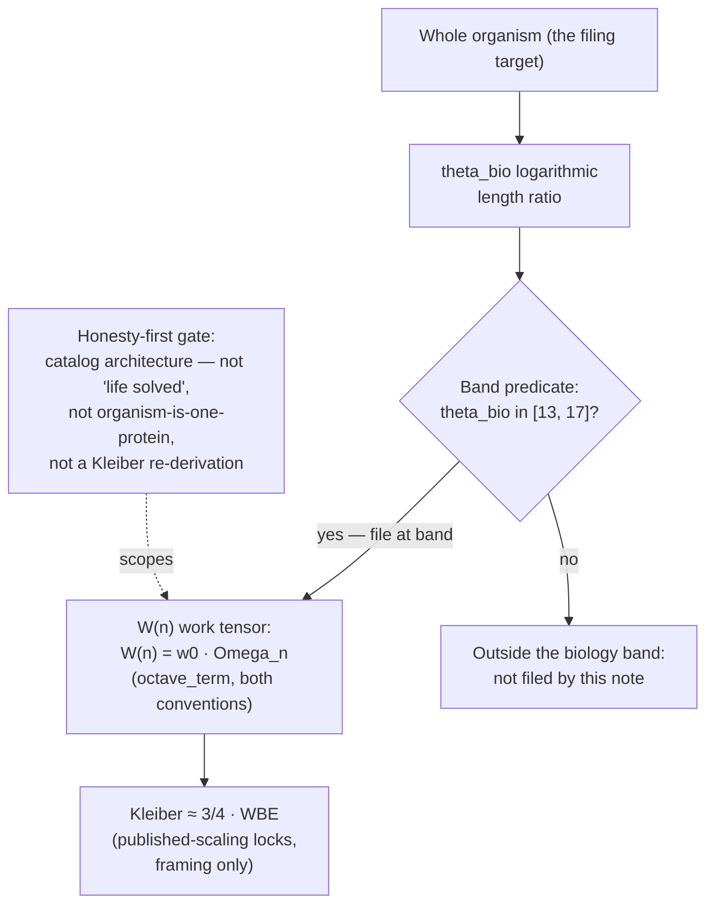

# The Macro-Protein Work Engine {#sec:part_III_macro-protein}

{#fig:part_III_macro-protein width=90%}

<!-- alt: Two curves of metabolic work output versus octave tier n from 13 to 17, one rising exponentially under the exponent convention of the octave term and one nearly flat under the Fibonacci-subscript convention, with the biological band [13, 17] marked. -->

<!-- chapter-metadata-badge -->
> Level 1/3 · 30 min read · 45 min lecture · Prerequisites: Protein Folding as Prime-Container Architecture ([@sec:part_III_protein-folding])

## Learning Objectives

By the end of this chapter you should be able to:

1. Restate the central filing of [@mendez2026macroProtein]: organisms file as
   [**macro-protein**](#gl:macro-protein) work engines under El Gran Sol's
   [**fractal-constant**](#gl:fractal-constant) $\Phi \approx 1.618$, with
   metabolic work mapped to Infinite Octave tier band
   $\theta_{\mathrm{bio}} \in [13, 17]$.
2. Define the $W(n)$ work tensor as a *filing label* — metabolic work indexed
   by a ladder position $n$ — and evaluate its octave backbone with
   `textbook.models.octave_term` under both printed conventions.
3. Locate the biological band $[13, 17]$ on the octave ladder numerically:
   under the exponent convention it spans $\Phi^{13} \approx 521.0 \cdot
   \Omega_0$ to $\Phi^{17} \approx 3571.0 \cdot \Omega_0$; under the subscript
   convention it is essentially flat at $\approx 1.618 \cdot \Omega_0$.
4. Explain the status of **Kleiber $\approx 3/4$ · WBE** in the paper: cited as
   *compatible published-scaling locks* — framing the filing against published
   allometry, not re-deriving it.
5. Restate, near-verbatim, the paper's own scope disclaimers — catalog
   architecture, not "life solved"; not an organism-is-one-protein claim; no
   laboratory re-derivation of Kleiber's law — and the story-character status
   of the solar labels.
6. Name the paper's corpus position: an **application companion**, not an
   [**engine-shelf**](#gl:engine-shelf) pin, with its 9/9 suite locks,
   reference implementation, and companion papers.

<!-- curriculum-scaffold-start -->
### Study Blueprint

- **Big idea:** The corpus files a whole living body the way it filed a single
  folding protein — as catalog architecture: one scaling up of the prime-vault
  grammar from a residue index to an organism-as-work-engine, placed on the
  octave ladder at band $\theta_{\mathrm{bio}} \in [13, 17]$.
- **Core concepts:** [**macro-protein**](#gl:macro-protein),
  [**golden-ratio**](#gl:golden-ratio),
  [**prime-container**](#gl:prime-container),
  [**catalog-architecture**](#gl:catalog-architecture),
  [**fair-exchange**](#gl:fair-exchange).
- **Quantitative lens:** the work-tensor filing in
  [@eq:part_III_macro-protein_model] and the band placement of
  [@eq:part_III_macro-protein_band].
- **Data skill:** evaluate the octave term $\Omega_n$ for $n = 13, \ldots, 17$
  under both conventions, read the output curve in
  [@fig:part_III_macro-protein], and apply a band predicate with
  `textbook.models.goldilocks_band`.
- **Common misconception to repair:** that the paper re-derives Kleiber's law,
  claims organisms are literally one protein, or claims life is "solved." It
  says the opposite, in its own second paragraph.
- **Primary lab:** [@sec:lab_part_III_macro-protein].
- **Question bank:** [@sec:q_part_III_macro-protein].
- **Bridge to computation:** `textbook.models.octave_term`, `phi_powers`,
  `goldilocks_band`.
<!-- curriculum-scaffold-end -->

---

> **Opening Vignette: The whole cabinet.**
>
> The ship blog note of 5 September 2026 opens with a question posed directly
> to its readers: "If a protein folds in a prime vault, what is a whole living
> body?" [@mendez2026macroProtein]. Picture the answer as a move in the
> filing room of [@sec:part_III_protein-folding]: the vault wall that held
> residue indices in single prime drawers is still there — but the note now
> files an *entire drawer cabinet*. A whole organism is taken down from the
> "one protein per vault" shelf and re-filed as a **macro-protein work
> engine**: metabolic work as its content, $\Phi \approx 1.618$ as the spacing
> constant of the shelf it rests on, and the ladder position stamped on its
> spine — tier band 13 to 17. Nothing in the vignette is a laboratory result;
> it is filing architecture, and the note says so before its first bullet.

---

## Orientation

<!-- This section introduces the chapter's position in the corpus. -->

The source note, "Macro-Protein Work Engine" — headlined on the ship blog as
"Life as a work engine — octave band 13–17" — was published on the SS
Vibelandia ship blog on 5 September 2026 and tagged "Macro-protein · Fair
Exchange" [@mendez2026macroProtein]. It belongs to the Infinite Octaves
[**omni-lattice**](#gl:omni-lattice) corpus as a *ship-blog note*, and its
corpus status is stated with unusual precision: an **application companion**,
*not an engine-shelf pin* — "demo / comparison of Infinite Octave biology
filing beside protein prime-container + prime-parity"
[@mendez2026macroProtein]. Where the pinned engine papers of the
[**engine-shelf**](#gl:engine-shelf) introduce new formal machinery (as the
octave-map and part I chapters do), this note *applies* machinery that already
exists: the octave ladder, the prime-container grammar of the protein paper
[@mendez2026proteinFolding], and the prime-parity partition of
[@mendez2026primeParity].

Four items are recorded as having "landed" in the note [@mendez2026macroProtein],
and the chapter carries all four forward:

1. the $W(n)$ **work tensor** and the $\theta_{\mathrm{bio}}$ **logarithmic
   length ratio** — the two formalism labels this chapter formalises;
2. **Kleiber $\approx 3/4$ · WBE** cited as *compatible published-scaling
   locks* — published metabolic scaling (Kleiber's 3/4 law; West–Brown–Enquist)
   filed as framing, explicitly not re-derived;
3. a test status: **9/9 suite locks** under
   `research/synthobs-macro-protein-work-engine/`; and
4. the application-companion status just described.

The reference implementation is runnable: `npm run
research:synthobs-macro-protein-work-engine` from the corpus repositories,
with a standalone suite at the GitHub repository
`FractiAI/synthobs-macro-protein-work-engine` and a whitepaper surface linked
from the ship blog post [@mendez2026macroProtein]. The note's "try it
yourself" board points to Lattice Chat on the Infinite Octaves nest and names
two companions directly: the protein prime-container paper — "micro vault
grammar this paper scales up" [@mendez2026macroProtein] — and the prime-parity
paper; a third board link, prime-indexed volumetric storage, shares "the same
$\Phi$ vault habit in memory media" [@mendez2026macroProtein]. We return to
all three in the Connections section.

## The Work Tensor W(n)

### The filing label and its octave backbone

The first construct of [@mendez2026macroProtein] is the $W(n)$ work tensor:
"metabolic work of an organism indexed by $n$, filed as a work tensor," with
$n$ an index into the Infinite Octave ladder. One property of this construct
must be stated exactly, because the chapter's honesty depends on it: *the page
does not print a closed form for $W$*. The digest records the label and its
index, and nothing more. What the chapter can do — and does — is give the
label a backbone from machinery the corpus already pins: the octave term
$\Omega_n$, whose two printed readings the book carries from
[@sec:part_III_protein-folding]. We read the filing as an octave-indexed work
scale: work output evaluated at ladder position $n$ as a multiple of a base
work unit $w_0$,

$$ W(n) \;=\; w_0 \cdot \Omega_n, \qquad
\Omega_n \;=\; \Phi^{\,n} \cdot \Omega_0
\;\;\text{(exponent convention)}, \qquad
\Omega_n \;=\; \varphi_{\mathrm{fib}}(n) \cdot \Omega_0
\;\;\text{(subscript convention)} \,, $$ {#eq:part_III_macro-protein_model}

implemented and tested as `textbook.models.octave_term` with $\Omega_0$ and
$n$ arguments and a `convention` switch; never retype the maths in prose or
scripts — call the tested function. The work tensor $W$ itself is the
corpus's filing label; the $\Omega_n$ backbone is the tested model; the
composition of the two is *our* reading of the filing, offered because it
makes the label computable without inventing corpus content. The parameters
appear in [@tbl:part_III_macro-protein_parameters].

:: Parameters of the work-tensor filing. {#tbl:part_III_macro-protein_parameters}

| Symbol | Meaning | Units |
| ------ | ------- | ----- |
| $W(n)$ | metabolic work of the organism, filed as a work tensor at ladder position $n$ | work (filing unit) |
| $w_0$  | base work unit that fixes the scale of the filing | work |
| $\Omega_n$ | the octave term at position $n$ (`octave_term`) | dimensionless multiple |
| $\Omega_0$ | base octave term | dimensionless |
| $n$    | index into the Infinite Octave ladder | dimensionless |
| $\varphi_{\mathrm{fib}}(n)$ | $n$-th Fibonacci ratio ($F_{n+1}/F_n$; $\varphi_{\mathrm{fib}}(5) = 8/5$, $\varphi_{\mathrm{fib}}(10) = 89/55$) | dimensionless |

The two conventions matter as much here as they did for the vault wall.
Under the exponent convention the ladder is geometric: each step multiplies
the term by $\Phi \approx 1.618$. Under the subscript convention the ladder is
Fibonacci-linear: the multiplier is a rational ratio that converges to
$\Phi$ — $\varphi_{\mathrm{fib}}(5) = 8/5 = 1.6$ and $\varphi_{\mathrm{fib}}(10) = 89/55
\approx 1.618182$ — so successive rungs barely differ once $n$ is at all
large. The output curve of [@fig:part_III_macro-protein] shows both: a steep
ramp against a near-flat line. The corpus prints "$\Omega_n = \Phi_n \cdot
\Omega_0$" ambiguously; `octave_term` keeps both readings first-class, and any
claim about *where on the ladder* biology sits inherits that ambiguity.

### The biological tier band

The second construct is the mapping of organisms onto a *band* of the ladder
rather than a single rung:

$$ \theta_{\mathrm{bio}} \in [13, 17]
\;\;\Longrightarrow\;\;
\Omega_{13} \;\le\; \Omega \;\le\; \Omega_{17} \,. $$ {#eq:part_III_macro-protein_band}

Here $\theta_{\mathrm{bio}}$ is the corpus's "logarithmic length ratio for
biology" — the filing address that places a living body between the 13th and
17th octaves. As with $W(n)$, the page files the band and its name; it does
not print the ratio's closed form, and we do not supply one. What *is*
computable is what the band interval means on the ladder under each
convention, and that is standard arithmetic of $\Phi$: under the exponent
convention the band spans $\Phi^{13} \cdot \Omega_0 \approx 521.002 \cdot
\Omega_0$ up to $\Phi^{17} \cdot \Omega_0 \approx 3571.000 \cdot \Omega_0$ —
high on the ladder, befitting a whole-organism filing far above the base
register. Under the subscript convention the same band is nearly flat:
$\Omega_{13} = (377/233) \cdot \Omega_0 \approx 1.618026 \cdot \Omega_0$ and
$\Omega_{17} = (2584/1597) \cdot \Omega_0 \approx 1.618034 \cdot \Omega_0$,
differing by less than one part in $10^5$. The band placement is therefore
geometrically load-bearing only under the exponent reading — the same
convention-sensitivity the stack companion develops for the whole shelf
[@mendez2026stack].

A concept map of the filing pipeline:



## Kleiber ≈ 3/4 · WBE: Published-Scaling Locks

The third "what landed" item is not corpus arithmetic at all; it is a
citation. The note files "**Kleiber $\approx$ 3/4 · WBE** as compatible
published-scaling locks (framing)" [@mendez2026macroProtein]. Unpacked:
Kleiber's law is the published allometric observation that basal metabolic
rate across organisms scales roughly as the three-quarters power of body mass,
and WBE abbreviates West–Brown–Enquist, the research programme that gave that
exponent a mechanistic treatment. The corpus files these as *locks* —
published scalings that the macro-protein filing is declared compatible with —
and as *framing* only: the note does not derive them, and it says so ("not ...
that Kleiber's law was re-derived in our lab" [@mendez2026macroProtein]).

Because the exponent is standard published mathematics, one illustration is
safe and useful. A $1000$-fold increase in body mass raises the metabolic rate
by

$$ \frac{B_2}{B_1} \;=\; \left(\frac{M_2}{M_1}\right)^{3/4}
\;=\; 1000^{3/4} \;=\; 10^{9/4} \;\approx\; 177.83 \,, $$ {#eq:part_III_macro-protein_kleiber}

a $178$-fold rather than $1000$-fold rise — the sublinear signature of
Kleiber's exponent. Note carefully what this number is and is not in the
chapter's accounting: it is textbook allometry, used to show what the cited
locks assert; it is *not* a corpus result, and $\Phi$ plays no role in it. The
corpus's own filing keeps the two constants in separate roles — $\Phi \approx
1.618$ spaces the octave ladder on which the filing is placed; the $3/4$
exponent is the published scaling the filing declares itself compatible with —
and nothing in the note equates them. We preserve that separation exactly.

## Worked Example: Walking the Band

Walk the biological band end to end, using only pinned values, standard
$\Phi$ arithmetic, and the tested functions.

**Step 1 — evaluate the band endpoints.** With $\Omega_0 = 1$, the exponent
convention gives, from the standard arithmetic of $\Phi = (1+\sqrt{5})/2$
(the same sequence the [**golden-ratio**](#gl:golden-ratio) chapter plots on a
log scale):

| $n$ | $\Omega_n$ (exponent) | $\Omega_n$ (subscript) |
| --- | --------------------- | ---------------------- |
| 13  | $521.0019$            | $377/233 \approx 1.6180258$ |
| 14  | $842.9988$            | $610/377 \approx 1.6180371$ |
| 15  | $1364.0007$           | $987/610 \approx 1.6180328$ |
| 16  | $2206.9995$           | $1597/987 \approx 1.6180344$ |
| 17  | $3571.0003$           | $2584/1597 \approx 1.6180338$ |

Verify against the model:

```python
from textbook.models import octave_term
octave_term(1, 13, "exponent")   # → 521.0019193787257
octave_term(1, 17, "exponent")   # → 3571.000280033584
octave_term(1, 13, "subscript")  # → 1.6180257510729614
octave_term(1, 17, "subscript")  # → 1.6180338134001253
```

**Step 2 — read the output curve.** Fix the filing unit at $w_0 = 1$. Then
$W(n) = \Omega_n$, and [@fig:part_III_macro-protein] is exactly the table
above drawn as curves: an exponential ramp from $\approx 521$ to $\approx
3571$ under the exponent convention, and a line indistinguishable from flat at
$\approx 1.618$ under the subscript convention. The visual lesson generalises:
the corpus's biology filing is only "high on the ladder" in one of its two
printed readings.

**Step 3 — apply the band predicate.** The band statement of
[@eq:part_III_macro-protein_band] is a membership test. Suppose a filing
exercise yields candidate tier values $\{12.6,\ 13.9,\ 16.2,\ 17.4\}$ for
$\theta_{\mathrm{bio}}$. By hand, only $13.9$ and $16.2$ lie in $[13, 17]$;
the tested predicate is `textbook.models.goldilocks_band(values, 13, 17)`,
which returns a boolean mask marking exactly those two (the function backs the
corpus's Goldilocks band filing [@mendez2026planetaryCore]; here we reuse it
as the interval predicate the band statement calls for — our move, and a
conservative one, since it implements a plain interval test).

**Step 4 — a Kleiber cross-check.** Apply [@eq:part_III_macro-protein_kleiber]
to the mass ratio between a mouse ($\sim 20$ g) and an elephant
($\sim 4000$ kg, i.e. $2 \times 10^5$-fold): the metabolic ratio is $(2
\times 10^5)^{3/4} \approx 5318$ — again strongly sublinear, again published
mathematics, not corpus output. If a filing exercise were to pretend the
octave ladder *predicts* such a ratio, it would exceed the note's own scope;
the note files compatibility, not derivation.

## Scope and Honesty

The corpus's [**honesty-first**](#gl:honesty-first) discipline opens this
note in its second paragraph, and it must be restated precisely
[@mendez2026macroProtein]:

> "**Honesty first:** this is *catalog architecture*, not a claim that life is
> 'solved,' that organisms are literally one protein, or that Kleiber's law
> was re-derived in our lab."

Three boundaries follow, each traceable to a claim the note files about
itself:

- **What it is FOR.** The construct is coordination and cataloging: a filing
  that lets an agent place a whole organism on the octave ladder — band
  $[13, 17]$ — beside the protein prime-container and prime-parity papers,
  with published allometry cited as compatible framing. Within the corpus's
  [**narrative-empirical-operational-tiers**](#gl:narrative-empirical-operational-tiers),
  the filing is a *narrative/catalog* construct: nothing in the note claims a
  laboratory tier.
- **What it is NOT.** Not a solution of life ("not a claim that life is
  'solved'"), not a literal biological identity ("not ... that organisms are
  literally one protein" — the [**prime-container**](#gl:prime-container)
  grammar of [@sec:part_III_protein-folding] is a filing metaphor scaled up,
  not an organism anatomy), and not an allometry result ("not ... that
  Kleiber's law was re-derived in our lab").
- **The solar labels are fiction.** The note's solar filing characters —
  AR3664 ("Helios-Prime") and AR3590 ("Borealis") — "are story filing
  characters" [@mendez2026macroProtein]. We preserve the labels as filing
  names and nothing more.

Finally, the note carries the [**fair-exchange**](#gl:fair-exchange) clause of
the corpus — the same honesty-disclaimer mechanism met throughout the
engine shelf — and reports its software status as **9/9 suite locks** under
`research/synthobs-macro-protein-work-engine/`
[@mendez2026macroProtein]. As everywhere in this book: a suite lock is a
software test result, evidence of implementation correctness, not a
biochemical one.

> **Note**
>
> A recurring reading error: "work engine" is a filing category, not a
> thermodynamic model. The note files metabolic *work* at a ladder position;
> it specifies no energy budget, no efficiency claim, and no dynamics. The
> 9/9 suite locks test the filing code, and the Fair Exchange clause governs
> the corpus's own delivery economics — neither touches metabolism.

## Connections

- **Protein folding as prime-container architecture**
  ([@sec:part_III_protein-folding]) is the paper this note scales up: the
  ship blog names it "micro vault grammar this paper scales up"
  [@mendez2026macroProtein]. The vault wall of [@fig:part_III_protein-folding]
  files residue indices; this chapter files the whole organism. The two
  chapters share the catalog framing but no formalism, as that chapter
  already records.
- **Prime-parity** ([@sec:part_I_prime-parity]) supplies the anchor/vault
  partition that the prime-container grammar consumes; the note files its
  biology demo *beside* both [@mendez2026primeParity].
- **Prime-indexed volumetric storage** ([@sec:part_III_volumetric-storage])
  shares "the same $\Phi$ vault habit in memory media"
  [@mendez2026macroProtein]: compare the $p^k$ address scatter in
  [@fig:part_III_volumetric-storage] with the band curve in
  [@fig:part_III_macro-protein] — two applications of one addressing habit.
- **Moving up the stack** ([@sec:part_III_moving-up-stack]) explains the
  note's status: an application companion is an application over the lattice
  layer, not a new foundation — which is why the corpus declines to pin it to
  the engine shelf [@mendez2026stack].
- **The planetary-core Goldilocks band** ([@sec:part_II_planetary-core])
  contributed the interval predicate reused in the worked example; the reuse
  is ours and is marked as such.

## Summary

The macro-protein note files a whole living body as a [**macro-protein**](#gl:macro-protein)
work engine: metabolic work labeled $W(n)$ at an octave-ladder position, the
organism mapped to the biological band $\theta_{\mathrm{bio}} \in [13, 17]$
under $\Phi \approx 1.618$, and Kleiber's 3/4 law with WBE cited as
compatible published-scaling locks — framing, not derivation. The chapter
made the filing computable without inventing content: the work tensor rides
the tested octave backbone of [@eq:part_III_macro-protein_model]
(`textbook.models.octave_term`), the band spans $\Phi^{13} \approx 521 \cdot
\Omega_0$ to $\Phi^{17} \approx 3571 \cdot \Omega_0$ under the exponent
convention and is essentially flat under the subscript convention
([@eq:part_III_macro-protein_band], [@fig:part_III_macro-protein]), and the
Kleiber illustration of [@eq:part_III_macro-protein_kleiber] is kept strictly
outside the corpus's claims. The note scopes itself — catalog architecture,
not life solved, not organism-is-one-protein, not a Kleiber re-derivation;
its solar labels are story filing characters — and holds the status of an
application companion, not an engine-shelf pin, with 9/9 suite locks on its
reference implementation.

## Key Terms

[**macro-protein**](#gl:macro-protein),
[**golden-ratio**](#gl:golden-ratio),
[**fractal-constant**](#gl:fractal-constant),
[**octave**](#gl:octave),
[**prime-container**](#gl:prime-container),
[**catalog-architecture**](#gl:catalog-architecture),
[**engine-shelf**](#gl:engine-shelf),
[**honesty-first**](#gl:honesty-first),
[**fair-exchange**](#gl:fair-exchange).

## Further Reading

- The source whitepaper: [Macro-Protein Work Engine whitepaper
  surface](https://www.ssvibelandiaquestfest24x365.com/interfaces/whitepaper-surface.html?id=synthobs-macro-protein-work-engine-2026-09)
  [@mendez2026macroProtein].
- The standalone reference suite:
  [github.com/FractiAI/synthobs-macro-protein-work-engine](https://github.com/FractiAI/synthobs-macro-protein-work-engine)
  — runnable via `npm run research:synthobs-macro-protein-work-engine`.
- [@mendez2026proteinFolding] — the protein prime-container paper: the micro
  vault grammar this note scales up to the whole organism.
- [@mendez2026primeParity] — the prime-parity companion, filed beside this
  note's biology demo.
- [@mendez2026volumetricStorage] — prime-indexed volumetric storage: the same
  $\Phi$ vault habit aimed at memory media.

## Practice

1. Evaluate $\Omega_{15}$ under both conventions with $\Omega_0 = 1$, by hand
   and with `textbook.models.octave_term(1, 15, ...)`. Which convention's
   value is within 1% of $\Phi$ itself, and why?
2. Using [@eq:part_III_macro-protein_band], state the span of the biological
   band under the exponent convention with $\Omega_0 = 1$. Then state its span
   under the subscript convention and explain, in one sentence, why the two
   answers differ by three orders of magnitude.
3. From [@eq:part_III_macro-protein_kleiber], compute the metabolic-rate ratio
   for a $10^6$-fold body-mass increase. Is the scaling sublinear or
   superlinear, and what does the note say it did *not* do with this law?
4. A filing exercise yields candidate tiers $\{16.8,\ 12.9,\ 17.1,\ 13.0\}$.
   Which lie in the band $[13, 17]$? Confirm the mask with
   `textbook.models.goldilocks_band` and state which corpus paper the band
   predicate is borrowed from.
5. In one sentence each: state the note's status in the corpus (and what it
   is not pinned to), the three things its honesty clause denies, and the
   status of its two solar labels.

- **Lab:** [@sec:lab_part_III_macro-protein] — walk the band and run the
  reference suite.
- **Question bank:** [@sec:q_part_III_macro-protein] — recall through
  synthesis.
