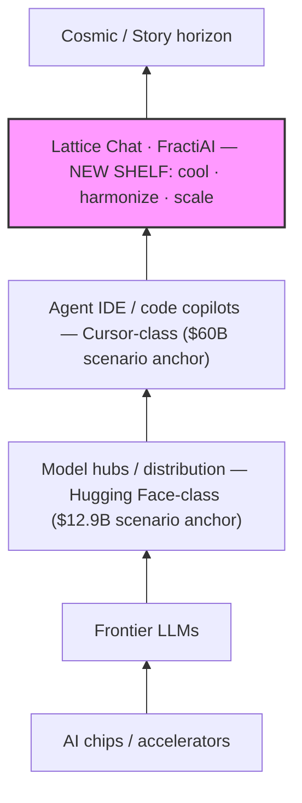

# Moving Up the Stack: Lattice as the Next AI Layer {#sec:part_III_moving-up-stack}

{#fig:part_III_moving-up-stack width=90%}

<!-- alt: A rising step plot of six AI stack layers from chips and frontier LLMs up through model hubs, agent IDEs, and the Lattice Chat orchestration shelf to the Story horizon, with valuation anchors marked at the hub, IDE, and new-layer shelves. -->

<!-- chapter-metadata-badge -->
> Level 2/3 · 35 min read · 50 min lecture · Prerequisites: the silicon shelf ([@sec:part_III_cmos-protonic])

## Learning Objectives

By the end of this chapter you should be able to:

1. Recite the corpus's six-layer AI stack and explain what "moving up the stack" means as a pattern of acquisitions.
2. Distinguish the **new-layer framing** ($12B–$28B) from the **peer-shelf misread** ($4.2B–$7.5B) and say precisely why the corpus rejects the second.
3. Formalise the valuation band as an interval anchored between hub-layer gravity and IDE-monopoly capture, and compute its floor, ceiling, and midpoints.
4. Restate the three load-bearing functions of the proposed new shelf — cool token burn, harmonise multi-agent loops, scale agentic systems — and sketch their token-accounting consequences.
5. Separate the [**fair-exchange**](#gl:fair-exchange) governance apparatus (scenario anchors, refund clause, filing labels) from any causal or appraisal claim the paper does not make.
6. Position the chapter's constructs relative to the [**lattice-linear**](#gl:lattice-linear) gateway material and the open problems of [@sec:part_III_frontiers].

<!-- curriculum-scaffold-start -->
### Study Blueprint

- **Big idea:** the corpus prices Lattice Chat not as another player on the hub/IDE shelf but as a *new higher stack layer* — a thermal + orchestration shelf that hub- and IDE-level climbers need next.
- **Core concepts:** [**engine-shelf**](#gl:engine-shelf), [**catalog-architecture**](#gl:catalog-architecture), [**fair-exchange**](#gl:fair-exchange), [**honesty-first**](#gl:honesty-first), [**omni-lattice**](#gl:omni-lattice).
- **Quantitative lens:** the new-layer valuation band, [@eq:part_III_moving-up-stack_band].
- **Data skill:** reading a *scenario anchor* table honestly — separating deal anchors, implied bands, and filing labels without converting any of them into a forecast.
- **Common misconception to repair:** that the $12B–$28B band is an appraisal, a securities offer, or a market prediction. It is none of these; it is valuation *framing* on a ship blog.
- **Primary lab:** [@sec:lab_part_III_moving-up-stack].
- **Question bank:** [@sec:q_part_III_moving-up-stack].
- **Bridge to computation:** `textbook.models.goldilocks_band`, `net_zero_balance`, `descriptive_statistics`.
<!-- curriculum-scaffold-end -->

---

> **Opening Vignette: The deal board on the ship's bulkhead.**
>
> September 2026, aboard the SS Vibelandia. The autonomous agent has pinned two receipts to the deal board: NVIDIA's **$12.9B** move on Hugging Face — silicon reaching for **model distribution** — and SpaceX's **$60B** move on Cursor — capital+compute reaching for **developer agent workflow** [@mendez2026stack]. Below them, a third card is still wet ink: FractiAI & Lattice Chat, band **$12B–$28B**, flagged as a *new shelf*, not a peer. The captain's annotation reads like a systems-engineering thesis: everyone is climbing, and the climb has a direction. This chapter formalises that direction.

---

## The paper in the corpus

The source is a ship-blog entry, "Moving up the stack · Lattice is the next AI layer," dated 2026-09-05 and filed under the *new-layer framing / Fair Exchange* tags [@mendez2026stack]. In the corpus's filing scheme it sits on ship-blog **shelf 12**; its standalone reference suite — `github.com/FractiAI/synthobs-moving-up-the-stack-valuation`, runnable as `npm run research:synthobs-moving-up-the-stack-valuation` — self-files as **Infinite Octaves [**engine-shelf**](#gl:engine-shelf) #13** [@mendez2026stack]. (We record both numbers as the corpus prints them: the blog post and its suite carry adjacent shelf filings.) The whitepaper surface is linked from the post as `whitepaper-surface.html?id=synthobs-moving-up-the-stack-valuation-2026-09`.

The paper is a *positioning* paper rather than a physics paper: it classifies a product (Lattice Chat / FractiAI) within the [**catalog-architecture**](#gl:catalog-architecture) of the [**omni-lattice**](#gl:omni-lattice) project, using acquisition events as evidence about the shape of the AI stack. Its named companions are the gateway paper — *EGS Lattice-Linear · PDVSA ops mock* [@mendez2026pdvsaGateway], whose lattice-linear flow ramp is visualised in [@fig:part_III_pdvsa-gateway] — and the separate "Lattice vs vibe coding" receipts note, which the paper explicitly keeps off-board ("coding receipts stay on the separate note"). The silicon-side context — what lives on the shelves *below* the new layer — is developed in [@sec:part_III_cmos-protonic].

## The climb: a six-layer stack model

The paper's core structural claim (its formalism F-1) is that the AI stack is layered, that capital moves upward through the layers, and that the deals of 2026 reveal the direction of the climb. Chip makers and LLM/compute players "are not staying on their shelf. They are buying up the stack" [@mendez2026stack] — a claim the corpus files as C-1. The six layers, read bottom-up exactly as the paper prints them, are shown in [@fig:part_III_moving-up-stack] and diagrammed in the mermaid rendering below (the source prints them as an ASCII stack; we keep its content and its bottom-up arrows verbatim):

Each arrow is an instance of **moving up the stack**: an acquirer buying a capability one layer above its own. Two **scenario anchors** give the climb its altitudes — NVIDIA's **$12.9B** Hugging Face move ("silicon reaching for model distribution") and SpaceX's **$60B** Cursor move ("capital+compute reaching for developer agent workflow") [@mendez2026stack]. A **stack shelf** is the corpus's term for one horizontal tier of this diagram.

Why does the corpus insist the top-but-one layer is a **new shelf** rather than "another player on the same shelf"? Because it performs a different kind of work [@mendez2026stack]:

- **Cool token burn** — fewer tokens per agentic loop; *seeds and pointers instead of fat paste*.
- **Harmonise** — nested agents share one coherent brief instead of siloed chat windows.
- **Scale agentic systems** — cross-model abstraction so fleets do not stall when hubs and IDEs alone cannot orchestrate.

The paper's own classification of this bundle is a **thermal + orchestration layer**: "It does not replace Hugging Face or Cursor. It is what those lower shelves climb toward when agentic load gets real" [@mendez2026stack]. We formalise the cooling and harmonisation claims in [@eq:part_III_moving-up-stack_cooling] below.

## Core constructs

### The new-layer valuation band

The paper's second formalism (F-2) is a *corrected* valuation reading. Its first attempt priced Lattice at **$4.2B–$7.5B**; the paper retracts this as the **peer-shelf misread** — "pricing Lattice as if it lived next to hubs and IDEs instead of *above* them" — and replaces it with the **new-layer framing**: **$12B–$28B** as a new higher stack layer [@mendez2026stack]. We formalise the band as an interval:

$$ \mathcal{B}_{\text{new}} = [\,V_{\min},\, V_{\max}\,] = [\,\$12\text{B},\ \$28\text{B}\,], \qquad V_{\min} \approx A_{\text{hub}}, \qquad V_{\max} < A_{\text{IDE}}, $$ {#eq:part_III_moving-up-stack_band}

where $A_{\text{hub}}$ and $A_{\text{IDE}}$ are the two scenario anchors. The derivation logic, as the paper states it: climbers already pay $12.9B for *hub altitude* and $60B for *IDE altitude*; after distribution and IDE capture, "the binding constraint is **agentic token burn + coordination failure**"; a shelf that cools burn and harmonises agents "is not a cheaper Cursor — it is the **thermal layer** that lets agentic systems scale" [@mendez2026stack]. Hence a floor near hub-layer gravity and headroom below IDE-monopoly capture. The band's parameters are collected in [@tbl:part_III_moving-up-stack_band].

: Parameters of the new-layer valuation band. {#tbl:part_III_moving-up-stack_band}

| Symbol | Meaning | Corpus value | Status |
| ------ | ------- | ------------ | ------ |
| $V_{\min}$ | floor of the implied band, near hub-layer gravity | $12B | new-layer framing |
| $V_{\max}$ | ceiling of the implied band, headroom below IDE capture | $28B | new-layer framing |
| $A_{\text{hub}}$ | NVIDIA / Hugging Face scenario anchor | $12.9B | scenario anchor |
| $A_{\text{IDE}}$ | SpaceX / Cursor scenario anchor | $60.0B | scenario anchor |
| $[\,\cdot\,]_{\text{peer}}$ | rejected peer-shelf band | $4.2B–$7.5B | peer-shelf misread |

The comparative anchors the paper assembles are reproduced verbatim in [@tbl:part_III_moving-up-stack_anchors], and the two competing readings in [@tbl:part_III_moving-up-stack_readings].

: Comparative anchors — up-stack buys (verbatim from the source). {#tbl:part_III_moving-up-stack_anchors}

| Asset / Ecosystem | Deal / valuation anchor | Stack shelf | What the climber bought |
| --- | --- | --- | --- |
| Hugging Face (NVIDIA) | $12.9 Billion | Model hub / distribution | Open gravity for models + developers (**model gravity**) |
| Cursor AI (SpaceX) | $60.0 Billion | Agent IDE / workflow | Direct interception of coding agents + GPU tie-in (**agent-IDE workflow**) |
| FractiAI & Lattice Chat | $12B – $28B (new-layer implied) | Orchestration / cooling / harmony | Next shelf above hubs and IDEs — token cooling + multi-agent scale |

: Peer-shelf misread vs new-layer framing. {#tbl:part_III_moving-up-stack_readings}

| Reading | Implied band | Error / correction |
| --- | --- | --- |
| Peer-shelf misread | $4.2B – $7.5B | Prices a *new shelf* as if it lived on the *old* hub/IDE shelf |
| New-layer framing | $12B – $28B | Treats Lattice as stack completion / cooling layer that climbers need next |

### Cooling and harmonisation: a token-accounting sketch

The three bullet claims above are descriptive; to make them inspectable we read them as a token-accounting model (this formalisation is ours; the corpus states the bullets, not the equation). Let a siloed fleet of $m$ nested agents each burn $T_{\text{loop}}$ tokens per loop by re-pasting full context ("fat paste"), while a harmonised fleet shares one coherent brief $B$ and per-agent per-loop cost $(s + p)$ — one seed plus one pointer. Then

$$ C_{\text{siloed}}(m) = m\,T_{\text{loop}}, \qquad C_{\text{harmonised}}(m) = B + m\,(s+p), \qquad \kappa(m) = \frac{C_{\text{siloed}}(m)}{C_{\text{harmonised}}(m)} > 1, $$ {#eq:part_III_moving-up-stack_cooling}

where $\kappa$ is the *cooling factor*: the factor by which the per-round token bill drops when loops run on seeds and pointers. The parameters are defined in [@tbl:part_III_moving-up-stack_cooling]. The corpus's own words for what the model encodes are exactly the three bullets: *cools token burn*, *harmonises multi-agent loops*, *lets agentic systems scale* [@mendez2026stack].

: Parameters of the token-accounting sketch. {#tbl:part_III_moving-up-stack_cooling}

| Symbol | Meaning | Units |
| ------ | ------- | ----- |
| $m$ | number of nested agents in the fleet | agents |
| $T_{\text{loop}}$ | tokens per siloed agentic loop (fat paste) | tokens |
| $B$ | one shared coherent brief, written once | tokens |
| $s$ | seed tokens per agent per loop | tokens |
| $p$ | pointer tokens per agent per loop | tokens |
| $\kappa$ | cooling factor $C_{\text{siloed}}/C_{\text{harmonised}}$ | dimensionless |

### The EGS fractal constant

The paper's third formalism (F-3) invokes a harmony constant. As the paper states it, "**Efficiency premium (cooling):** Lattice scales on minimalist tokens per agentic loop — the inverse of brute-force IDE+GPU lock-in" and "**EGS fractal constant (harmony):** ΦEGS ≈ 1.618 is catalog routing grammar for cross-octave sync — architecture thesis, not measured physics" [@mendez2026stack]. Formally:

$$ \Phi_{\text{EGS}} \approx 1.618 \;\approx\; \Phi = \frac{1+\sqrt{5}}{2} = 1.6180339887\ldots $$ {#eq:part_III_moving-up-stack_harmony}

Two honesty notes are load-bearing here. First, the paper itself files the disclaimer: "ΦEGS ≈ 1.618 is catalog grammar, not a market oracle" — the constant in [@eq:part_III_moving-up-stack_harmony] is routing grammar for the [**octave**](#gl:octave) structure of the omni-lattice, not a claim about markets or physics [@mendez2026stack]. Second, numerically the rounding is benign: 1.618 agrees with the pinned $\Phi$ to within about 0.002%, and the Fibonacci ratio $\varphi_{\text{fib}}(10) = 89/55 \approx 1.618182$ (implemented as `phi_fibonacci` in `textbook.models`) brackets it from above; $\varphi_{\text{fib}}(5) = 8/5 = 1.6$ brackets it from below. The constant's deeper role in the corpus's harmonic machinery is developed in [@sec:part_I_fractal-constant]; here it functions purely as a *routing thesis* for cross-octave sync.

## Worked example: pricing a new shelf

We walk the paper's derivation as a five-step procedure, using only numbers the source prints [@mendez2026stack].

1. **Fix the anchors.** $A_{\text{hub}} = \$12.9\text{B}$ (Hugging Face, model distribution) and $A_{\text{IDE}} = \$60.0\text{B}$ (Cursor, agent-IDE workflow). Both are *scenario anchors*, not audited transaction prices.
2. **Name the binding constraint.** After distribution and IDE capture, the scarce resource is not compute or distribution but **agentic token burn + coordination failure** — the two failure modes the new shelf is built to cool and harmonise (claim C-7).
3. **Place the floor.** $V_{\min} = \$12\text{B}$ sits just under $A_{\text{hub}}$: the floor "near hub-layer gravity" is $12/12.9 \approx 93\%$ of the hub anchor. A buyer who has already paid $12.9B for distribution will not pay less for the layer that makes distribution orchestritable — that is the floor's logic.
4. **Place the ceiling.** $V_{\max} = \$28\text{B}$ is $28/60 \approx 47\%$ of the IDE anchor: real "headroom below IDE-monopoly capture". The band tops out well short of what an exclusive IDE-level capture commanded.
5. **Cross-check against the misread.** The rejected peer band tops out at $\$7.5\text{B}$ — which is *below the new-layer floor of $\$12\text{B}$*. The two readings do not even overlap: peer midpoint $(4.2+7.5)/2 = \$5.85\text{B}$ versus new-layer midpoint $(12+28)/2 = \$20\text{B}$, a factor of $20/5.85 \approx 3.4$. The correction is not a tune-up; it is a re-shelving.

As a numerical illustration of the cooling claim (our arithmetic, not the corpus's), take $m = 10$ agents, siloed loops of $T_{\text{loop}} = 40{,}000$ tokens, a shared brief $B = 5{,}000$, and seed+pointer loops of $s + p = 2{,}500$. Then $C_{\text{siloed}} = 400{,}000$, $C_{\text{harmonised}} = 5{,}000 + 25{,}000 = 30{,}000$, and $\kappa \approx 13.3$ by [@eq:part_III_moving-up-stack_cooling]. The magnitude is illustrative; the *mechanism* — fewer tokens per loop because agents carry seeds and pointers instead of fat paste — is the corpus's claim.

## Scope and honesty

The paper is unusually explicit about what its numbers are not, and we preserve those disclaimers precisely [@mendez2026stack]:

- **"Honesty first:"** the valuation material is *framing*, "not an audited appraisal or securities offer. Deal sizes are scenario anchors for the climb." This is the corpus-wide [**honesty-first**](#gl:honesty-first) scope discipline applied to money.
- **The constant:** "ΦEGS ≈ 1.618 is catalog grammar, not a market oracle" — the harmony constant carries no predictive claim about asset prices.
- **Telemetry:** the "NOAA-predicted September 2026 sunspot count **90.9** and operational node **Hero Jo** are filing / ops labels — not causal dollar drivers." They index the filing, they do not move the band.
- **Governance:** a [**fair-exchange**](#gl:fair-exchange) clause is "actively in effect: any transaction or value acknowledged here may be refunded in part, depending on overall delivery, utility, and actualized results — like tipping." We can model the refund bookkeeping with `textbook.models.net_zero_balance` — acknowledged value minus delivered value is the residual — but the clause itself is a terms-of-service statement, not a valuation input.
- **What the construct is FOR:** coordination, cataloging, and agent routing — a shelf classification and a positioning thesis inside the corpus's narrative–empirical–operational tiering ([**narrative-empirical-operational-tiers**](#gl:narrative-empirical-operational-tiers)).
- **What it is explicitly NOT:** not an appraisal, not a securities offer, not a market forecast, not a claim that the anchors are transacted prices, and not a replacement for Hugging Face or Cursor (claim C-6: the layer is complementary, "what those lower shelves climb toward").

> **Note.** The peer-shelf misread is itself instructive as method: the corpus corrects its *own* earlier reading, in public, on scope grounds. The error was not arithmetic ($4.2$–$7.5$ is a plausible hub/IDE-shelf band); it was *shelving* — assigning the artefact to the wrong layer of the stack, which mispriced it by a factor of about 3.4 at the midpoint.

## Connections

The new-layer thesis connects downstream and sideways in the book:

- **The silicon shelf below.** What "chips / accelerators" and CMOS-protonic hardware contribute to the lower shelves is developed in [@sec:part_III_cmos-protonic]; the octaves-per-substrate stacking there ([@fig:part_III_cmos-protonic]) is the hardware-side mirror of the software stack climbed here.
- **The gateway.** The companion paper's lattice-linear routing — *EGS Lattice-Linear · PDVSA ops mock* — is formalised in [@sec:part_III_pdvsa-gateway], whose flow ramp appears in [@fig:part_III_pdvsa-gateway]. If the present chapter prices the orchestration shelf, that chapter shows the routing grammar the shelf is supposed to run.
- **Bridging outward.** The routing/brokerage apparatus that would carry traffic *between* shelves is the subject of [@sec:part_III_reality-bridge]; the new-layer shelf is one of the endpoints such a bridge would have to serve.
- **Open problems.** Whether the cooling and harmonisation functions can be specified and tested at all — rather than asserted — is exactly the kind of question the open-problems map in [@sec:part_III_frontiers] collects; this chapter's token-accounting sketch in [@eq:part_III_moving-up-stack_cooling] is a candidate specification, and a candidate target for falsification.

## Summary

The corpus's moving-up-the-stack paper reads the 2026 acquisition landscape as evidence that AI capital climbs a six-layer stack — chips, frontier LLMs, model hubs, agent IDEs, and then a *new* shelf, Lattice Chat · FractiAI, that cools token burn, harmonises multi-agent loops, and lets agentic fleets scale [@mendez2026stack]. Because the new shelf performs thermal + orchestration work rather than hub or IDE work, the paper re-shelves its valuation from a rejected peer-band of $4.2B–$7.5B to a new-layer band of $12B–$28B, floored near the $12.9B hub anchor and ceilinged below the $60B IDE anchor. Every number in the derivation is a scenario anchor or an implied band — framing, not appraisal — and the paper's own disclaimers (ΦEGS as catalog grammar, sunspot count and Hero Jo as filing labels, the fair-exchange refund clause) are part of the construct, not fine print.

## Key Terms

[**engine-shelf**](#gl:engine-shelf), [**catalog-architecture**](#gl:catalog-architecture), [**omni-lattice**](#gl:omni-lattice), [**octave**](#gl:octave), [**honesty-first**](#gl:honesty-first), [**fair-exchange**](#gl:fair-exchange), [**narrative-empirical-operational-tiers**](#gl:narrative-empirical-operational-tiers), [**lattice-linear**](#gl:lattice-linear), [**silicon-shelf**](#gl:silicon-shelf).

## Further Reading

- Whitepaper surface: [synthobs-moving-up-the-stack-valuation-2026-09](https://www.ssvibelandiaquestfest24x365.com/interfaces/whitepaper-surface.html?id=synthobs-moving-up-the-stack-valuation-2026-09) — the paper's own linked whitepaper.
- Reference implementation: [FractiAI/synthobs-moving-up-the-stack-valuation](https://github.com/FractiAI/synthobs-moving-up-the-stack-valuation) — Infinite Octaves engine shelf #13; run with `npm run research:synthobs-moving-up-the-stack-valuation`.
- [@mendez2026pdvsaGateway] — the gateway companion: lattice-linear routing and the PDVSA ops mock, the grammar the new shelf would run.
- [@mendez2026cmosProtonic] — the silicon shelf below: what the chip layer of the stack contributes.
- [@mendez2026realityBridge] — the bridge/router layer that would connect shelves to each other.

## Practice

- **Lab:** [@sec:lab_part_III_moving-up-stack] — run the standalone valuation suite, then recompute the band statistics by hand and check them against `textbook.models`.
- **Question bank:** [@sec:q_part_III_moving-up-stack] — recall through synthesis.

1. Reproduce the five-step derivation of the $12B–$28B band from the two scenario anchors, and state at which step the *binding constraint* enters.
2. Show that the peer-shelf band $[\$4.2\text{B}, \$7.5\text{B}]$ and the new-layer band $[\$12\text{B}, \$28\text{B}]$ are disjoint, and compute both midpoints.
3. Using [@eq:part_III_moving-up-stack_cooling], compute $\kappa$ for $m = 4$, $T_{\text{loop}} = 20{,}000$, $B = 4{,}000$, $s + p = 2{,}000$. Is the harmonised fleet cheaper? By how much in absolute tokens?
4. The paper claims the sunspot count 90.9 and the node Hero Jo are "filing / ops labels". Write two sentences explaining why including them in a valuation derivation would violate the paper's own honesty-first scope.
5. Argue for or against: "the new-layer framing is falsifiable." What observation in the acquisition market would count as evidence *against* a new higher stack layer, per the paper's own logic?
