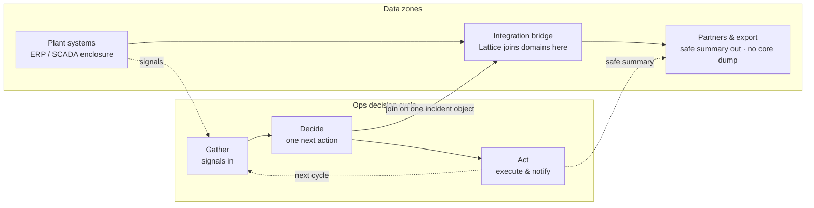

# PDVSA Gateway Ops: The EGS Lattice-Linear Companion {#sec:part_III_pdvsa-gateway}

![The lattice-linear flow ramp of the EGS Lattice-Linear Gateway: cumulative flow $L_n = n\,r$ rises in equal increments across the ops decision cycle (Gather → Decide → Act), generated from `textbook.models.lattice_linear_profile` at the routing-grammar step $r = \Phi \approx 1.618$. Each domain join adds exactly one increment of flow, so the shared brief accumulates without a tab reset and the ramp stays linear rather than exponential. The takeaway: routing grammar, not more tokens — the signature difference between a gateway profile and the corpus's octave ladders.](../../output/figures/part_III_pdvsa-gateway.png){#fig:part_III_pdvsa-gateway width=90%}

<!-- alt: Rising staircase of six equal-width steps on a linear axis, each step one routing-grammar unit taller than the last, annotated with the repeating Gather, Decide, Act cycle of the gateway console; the cumulative ramp stays linear rather than exponential. -->

<!-- chapter-metadata-badge -->
> Level 1/3 · 30 min read · 45 min lecture · Prerequisites: [@sec:part_III_cmos-protonic]

## Learning Objectives

By the end of this chapter you should be able to:

1. Describe the gateway simulator's three-zone data topology — plant systems, integration bridge, partners and export — and state what each zone is allowed to release.
2. Formalise the lattice-linear flow ramp $L_n = n\,r$ of [@eq:part_III_pdvsa-gateway_model], compute a worked ramp at the routing-grammar step $r = \Phi$ using `textbook.models.lattice_linear_profile`, and explain why the profile is linear rather than exponential.
3. Read the simulator's nine executive takeaways and trace each to its backing paper and empirics, including the token-cost bound of [@eq:part_III_pdvsa-gateway_tokens].
4. State precisely what the gateway artefact is and is not — a simulator and catalog map, not live telemetry or a measured SLA — using the source's own honesty-first disclaimer.
5. Place the enterprise gateway companion on the engine shelf relative to its neighbours, the CMOS protonic pin and the model → lattice → agent stack.

<!-- curriculum-scaffold-start -->
### Study Blueprint

- **Big idea:** the EGS Lattice-Linear Gateway is a [**catalog-architecture**](#gl:catalog-architecture) construct — one shared incident brief replacing N silo windows — whose honest scope is a simulator, not telemetry.
- **Quantitative lens:** the worked formalism in [@eq:part_III_pdvsa-gateway_model].
- **Data skill:** compute and plot a lattice-linear ramp with `textbook.models.lattice_linear_profile`, and read a labeled-simulator token-cost bound from companion empirics.
- **Common misconception to repair:** that the PDVSA Gateway Ops simulator measures a real oilfield. It files a routing grammar and says so — "labeled simulator gains, not measured oilfield SLAs" [@mendez2026pdvsaGateway].
- **Primary lab:** [@sec:lab_part_III_pdvsa-gateway].
- **Question bank:** [@sec:q_part_III_pdvsa-gateway].
- **Bridge to computation:** `textbook.models`.
<!-- curriculum-scaffold-end -->

---

> **Opening Vignette: One incident, two gravities.**
>
> It is morning on an operations floor, and something has gone wrong at a plant. On one screen the duty engineer tabs between an ERP window, a SCADA console, a legal-risk register, and an export-logistics queue — four systems, four partial views of the same event. On the screen beside it, the **EGS Lattice-Linear Gateway** simulator holds the identical incident on *one shared brief*: Production, Field, Compliance, and Export sit as domain cards on a single console, and clicking a card pulls that domain into the brief while the others stay lit — "no tab reset" [@mendez2026pdvsaGateway]. "Same incident, two gravities," the page captions the pair. The simulator is not live telemetry; it is a catalog artefact filed on the [**engine-shelf**](#gl:engine-shelf) as the enterprise gateway companion, built so a reader can *feel the bridge* before reading its grammar [@mendez2026pdvsaMockup].

---

## Two Artefacts, One Gateway: Simulator and Mockup Note

Two linked artefacts from September 2026 anchor this chapter: the *PDVSA Gateway Ops* special-project simulator [@mendez2026pdvsaGateway] and its ship-blog mockup note [@mendez2026pdvsaMockup]. Both stage the same contrast quoted above: "today's fragmented industry management UI — ERP · SCADA · Legal · Logistics" on one side, and on the other the EGS Lattice-Linear Gateway, on which Production · Field · Compliance · Export are "joined on one incident object" [@mendez2026pdvsaGateway]. The simulator's meta description is explicit about its own status: "IBM SNA↔TCP/IP is the historical rhyme — not live PDVSA telemetry."

This chapter treats the gateway the way this book treats every shelf entry: as [**catalog-architecture**](#gl:catalog-architecture) to be formalised, not as a device to be believed. The constructs section gives the console's three-zone data topology, its lattice-linear flow profile, and its nine-takeaway index; a worked example walks the "Scenario 1 · Morning brief" scenario numerically; the honesty section reproduces the source's [**honesty-first**](#gl:honesty-first) disclaimers verbatim. The quantitative lens is deliberately thin — the corpus prints no symbolic equation on the simulator page itself — so the worked formalism below is a structural model of the console profile, implemented as `lattice_linear_profile` in `textbook.models`.

## The Enterprise Companion Beside the CMOS Pin

The gateway papers sit at the enterprise edge of the Infinite Octaves engine shelf. The mockup note files the simulator "on the **Infinite Octaves engine shelf** as the enterprise gateway companion," and is equally explicit that this filing "does not displace the CMOS pin" — the substrate-layer companion treated in [@sec:part_III_cmos-protonic] [@mendez2026pdvsaMockup]. The note's engine-inclusion line reads: "AGENT_SYNC sync-stack · Lattice Chat workstream · Infinite Octaves dual-lock companion." The post is billed "**SS Vibelandia** — 2026-09-04 — CEO demo · Fair Exchange" [@mendez2026pdvsaMockup], a demo artefact in the corpus's [**fair-exchange**](#gl:fair-exchange) sense: takeaways that open their backing papers rather than trading on attention.

Concretely, the artefact ships as [@mendez2026pdvsaGateway; @mendez2026pdvsaMockup]:

- **Simulator page** at `/special-projects/pdvsa-gateway-ops`, with mode switches Split / Today only / Gateway only and a scenario stepper whose first stop is "Scenario 1 · Morning brief."
- **Whitepaper** `synthobs-pdvsa-gateway-ops-mockup-2026-09` on the corpus whitepaper surface — the "fleshed paper" the mockup summarises.
- **Reference implementation**: re-run with `npm run research:synthobs-pdvsa-gateway-ops-mockup`; standalone nest `research/synthobs-pdvsa-gateway-ops-mockup/` holding "empirics E1–E6."
- **GitHub repository**: `FractiAI/synthobs-pdvsa-gateway-ops-mockup`.
- **Historical rhyme**: the IBM SNA ↔ TCP/IP gateway case study, whose designated status is "the *historical rhyme*, not the product name" [@mendez2026pdvsaMockup].

## Core Constructs: The Gateway Formalised

### The lattice-linear flow ramp

The mockup note pins the console's routing grammar to a single constant: "**Honesty first:** … $\Phi \approx 1.618$ is Lattice-Linear routing grammar" [@mendez2026pdvsaMockup]. The constant is the golden ratio, $\Phi = (1+\sqrt{5})/2 \approx 1.6180339887$, the same fractal constant this book develops in [@sec:part_I_fractal-constant]. What the gateway does with it is the chapter's first structural claim, and the name is load-bearing: the console profile is *lattice-linear* — linear in the decision step — with $\Phi$ entering as the unit of accumulation, not as an exponent. Where the corpus's [**octave**](#gl:octave) growth is exponential ($\Omega_n = \Phi^n \Omega_0$ in one convention), the gateway's flow accumulates one domain-join per step:

$$ L_n = n\,r, \qquad n = 1, 2, \ldots, N, $$ {#eq:part_III_pdvsa-gateway_model}

implemented as `lattice_linear_profile(n_steps, rate)` in `textbook.models`, which returns the array $[r,\, 2r,\, \ldots,\, Nr]$ [@mendez2026pdvsaGateway]. The parameters appear in [@tbl:part_III_pdvsa-gateway_parameters].

: Parameters of the lattice-linear flow ramp. {#tbl:part_III_pdvsa-gateway_parameters}

| Symbol | Meaning | Units |
| ------ | ------- | ----- |
| $n$ | decision-step index — one Gather → Decide → Act cycle | — |
| $N$ | ramp length: number of decision steps simulated (`n_steps`) | count |
| $r$ | per-step increment (`rate`); the routing-grammar step | flow units per step |
| $L_n$ | cumulative gateway flow after step $n$, per [@eq:part_III_pdvsa-gateway_model] | flow units |

We read this as the formal footprint of the console's interaction model: "Click a domain to pull it into the shared brief — the other domains stay lit. No tab reset" [@mendez2026pdvsaGateway]. Each click is one step $n$; the shared brief accumulates joins without ever resetting, which is exactly what a linear ramp encodes.

### The three-zone data topology

The simulator's "Where the data lives" panel defines where information may sit and what may leave [@mendez2026pdvsaGateway]:

: The three-zone data topology of the EGS Lattice-Linear Gateway. {#tbl:part_III_pdvsa-gateway_zones}

| Zone | Content as printed | Release rule as printed |
| ---- | ------------------ | ----------------------- |
| Plant systems | "Secure internal · ERP / SCADA enclosure" | core state stays inside the enclosure |
| Integration bridge | "Lattice joins domains here" | the single join point for all domains |
| Partners & export | "Safe summary out · no core dump" | summaries only, never core state |

The diagram below maps the three zones onto the ops decision cycle that the console prints as its strip: "Gather — *signals in*," "Decide — *one next action*," "Act — *execute & notify*" [@mendez2026pdvsaGateway].

The topology is the mechanism behind the simulator's uptime claim: "Enclosure stays protected while the Horizon stays open: SNA Core does not dump into every Edge handoff; the gateway mediates continuity" [@mendez2026pdvsaGateway]. Continuity is mediated at the bridge — the middle zone — so neither the enclosure nor the partner boundary has to be relaxed for an executive to see one coherent brief.

### The nine takeaways and the token bound

The mockup organises the console as "Nine clickable takeaways: efficiency · immediacy · harmony · savings · uptime · accuracy · predictions · exploration · new R&D — each → full paper + empirics" [@mendez2026pdvsaMockup]. [@tbl:part_III_pdvsa-gateway_takeaways] lists all nine with the claims as printed and the whitepaper each card opens.

: The nine executive takeaways of the gateway simulator, with claims and backing papers as printed on the page. {#tbl:part_III_pdvsa-gateway_takeaways}

| Takeaway | Claim as printed | Backing paper (whitepaper id) |
| -------- | ---------------- | ----------------------------- |
| Efficiency | "One gravity well replaces silo-hopping. Multi-octave routing keeps N domains in a single executive thread instead of N ticket queues." | `lattice-token-reduction-proof-2026-07` |
| Immediacy | "Pointer-first briefs refresh in place — no waiting on batch sync … for a 90-second decision." | `synthobs-infinite-octaves-omniversal-lattice-2026-08` |
| Harmony | "Nested agents under peer-firewall keep … voices coherent after domain switches — fixture rhyme: high coherence at K=12." | `synthobs-ibm-sna-tcpip-gateway-omni-lattice-2026-09` |
| Savings | "Lattice context cost stays under 15% of flat token dumps at N≥6 in companion empirics." | `synthobs-lattice-vs-vibe-coding-2026-09` |
| Uptime | "Enclosure stays protected while the Horizon stays open." | `synthobs-ibm-sna-tcpip-gateway-omni-lattice-2026-09` |
| Accuracy | "Seed·RAG cites pointers to domain sources instead of vibe-window paraphrase." | `synthobs-infinite-octaves-omniversal-lattice-2026-08` |
| Predictions | "MCA (Metabolize → Crystallize → Animate) turns incident noise into a next-action band — forecasting as operational rehearsal, not prophecy." | `omniversal-nested-agent-lattice-2026-07` |
| Exploration | "Cross-domain what-ifs stay on one console." | `omniversal-nested-agent-lattice-2026-07` |
| New R&D | "Caracas template: industrial urgency + local integrator mastery (Protokol Sistemas pattern) ships frontier stacks early." | `synthobs-ibm-sna-tcpip-gateway-omni-lattice-2026-09` |

The savings card carries the chapter's second quantitative lens. In the vocabulary of [@tbl:part_III_pdvsa-gateway_takeaways], the companion empirics commit the gateway grammar to a context-cost bound per domain count $N$:

$$ \frac{C_{\mathrm{lattice}}(N)}{C_{\mathrm{flat}}(N)} < 0.15 \qquad \text{for } N \ge 6, $$ {#eq:part_III_pdvsa-gateway_tokens}

with the parameters of [@eq:part_III_pdvsa-gateway_tokens] given in [@tbl:part_III_pdvsa-gateway_tokens].

: Parameters of the token-cost bound. {#tbl:part_III_pdvsa-gateway_tokens}

| Symbol | Meaning | Units |
| ------ | ------- | ----- |
| $C_{\mathrm{lattice}}(N)$ | gateway context cost with $N$ domains joined on the incident object | tokens |
| $C_{\mathrm{flat}}(N)$ | context cost of the corresponding flat token dump at $N$ domains | tokens |
| $N$ | number of domains in the executive thread | count |

Two readings of [@eq:part_III_pdvsa-gateway_tokens] are honest and one is not. Honest: it is a labeled-simulator empiric — "in companion empirics," not a theorem, and its numerics live in the standalone nest's E1–E6 rather than on the console page. Also honest: it is a design rule of thumb — "invest in gateway grammar, not only more tokens" [@mendez2026pdvsaGateway]. Not honest: treating it as a measured oilfield SLA. The MCA card belongs to the same register: Metabolize → Crystallize → Animate is the backing-paper cycle that the console renders as Gather → Decide → Act [@mendez2026pdvsaMockup], and its forecasting posture is "operational rehearsal, not prophecy."

> **Note**
>
> The corpus prints no symbolic equations on either gateway page. Both [@eq:part_III_pdvsa-gateway_model] and [@eq:part_III_pdvsa-gateway_tokens] are this book's structural formalisation of statements the sources make in prose, chosen so that every number in them traces to a quoted claim. When the prose and the equation disagree, the prose wins.

## Worked Example: The Morning-Brief Ramp

Scenario 1 of the simulator is "Morning brief" [@mendez2026pdvsaGateway]. We walk it numerically with the ramp of [@eq:part_III_pdvsa-gateway_model] at the routing-grammar step: $r = \Phi = 1.6180339887$ flow units per step, and $N = 6$ decision steps — four joins (one per domain card) plus two rehearsal steps in which the MCA cycle replays the brief as "operational rehearsal, not prophecy" [@mendez2026pdvsaGateway; @mendez2026pdvsaMockup]. The four-domain ordering Production → Field → Compliance → Export follows the simulator's card layout; the two-step extension is our interpretation of the exploration claim ("Cross-domain what-ifs stay on one console"), not a printed number.

Calling `lattice_linear_profile(6, 1.6180339887)` in `textbook.models` yields:

$$ L = [\,1.618034,\; 3.236068,\; 4.854102,\; 6.472136,\; 8.090170,\; 9.708204\,]. $$

| Step $n$ | Console event | Cumulative flow $L_n$ |
| -------- | ------------- | --------------------: |
| 1 | Production card pulled into the shared brief | 1.618034 |
| 2 | Field card pulled in; Production stays lit | 3.236068 |
| 3 | Compliance card pulled in; no tab reset | 4.854102 |
| 4 | Export card pulled in — four domains, one incident object | 6.472136 |
| 5 | MCA rehearsal: metabolize and crystallize the brief | 8.090170 |
| 6 | MCA animate: one next action band issued | 9.708204 |

Each increment is exactly $\Phi$; the brief never resets, so the flow is the linear ramp of [@fig:part_III_pdvsa-gateway], not an exponential. That linearity is the difference between this chapter's profile and the octave ladders elsewhere in the corpus: adding a seventh domain adds $r$ flow units, not $r$ multiplied by a growing base.

The same $N = 6$ is the threshold at which the token bound of [@eq:part_III_pdvsa-gateway_tokens] engages: at six domains, the savings card commits the gateway grammar to a context cost below $0.15\,C_{\mathrm{flat}}(6)$ — if the corresponding flat dump would cost 100 token units, the bound allows the gateway fewer than 15. And the harmony card's fixture — "high coherence at K=12" nested agents under peer-firewall [@mendez2026pdvsaGateway] — sits at twice the ramp we just walked: the console's own numeric furniture (N ≥ 6, K = 12, a 90-second decision window) is what a re-run of `npm run research:synthobs-pdvsa-gateway-ops-mockup` and its E1–E6 empirics are there to exercise [@mendez2026pdvsaMockup].

## Simulator, Not Telemetry: The Honesty-First Scope

The gateway papers are unusually explicit about their own epistemic status, and this chapter preserves that framing verbatim. The mockup note's disclaimer, in full [@mendez2026pdvsaMockup]:

> **Honesty first:** this is a *simulator* and catalog map — not live PDVSA telemetry or a Protokol Sistemas contract audit. $\Phi \approx 1.618$ is Lattice-Linear routing grammar. Each takeaway card opens the backing paper (math + empirics), not a measured oilfield SLA.

The simulator page echoes it twice: "Labeled simulator gains, not measured oilfield SLAs," and the meta description's "IBM SNA↔TCP/IP is the historical rhyme — not live PDVSA telemetry" [@mendez2026pdvsaGateway]. The rhyme framing matters for how the artefact should be cited: "The IBM SNA ↔ TCP/IP gateway case study is the *historical rhyme*, not the product name" [@mendez2026pdvsaMockup].

Within that scope, the construct is FOR coordination and cataloging: one executive thread across $N$ domains, pointer-citing retrieval (Seed·RAG) so that "executives see what is grounded vs what still needs human confirmation," and a next-action band rather than a forecast [@mendez2026pdvsaGateway]. It is explicitly NOT: live telemetry, a Protokol Sistemas contract audit, a measured SLA, or prophecy. The takeaways' numerics belong to the standalone nest's E1–E6 empirics, and this book's [@eq:part_III_pdvsa-gateway_model] and [@eq:part_III_pdvsa-gateway_tokens] inherit exactly that status: structural models of printed prose, not measurements.

## Handoffs to the CMOS Pin, the Stack, and the Catalog

**Beside on the shelf: the CMOS pin.** The mockup is careful that the gateway's engine-shelf filing "does not displace the CMOS pin" [@mendez2026pdvsaMockup]. The substrate-layer companion — the octaves-per-substrate tiers of [@sec:part_III_cmos-protonic], visualised in [@fig:part_III_cmos-protonic] — is the [**cmos-protonic**](#gl:cmos-protonic) entry the gateway sits next to on the [**silicon-shelf**](#gl:silicon-shelf), not one it replaces [@mendez2026cmosProtonic]. The two filings are dual-lock companions: gateway grammar above, substrate pin below.

**Up the stack.** The gateway is an agent-layer artefact whose routing grammar is fixed at the lattice layer — precisely the model → lattice → agent ascent developed in [@sec:part_III_moving-up-stack] and its step plot [@fig:part_III_moving-up-stack] [@mendez2026stack]. Read in that vocabulary, the console joins domains at the lattice layer (the integration bridge) while the desks on the call — Sources desk, Field & Production, Compliance, Partner / Export [@mendez2026pdvsaGateway] — are agent-layer roles.

**Across the corpus.** The nine-takeaway index and the "each → full paper + empirics" wiring exemplify the [**catalog-architecture**](#gl:catalog-architecture) grammar of [@mendez2026catalog] applied to an executive console; the peer-firewall and Seed·RAG mechanisms point forward to the nested-agent material assembled in the part's synthesis chapters. For the ramp itself, the natural continuations are the lab and question bank attached to this chapter, which re-derive [@eq:part_III_pdvsa-gateway_model] by hand.

## Summary

The EGS Lattice-Linear Gateway replaces N siloed management windows with one shared incident brief: four domain cards joined on a single console, where clicking a domain pulls it in "while the others stay lit — no tab reset" [@mendez2026pdvsaGateway]. Its data lives in three zones — plant enclosure, integration bridge, partner boundary — with summaries, never core state, crossing outward, and its executive surface is nine clickable takeaways, each opening its backing paper and empirics. The book formalises the console's profile as the linear ramp $L_n = n\,r$ of [@eq:part_III_pdvsa-gateway_model] with $r = \Phi \approx 1.618$ as routing grammar, implemented as `lattice_linear_profile` in `textbook.models`, and reads the savings card as the token-cost bound of [@eq:part_III_pdvsa-gateway_tokens] at $N \ge 6$. Every one of these numbers is labeled-simulator furniture: "this is a *simulator* and catalog map — not live PDVSA telemetry or a Protokol Sistemas contract audit" [@mendez2026pdvsaMockup]. The artefact files on the engine shelf as the enterprise gateway companion, beside — not instead of — the CMOS pin of [@sec:part_III_cmos-protonic].

## Key Terms

[**lattice-linear**](#gl:lattice-linear), [**catalog-architecture**](#gl:catalog-architecture), [**engine-shelf**](#gl:engine-shelf), [**fair-exchange**](#gl:fair-exchange), [**honesty-first**](#gl:honesty-first), [**cmos-protonic**](#gl:cmos-protonic), [**silicon-shelf**](#gl:silicon-shelf), [**octave**](#gl:octave).

## Further Reading

- **Simulator page** — <https://www.ssvibelandiaquestfest24x365.com/special-projects/pdvsa-gateway-ops> [@mendez2026pdvsaGateway]: the interactive console this chapter formalises; the meta description itself carries the honesty-first framing.
- **Ship-blog mockup note** — <https://www.ssvibelandiaquestfest24x365.com/ship-blog/pdvsa-gateway-ops-mockup> [@mendez2026pdvsaMockup]: the filing note with the standalone nest (`research/synthobs-pdvsa-gateway-ops-mockup/`, empirics E1–E6) and GitHub repository <https://github.com/FractiAI/synthobs-pdvsa-gateway-ops-mockup>.
- @mendez2026catalog — the catalog-architecture grammar that the gateway's nine-takeaway, each-card-opens-its-paper wiring instantiates.
- @mendez2026cmosProtonic — the substrate-layer pin that the gateway's dual-lock companion filing explicitly does not displace; see [@sec:part_III_cmos-protonic].
- @mendez2026stack — the model → lattice → agent ascent along which the gateway's grammar (lattice layer) and desks (agent layer) separate; see [@sec:part_III_moving-up-stack].

## Practice

- **Lab:** [@sec:lab_part_III_pdvsa-gateway] — re-run `npm run research:synthobs-pdvsa-gateway-ops-mockup`, then compute `lattice_linear_profile` values by hand and check them against the tested function.
- **Question bank:** [@sec:q_part_III_pdvsa-gateway] — recall through synthesis on the three-zone topology, the ramp, and the honesty-first scope.
- Re-plot the morning-brief ramp for a fifth domain join and state, in one sentence each, which printed claims the extension touches (exploration) and which it must not touch (measured SLAs).
- Given $C_{\mathrm{flat}}(8) = 240$ token units, use [@eq:part_III_pdvsa-gateway_tokens] to state the largest context cost the gateway grammar may claim at eight domains, and identify the E1–E6 empirics that would have to back such a claim.
- Draw the three-zone topology of [@tbl:part_III_pdvsa-gateway_zones] from memory, label each zone's release rule, and mark where the "no core dump" guarantee binds.
