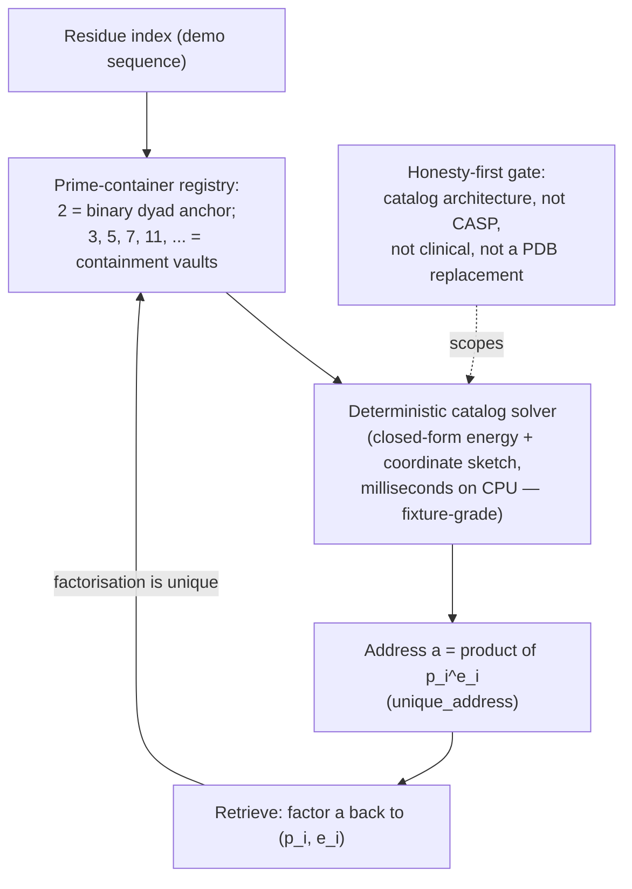

# Protein Folding as Prime-Container Architecture {#sec:part_III_protein-folding}

![Prime-container capacity: the growth sequence of `textbook.models.unique_address` as odd-prime vaults join the registry one at a time, each vault contributing an exponent budget of addresses on top of the binary anchor. Every additional vault prime multiplies the number of distinct residue-index addresses rather than adding to it, because each address is the product $\prod p_i^{e_i}$ over the vault primes and their occupancies. The takeaway is the compounding itself — the visual signature of a vault architecture whose encoding is injective and reversible by the fundamental theorem of arithmetic.](../../output/figures/part_III_protein-folding.png){#fig:part_III_protein-folding width=90%}

<!-- alt: Step curve of addressing capacity rising multiplicatively as vault primes 3, 5, 7, 11 and beyond join the registry, each new vault multiplying the address space by the per-vault exponent budget. -->

<!-- chapter-metadata-badge -->
> Level 1/3 · 30 min read · 45 min lecture · Prerequisites: Prime-Parity ([@sec:part_I_prime-parity])

## Learning Objectives

By the end of this chapter you should be able to:

1. State the prime-container grammar of [@mendez2026proteinFolding]: Prime 2 as the
   [**binary-dyad-anchor**](#gl:binary-dyad-anchor) and odd primes as
   [**irreducible-minimum-set**](#gl:irreducible-minimum-set) containment vaults
   for residue indices, all filed under the [**golden-ratio**](#gl:golden-ratio)
   constant $\Phi \approx 1.618$.
2. Compute an injective prime-encoded address with
   `textbook.models.unique_address`, and explain why the encoding is reversible.
3. Derive and evaluate the addressing-capacity product of a vault registry, and
   read the growth sequence plotted in [@fig:part_III_protein-folding].
4. Distinguish the two $\Omega_n$ conventions that the corpus prints
   ambiguously as "$\Omega_n = \Phi^n \cdot \Omega_0$", and name the
   `textbook.models.octave_term` function that implements both.
5. Restate, near-verbatim, the paper's own scope disclaimers — what the
   prime-container architecture is filed AS, and what it explicitly is not.
6. Locate the paper on the [**engine-shelf**](#gl:engine-shelf) and name its
   companion papers, reference implementation, and test status.

<!-- curriculum-scaffold-start -->
### Study Blueprint

- **Big idea:** The corpus files protein folding not as a statistics problem but
  as a *catalog problem* — residue indices addressed by odd-prime "containment
  vaults" under $\Phi$, solved deterministically rather than predicted
  statistically.
- **Core concepts:** [**prime-container**](#gl:prime-container),
  [**prime-parity**](#gl:prime-parity),
  [**binary-dyad-anchor**](#gl:binary-dyad-anchor),
  [**golden-ratio**](#gl:golden-ratio),
  [**catalog-architecture**](#gl:catalog-architecture).
- **Quantitative lens:** the injective prime-address formalism in
  [@eq:part_III_protein-folding_address] and its capacity product in
  [@eq:part_III_protein-folding_capacity].
- **Data skill:** factor an integer address back into vault primes and
  exponents, and verify the round trip with `textbook.models.unique_address`.
- **Common misconception to repair:** that the paper competes with AlphaFold
  for structure prediction. It does not — the corpus files it as catalog
  architecture, a fixture-grade deterministic sketch, and says so itself.
- **Primary lab:** [@sec:lab_part_III_protein-folding].
- **Question bank:** [@sec:q_part_III_protein-folding].
- **Bridge to computation:** `textbook.models.unique_address`, `octave_term`,
  `phi_powers`, `phi_fibonacci`.
<!-- curriculum-scaffold-end -->

---

> **Opening Vignette: The vault wall.**
>
> Picture the ship's library aboard the SS Vibelandia: one wall of filing
> cabinets, and on it a small vault set slightly apart — a single drawer
> labelled **2**, then drawers labelled **3, 5, 7, 11, 13, ...**. Drawer 2 is
> the anchor: everything binary hangs from it. The odd drawers are the vaults:
> each one is indivisible, so anything filed inside it can only be retrieved
> one way. This is the scene [@mendez2026proteinFolding] constructs when it
> files protein folding as a catalog problem: residue indices as vault
> contents, odd primes as the vaults, and $\Phi \approx 1.618$ — El Gran Sol's
> [**fractal-constant**](#gl:fractal-constant) — as the constant under which
> the whole wall is spaced. Nothing in the vignette is a laboratory claim; it
> is filing architecture, and the paper is careful to say so.

---

## The Prime-Vault Note on Engine Shelf #14

The source note, "Protein folding, prime vaults, and $\Phi$"
[@mendez2026proteinFolding], was published on the SS Vibelandia ship blog in
September 2026 and filed on the Infinite Octaves [**omni-lattice**](#gl:omni-lattice)
[**engine-shelf**](#gl:engine-shelf) as **engine shelf #14**, in companion
position to the prime-parity paper [@mendez2026primeParity]. Where that
companion establishes the [**prime-parity**](#gl:prime-parity) partition — the
sole-even anchor 2 against the odd-prime classes — the present paper *uses*
that partition as load-bearing infrastructure: 2 becomes the
[**binary-dyad-anchor**](#gl:binary-dyad-anchor) and the odd primes become the
containment vaults.

The paper positions itself against a named baseline. As the corpus records it,
"AlphaFold taught the world that **statistics + MSAs** can predict structure"
[@mendez2026proteinFolding] — multiple sequence alignments feeding statistical
structure prediction. The note then files a different grammar: "**odd primes
as containment vaults** under El Gran Sol's Fractal constant $\Phi \approx
1.618$, with a deterministic catalog solver" [@mendez2026proteinFolding]. The
contrast is not score-against-score; it is *method-class against method-class*:
statistical prediction versus deterministic addressing on a
[**catalog-architecture**](#gl:catalog-architecture) reading of the folding
problem.

Three items "landed" in the note, and we carry all three forward in this
chapter:

1. the prime-container grammar itself (Prime 2 as binary dyad anchor; odd
   primes as irreducible containers for residue indices);
2. a **closed-form energy + coordinate sketch**, described as running "in
   milliseconds on CPU for demo sequences (fixture, not PDB replacement)"
   [@mendez2026proteinFolding]; and
3. a test status: **9/9 suite locks** under
   `research/synthobs-protein-folding-prime-container/`
   [@mendez2026proteinFolding].

The reference implementation is runnable: `npm run
research:synthobs-protein-folding-prime-container` from the corpus
repositories, with a standalone suite at the GitHub repository
`FractiAI/synthobs-protein-folding-prime-container` and a whitepaper surface
linked from the ship blog post [@mendez2026proteinFolding]. The note also
offers two companions beyond prime-parity: the Higgs Gate paper on "awareness
phase coupling" [@mendez2026higgsGate] and the "Moving up the stack" essay
[@mendez2026stack], both cross-linked from the same board. We return to these
in the handoff section below.

## The Prime-Container Grammar

### The address formalism

The core construct of [@mendez2026proteinFolding] is an *addressing scheme*:
each residue index in a demo sequence is filed as an integer built from vault
primes raised to exponents. Formally, given $m$ vault primes
$p_1 < p_2 < \cdots < p_m$ and a tuple of exponents
$\mathbf{e} = (e_1, \ldots, e_m)$, the address is

$$ a(\mathbf{e}) \;=\; \prod_{i=1}^{m} p_i^{\,e_i} \,, \qquad e_i \in \{0, 1, \ldots, E\} \,. $$ {#eq:part_III_protein-folding_address}

This is implemented and tested as `textbook.models.unique_address`; never
retype the product in prose or scripts — call the tested function. The
parameters appear in [@tbl:part_III_protein-folding_address].

: Parameters of the prime-container address formalism. {#tbl:part_III_protein-folding_address}

| Symbol | Meaning | Units |
| ------ | ------- | ----- |
| $p_i$  | the $i$-th vault prime (2 for the dyad anchor; odd primes thereafter) | dimensionless |
| $e_i$  | exponent of $p_i$ in the address (the "occupancy" of vault $i$) | dimensionless |
| $E$    | per-vault exponent budget | dimensionless |
| $m$    | number of vaults in the registry | dimensionless |
| $a$    | the composite address filed for a residue index | dimensionless |

Two properties make the scheme a *catalog* rather than a hash. First, by the
fundamental theorem of arithmetic — standard mathematics of primes — the map
$\mathbf{e} \mapsto a$ is **injective**: distinct exponent tuples yield
distinct addresses, so no two residue indices ever collide. Second, the map is
**reversible**: factoring $a$ recovers exactly which vaults were occupied and
how deeply, which is what makes the scheme usable for deterministic retrieval.
The pinned worked instance is `unique_address([2, 3], [2, 1])` $= 2^2 \cdot 3
= 12$ — vault 2 occupied to depth two, vault 3 to depth one.

In the grammar of [@mendez2026proteinFolding], the roles are fixed: **Prime 2
is the binary dyad anchor** — the sole even prime, marking the binary layer on
which everything else sits, exactly as the prime-parity companion files it
[@mendez2026primeParity] — and **the odd primes are the containment vaults**
that index residue positions. Because odd primes cannot factor through the
anchor, each vault is an *irreducible container*: contents filed in vault $p$
are reachable only through $p$.

### Capacity: why vaults compound

How many distinct residue indices can a registry of $m$ vaults file, if each
vault's exponent runs over $\{0, 1, \ldots, E\}$? Counting the admissible
exponent tuples is standard combinatorics — we read this as the natural
capacity measure of the grammar, not as a formula the paper states:

$$ C(m, E) \;=\; \prod_{i=1}^{m} (E + 1) \;=\; (E+1)^m \,. $$ {#eq:part_III_protein-folding_capacity}

The capacity grows *multiplicatively* in the number of vaults: this is what
[@fig:part_III_protein-folding] plots, the `unique_address` growth sequence as
vaults are added one at a time. Each new odd prime multiplies the addressable
space by $(E+1)$ rather than adding to it — the visual signature of a vault
architecture, and the same compounding that the prime-indexed storage
companion exploits for volumetric addressing in
[@sec:part_III_volumetric-storage] (see the $p^k$ address scatter in
[@fig:part_III_volumetric-storage]).



### Under $\Phi$: the Fractal constant and the octave ladder

The vault grammar does not float free: [@mendez2026proteinFolding] files the
odd primes "under El Gran Sol's Fractal constant $\Phi \approx 1.618$" — the
[**golden-ratio**](#gl:golden-ratio), whose standard arithmetic we carry from
[@sec:part_I_fractal-constant]:

$$ \Phi = \frac{1 + \sqrt{5}}{2} \approx 1.6180339887, \qquad \Phi^2 = \Phi + 1 \,. $$ {#eq:part_III_protein-folding_phi}

In the corpus's octave vocabulary, $\Phi$ is the constant under which the
[**octave**](#gl:octave) bands of the Infinite Octaves ladder are spaced, and
the prime-container paper positions its vault wall at **engine shelf #14** on
that ladder [@mendez2026proteinFolding]. One printed ambiguity deserves
explicit treatment, because this chapter's octave placement depends on it. The
corpus prints the octave spacing as "$\Omega_n = \Phi^n \cdot \Omega_0$", but
this line admits two readings — an *exponent* convention, in which the $n$-th
octave sits at the $n$-th power of $\Phi$ above the base:

$$ \Omega_n^{\text{(exp)}} = \Phi^{\,n} \cdot \Omega_0 \,, $$ {#eq:part_III_protein-folding_octave}

and a *subscript* convention, in which the multiplier is the $n$-th Fibonacci
ratio $\varphi_{\text{fib}}(n)$ (for which $\varphi_{\text{fib}}(5) = 8/5 = 1.6$
and $\varphi_{\text{fib}}(10) = 89/55 \approx 1.618182$ — a rational
approach to $\Phi$):

$$ \Omega_n^{\text{(sub)}} = \varphi_{\text{fib}}(n) \cdot \Omega_0 \,. $$ {#eq:part_III_protein-folding_octave_sub}

Both readings are implemented in `textbook.models.octave_term` via its
`convention` argument, and they diverge sharply with $n$: at the tenth octave
the exponent reading gives $\Phi^{10} \approx 122.99$ above the base, while
the subscript reading gives $89/55 \approx 1.618$ — a geometric ladder versus
a Fibonacci-linear one. The takeaway for the vault wall is therefore
convention-sensitive: under the exponent reading, shelf #14 sits high on the
ladder ($\Phi^{14} \approx 843 \cdot \Omega_0$), befitting an application-layer
construct far from the base register; under the subscript reading the ladder
is nearly flat and shelf placement carries little geometric weight. The
corpus's printed ambiguity is exactly why `textbook.models.octave_term`
exposes the convention as an explicit argument — a point the stack companion
develops for the whole engine shelf
[@mendez2026stack].

## Worked Example: Filing a Demo Residue Index

Walk one address end to end, using only pinned values and the tested function.

**Registry.** Take the anchor and the first vaults: $p_0 = 2$ (binary dyad
anchor) and the odd vaults $3, 5, 7, 11$, so $m = 4$ vaults beyond the anchor.
Set the exponent budget $E = 2$; each vault is empty, half-occupied, or full.

**File index 12.** Factor: $12 = 2^2 \cdot 3^1 \cdot 5^0 \cdot 7^0 \cdot
11^0$. Exponent tuple $\mathbf{e} = (2, 1, 0, 0, 0)$ over $(2, 3, 5, 7, 11)$.
Verify with the model:

```python
from textbook.models import unique_address
unique_address([2, 3], [2, 1])   # → 12
```

The round trip closes: factoring 12 recovers exactly $(2,1,0,0,0)$, so the
address is both collision-free and retrievable — the two catalog properties
from [@eq:part_III_protein-folding_address].

**Capacity of the demo registry.** With $E = 2$ and, say, ten vaults, the
capacity of [@eq:part_III_protein-folding_capacity] is $(2+1)^{10} = 59{,}049$
distinct residue indices, addressable within a numeric range no larger than
the product of the first ten odd primes $3 \cdot 5 \cdot 7 \cdot 11 \cdot 13
\cdot 17 \cdot 19 \cdot 23 \cdot 29 \cdot 31 = 100{,}280{,}245{,}065 \approx
1.0 \times 10^{11}$ (the anchor 2 extends the range further but files the
binary layer, not residue indices). A demo protein segment of a few hundred
residues fits comfortably — consistent with the paper's framing of the solver
as a **demo-sequence fixture**: "milliseconds on CPU" [@mendez2026proteinFolding]
because the address space traversed is catalog-small, not because a
proteome-scale problem was solved.

**Scale check.** For orientation, the corpus's own register arithmetic files
the full octave catalog at `catalog_size()` $= 99 \times 81 = 8{,}019$
[**digit**](#gl:digit) register slots — the same order of catalog-smallness
that keeps the prime-container solver in millisecond territory on a laptop
CPU. The fixture framing is the paper's own, and we keep it.

## Honesty First: Catalog Architecture, Not a CASP Entry

The corpus's [**honesty-first**](#gl:honesty-first) discipline is not an
appendix here; it is the paper's second paragraph. Restated precisely
[@mendez2026proteinFolding]:

> "**Honesty first:** this is *catalog architecture*, not a CASP gold medal,
> not a clinical tool, and not a claim that DeepMind's Nobel work is void."

Three boundaries follow, each traceable to a claim the paper files about
itself:

- **What it is FOR.** The construct is coordination and cataloging
  infrastructure: an injective, reversible, deterministic addressing grammar
  for residue indices, run by a deterministic catalog solver, filed on the
  engine shelf alongside its companions. Within the corpus's
  [**narrative-empirical-operational-tiers**](#gl:narrative-empirical-operational-tiers),
  the demo solver sits at the fixture/operational tier *for demo sequences
  only*.
- **What it is NOT.** Not a structure-prediction entry ("not a CASP gold
  medal"), not a clinical instrument ("not a clinical tool"), and not a
  refutation of statistical folding ("not a claim that DeepMind's Nobel work
  is void"). The closed-form energy + coordinate sketch is "fixture, not PDB
  replacement" [@mendez2026proteinFolding] — it produces demonstration
  artifacts, not deposition-grade coordinate files.
- **The solar labels are fiction.** The note's solar filing characters
  AR3664 ("Helios-Prime") and AR3590 ("Borealis") "are story filing
  characters — not NOAA proof that stars fold proteins"
  [@mendez2026proteinFolding]. We preserve the labels as filing names and
  nothing more.

Finally, the note applies the [**fair-exchange**](#gl:fair-exchange) clause of
the catalog framework: "delivery depth can adjust funding like an
intellectual tip" [@mendez2026proteinFolding] — an economic convention of the
corpus, not a scientific claim, and we record it as such.

> **Note**
>
> A recurring reading error: "deterministic" is a claim about *method class*,
> not about biological truth. The solver is deterministic in the sense that
> the same address registry always yields the same closed-form sketch; the
> paper files no experimental validation against measured structures, and the
> 9/9 suite locks are software test results, not biochemical ones.

## Handoffs to Storage, the Stack, and the Work Engine

- **Prime-parity** ([@sec:part_I_prime-parity]) supplies the partition this
  chapter consumes: the sole-even anchor 2 and the odd-prime classes become,
  respectively, the binary dyad anchor and the containment vaults
  [@mendez2026primeParity].
- **Prime-indexed volumetric storage** ([@sec:part_III_volumetric-storage])
  is the addressing sibling: the same injective prime encoding, aimed at
  storage density rather than residue indexing; compare its $p^k$ address
  scatter in [@fig:part_III_volumetric-storage] with the capacity curve in
  [@fig:part_III_protein-folding].
- **Moving up the stack** ([@sec:part_III_moving-up-stack]) gives the
  layer placement: a fixture-grade catalog solver is an application over the
  lattice layer, not a new foundation [@mendez2026stack].
- **The Higgs Gate** ([@sec:part_I_higgs-awareness]) is cross-linked by the
  paper as the "awareness phase coupling" companion [@mendez2026higgsGate];
  the corpus files the link, and we record it without importing that paper's
  claims here.
- **The macro-protein work engine** ([@sec:part_III_macro-protein]) extends
  the protein motif from indexing to a work-output curve
  [@mendez2026macroProtein]; the two chapters share the catalog framing but
  no formalism.

## Summary

The prime-container paper files protein folding as a catalog problem: Prime 2
as the binary dyad anchor, odd primes as irreducible containment vaults for
residue indices, all under $\Phi \approx 1.618$, solved by a deterministic
catalog solver whose closed-form energy + coordinate sketch runs in
milliseconds on CPU for demo sequences. The address formalism of
[@eq:part_III_protein-folding_address] is injective and reversible — the two
properties that make it a catalog rather than a hash — and its capacity
product of [@eq:part_III_protein-folding_capacity] compounds multiplicatively
in vault count, the growth sequence plotted in [@fig:part_III_protein-folding].
The paper's own disclaimers bound the construct: catalog architecture, not a
CASP entry, not a clinical tool, not a challenge to statistical folding, and
its solar labels are story filing characters. The implementation lives at
engine shelf #14 with 9/9 suite locks, companion to prime-parity.

## Key Terms

[**prime-container**](#gl:prime-container),
[**binary-dyad-anchor**](#gl:binary-dyad-anchor),
[**irreducible-minimum-set**](#gl:irreducible-minimum-set),
[**prime-parity**](#gl:prime-parity),
[**golden-ratio**](#gl:golden-ratio),
[**fractal-constant**](#gl:fractal-constant),
[**catalog-architecture**](#gl:catalog-architecture),
[**engine-shelf**](#gl:engine-shelf),
[**fair-exchange**](#gl:fair-exchange),
[**honesty-first**](#gl:honesty-first).

## Further Reading

- The source whitepaper: [Protein Folding · Prime-Container Architecture
  whitepaper surface](https://www.ssvibelandiaquestfest24x365.com/interfaces/whitepaper-surface.html?id=synthobs-protein-folding-prime-container-2026-09)
  [@mendez2026proteinFolding].
- The standalone reference suite:
  [github.com/FractiAI/synthobs-protein-folding-prime-container](https://github.com/FractiAI/synthobs-protein-folding-prime-container)
  — runnable via `npm run research:synthobs-protein-folding-prime-container`.
- [@mendez2026primeParity] — the prime-parity companion: the sole-even anchor
  and odd irreducible sets that the vault grammar consumes.
- [@mendez2026stack] — "Moving up the stack": where fixture-grade catalog
  solvers sit in the lattice-as-AI-layer architecture.
- [@mendez2026higgsGate] — the Higgs Gate companion on awareness phase
  coupling, cross-linked from the same ship-blog board.

## Practice

1. Compute by hand the address for the exponent tuple $(1, 2, 0)$ over vaults
   $(2, 3, 5)$, then verify with
   `textbook.models.unique_address([2, 3, 5], [1, 2, 0])`.
2. Factor the address $45$ against the registry $(2, 3, 5, 7)$ and give its
   exponent tuple; confirm the round trip via `unique_address`.
3. Using [@eq:part_III_protein-folding_capacity], how many distinct residue
   indices can a registry of $m = 10$ odd vaults with budget $E = 2$ file?
   What is the largest addressible integer in that registry?
4. In one sentence each, state what the prime-container solver IS for and the
   three things the paper says it is NOT.
5. Evaluate $\Omega_5$ under both conventions of
   [@eq:part_III_protein-folding_octave] and
   [@eq:part_III_protein-folding_octave_sub] with $\Omega_0 = 1$ and
   `textbook.models.octave_term`; how far apart are the two readings at
   $n = 5$, given $\varphi_{\text{fib}}(5) = 8/5$?

- **Lab:** [@sec:lab_part_III_protein-folding] — run the vault registry
  end to end and probe the uniqueness property.
- **Question bank:** [@sec:q_part_III_protein-folding] — recall through
  synthesis.
