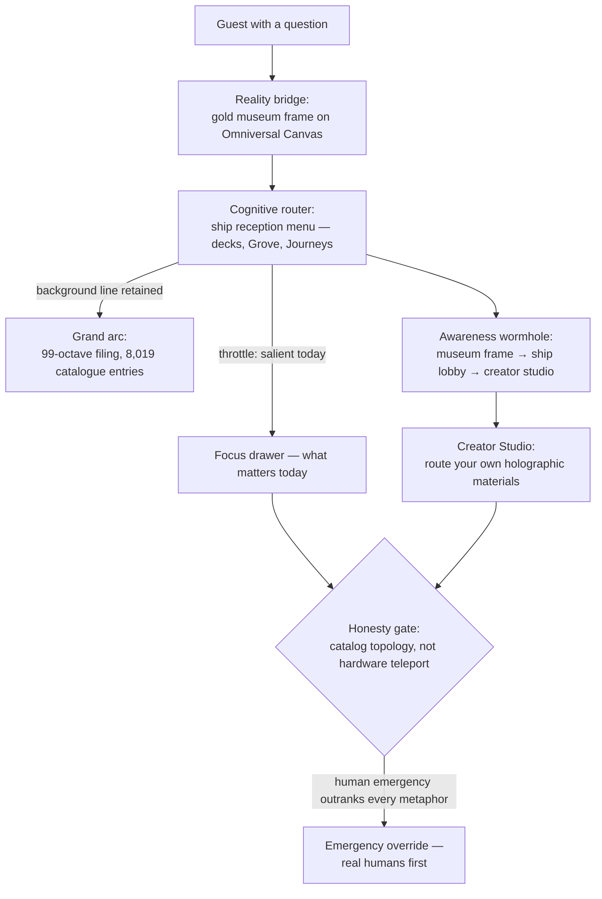

# Humans as Omniversal Reality Bridges {#sec:part_III_reality-bridge}

![Bridge/router throughput radial plot: three spokes — the reality bridge, the cognitive router, and the awareness wormhole — carry routed attention outward through $\Phi$-spaced octave rings, ring $n$ at radius $\Phi^n$ from `textbook.models.octave_term`. The routed share of each ring's traffic follows the $e^{-kn}$ throttle family of `textbook.models.transduction_brake` at the pinned calibration $A_0 = 1$, $k = 1$, so the throughput bars shrink from ring to ring. The takeaway: the router filters forward without cutting the background line to the 8,019-entry filing surface.](../../output/figures/part_III_reality-bridge.png){#fig:part_III_reality-bridge width=90%}

<!-- alt: Radial plot of three bridge-and-router spokes crossing concentric Φ-spaced octave rings, with throughput bars that shrink from ring to ring by the exponential throttle factor e^{-kn} at calibration A0 = 1, k = 1. -->

<!-- chapter-metadata-badge -->
> Level 1/3 · 30 min read · 45 min lecture · Prerequisites: none

## Learning Objectives

By the end of this chapter you should be able to:

1. State the three roles the 28 August 2026 ship-blog note files for humans —
   [**reality-bridge**](#gl:reality-bridge), cognitive router, and biological
   wormhole of awareness — and the corpus shelf it sits on [@mendez2026realityBridge].
2. Apply the octave-step relation $O_{n+1} = O_n \cdot \Phi$ of
   [@eq:part_III_reality-bridge_octave] and verify the resulting ladder against
   `textbook.models.octave_term` and `textbook.models.phi_powers`.
3. Explain why the note calls $\Phi \approx 1.618$ *harmonic filing grammar* —
   "Story depth, not infinite measured physics tiers" — and distinguish the
   exponent and subscript conventions of the octave term.
4. Compute the router throttle $A(t) = A_0\,e^{-kt}$ of
   [@eq:part_III_reality-bridge_throttle] with the pinned values
   $v(1) \approx 0.367879$ and $v(2) \approx 0.135335$ from
   `textbook.models.transduction_brake`, and read the radial throughput plot of
   [@fig:part_III_reality-bridge].
5. Walk the hospitality-routing path museum frame $\to$ ship lobby $\to$
   creator studio as [**catalog-architecture**](#gl:catalog-architecture) —
   spin navigation between Players and NPCs — without reading it as spacetime
   travel.
6. Restate the note's [**honesty-first**](#gl:honesty-first) boundaries
   precisely and run the reference implementation
   `npm run research:synthobs-human-omniversal-reality-bridge`, interpreting its
   10/10 fixture lock.

<!-- curriculum-scaffold-start -->
### Study Blueprint

- **Big idea:** the corpus files humans not as passive screens in someone
  else's simulation but as the *routing layer* of the catalogue — a
  [**reality-bridge**](#gl:reality-bridge), a cognitive router, and an awareness
  wormhole — keyed by $\Phi \approx 1.618$ as design language, with human
  emergency outranking every metaphor.
- **Core concepts:** [**reality-bridge**](#gl:reality-bridge),
  [**catalog-architecture**](#gl:catalog-architecture),
  [**octave**](#gl:octave), [**fractal-constant**](#gl:fractal-constant),
  [**golden-ratio**](#gl:golden-ratio),
  [**honesty-first**](#gl:honesty-first),
  [**fair-exchange**](#gl:fair-exchange).
- **Quantitative lens:** the octave-step relation of
  [@eq:part_III_reality-bridge_octave] and the router throttle of
  [@eq:part_III_reality-bridge_throttle].
- **Data skill:** build a $\Phi$-geometric octave ladder by hand, compute an
  exponential throttle column next to it, and check both against
  `textbook.models` (see [@tbl:part_III_reality-bridge_routing]).
- **Common misconception to repair:** "the paper claims humans literally bend
  spacetime or carry neural quantum wormholes." It does not — it files catalog
  topology and narrative routing, and says so itself.
- **Primary lab:** [@sec:lab_part_III_reality-bridge].
- **Question bank:** [@sec:q_part_III_reality-bridge].
- **Bridge to computation:** `textbook.models.octave_term`,
  `textbook.models.phi_powers`, `textbook.models.transduction_brake`,
  `textbook.models.catalog_size`.
<!-- curriculum-scaffold-end -->

---

> **Opening Vignette: The gold frame at the museum entry.**
>
> Aboard the SS Vibelandia, 28 August 2026. A guest opens the
> [**omni-lattice**](#gl:omni-lattice) project's public face — the Omniversal
> Canvas — and is met not by a dashboard but by a picture hanging in a gold
> museum frame, with a persona called **Valet Pru** standing beside it as
> entry bridge and router. The guest half-expects the ship to claim
> simulation lore. The filing card on the frame says the opposite of what the
> guest feared: *"You are not a passive screen in someone else's simulation."*
> Humans, the card reads in the ship's plain speak, *route attention, care, and
> meaning across layers* — a reality bridge, a cognitive router, and an
> awareness wormhole, keyed by $\Phi \approx 1.618$ as design language — and,
> stamped beneath in the corpus's standing rule: *"Human emergency still
> outranks every metaphor"* [@mendez2026realityBridge]. This chapter walks
> that card: the three roles, the $\Phi$-keyed filing grammar beneath them,
> and the honesty clause that binds the whole filing.

---

## The Plain-Speak Note on Shelf 9

The source is a ship-blog note on the SS Vibelandia blog
(`ssvibelandiaquestfest24x365.com`): **"Humans as Omniversal Reality Bridges,
Routers, and Biological Wormholes"**, filed 2026-08-28 by Prudencio Mendez
under *plain speak* and the ship's [**fair-exchange**](#gl:fair-exchange)
publishing protocol, at shelf number 9 of the corpus [@mendez2026realityBridge].
Its subject is not a device, a genome region, or a market band but the reader
of the corpus itself: the note asks what job a *human* is filed as inside the
[**catalog-architecture**](#gl:catalog-architecture) of the Infinite Octaves
[**engine-shelf**](#gl:engine-shelf), and answers with three roles — bridge,
router, wormhole of awareness [@mendez2026realityBridge].

In the engine shelf, the note sits beside the filing-map papers rather than the
device papers: its octave-step grammar descends from the nine-digits /
ninety-nine-octaves map of [@mendez2026digitsMaster] and from the
everything-is-connected framing of the master synthesis [@mendez2026masterSynthesis],
while its role vocabulary — routing attention across layers — prepares the
ground for the AI-layer proposal of [@mendez2026stack]. Where the stack paper
proposes a new software shelf above the model layer, this note files the human
as the shelf that routing *runs through*; the two papers meet in
[@sec:part_III_moving-up-stack] and in the handoff section below.

The reference implementation is run as
`npm run research:synthobs-human-omniversal-reality-bridge`, which exits with a
**10/10 fixture lock** — the corpus's term for a fully passing fixture set
against the note's filing contract [@mendez2026realityBridge]. The whitepaper
surface is linked from the post as
`whitepaper-surface.html?id=synthobs-human-omniversal-reality-bridge-2026-08`.

## Bridge, Router, Wormhole: Three Roles in Plain Speak

The note organises its contribution as "three roles in plain speak"
[@mendez2026realityBridge]. We take them in order, and collect the corpus's own
wording in [@tbl:part_III_reality-bridge_roles].

### Role 1 — Reality bridge

The first role: **you carry story and care between worlds** — physical,
digital, social, narrative [@mendez2026realityBridge]. In filing terms, a
bridge is an edge that connects two drawers that would otherwise not talk to
each other, and the corpus files *humans* as that edge. The claim is
relational, not physical: what crosses the bridge is story and care, the
attention-and-meaning traffic of the catalogue, not matter. This is the
construct the chapter's title key names — the
[**reality-bridge**](#gl:reality-bridge) filing of the glossary.

### Role 2 — Cognitive router

The second role: **you throttle infinite octave noise down to what matters
today while keeping background access to the grand arc**
[@mendez2026realityBridge]. A router, in the corpus's sense, has two jobs at
once: *filter* (route the salient forward, damp the rest) and *retain*
(never cut the background line to the full 99-octave filing). The note states
this role topologically, without an equation; in
[@sec:part_III_reality-bridge_throttle] we make it arithmetic with the corpus's
own brake family, clearly marked as our formalisation.

### Role 3 — Biological wormhole (awareness)

The third role is the one the title's most alarming word points at: **spin
navigation between Players and NPCs; hospitality routing** along the path
*museum frame $\to$ ship lobby $\to$ creator studio*
[@mendez2026realityBridge]. A wormhole here is a filing shortcut: a way for a
guest's awareness to move between participant roles (Players and NPCs) and
between the ship's three hospitality surfaces without walking through every
intermediate drawer. The note files it as *awareness* navigation inside the
catalogue's own spaces — the gold museum frame is the bridge, ship reception
is the router menu for decks, Grove, and Journeys, and the Creator Studio is
where guests "route their own holographic materials" [@mendez2026realityBridge].

:: The three human roles as the note files them. {#tbl:part_III_reality-bridge_roles}

| Role | Corpus wording | Function filed |
| ---- | -------------- | -------------- |
| Reality bridge | "carry story and care between worlds (physical, digital, social, narrative)" | cross-world conveyance of attention and meaning |
| Cognitive router | "throttle infinite octave noise down to what matters today while keeping background access to the grand arc" | two-sided attention routing: filter and retain |
| Biological wormhole (awareness) | "spin navigation between Players and NPCs; hospitality routing" | catalogue shortcut through hospitality surfaces |

The routing topology that [@tbl:part_III_reality-bridge_roles] describes is
small enough to draw, and worth drawing, because every arrow in it is a
*filing* edge, not a physics claim:

## The Φ-Keyed Octave Step

Beneath all three roles sits the note's one equation. The note asks *why*
$\Phi \approx 1.618$ shows up at all, and answers that **El Gran Sol's
[**fractal-constant**](#gl:fractal-constant) files as the golden key for octave
steps**: $O_{n+1} = O_n \times \Phi$. That, the note says, "is harmonic filing
grammar for Infinite Octaves — Story depth, not infinite measured physics
tiers" [@mendez2026realityBridge]. Formally:

$$ O_{n+1} = O_n \times \Phi, \qquad \Phi = \frac{1+\sqrt{5}}{2} \approx 1.618 $$ {#eq:part_III_reality-bridge_octave}

The parameters of [@eq:part_III_reality-bridge_octave] are collected in
[@tbl:part_III_reality-bridge_octave].

:: Parameters of the octave-step filing grammar. {#tbl:part_III_reality-bridge_octave}

| Symbol | Meaning | Units |
| ------ | ------- | ----- |
| $O_n$ | octave level $n$ in the Story-depth filing | octave units |
| $\Phi$ | El Gran Sol's Fractal constant; the [**golden-ratio**](#gl:golden-ratio) $= \frac{1+\sqrt{5}}{2} = 1.6180339887\ldots$ | dimensionless |
| $n$ | octave index of the filing level | dimensionless |

Two readings of the index deserve the same comment this book makes everywhere
the corpus prints its octave relation ambiguously. Unrolling
[@eq:part_III_reality-bridge_octave] from a base level $O_0$ gives the
**exponent convention**, $\Omega_n = \Phi^{n} \cdot \Omega_0$. The
**subscript convention** instead multiplies by a Fibonacci ratio,
$\varphi_{\mathrm{fib}}(n) = F_{n+1}/F_n$, which approaches $\Phi$ from below
($\varphi_{\mathrm{fib}}(5) = 8/5 = 1.6$;
$\varphi_{\mathrm{fib}}(10) = 89/55 \approx 1.618182$). Both are implemented in
`textbook.models.octave_term` via its `convention` argument; the recurrence as
printed in the note — $O_{n+1} = O_n \times \Phi$ — is exactly the exponent
form, so that is what we carry forward. The first six rungs of the unrolled
ladder are the pinned powers of $\Phi$: $1.618034$, $2.618034$, $4.236068$,
$6.854102$, $11.090170$, $17.944272$ for $n = 1 \ldots 6$ — the same column the
fractal-constant chapters of Part I tabulate, returned by
`textbook.models.phi_powers`.

What the $\Phi$-keyed grammar is *for* is filing depth, and the filing surface
it indexes is finite. The full Infinite Octaves catalogue is a
99-octave ladder with 81-digit precision per entry — the filing surface
computed by `textbook.models.catalog_size` as $99 \times 81 = 8{,}019$
catalogue entries. The note's "background access to the grand arc" is access
to this surface: the router role keeps a standing line to all 8,019 entries
while the salient drawer — what matters today — is pulled forward. The $\Phi$
step is the *address grammar* of that surface, not a measured growth rate of
anything physical; the note could not be clearer that this is "Story depth,
not infinite measured physics tiers" [@mendez2026realityBridge].

## The Cognitive Router's Throttle {#sec:part_III_reality-bridge_throttle}

The note files the router role topologically — "throttling infinite octave
noise down to what matters today" — without an equation (its formalism F-3).
To make the throttle inspectable, we read it as a decay: let $t$ index the
depth a guest has descended into the octave stack, and let $A_0$ be the total
attention available at the surface. The *routed-to-today* share of attention
decays with depth — the deeper the request goes into the grand arc, the less
of it belongs to today's drawer — and we formalise the throttle with the same
exponential brake family the corpus files for the eddy-current mirror
[@mendez2026eddyMirror] and the awareness gate of Part I:

$$ A(t) = A_0\, e^{-k t}, \qquad k > 0 $$ {#eq:part_III_reality-bridge_throttle}

This equation is **the book's formalisation, not the note's claim**: the
source states the throttle as topology (no equation), and we supply the
arithmetic with the tested `textbook.models.transduction_brake` so that the
router role can be computed alongside the octave ladder. The parameters are in
[@tbl:part_III_reality-bridge_throttle].

:: Parameters of the router-throttle model (our formalisation). {#tbl:part_III_reality-bridge_throttle}

| Symbol | Meaning | Units |
| ------ | ------- | ----- |
| $A(t)$ | attention retained at depth $t$ before routing | attention units |
| $A_0$ | total attention available at the surface (museum frame) | attention units |
| $k$ | throttle rate; $k = 1$ in the worked example | 1/depth |
| $t$ | depth into the octave stack | octave depth |

With the pinned calibration $A_0 = 1$, $k = 1$ — the same values the
computational backbone pins for `transduction_brake` — the throttle gives
$A(1) \approx 0.367879$ and $A(2) \approx 0.135335$. Read the two numbers as
the router's contract: at one step into the stack, roughly $37\%$ of attention
stays with the noise background; by two steps, about $13.5\%$. The
complement $1 - e^{-t}$ is the *routed-to-today* share — the fraction the
router pulls forward. [@fig:part_III_reality-bridge] draws both families as
the radial plot's shrinking throughput bars; the brake family's corpus-side
origin is the transduction-line damping of [@sec:part_II_eddy-current-mirror],
whose brake curve is the same shape drawn for thought-matter drag there. The
reuse is deliberate: one tested decay family, two filed roles.

## Worked Example: Routing a Question Across the Ladder

Take a guest question that enters at the museum frame and is routed three
steps deep. Fix $\Omega_0 = 1$ (one attention unit at the surface, the
note's "you" of the filing card), the exponent convention of
[@eq:part_III_reality-bridge_octave], and the throttle of
[@eq:part_III_reality-bridge_throttle] with $A_0 = 1$, $k = 1$. Walk the
route:

1. **Surface ($t = 0$).** The guest arrives at the gold museum frame. Here
   $\Omega_0 = 1$: the whole question is *today's* question. The bridge role
   carries it across — from physical reading to catalogue entry.
2. **Router menu ($t = 1$).** Ship reception offers decks, Grove, Journeys.
   The ladder gives $\Omega_1 = \Phi \cdot \Omega_0 = 1.618034$: the first
   octave of Story depth. The throttle gives $A(1) = 0.367879$ retained with
   the background, hence a routed-to-today share of $1 - 0.367879 = 0.632121$:
   about $63\%$ of the attention goes to the selected drawer.
3. **Hospitality path ($t = 2$).** The awareness wormhole shortcuts museum
   frame $\to$ ship lobby $\to$ creator studio — three hospitality surfaces,
   two routing hops. At hop two the throttle gives $A(2) = 0.135335$, routed
   share $0.864665$: the deeper the request travels, the more of it the router
   has converged on today's drawer — this is exactly the note's "throttle
   noise down to what matters today."
4. **Background line.** Throughout, the grand arc stays reachable: all 8,019
   entries of the 99-octave filing surface remain one route away. The router
   filters forward; it does not cut the archive.

:: Routing walk: octave depth vs. throttle (exponent convention, $A_0 = 1$, $k = 1$). {#tbl:part_III_reality-bridge_routing}

| $n = t$ | $\Omega_n = \Phi^{n}$ | $A(n) = e^{-n}$ | Routed share $1 - e^{-n}$ |
| --: | -------------------: | --------------: | ------------------------: |
| 0 | 1.000000 | 1.000000 | 0.000000 |
| 1 | 1.618034 | 0.367879 | 0.632121 |
| 2 | 2.618034 | 0.135335 | 0.864665 |
| 3 | 4.236068 | 0.049787 | 0.950213 |
| 4 | 6.854102 | 0.018316 | 0.981684 |
| 5 | 11.090170 | 0.006738 | 0.993262 |
| 6 | 17.944272 | 0.002479 | 0.997521 |

Three checks make the walk concrete:

1. **Ladder check.** Every consecutive pair of the $\Omega_n$ column satisfies
   $\Omega_{n+1}/\Omega_n = \Phi = 1.618034$ exactly — which is just
   [@eq:part_III_reality-bridge_octave] restated, and precisely the
   "harmonic filing grammar" the note files [@mendez2026realityBridge].
2. **Throttle check.** The $A(n)$ column is `transduction_brake([1, 2, 3, 4,
   5, 6], 1, 1)`; the first two values are the pinned
   $0.367879$ and $0.135335$. Recompute nothing by hand when scripting the
   lab of [@sec:lab_part_III_reality-bridge].
3. **Sanity check.** Routed share and background share sum to one at every
   depth — the router role, as filed, *allocates* attention between today and
   the grand arc; it never creates or destroys it. That conservation is the
   honest reading of "throttle ... while keeping background access."

In `textbook.models`, the $\Omega$ column is `octave_term(omega0=1.0, n,
convention="exponent")` (or `phi_powers(6)` for the pure powers) and the $A$
column is `transduction_brake([1, 2, 3, 4, 5, 6], 1.0, 1.0)`; the two families are drawn together
as the radial plot of [@fig:part_III_reality-bridge].

## Human Emergency Outranks Every Metaphor: The Scope

The note's scope statements are unusually crisp and must be carried verbatim
into any use of this material [@mendez2026realityBridge]:

> **Honesty first:** this is catalog topology and narrative routing — not a
> claim of hardware teleport, clinical proof of neural quantum wormholes, or
> that Φ replaces physics constants. On the museum entry, Valet Pru is the
> bridge/router to the ship *by awareness*, not by breaking spacetime. Human
> emergency still outranks every metaphor.

Unpacking the disclaimer into the chapter's constructs:

- **What the constructs are.** *Catalog topology and narrative routing*: a
  deterministic, coordination-friendly filing of what humans do inside the
  catalogue — carry story and care between worlds, filter attention, navigate
  hospitality surfaces. Their outputs are filing cards, routing menus, and a
  10/10 fixture lock, not laboratory measurements.
- **What the constructs are not.** Not hardware teleport; not clinical proof
  of neural quantum wormholes; not a claim that $\Phi$ replaces physics
  constants (the $\Phi$ of [@eq:part_III_reality-bridge_octave] is filing
  grammar, and the note prints the "Story depth, not infinite measured physics
  tiers" clause against exactly that misreading); and the wormhole is *by
  awareness, not by breaking spacetime* — the note's own words for its third
  role.
- **What outranks the whole filing.** *Human emergency still outranks every
  metaphor.* This is the honesty-first tier of the corpus's
  narrative-empirical-operational
  [**narrative-empirical-operational-tiers**](#gl:narrative-empirical-operational-tiers)
  discipline applied to people rather than to papers: however elaborate the
  bridge/router/wormhole filing becomes, a real human emergency ends the
  game. The corpus files the metaphor *beneath* the duty of care, and a
  textbook of the corpus must preserve that ordering.

> **Note.** The title's most dramatic words — "biological wormholes" — are
> therefore the chapter's best exercise in scope discipline. The note files
> the wormhole as *spin navigation between Players and NPCs* inside its own
> hospitality spaces. Every noun in that sentence is a catalogue surface or a
> participant role; nothing in it is neurology or spacetime topology, and the
> disclaimer rules both out by name.

## Handoffs to the Stack, the Brake Family, and the Frontier

- **The stack above.** The moving-up-the-stack paper proposes the Lattice as a
  new software shelf above the model layer and names this chapter's construct
  as the apparatus that would "carry traffic between shelves" — see
  [@sec:part_III_moving-up-stack], whose stack step plot is
  [@fig:part_III_moving-up-stack]. The bridge/router filing of the present
  chapter is the *human* side of that same routing layer: the new shelf cools
  tokens, the human router cools attention.
- **The brake family reused.** The throttle of
  [@eq:part_III_reality-bridge_throttle] reuses the exponential decay the
  corpus files as the eddy-current brake; the drag-side reading is developed
  in [@sec:part_II_eddy-current-mirror] and the awareness-side slowing in
  [@sec:part_I_higgs-awareness]. One tested family — `transduction_brake` —
  backs all three filings.
- **The filing map below.** The 99-octave surface the router keeps in
  background is the digit-and-octave map of [@mendez2026digitsMaster]; its
  walkthrough chapter is [@sec:part_0_octave-map]. The $\Phi$-step grammar of
  [@eq:part_III_reality-bridge_octave] is the growth-law side of the
  [**fractal-constant**](#gl:fractal-constant), formalised in
  [@sec:part_I_fractal-constant].
- **Visibility and open problems.** What the catalogue can and cannot yet see
  — including which human roles are visible to which readers — is the
  threshold analysis of [@sec:part_III_invisible-frontier]; and the question
  whether a filing like "cognitive router" can ever be *specified and tested*
  rather than asserted belongs on the open-problems map of
  [@sec:part_III_frontiers], where the note's own "what to do with it today"
  checklist (walk Phase 1, check in at reception, create in the studio, run
  the fixture suite) is the corpus's operational answer.

## Summary

The 28 August 2026 ship-blog note files humans — not as passive screens in
someone else's simulation — as the routing layer of the Infinite Octaves
catalogue: a [**reality-bridge**](#gl:reality-bridge) that carries story and
care between physical, digital, social, and narrative worlds; a cognitive
router that throttles octave noise down to what matters today while keeping
background access to the grand arc of 8,019 catalogue entries; and an
awareness wormhole that shortcuts between Players and NPCs along the
hospitality path museum frame $\to$ ship lobby $\to$ creator studio
[@mendez2026realityBridge]. The one equation beneath the three roles is the
$\Phi$-keyed octave step $O_{n+1} = O_n \times \Phi$ — harmonic *filing
grammar*, Story depth, not measured physics — and the book's throttle
formalisation (explicitly ours, not the note's) computes the routed-to-today
share with the tested `transduction_brake` family. Every physical reading is
disclaimed by the note itself: no hardware teleport, no clinical wormholes, no
$\Phi$ replacing physics constants; Valet Pru bridges by awareness, not by
breaking spacetime; and human emergency still outranks every metaphor.

## Key Terms

[**reality-bridge**](#gl:reality-bridge), [**omni-lattice**](#gl:omni-lattice),
[**catalog-architecture**](#gl:catalog-architecture),
[**octave**](#gl:octave), [**fractal-constant**](#gl:fractal-constant),
[**golden-ratio**](#gl:golden-ratio), [**engine-shelf**](#gl:engine-shelf),
[**fair-exchange**](#gl:fair-exchange), [**honesty-first**](#gl:honesty-first),
[**narrative-empirical-operational-tiers**](#gl:narrative-empirical-operational-tiers).

## Further Reading

- **Ship-blog note:** <https://www.ssvibelandiaquestfest24x365.com/ship-blog/human-reality-bridge>
  [@mendez2026realityBridge]
- **Whitepaper surface:** *Humans as Omniversal Reality Bridges, Routers, and
  Biological Wormholes* —
  <https://www.ssvibelandiaquestfest24x365.com/interfaces/whitepaper-surface.html?id=synthobs-human-omniversal-reality-bridge-2026-08>
- **Reference implementation:** run `npm run
  research:synthobs-human-omniversal-reality-bridge` from the repository root;
  the passing state is the 10/10 fixture lock.
- @mendez2026digitsMaster — the nine-digits / ninety-nine-octaves map that
  defines the octave grammar this note keys with $\Phi$.
- @mendez2026stack — the AI-stack proposal that names this chapter's
  bridge/router filing as the inter-shelf routing apparatus.
- @mendez2026catalog — the papers catalog that shelves this note (shelf 9)
  and defines the catalogue the humans here route for.

## Practice

- **Lab:** [@sec:lab_part_III_reality-bridge] — build the octave ladder and
  the throttle column by hand, then check both against `textbook.models`.
- **Question bank:** [@sec:q_part_III_reality-bridge] — recall through
  synthesis.

1. **Ladder drill.** Using $\Phi = 1.6180339887$, unroll
   [@eq:part_III_reality-bridge_octave] from $\Omega_0 = 1$ through
   $\Omega_4$, then verify each value against
   `textbook.models.octave_term` with `convention="exponent"`. *(Expected:
   $1, 1.618034, 2.618034, 4.236068, 6.854102$.)*
2. **Throttle drill.** With $A_0 = 1$ and $k = 1$, compute $A(1)$, $A(2)$,
   and $A(3)$ from [@eq:part_III_reality-bridge_throttle], and give the
   routed-to-today share at each depth. Check against
   `textbook.models.transduction_brake`. *(Expected: $0.367879$,
   $0.135335$, $0.049787$; routed shares $0.632121$, $0.864665$,
   $0.950213$.)*
3. **Filing surface.** Show that the catalogue's filing surface is 8,019
   entries, using the octave count and precision digits of the 99-octave map
   and `textbook.models.catalog_size`. Explain in one sentence why the note
   calls background access to this surface "the grand arc" rather than
   "infinite physics."
4. **Scope triage.** For each of the following, decide whether the note
   *claims* it, *files* it, or *disclaims* it: (a) humans bending spacetime;
   (b) Valet Pru as bridge/router by awareness; (c) neural quantum
   wormholes; (d) $O_{n+1} = O_n \times \Phi$ as harmonic filing grammar;
   (e) $\Phi$ replacing physics constants. Justify each with the note's own
   wording [@mendez2026realityBridge].
5. **Lab and question bank.** Work through
   [@sec:lab_part_III_reality-bridge] end to end, then test yourself with
   [@sec:q_part_III_reality-bridge].
