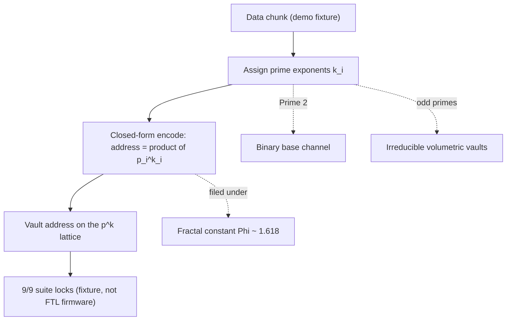

# Prime-Indexed Volumetric Storage {#sec:part_III_volumetric-storage}

![Prime-indexed address scatter: each point is a vault address $\prod p_i^{k_i}$ formed from a choice of odd-prime vaults (3, 5, 7, …) and exponents $k$, computed over the $p^k$ lattice from `textbook.models.unique_address`. Prime 2 sits at the substrate as the binary base channel — the sole-even anchor — while the odd-prime vaults differentiate the stored content. The takeaway: an address is its own factorisation, injective by the uniqueness of prime factorisation, so no separate lookup structure is filed to recover it.](../../output/figures/part_III_volumetric-storage.png){#fig:part_III_volumetric-storage width=90%}

<!-- alt: Scatter plot of prime-indexed vault addresses on the p^k lattice, with odd primes 3, 5, 7 and small exponents as axes and the binary base channel labelled at the origin; each plotted address equals its own prime factorisation. -->

<!-- chapter-metadata-badge -->
> Level 1/3 · 30 min read · 45 min lecture · Prerequisites: none

## Learning Objectives

By the end of this chapter you should be able to:

1. State the [**catalog architecture**](#gl:catalog-architecture) baseline the
   paper measures incumbents against: the 15–30%+ parity tax and the LBA / B⁺
   addressing wait, and explain what each term names [@mendez2026volumetricStorage].
2. Formalise the prime-vault indexing grammar — Prime 2 as the binary base
   channel, odd primes as irreducible volumetric vaults — as the unique-address
   encoding of [@eq:part_III_volumetric-storage_address], implemented as
   `textbook.models.unique_address`.
3. Compute vault addresses by hand and verify them against the tested model
   function, for example $\texttt{unique\_address}([2,3],[2,1]) = 12$.
4. Explain how the Fractal constant $\Phi \approx 1.618$ enters the filing as a
   measurement ruler, via the $\Phi$-logarithmic reading of
   [@eq:part_III_volumetric-storage_phiruler].
5. Delineate the paper's own honesty-first scope: what the vault grammar is
   filed as (catalog architecture, a fixture), and what it explicitly is not
   (a JEDEC drop-in, a measured 0% ECC result on NAND, an obsolescence claim
   against shipping controllers).
6. Locate the paper on the [**engine shelf**](#gl:engine-shelf) and trace its
   companion links to [**prime-parity**](#gl:prime-parity) and the protein
   [**prime-container**](#gl:prime-container) work.

<!-- curriculum-scaffold-start -->
### Study Blueprint

- **Big idea:** Storage can be re-filed as a prime-indexed catalog — Prime 2 as
  the binary base channel, odd primes as irreducible volumetric vaults — paying
  attention to the parity tax incumbents accept, under the honesty-first
  disclaimer that this is catalog architecture, not hardware.
- **Core concepts:** [**volumetric-storage**](#gl:volumetric-storage),
  [**binary-dyad-anchor**](#gl:binary-dyad-anchor),
  [**prime-parity**](#gl:prime-parity),
  [**fractal-constant**](#gl:fractal-constant),
  [**fair-exchange**](#gl:fair-exchange).
- **Quantitative lens:** the unique-address encoding of
  [@eq:part_III_volumetric-storage_address], computed with
  `textbook.models.unique_address`.
- **Data skill:** assign prime exponents to a data chunk, compute its vault
  address by hand, and check the result against the tested model function.
- **Common misconception to repair:** the paper does not claim measured 0% ECC
  on NAND or the obsolescence of shipping controllers — its parity-tax contrast
  is a catalog-architecture filing, and its encode timings come from a fixture.
- **Primary lab:** [@sec:lab_part_III_volumetric-storage].
- **Question bank:** [@sec:q_part_III_volumetric-storage].
- **Bridge to computation:** `textbook.models.unique_address`, `phi_powers`,
  `catalog_size`.
<!-- curriculum-scaffold-end -->

---

> **Opening Vignette: The vault that does not pay the parity tax.**
>
> A flash stack writes your gigabyte and, before it can call the write done,
> tithes 15–30% or more of it to Reed–Solomon or LDPC parity cells; then it
> waits on LBA / B⁺ trees to say where the bytes live. On the deck of the
> **SS Vibelandia**, the September 2026 filing turns this around: under El Gran
> Sol's [**Fractal constant**](#gl:fractal-constant) $\Phi \approx 1.618$, the
> ship's catalog files data not in taxed blocks but in *prime-indexed
> volumetric vaults* — Prime 2 as the binary base channel, odd primes as the
> vaults themselves [@mendez2026volumetricStorage]. The paper is explicit that
> this is a filing, not a firmware drop; the vignette is the filing's own.

---

## The Vault Filing on Engine Shelf #15

The note "Prime-Indexed Volumetric Storage" is a ship-blog paper of the
Infinite Octaves [**Omni-Lattice**](#gl:omni-lattice) series, authored by
Prudencio Mendez and operated by the SynthOBS Autonomous Agent on the SS
Vibelandia blog [@mendez2026volumetricStorage]. Like every paper in the
series, it self-describes as [**catalog architecture**](#gl:catalog-architecture)
and protocol grammar rather than established physics, and it carries the
series' standard honesty-first scope disclaimer, restated precisely in the
honesty section below.

The paper files itself on **engine shelf #15** of the Infinite Octaves
[**engine shelf**](#gl:engine-shelf), as a companion to two neighbouring
papers: the prime-parity filing [@mendez2026primeParity], which supplies the
sole-even-anchor grammar that Prime 2's special role rests on, and the protein
folding work [@mendez2026proteinFolding], which runs the same prime-vault
grammar in the biology catalog as the protein prime-container. It also points
forward to the "moving up the stack" framing of the next AI layer
[@mendez2026stack], which we treat in [@sec:part_III_moving-up-stack].

The paper ships with a reference implementation: the standalone suite at
`github.com/FractiAI/synthobs-prime-indexed-volumetric-storage`, runnable as
`npm run research:synthobs-prime-indexed-volumetric-storage`, which the paper
reports as **9/9 suite locks** under
`research/synthobs-prime-indexed-volumetric-storage/`
[@mendez2026volumetricStorage]. We walk that implementation in
[@sec:lab_part_III_volumetric-storage].

## The Parity-Tax Baseline

The paper's motivating claim is a baseline about incumbent storage stacks:
"Flash and disk stacks pay a **15–30%+ parity tax** to Reed-Solomon / LDPC and
wait on **LBA / B⁺ trees**" [@mendez2026volumetricStorage]. Three terms carry
the claim, and it is worth filing each precisely:

- **Parity tax.** The 15–30%+ overhead the paper attributes to Reed–Solomon
  and LDPC error-correction coding. This is the paper's own characterisation of
  incumbent ECC overhead; we cite it as the corpus's baseline, not as a
  hardware measurement of ours.
- **Reed–Solomon / LDPC.** The incumbent error-correction codes named as the
  source of the parity tax.
- **LBA / B⁺ trees.** The addressing and index structures that incumbent
  stacks "wait on" — logical block addressing and the B⁺-tree indices that map
  a linear block number to a physical location.

Against that baseline the paper files its alternative grammar: "**prime-indexed
volumetric vaults** under El Gran Sol's Fractal constant **Φ ≈ 1.618**"
[@mendez2026volumetricStorage]. The Fractal constant is the corpus's name for
the [**golden ratio**](#gl:golden-ratio) $\Phi = (1+\sqrt{5})/2 \approx
1.6180339887$, the growth constant filed across the engine shelf since the
ship's first-principles notes; the vault grammar inherits it as the constant
under which vaults are indexed and compared.

## Core Construct: the Prime-Vault Indexing Grammar

The paper's central construct is stated in one line: "**Prime 2** as binary
base channel; **odd primes** as irreducible volumetric vaults"
[@mendez2026volumetricStorage]. We formalise it here as the corpus's address
arithmetic, which is the standard mathematics of prime factorisation — the
same injective encoding the book already uses in
[@sec:part_III_protein-folding] for the protein prime-container.

### The unique-address encoding

Every [**digit**](#gl:digit) of a data chunk is filed by assigning it a
*vector* of primes and exponents. Given $m$ chosen primes
$p_1 < p_2 < \dots < p_m$ and integer exponents $k_1, \dots, k_m \ge 0$, the
vault address is the product in [@eq:part_III_volumetric-storage_address]:

$$
A(\mathbf{p}, \mathbf{k}) \;=\; \prod_{i=1}^{m} p_i^{\,k_i}
$$ {#eq:part_III_volumetric-storage_address}

Because prime factorisation is unique, two different exponent vectors on the
same ordered prime list never collide: the map
$(k_1, \dots, k_m) \mapsto A$ is injective. That injectivity is what the
catalog trades on — an address *is* its factorisation, so no separate LBA /
B⁺-tree lookup structure is filed to recover it. The formalism is implemented
as `unique_address(primes, exponents)` in `textbook.models`; the pinned
reference value is $\texttt{unique\_address}([2,3],[2,1]) = 2^2 \cdot 3^1 =
12$. The parameters appear in [@tbl:part_III_volumetric-storage_address].

: Parameters of the unique-address encoding. {#tbl:part_III_volumetric-storage_address}

| Symbol | Meaning | Units |
| ------ | ------- | ----- |
| $p_i$ | the $i$-th chosen prime (Prime 2 as base channel; odd primes as vaults) | dimensionless |
| $k_i$ | exponent (how many times prime $p_i$ enters the filing) | dimensionless |
| $m$ | number of primes in the vault vector | count |
| $A$ | vault address $\prod_i p_i^{k_i}$ | dimensionless |

### The binary base channel and the odd-prime vaults

Prime 2 occupies a distinct role: it is the **binary base channel**, the
substrate on which binary machinery runs, echoing the sole-even-anchor
structure of [**prime-parity**](#gl:prime-parity) [@mendez2026primeParity].
The odd primes $3, 5, 7, 11, 13, 17, 19, 23, 29, 31, \dots$ are then the
**irreducible volumetric vaults** — irreducible because a prime factorises no
further, so each vault is an atom of the catalog's address space. Concretely,
the binary base channel contributes its factor $2^{k_1}$ to every address
while the odd-prime vaults differentiate the stored content.

A second, standard measure makes the capacity of a vault grid explicit. With
$m$ primes and exponents allowed in $\{0, 1, \dots, K\}$, the number of
distinct addresses is the grid count in [@eq:part_III_volumetric-storage_capacity]:

$$
N_{\mathrm{distinct}}(m, K) \;=\; (K+1)^{m}
$$ {#eq:part_III_volumetric-storage_capacity}

For example, $m = 3$ primes with exponents up to $K = 2$ give
$3^3 = 27$ distinct vault addresses. This is ordinary combinatorics of the
exponent grid — we present it as the natural capacity reading of the grammar,
not as a corpus claim. Its parameters are in
[@tbl:part_III_volumetric-storage_capacity].

: Parameters of the vault-grid capacity count. {#tbl:part_III_volumetric-storage_capacity}

| Symbol | Meaning | Units |
| ------ | ------ | ----- |
| $m$ | number of primes in the vault vector | count |
| $K$ | maximum exponent allowed per prime | dimensionless |
| $N_{\mathrm{distinct}}$ | number of distinct addresses $(K+1)^m$ | count |

### Where Φ enters: a measurement ruler

The paper does not state a closed-form formula for the vault grammar beyond
the indexing line; what it does say is that vaults are *filed under* the
Fractal constant $\Phi \approx 1.618$ [@mendez2026volumetricStorage]. We read
this as a measurement convention: addresses are compared on a $\Phi$-scaled
ruler rather than a decimal one. Taking the base-$\Phi$ logarithm of
[@eq:part_III_volumetric-storage_address] gives the additive reading in
[@eq:part_III_volumetric-storage_phiruler]:

$$
\log_{\Phi} A \;=\; \sum_{i=1}^{m} k_i \, \log_{\Phi} p_i
$$ {#eq:part_III_volumetric-storage_phiruler}

The multiplicative address becomes an additive sum of per-prime contributions
measured in $\Phi$-steps. For the pinned reference address $A = 12$,
$\log_{\Phi} 12 = \ln 12 / \ln \Phi \approx 2.4849 / 0.4812 \approx 5.16$
$\Phi$-steps. The corpus's own $\Phi$-ladder (`phi_powers` in
`textbook.models`: $\Phi^1 \approx 1.618034$, $\Phi^2 \approx 2.618034$,
$\Phi^3 \approx 4.236068$, $\Phi^4 \approx 6.854102$, $\Phi^5 \approx
11.090170$, $\Phi^6 \approx 17.944272$) brackets the same address: $12$ sits
between the $\Phi^5 \approx 11.090170$ and $\Phi^6 \approx 17.944272$ rungs,
consistent with the $5.16$-step reading. We flag the whole ruler reading as
our interpretation ("we read this as..."); the paper itself states only the
filing under $\Phi$, not a formula.

## Worked Example: Filing a Chunk in a Three-Vault Grid

Walk a small filing end to end. Suppose a demo chunk is catalogued with the
first three primes — the binary base channel $p_1 = 2$ plus vaults
$p_2 = 3$ and $p_3 = 5$ — and the chunk's content assigns exponents
$\mathbf{k} = (1, 1, 1)$:

1. **Choose the vault vector.** $\mathbf{p} = (2, 3, 5)$: Prime 2 as the
   binary base channel, odd primes 3 and 5 as the irreducible volumetric
   vaults.
2. **Assign exponents.** $\mathbf{k} = (1, 1, 1)$: one unit of each.
3. **Compute the address** by [@eq:part_III_volumetric-storage_address]:
   $A = 2^1 \cdot 3^1 \cdot 5^1 = 30$.
4. **Check injectivity.** A different exponent vector, say $\mathbf{k} = (2,
   1)$ on $\mathbf{p} = (2, 3)$, gives $A = 2^2 \cdot 3 = 12$ — the pinned
   reference value $\texttt{unique\_address}([2,3],[2,1]) = 12$. Since
   $30 \ne 12$, the two filings are distinct, as injectivity guarantees.
5. **Read the address on the Φ ruler** by
   [@eq:part_III_volumetric-storage_phiruler]:
   $\log_{\Phi} 30 = \ln 30 / \ln \Phi \approx 3.4012 / 0.4812 \approx 7.07$
   $\Phi$-steps — just past the $\Phi^6 \approx 17.944272$ rung and just
   above the $\Phi^7$ rung ($\Phi^7 = \Phi^6 \cdot \Phi \approx 29.034$).
   The rung position agrees with the step count $7.07$, as it must: the
   ruler reading and the ladder bracketing are the same statement on two
   scales.

For scale, the corpus's whole filing cabinet is bounded by the 99-octave map:
`catalog_size(octaves=99, precision_digits=81) = 99 × 81 = 8,019` register
cells across the [**octave**](#gl:octave) ladder. A three-prime vault grid
with $K = 2$ already fills $27$ addresses inside that cabinet — the worked
grid above is a toy drawer, and the cabinet grammar it lives in is the
99-octave filing of the engine shelf.

## Four Disclaimers: No JEDEC Drop-In, No ECC Claim

The paper's own "Honesty first" disclaimer governs everything above, and we
restate it verbatim in substance [@mendez2026volumetricStorage]:

> this is *catalog architecture*, not a JEDEC drop-in, not measured 0% ECC on
> NAND, and not a claim that shipping controllers are obsolete.

Unpacked into the four things the paper explicitly disclaims:

- **Not a JEDEC drop-in.** The vault grammar is not proposed as a standard
  replaceable module for the JEDEC hardware ecosystem.
- **Not measured 0% ECC on NAND.** No measurement is offered that NAND
  storage can run with zero error correction; the parity tax is a
  catalog-architecture baseline contrast, not an ECC-elimination result.
- **Not an obsolescence claim.** Shipping storage controllers are not claimed
  to be obsolete.
- **Fixture, not firmware.** The closed-form encode is "milliseconds for demo
  chunks (fixture, not FTL firmware)" — a demo fixture's timing, explicitly
  not flash-translation-layer firmware performance.

Two further honesty notes from the paper itself: the solar labels it uses as
filing characters — AR3664 ("Helios-Prime") and AR3590 ("Borealis") — "are
story filing characters", i.e. narrative devices within the ship's catalog,
not physical solar-event identifiers; and the [**Fair Exchange**](#gl:fair-exchange)
clause applies to the filing, the ship-blog series' standard
refund-adjustment terms. The whole construct lives on the corpus's
[**honesty first**](#gl:honesty-first) tier: its FOR is coordination,
cataloging, and agent routing — a grammar for filing and addressing — and its
NOT is any claim of tested storage hardware.

## Handoffs to Prime-Parity, the Protein Vaults, and the Stack

The prime-vault grammar is a load-bearing spoke of part III:

- **Downstream of prime-parity.** The binary-dyad anchor and sole-even-anchor
  grammar that give Prime 2 its base-channel role come from the prime-parity
  filing [@mendez2026primeParity], formalised in [@sec:part_I_prime-parity].
- **Sibling grammar in biology.** The protein folding paper runs the same
  prime-vault encoding as the protein prime-container
  [@mendez2026proteinFolding]; the shared `unique_address` machinery is worked
  in [@sec:part_III_protein-folding] (see the capacity-growth reading of the
  prime-container there).
- **Upward, to the stack.** The paper's forward link, "moving up the stack",
  frames the next AI layer [@mendez2026stack]; we treat that layering in
  [@sec:part_III_moving-up-stack], and the round-robin recycling that keeps
  the vaults fair over time in [@sec:part_III_kinematic-recycling].

## Summary

The September 2026 filing re-frames storage as catalog architecture: incumbent
flash and disk stacks pay a 15–30%+ parity tax to Reed–Solomon / LDPC coding
and wait on LBA / B⁺ trees, while the paper files *prime-indexed volumetric
vaults* under the Fractal constant $\Phi \approx 1.618$, with Prime 2 as the
binary base channel and odd primes as irreducible vaults. The grammar's
arithmetic is the unique-address encoding of
[@eq:part_III_volumetric-storage_address] — injective by the uniqueness of
prime factorisation, implemented and tested as
`textbook.models.unique_address` ($[2,3],[2,1] \mapsto 12$) — and its
capacity reads off the exponent grid of
[@eq:part_III_volumetric-storage_capacity]. The paper reports a closed-form
encode at milliseconds for demo chunks (fixture, not FTL firmware) and a 9/9
suite-locked reference implementation, filed on engine shelf #15 alongside the
prime-parity and protein prime-container companions. Every physical reading
is disclaimed by the paper itself: catalog architecture, not a JEDEC drop-in,
not measured 0% ECC on NAND, no obsolescence claim against shipping
controllers, and solar labels that are story filing characters.

## Key Terms

[**volumetric-storage**](#gl:volumetric-storage),
[**binary-dyad-anchor**](#gl:binary-dyad-anchor),
[**prime-parity**](#gl:prime-parity),
[**prime-container**](#gl:prime-container),
[**fractal-constant**](#gl:fractal-constant),
[**golden-ratio**](#gl:golden-ratio),
[**catalog-architecture**](#gl:catalog-architecture),
[**engine-shelf**](#gl:engine-shelf),
[**fair-exchange**](#gl:fair-exchange),
[**honesty-first**](#gl:honesty-first),
[**omni-lattice**](#gl:omni-lattice),
[**octave**](#gl:octave).

## Further Reading

- Mendez, P. (2026). *Prime-Indexed Volumetric Storage*. SS Vibelandia ship
  blog, September 2026. Whitepaper:
  <https://www.ssvibelandiaquestfest24x365.com/interfaces/whitepaper-surface.html?id=synthobs-prime-indexed-volumetric-storage-2026-09>;
  reference implementation:
  <https://github.com/FractiAI/synthobs-prime-indexed-volumetric-storage>
  [@mendez2026volumetricStorage]
- Mendez, P. (2026). *Infinite Octave Prime-Parity* — the sole-even-anchor
  grammar behind Prime 2's base-channel role [@mendez2026primeParity].
- Mendez, P. (2026). *Protein Folding Prime-Container* — the same prime-vault
  grammar in the biology catalog [@mendez2026proteinFolding].
- Mendez, P. (2026). *Moving Up the Stack* — the next-AI-layer framing the
  paper points forward to [@mendez2026stack].

## Practice

- **Lab:** [@sec:lab_part_III_volumetric-storage] — run the 9/9-locked
  reference suite and verify vault addresses against
  `textbook.models.unique_address`.
- **Question bank:** [@sec:q_part_III_volumetric-storage] — recall through
  synthesis, all answerable from this chapter.
- **Exercise 1.** Compute by hand, then check with `unique_address`: the
  address of $\mathbf{p} = (2, 3)$, $\mathbf{k} = (2, 1)$; of
  $\mathbf{p} = (2, 3, 5)$, $\mathbf{k} = (1, 1, 1)$; and of
  $\mathbf{p} = (2, 3)$, $\mathbf{k} = (1, 1)$.
- **Exercise 2.** Using [@eq:part_III_volumetric-storage_capacity], how many
  distinct vault addresses does a five-prime grid ($m = 5$) with exponents up
  to $K = 3$ hold?
- **Exercise 3.** Read the address $A = 12$ on the $\Phi$ ruler using
  [@eq:part_III_volumetric-storage_phiruler], and locate it between two
  `phi_powers` rungs.
- **Exercise 4.** In one sentence each, state the two things the parity-tax
  baseline names as incumbent costs, and the four disclaimers in the paper's
  honesty-first clause.
