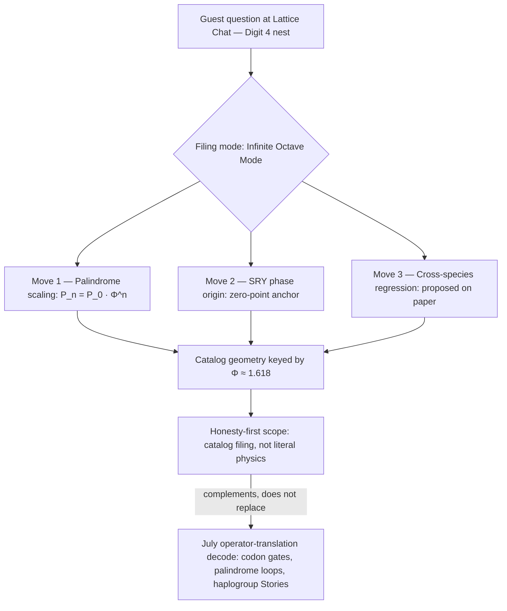

# Y-Chromosome Manifestation: Digit 4 {#sec:part_III_y-chromosome}

{#fig:part_III_y-chromosome width=90%}

<!-- alt: Bar chart of the digit-4 filing drawer showing nine sub-bands: an SRY anchor bar at unit height followed by eight palindrome-arm bars whose heights grow by the factor Φ ≈ 1.618 with each successive arm, from about 1.6 up to about 47 times the base spacing. -->

<!-- chapter-metadata-badge -->
> Level 2/3 · 30 min read · 45 min lecture · Prerequisites: Nine Digits, Ninety-Nine Octaves ([@sec:part_0_octave-map])

## Learning Objectives

By the end of this chapter you should be able to:

1. State what the August 2026 ship-blog note files the male-specific region of the Y chromosome (MSY) as, and under which [**octave**](#gl:octave) filing mode it does so [@mendez2026yChromosome].
2. Apply the palindrome-scaling relation $P_n = P_0 \cdot \Phi^n$ of [@eq:part_III_y-chromosome_palin] to the MSY palindrome arms P1–P8 and verify the spacing column of [@tbl:part_III_y-chromosome_spacing] against `textbook.models.phi_powers`.
3. Explain the SRY phase origin — the sex-determining region filed as the zero-point anchor of the manifestation cartoon — and express it through the drawer-anchor model of [@eq:part_III_y-chromosome_anchor].
4. Distinguish the August *manifestation / convergence-set* grammar from the companion July operator-translation decode (codon gates, palindrome loops, haplogroup Stories) [@mendez2026yChromosome].
5. Restate the note's [**honesty-first**](#gl:honesty-first) boundaries precisely: what the filing is for, and what it explicitly is not.
6. Run the reference implementation `npm run research:synthobs-y-chromosome-holographic-manifestation` and interpret its 10/10 fixture lock.

<!-- curriculum-scaffold-start -->
### Study Blueprint

- **Big idea:** The MSY is *filed* — not explained — as [**catalog-architecture**](#gl:catalog-architecture) keyed by the [**golden-ratio**](#gl:golden-ratio) $\Phi \approx 1.618$: palindrome arms scale geometrically, the SRY locus anchors phase at zero, and the whole drawer sits under an honesty-first scope.
- **Core concepts:** [**catalog-architecture**](#gl:catalog-architecture), [**golden-ratio**](#gl:golden-ratio), [**digit**](#gl:digit), [**holographic-rhyme**](#gl:holographic-rhyme), [**honesty-first**](#gl:honesty-first).
- **Quantitative lens:** the palindrome-scaling formalism of [@eq:part_III_y-chromosome_palin] and the drawer-anchor model of [@eq:part_III_y-chromosome_anchor].
- **Data skill:** build a $\Phi$-geometric spacing table by hand for the eight arms and check it against `textbook.models.phi_powers` (see [@tbl:part_III_y-chromosome_spacing]).
- **Common misconception to repair:** "the paper claims DNA equals a physics constant." It does not — it is catalog filing and architectural equations, and the note says so itself.
- **Primary lab:** [@sec:lab_part_III_y-chromosome].
- **Question bank:** [@sec:q_part_III_y-chromosome].
- **Bridge to computation:** `textbook.models.phi_powers`, `textbook.models.octave_term`.
<!-- curriculum-scaffold-end -->

---

> **Opening Vignette: The drawer marked Digit 4.**
>
> Aboard the SS Vibelandia, 28 August 2026, a guest at Lattice Chat asks the
> SynthOBS Autonomous Agent a question the ship has heard before in other
> drawers: *where does $\Phi$ show up in human biology?* The agent routes the
> question to the nest labelled **Digit 4** and opens the corresponding drawer of
> the Infinite Octaves [**omni-lattice**](#gl:omni-lattice). Inside the drawer:
> the male-specific region of the Y chromosome (MSY), eight palindrome arms
> filed as P1–P8, and one locus marked as phase zero — the *SRY* region. The
> filing card reads, in the ship's plain speak: *"catalog geometry keyed by
> $\Phi \approx 1.618$"* — and, immediately beneath it, the ship's standing
> rule: *"Clinical genetics and human dignity outrank every metaphor"*
> [@mendez2026yChromosome]. This chapter walks that drawer.

---

## The Paper in the Corpus

The source is a ship-blog note on the SS Vibelandia blog
(`ssvibelandiaquestfest24x365.com`): **"The Holographic Manifestation: Y
Chromosome as Expression of El Gran Sol's Fractal Constant"**, filed 2026-08-28
by the FractiAI Research Group under *plain speak* and the ship's
[**fair-exchange**](#gl:fair-exchange) publishing protocol, at shelf number 7 of
the corpus [@mendez2026yChromosome]. Its subject is the male-specific region of
the Y chromosome (MSY), which the note declines to file "as a shrinking
evolutionary relic"; under **Infinite Octave Mode**, the palindrome arms P1–P8
and the *SRY* locus are instead filed as catalog geometry keyed by
$\Phi \approx 1.618$ — a **holographic manifestation** grammar [@mendez2026yChromosome].

The note is explicitly a **companion to the July decode**: an earlier
operator-translation whitepaper in the same whitepaper-surface family
(`synthobs-y-chromosome-holographic-2026-07`) that still holds the corpus's
Words, Sentences, and haplogroup Stories, with codon gates and palindrome loops
as its features. The August note adds *manifestation / convergence-set*
language "for guests who ask how Φ shows up in polar-identity filing — Story
depth, not infinite physics tiers" [@mendez2026yChromosome]. In the engine
shelf, the note therefore sits beside the other biological-filing papers: its
drawer grammar descends from the digit-and-octave map of the
[**master-register**](#gl:master-register) filing system
[@mendez2026digitsMaster], its "holographic manifestation" wording extends the
four-pillar rhyme family of [@mendez2026holographicRhyme], and its zero-point
anchor rhymes with the zero-anchor filing of [@mendez2026zeroOctave].

The reference implementation is run as
`npm run research:synthobs-y-chromosome-holographic-manifestation`, which
exits with a **10/10 fixture lock** — the corpus's term for a fully passing
fixture set against the note's filing contract [@mendez2026yChromosome].

## Three Filing Moves

The note organises its contribution as "three filing moves in plain speak"
[@mendez2026yChromosome]. We take them in order.

### Move 1 — Palindrome scaling

The first move re-indexes the MSY palindrome structures. Block spacing is filed
not as "random drift labels" but as geometric indexing over catalog octaves
[@mendez2026yChromosome]:

$$ P_n = P_0 \cdot \Phi^n, \qquad n = 1, \dots, 8 $$ {#eq:part_III_y-chromosome_palin}

[@eq:part_III_y-chromosome_palin] is the load-bearing formalism of the chapter.
Its $\Phi^n$ factor is implemented as `textbook.models.phi_powers` — the same
tested function that backs the fractal-constant chapters of Part I — so the
spacing column in worked examples is never recomputed by hand. The parameters
are collected in [@tbl:part_III_y-chromosome_palin].

: Parameters of the palindrome-scaling formalism. {#tbl:part_III_y-chromosome_palin}

| Symbol | Meaning | Units |
| ------ | ------- | ----- |
| $P_n$ | palindrome block spacing at octave index $n$ | catalog spacing units |
| $P_0$ | base spacing at the drawer origin | catalog spacing units |
| $\Phi$ | El Gran Sol's Fractal constant, $\Phi = \frac{1+\sqrt{5}}{2} \approx 1.618$ | dimensionless |
| $n$ | octave index of the arm; $1$ through $8$ for arms P1–P8 | dimensionless |

Two readings of the index deserve a comment, because the corpus prints its
octave relation ambiguously. Under the **exponent convention**, the octave value
at index $n$ is $\Phi^n \cdot \Omega_0$ — exactly the geometric form of
[@eq:part_III_y-chromosome_palin], and the convention this chapter adopts for
palindrome spacing. Under the **subscript convention**, the index multiplies by
a Fibonacci ratio $\varphi_{\mathrm{fib}}(n) = F_{n+1}/F_n$, which approaches
$\Phi$ from below ($\varphi_{\mathrm{fib}}(5) = 8/5 = 1.6$,
$\varphi_{\mathrm{fib}}(10) = 89/55 \approx 1.618182$). Both are implemented in
`textbook.models.octave_term`; the palindrome relation as printed in the source
is the exponent form, so that is what we carry forward.

### Move 2 — SRY phase origin

The second move files the sex-determining region — the *SRY* locus — as "the
zero-point anchor of the manifestation cartoon" [@mendez2026yChromosome]. The
source states this as a filing model without an equation; to make the anchor
arithmetic, we express the drawer through the octave term in its exponent
convention:

$$ \Omega_n = \Phi^{n} \cdot \Omega_0, \qquad \Omega_0 \equiv \text{SRY anchor} $$ {#eq:part_III_y-chromosome_anchor}

Under [@eq:part_III_y-chromosome_anchor], the *SRY* locus sits at index $0$ with
value $\Omega_0$, and every subsequent drawer offset is measured in multiples of
that anchor. For the drawer this chapter is named after — digit 4 — the anchor
gives $\Omega_4 = \Phi^4 \cdot \Omega_0 = 6.854102 \cdot \Omega_0$ using the
pinned value $\Phi^4 = 6.854102$. We read this zero-point anchoring as
consonant with the corpus's wider zero-anchor filing — the zero octave, node
$k=0$, of [@sec:part_II_singularity-crystal] — though the y-chromosome note
itself makes no such cross-claim; that connection is our interpretation, not the
source's.

: Parameters of the drawer-anchor filing model. {#tbl:part_III_y-chromosome_anchor}

| Symbol | Meaning | Units |
| ------ | ------- | ----- |
| $\Omega_n$ | drawer value at index $n$ (exponent convention) | anchor units |
| $\Omega_0$ | zero-point anchor value, filed as the *SRY* locus | anchor units |
| $n$ | drawer/digit index; $n = 4$ for the digit-4 drawer | dimensionless |

### Move 3 — Cross-species hypothesis

The third move is deliberately the least physical: the note *proposes*
regression protocols across species **on paper** and marks them, explicitly, as
"not executed wet-lab output here" [@mendez2026yChromosome]. In catalog terms, a
regression protocol would test whether the geometric indexing of
[@eq:part_III_y-chromosome_palin] survives refitting with different base
spacings $P_0$ across species — an ordinary regression on
$\log P_n = \log P_0 + n \log \Phi$. The corpus files the proposal; it does not
claim a result. This is the same discipline the book applies throughout:
proposals live on the paper layer of the stack (see
[@sec:part_III_moving-up-stack]) until they are executed, and an unexecuted
proposal is never upgraded by prose.

### The manifestation / convergence-set grammar

Wrapping the three moves is the note's actual novelty: **manifestation /
convergence-set** language for "how Φ shows up in polar-identity filing — Story
depth, not infinite physics tiers" [@mendez2026yChromosome]. The grammar is
[**holographic-rhyme**](#gl:holographic-rhyme) in the corpus's sense — the
four-pillar interference family of Part I — applied to a polar-identity drawer
rather than to a physical field. A guest question enters the Digit 4 nest, the
three filing moves process it, and everything the moves produce converges on a
single honest output line, as [@fig:part_III_y-chromosome] shows as sub-band
bars and the diagram below shows as a flow:

## Worked Example: Walking the Digit-4 Drawer

Take the base spacing $P_0 = 1$ catalog spacing unit and walk
[@eq:part_III_y-chromosome_palin] across the drawer, from the zero-point anchor
at index $0$ (our reading of the *SRY* filing) up through arm P8 at index $8$.
The values are the pinned powers of $\Phi$ for $n = 1$ through $6$, extended by
the same multiplication: $\Phi^7 = \Phi^6 \cdot \Phi = 29.034442$ and
$\Phi^8 = \Phi^7 \cdot \Phi = 46.978714$. [@tbl:part_III_y-chromosome_spacing]
lists the full drawer; these are exactly the sub-band heights drawn in
[@fig:part_III_y-chromosome].

: Φ-scaled sub-band spacing across the digit-4 drawer ($P_0 = 1$). {#tbl:part_III_y-chromosome_spacing}

| $n$ | Sub-band | $P_n / P_0 = \Phi^n$ |
| --: | -------- | -------------------: |
| 0 | SRY anchor | 1.000000 |
| 1 | P1 | 1.618034 |
| 2 | P2 | 2.618034 |
| 3 | P3 | 4.236068 |
| 4 | P4 | 6.854102 |
| 5 | P5 | 11.090170 |
| 6 | P6 | 17.944272 |
| 7 | P7 | 29.034442 |
| 8 | P8 | 46.978714 |

Three checks make the drawer concrete:

1. **Ratio check.** Every consecutive pair satisfies
   $P_{n+1}/P_n = \Phi$ exactly: for example,
   $P_2/P_1 = 2.618034 / 1.618034 = 1.618034$. The filing is geometric by
   construction — which is precisely the claim of C-y-chromosome-manifestation-3:
   spacing is *indexed* geometrically rather than labeled as drift
   [@mendez2026yChromosome].
2. **Span check.** Arm P8 sits $46.978714$ base spacings from the anchor — the
   full drawer spans a factor of $\Phi^8$. In log terms,
   $\log_{\Phi}(P_8/P_0) = 8$ exactly: the octave index *is* the logarithm base
   $\Phi$ of the spacing ratio.
3. **Anchor check.** With the anchor value $\Omega_0 = 1$, the drawer's
   digit-4 offset from [@eq:part_III_y-chromosome_anchor] is
   $\Omega_4 = 6.854102$. Under the subscript convention the same index would
   give $\Omega_4 = \tfrac{F_5}{F_4}\,\Omega_0 = \tfrac{5}{3} \approx
   1.666667$ — a useful reminder that the two conventions diverge badly at low
   indices, and that the corpus's printed form ($\Phi^n \cdot \Omega_0$) is the
   exponent one.

In `textbook.models`, the first column of
[@tbl:part_III_y-chromosome_spacing] is `phi_powers(8)`; recompute nothing by
hand when scripting the lab of [@sec:lab_part_III_y-chromosome].

## Scope and Honesty

The note's own scope statements are unusually crisp and must be carried
verbatim into any use of this material [@mendez2026yChromosome]:

> **Honesty first:** this is catalog filing and architectural equations — not a
> claim that MSY literally equals a physics constant, that sunspot AR 3664
> writes human DNA, or that fractal dimension has been measured to Φ in this
> repository. Clinical genetics and human dignity outrank every metaphor.

Unpacking the disclaimer:

- **What the construct is.** A *filing grammar*: a deterministic,
  coordination-friendly way for the ship's agents to index, route, and discuss
  MSY structures — palindrome arms, phase anchors, drawer numbers — inside the
  catalog. Its outputs are catalog entries, fixture locks, and Lattice Chat
  routes, not laboratory measurements.
- **What the construct is not.** Not a literal-physics claim (the MSY does not
  "equal" $\Phi$); not a solar-biology claim (sunspot active region AR 3664 does
  not write human DNA); not a measured result (fractal dimension has not been
  measured to $\Phi$ anywhere in this repository); and not executed wet-lab
  science (the cross-species protocols of Move 3 are proposals on paper).
- **What outranks it.** Clinical genetics and human dignity. The note files the
  MSY *differently* than the "shrinking evolutionary relic" framing — that is a
  choice of filing, presented as such — and subordinates the entire metaphor to
  the dignity of the people the filing is about.

This is the honesty-first tier of the corpus's
narrative–empirical–operational [**engine-shelf**](#gl:engine-shelf) discipline
in its purest form: the August note is narrative filing, labeled as narrative
filing, and the corpus's own gate (the 10/10 fixture lock) checks the filing's
internal consistency, never a biological hypothesis.

## Connections

- **The drawer grammar** descends from the digit-and-octave map of
  [@mendez2026digitsMaster]; read [@sec:part_0_octave-map] first for the
  99-octave ladder and the exponent/subscript ambiguity this chapter carries
  into [@eq:part_III_y-chromosome_anchor].
- **The holographic grammar** is the four-pillar rhyme family of
  [@mendez2026holographicRhyme]; the manifestation/convergence-set language
  extends that rhyme family into polar-identity filing, alongside the
  multi-dimensional variants of [@sec:part_I_multidimensional-rhyme].
- **The zero-point anchor** rhymes with the zero octave and node $k = 0$ of
  [@sec:part_II_singularity-crystal] — our interpretive bridge, not a claim of
  the source.
- **Biological-filing neighbors.** The protein-folding chapter files
  biomolecular structure as prime-container capacity
  ([@sec:part_III_protein-folding], visualised in
  [@fig:part_III_protein-folding]); the y-chromosome note applies the same
  cataloging discipline to a genome region. Both keep wet-lab claims strictly
  on the proposal layer.
- **Open questions.** The unexecuted cross-species regression protocols belong
  on the open-problems map of [@sec:part_III_frontiers], and the note's
  careful visibility boundaries — what the filing shows and to whom — prepare
  for the threshold analysis of [@sec:part_III_invisible-frontier].

## Summary

The August 2026 y-chromosome note files the male-specific region of the Y
chromosome as catalog geometry under Infinite Octave Mode: palindrome arms
P1–P8 scale as $P_0 \cdot \Phi^n$, the *SRY* locus anchors the drawer's phase
at zero, and cross-species regression protocols are proposed strictly on paper
[@mendez2026yChromosome]. The note adds a *manifestation / convergence-set*
grammar that complements, without replacing, the July operator-translation
decode. Its formalisms are two: a geometric indexing implemented through
`textbook.models.phi_powers`, and a zero-anchor drawer model expressed through
`octave_term` in its exponent convention. Every physical reading is explicitly
disclaimed — catalog filing, not literal physics — and clinical genetics and
human dignity are filed as outranking every metaphor.

## Key Terms

[**catalog-architecture**](#gl:catalog-architecture), [**omni-lattice**](#gl:omni-lattice), [**octave**](#gl:octave), [**digit**](#gl:digit), [**golden-ratio**](#gl:golden-ratio), [**holographic-rhyme**](#gl:holographic-rhyme), [**master-register**](#gl:master-register), [**engine-shelf**](#gl:engine-shelf), [**fair-exchange**](#gl:fair-exchange), [**honesty-first**](#gl:honesty-first).

## Further Reading

- **Whitepaper surface (August note):** *The Holographic Manifestation: Y
  Chromosome as Expression of El Gran Sol's Fractal Constant* —
  <https://www.ssvibelandiaquestfest24x365.com/interfaces/whitepaper-surface.html?id=synthobs-y-chromosome-holographic-manifestation-2026-08>
- **Ship-blog note:** <https://www.ssvibelandiaquestfest24x365.com/ship-blog/y-chromosome-manifestation>
  [@mendez2026yChromosome]
- **Companion July decode:** *Y-Chromosome Holographic* operator-translation
  whitepaper (codon gates and palindrome loops) —
  <https://www.ssvibelandiaquestfest24x365.com/interfaces/whitepaper-surface.html?id=synthobs-y-chromosome-holographic-2026-07>
- @mendez2026digitsMaster — the digits-and-octaves map that defines the drawer
  grammar and the exponent/subscript convention ambiguity.
- @mendez2026holographicRhyme — the four-pillar holographic-rhyme family the
  manifestation grammar extends.
- @mendez2026zeroOctave — zero-anchor filing elsewhere in the corpus, the
  natural companion to the SRY phase origin.

## Practice

1. **Ratio drill.** Using $\Phi \approx 1.6180339887$, compute $P_1$ through
   $P_4$ for $P_0 = 2.5$ catalog spacing units via
   [@eq:part_III_y-chromosome_palin], then verify each against
   `textbook.models.phi_powers`. *(Expected: $P_1 = 4.045085$,
   $P_2 = 6.545085$, $P_3 = 10.590170$; check $P_2/P_1 = \Phi$.)*
2. **Drawer walk.** Reproduce [@tbl:part_III_y-chromosome_spacing] for
   $P_0 = 1$ and state $\log_{\Phi}(P_6/P_0)$ without a calculator. Explain
   why the answer is exact.
3. **Convention contrast.** Evaluate the digit-4 drawer offset
   $\Omega_4$ under both conventions of `textbook.models.octave_term`
   ($\Omega_0 = 1$) and explain which one [@eq:part_III_y-chromosome_palin]
   corresponds to, and why the corpus's printed octave relation is ambiguous.
4. **Scope triage.** For each of the following, decide whether the August note
   claims it, files it, or disclaims it: (a) the MSY equals $\Phi$; (b)
   palindrome spacing indexed geometrically; (c) sunspot AR 3664 writing human
   DNA; (d) cross-species regression protocols. Justify each with the note's
   own wording [@mendez2026yChromosome].
5. **Lab and question bank.** Work through [@sec:lab_part_III_y-chromosome]
   end to end, then test yourself with [@sec:q_part_III_y-chromosome].
