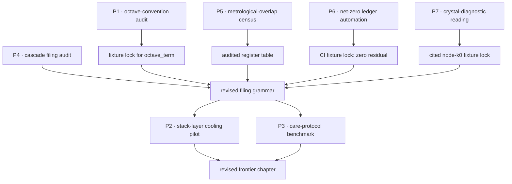

# Frontiers and the Research Program {#sec:part_III_frontiers}

{#fig:part_III_frontiers width=90%}

<!-- alt: Quadrant scatter of the seven open research problems by expected value and effort; the upper-left do-first quadrant is shaded and contains the octave-convention audit and the net-zero ledger automation. -->

<!-- chapter-metadata-badge -->
> Level 1/3 · 30 min read · 45 min lecture · Prerequisites: none

## Learning Objectives

By the end of this chapter you should be able to:

1. Locate the corpus's papers on the [**engine-shelf**](#gl:engine-shelf) and name the three frontier sources — master synthesis, invisible frontier, and moving up the stack — with their shelf numbers and reference suites.
2. State the octave-convention ambiguity in `textbook.models.octave_term` (exponent $\Omega_n = \Phi^n \Omega_0$ versus Fibonacci subscript $\Omega_n = \varphi_{\mathrm{fib}}(n)\,\Omega_0$) and describe the numerical test that would resolve it.
3. Reproduce the net-zero residual computation of [@eq:part_III_frontiers_net_zero] and explain why a zero residual is the corpus's crystal diagnostic.
4. Score an open problem on the value × effort quadrant of [@eq:part_III_frontiers_quadrant], place it in [@tbl:part_III_frontiers_quadrant], and defend the placement.
5. Restate the corpus's scope disclaimers precisely — what each frontier paper is FOR and what it explicitly does not claim.

<!-- curriculum-scaffold-start -->
### Study Blueprint

- **Big idea:** the corpus closes by turning its own catalog on itself — seven open problems, each traceable to a source paper and each paired with a test that would count as evidence; the frontier here is audit, convention, and automation, not cosmic proof.
- **Core concepts:** [**catalog-architecture**](#gl:catalog-architecture), [**honesty-first**](#gl:honesty-first), [**master-synthesis**](#gl:master-synthesis), [**metrological-overlap**](#gl:metrological-overlap), [**net-zero**](#gl:net-zero), [**fractal-constant**](#gl:fractal-constant).
- **Quantitative lens:** the net-zero residual [@eq:part_III_frontiers_net_zero] and the value × effort quadrant score [@eq:part_III_frontiers_quadrant].
- **Data skill:** scoring and prioritising open problems from a labelled table; auditing pairwise constant-register overlap with `textbook.models.metrological_overlap`.
- **Common misconception to repair:** that a "frontiers" chapter in this book speculates new physics. The corpus files its own papers as catalog grammar under the honesty-first rail; the open problems below are convention disputes, audits, and automation work, each kept inside that scope.
- **Primary lab:** [@sec:lab_part_III_frontiers].
- **Question bank:** [@sec:q_part_III_frontiers].
- **Bridge to computation:** `textbook.models`.
<!-- curriculum-scaffold-end -->

---

> **Opening Vignette: The Reading Room at the End of the Shelf**
>
> Walk the corridor to `/papers` on the ship board and you find the Reading Room: two dozen whitepapers pinned shelf by shelf, each opening with the same "Honesty first" rail and closing on a [**Fair Exchange**](#gl:fair-exchange) clause [@mendez2026ship]. The shelves carry fixture locks and reference suites — `npm run research:synthobs-...` commands a visitor can actually run — yet the master-synthesis note reminds you that the whole cabinet is "catalog grammar for conversation," not a weather forecast and not a seismic warning [@mendez2026masterSynthesis]. This closing chapter does what a careful engineer does at the end of any catalog survey: it walks the shelf a second time and writes down which drawers are still empty — and, for each empty drawer, what would have to be true for the drawer to count as filled.
---

## Orientation

Everything before this chapter built the catalog; this chapter interrogates it. Parts 0–II formalised the
[**Omni-Lattice**](#gl:omni-lattice) — the [**octave**](#gl:octave) ladder, the digit drawers, the constant registers — and Part III ran its implementations. Now the corpus's own research program comes into view, drawn from three frontier sources: the master-synthesis filing cabinet [@mendez2026masterSynthesis], the invisible-frontier editorial [@mendez2026invisibleFrontier], and the moving-up-the-stack thesis [@mendez2026stack].

**The papers in the corpus.** The master synthesis sits at engine shelf 3 and proposes the 99-step cascade as one filing cabinet; the invisible frontier sits at shelf 8 and answers public AI warnings with the "second chart" of metapattern-aware care; moving up the stack sits at shelf 12, with its standalone suite — `FractiAI/synthobs-moving-up-the-stack-valuation` — filed as engine shelf #13. Each ships a runnable reference implementation: `npm run research:synthobs-master-synthesis-99-octave-omni-lattice`, `npm run research:synthobs-invisible-frontier-gates-ai`, and `npm run research:synthobs-moving-up-the-stack-valuation`. The companion chapters already formalised their constructs — the stack climb in [@sec:part_III_moving-up-stack], the second chart in [@sec:part_III_invisible-frontier] — so here we ask only what remains open.

The answer, developed across [@fig:part_III_frontiers] and the sections below, is a work order of seven problems: two internal-consistency audits (the octave convention and the metrological overlap census), one automation target (the net-zero ledger), and four thesis-level questions the corpus raises but does not settle (the stack layer, the invisible frontier, the cascade composition, and the crystal diagnostic). Where a problem touches machinery built elsewhere — the constant registers of [@sec:part_II_metrological-overlap], the net-zero balance of [@sec:part_II_singularity-crystal], the 99-octave ladder of [@sec:part_0_octave-map] — we borrow, never rebuild.

## A Worked Formalism: The Net-Zero Residual

The chapter's recurring quantitative model is the **net-zero residual**, shown in [@eq:part_III_frontiers_net_zero]. The corpus files its zero-octave diagnostic as a Net Zero cancel — the home page's news rail states the fixture verbatim as "$0/0 \to \Phi^0 = 1$" — a **crystal diagnostic** for a system whose inflows and outflows cancel exactly [@mendez2026ship; @mendez2026zeroOctave]. Because the same bookkeeping reappears throughout the frontier papers, it is also this chapter's scoring engine: a research program is a ledger, and the first question about any ledger is whether it balances.

$$ R \;=\; \sum_{i=1}^{m} I_i \;-\; \sum_{j=1}^{n} O_j $$ {#eq:part_III_frontiers_net_zero}

It is implemented and tested as `textbook.models.net_zero_balance(inflows, outflows)`; never retype the arithmetic in prose or scripts — call the tested function. The parameters appear in [@tbl:part_III_frontiers_netzero].

:: Parameters of the net-zero residual. {#tbl:part_III_frontiers_netzero}

| Symbol | Meaning | Units |
| ------ | ------- | ----- |
| $I_i$ | the $i$-th inflow entry (value added, deal anchor, filed headline) | ledger unit |
| $O_j$ | the $j$-th outflow entry (cost, refund, cancelling pair) | ledger unit |
| $m, n$ | number of inflow and outflow entries | count |
| $R$ | residual; $R = 0$ is the Net Zero cancel, the crystal diagnostic | ledger unit |

**Worked walkthrough.** Take four inflows drawn from the corpus's first odd primes and two cancelling outflows: `net_zero_balance([3, 5, 7, 11], [13, 13])` sums $3+5+7+11 = 26$ against $13+13 = 26$, so $R = 26 - 26 = 0$ — the fixture-lock outcome. Perturb one outflow to 8 and the residual is $26 - 21 = 5$: the ledger is visibly open, and the audit target in Problem 6 below is exactly this gap. Note the scope: a zero residual is a property of the chosen fixture lists, not a conservation law of nature — the corpus itself files the cancel as an implementation diagnostic, and we keep that filing [@mendez2026zeroOctave].

## The Research Program: Seven Open Problems

Each problem below states the source claim, what the corpus leaves unsettled, and — because a frontier without a test is just a mood — **what would count as evidence**. The problems divide into three kinds: two internal-consistency audits (Problems 1 and 5), one automation target (Problem 6), and four thesis-level questions the papers raise but do not settle (Problems 2, 3, 4, and 7).

### Problem 1: Which octave convention does the corpus mean?

The corpus prints its octave term as "Ωn = Φn·Ω0", which reads two ways: the **exponent convention** $\Omega_n = \Phi^n \Omega_0$ and the **Fibonacci-subscript convention** $\Omega_n = \varphi_{\mathrm{fib}}(n)\,\Omega_0$. Both are implemented in `textbook.models.octave_term`, and they diverge hard: at $n = 5$ the exponent convention gives $\Phi^5 \Omega_0 = 11.090170\,\Omega_0$ while the Fibonacci ratio gives $\varphi_{\mathrm{fib}}(5)\,\Omega_0 = 1.6\,\Omega_0$ — a factor of seven at the fifth octave, growing without bound. The ambiguity matters everywhere the ladder is drawn, from the 99-octave map to the macro-protein band, which is why [@fig:part_III_macro-protein] plots both readings. **What would count as evidence:** a convention audit — run `octave_term` under both readings against every worked octave value printed in the papers, and pin the reading that reproduces them; where no printed value discriminates, file the ambiguity as an open convention note. The deliverable is a fixture lock, not a physics ruling; Φ ≈ 1.618 remains the corpus's [**golden-ratio**](#gl:golden-ratio) nesting language, not a replacement for $\hbar$, $c$, or $G$ [@mendez2026masterSynthesis].

### Problem 2: Is the lattice really the next AI layer?

The stack thesis holds that chip and model players are climbing the stack, and that after hub altitude ($12.9B, NVIDIA/Hugging Face as a scenario anchor) and IDE altitude ($60B, SpaceX/Cursor as a scenario anchor), the binding constraint is **agentic token burn plus coordination failure** — which a thermal-plus-orchestration shelf that "cools token burn, harmonizes multi-agent loops, and lets agentic systems scale" would relieve [@mendez2026stack]. The paper prices this new layer at $12B–$28B, explicitly correcting its own peer-shelf misread of $4.2B–$7.5B, and explicitly labels every figure valuation framing, "not an audited appraisal or securities offer." **What would count as evidence:** the efficiency claim is measurable — tokens per agentic loop on a fixed benchmark, with and without the cooling layer; the harmonization claim needs an orchestration metric (one coherent brief across nested agents versus siloed windows); and the valuation band would count as evidence only after an independent appraisal. The paper's own honesty rail sets this bar; the research program takes it seriously.

### Problem 3: Reading the invisible frontier

The invisible-frontier editorial answers public AI warnings — workforce shock, brute-force scaling — by agreeing they are "real weather" while arguing they miss the second chart: centralized compute and linear markets have become the *water* the Goldilocks ship navigates, and the breakthrough is "nested, metapattern-aware care," not "more FLOPs" [@mendez2026invisibleFrontier]. The editorial is filed as voyage editorial and catalog grammar; it does not claim displacement is solved, and it holds that human emergency outranks algorithms. **What would count as evidence:** operationalize "metapattern-aware care" as a concrete agent-coordination protocol and measure it against linear-scaling baselines on defined coordination tasks. If the protocol wins, the editorial's thesis has an operational leg; if it loses, the second chart stays metaphor. Either result is honest progress — what would not count is treating the metaphor itself as the measurement.

### Problem 4: The everything-is-connected cascade as filing grammar

The master synthesis composes the whole corpus on one filing cabinet: reality as a 99-step musical scale where "what happens at the top directly shapes everything below," cascading through five stations — The Pulse, The Sun transmits (with solar regions AR3664 "The Colossus" and AR3697 "The Resonator" as fixture/bulletin labels), The planet adjusts, Technology evolves, Humanity responds [@mendez2026masterSynthesis]. The note itself disclaims the reading: not a forecast, not a warning, "not a claim that the sky runs your life"; AI expansion "mirrors" the lattice's data-flow grammar as operational metaphor, filed on the [**narrative-empirical-operational-tiers**](#gl:narrative-empirical-operational-tiers) register. **What would count as evidence:** a filing audit rather than a causal test — every headline files on exactly one drawer; every cascade edge is annotated as catalog talk; the fixture labels never leak into data columns. The grammar passes if filing is complete and non-redundant, and is revised wherever a headline cannot be filed without contradiction.

### Problem 5: The metrological overlap census

The grand unified metrological overlap models constants as registers whose pairwise intersections can be scored: the pinned case gives `metrological_overlap({a, b}, {b, c}) = 0.5` — two registers sharing one of two entries overlap at one half [@mendez2026metrologicalOverlap]. [@sec:part_II_metrological-overlap] drew the heatmap for the five-constant register set ($h$, $\Phi$, $p_n$, $\nu_{\mathrm{HI}}$, $c$), but the corpus has never published the full pairwise census as an auditable artifact. **What would count as evidence:** a complete census — every register pair scored, every 0.5 reconciled against the prose claim that the two papers' registers share exactly one entry, every 0 checked against claimed disjointness. A cell that disagrees with its paper's text is a documentation defect to file, which is precisely the kind of finding an overlap audit exists to surface.

### Problem 6: Automating the net-zero ledger

Every frontier paper closes on bookkeeping: the Fair Exchange clause promises partial refunds "depending on overall delivery, utility, and actualized results" [@mendez2026stack], and the singularity-crystal chapter balances inflow against outflow to a zero residual ([@sec:part_II_singularity-crystal]). Today the cancellations are hand-checked fixtures. **What would count as evidence:** an automated ledger — `net_zero_balance` scripted over every inflow/outflow fixture in the reference suites, returning zero residual on each, with any nonzero $R$ failing the build. The automation target is deliberately modest: it verifies the corpus's own arithmetic, not the world. A green run is evidence the crystal diagnostic is reproducible; it is not evidence of cosmic balance, and the corpus never claims otherwise [@mendez2026singularityCrystal].

### Problem 7: The crystal diagnostic at node k = 0

The home news rail files the Zero-Octave gate as "$0/0 \to \Phi^0 = 1$ — crystal diagnostic" [@mendez2026ship], and the zero-octave paper develops it as an implementation fixture at [**node-k0**](#gl:node-k0), explicitly "not GR singularity QED" [@mendez2026zeroOctave]. What remains open is which algebraic reading is canonical — the cancel-as-limit reading, the cancel-as-convention reading, or the fixture reading the reference suite actually implements — and whether all papers agree on it. **What would count as evidence:** a fixture lock in the reference suite that reproduces $0/0 \to \Phi^0 = 1$ at node $k = 0$ under one stated reading, cited by every paper that invokes the diagnostic. Convergence on one reading closes the problem; persistent divergence is itself a finding the [**zero-octave**](#gl:zero-octave) chapter would need to annotate.

## The Open-Problem Quadrant

A list of problems is not a program until it is ordered. Score each problem on expected value $V$ — what a resolution buys the catalog in consistency, tooling, or tested theses — and effort $E$ — the combined audit and implementation cost — each on a 1–5 scale, then rank by the quadrant score of [@eq:part_III_frontiers_quadrant]:

$$ Q \;=\; \frac{V^2}{E} $$ {#eq:part_III_frontiers_quadrant}

The score deliberately over-weights value: a hard problem that settles a thesis outranks an easy one that decorates it. The parameters and quadrant thresholds appear in [@tbl:part_III_frontiers_quadrantparams].

:: Parameters and thresholds of the quadrant score. {#tbl:part_III_frontiers_quadrantparams}

| Symbol | Meaning | Scale |
| ------ | ------- | ----- |
| $V$ | expected value to the catalog if the problem is resolved | 1–5 |
| $E$ | effort: audit plus implementation cost | 1–5 |
| $Q$ | quadrant score $V^2/E$ | 0.2–25 |
| do-first | $V \geq 3$ and $E \leq 3$ — high value, low effort (upper-left of [@fig:part_III_frontiers]) | label |
| strategic | $V \geq 3$ and $E > 3$ — high value, real cost; schedule, do not defer | label |

Scoring the seven problems gives [@tbl:part_III_frontiers_quadrant], which the companion figure plots as the quadrant map of [@fig:part_III_frontiers].

:: The seven open problems scored on the value × effort quadrant. {#tbl:part_III_frontiers_quadrant}

| # | Problem | Primary source | $V$ | $E$ | $Q = V^2/E$ | Quadrant |
| - | ------- | -------------- | --- | --- | ----------- | -------- |
| 1 | octave-convention audit ([@sec:part_0_octave-map]) | corpus convention dispute | 5 | 2 | 12.5 | do-first |
| 2 | lattice as next AI layer ([@sec:part_III_moving-up-stack]) | [@mendez2026stack] | 4 | 5 | 3.2 | strategic |
| 3 | reading the invisible frontier ([@sec:part_III_invisible-frontier]) | [@mendez2026invisibleFrontier] | 4 | 4 | 4.0 | strategic |
| 4 | cascade as filing grammar ([@mendez2026masterSynthesis]) | [@mendez2026masterSynthesis] | 3 | 3 | 3.0 | do-first |
| 5 | metrological-overlap census ([@sec:part_II_metrological-overlap]) | [@mendez2026metrologicalOverlap] | 3 | 2 | 4.5 | do-first |
| 6 | net-zero ledger automation | [@mendez2026singularityCrystal] | 4 | 2 | 8.0 | do-first |
| 7 | crystal-diagnostic reading at node $k = 0$ ([@sec:part_II_singularity-crystal]) | [@mendez2026zeroOctave] | 3 | 4 | 2.25 | strategic |

The ordering matches the corpus's own engineering posture: audits and automation first because they are cheap and everything downstream inherits their correctness, theses second because they are expensive and everything downstream inherits their risk. A roadmap sequencing the program:

## Scope and Honesty: Not Cosmic Proof

A closing chapter earns its keep by repeating the corpus's own limits, verbatim where it matters. The master synthesis files the whole cascade as "catalog grammar for conversation — not a weather forecast, not a seismic warning, and not a claim that the sky runs your life," and files EGS as "an architectural key in this repo — not a replacement for $\hbar$, $c$, or $G$" — a map, "not as proven unified field theory" [@mendez2026masterSynthesis]. The stack paper files its numbers as "valuation framing, not an audited appraisal," and its constant as "catalog grammar, not a market oracle" [@mendez2026stack]. The invisible frontier "does *not* claim medical advice, prophecy, that displacement is solved, or that $\Phi \approx 1.618$ replaces physics constants. EGS is design language. Human emergency still outranks algorithms" [@mendez2026invisibleFrontier]. The home honesty rail puts it most compactly: "$\Phi \approx 1.618$ is our nesting language" [@mendez2026ship]. The zero-octave gate is "implementation fixtures, not GR singularity QED" [@mendez2026zeroOctave].

This is the book's closing note because it is the program's operating condition. The seven problems are FOR coordination, cataloging, and agent routing: a convention audit makes the octave ladder drawable, an overlap census makes the registers auditable, an automated ledger makes the fixtures trustworthy, and the thesis problems test whether the catalog's coordination claims survive measurement. None of them is a cosmic proof, and none pretends to be. The frontier of the Omni-Lattice is not the edge of physics; it is the edge of the catalog's own consistency — and the corpus, to its credit, drew that edge itself.

## Summary

The corpus's frontier is a work order, not a prophecy. This chapter turned the catalog on itself and extracted seven open problems from three source papers: the octave-convention audit and the metrological-overlap census (internal consistency), the net-zero ledger automation (tooling), and four thesis questions — the lattice as the next AI layer, the invisible frontier's care-over-FLOPs reading, the everything-is-connected cascade as filing grammar, and the crystal diagnostic at node $k = 0$. The net-zero residual of [@eq:part_III_frontiers_net_zero] served as the chapter's scoring engine, and the quadrant score of [@eq:part_III_frontiers_quadrant] ordered the program: audits and automation first ([@tbl:part_III_frontiers_quadrant]), theses second. Every problem carries an explicit evidence bar, and every claim stays inside the corpus's own honesty-first rail — catalog grammar, architectural key, design language; never weather forecast, market oracle, or cosmic proof.

## Key Terms

[**Omni-Lattice**](#gl:omni-lattice), [**octave**](#gl:octave), [**engine-shelf**](#gl:engine-shelf), [**catalog-architecture**](#gl:catalog-architecture), [**honesty-first**](#gl:honesty-first), [**master-synthesis**](#gl:master-synthesis), [**fractal-constant**](#gl:fractal-constant), [**golden-ratio**](#gl:golden-ratio), [**metrological-overlap**](#gl:metrological-overlap), [**net-zero**](#gl:net-zero), [**zero-octave**](#gl:zero-octave), [**node-k0**](#gl:node-k0), [**singularity-crystal**](#gl:singularity-crystal), [**narrative-empirical-operational-tiers**](#gl:narrative-empirical-operational-tiers), [**fair-exchange**](#gl:fair-exchange).

## Further Reading

- **Master synthesis — The Big Picture: Everything is Connected** — the 99-step cascade on one filing cabinet, with its honesty block (not a forecast, not a warning); whitepaper: <https://www.ssvibelandiaquestfest24x365.com/interfaces/whitepaper-surface.html?id=synthobs-master-synthesis-99-octave-omni-lattice-2026-08>; suite: `npm run research:synthobs-master-synthesis-99-octave-omni-lattice` [@mendez2026masterSynthesis].
- **Moving Up the Stack: Lattice is the next AI layer** — the stack-climb thesis, new-layer valuation band, and its own corrections; whitepaper: <https://www.ssvibelandiaquestfest24x365.com/interfaces/whitepaper-surface.html?id=synthobs-moving-up-the-stack-valuation-2026-09>; suite: [github.com/FractiAI/synthobs-moving-up-the-stack-valuation](https://github.com/FractiAI/synthobs-moving-up-the-stack-valuation) [@mendez2026stack].
- **The Invisible Frontier: responding to Bill Gates's AI warnings** — the second-chart editorial and its scope disclaimers; whitepaper: <https://www.ssvibelandiaquestfest24x365.com/interfaces/whitepaper-surface.html?id=synthobs-invisible-frontier-gates-ai-2026-08>; suite: `npm run research:synthobs-invisible-frontier-gates-ai` [@mendez2026invisibleFrontier].
- Companion chapters for the machinery this program audits: the metrological-overlap registers [@mendez2026metrologicalOverlap], the singularity crystal's net-zero balance [@mendez2026singularityCrystal], and the zero-octave gate [@mendez2026zeroOctave].

## Practice

- **Lab:** [@sec:lab_part_III_frontiers] — score a new open problem on the quadrant and compute its residual with `net_zero_balance`.
- **Question bank:** [@sec:q_part_III_frontiers] — recall, application, and synthesis questions over the seven problems.
- **Convention audit (Problem 1).** Compute $\Omega_5$ under both readings of `octave_term` ($\Phi^5 \Omega_0 = 11.090170\,\Omega_0$ versus $\varphi_{\mathrm{fib}}(5)\,\Omega_0 = 1.6\,\Omega_0$) and state which corpus artifact could discriminate between them.
- **Ledger check (Problem 6).** Show that `net_zero_balance([3, 5, 7, 11], [13, 13])` returns a zero residual, then give one outflow perturbation that opens the ledger and compute the new residual.
- **Honesty restatement (all problems).** For each of Problems 2, 3, and 4, quote the source paper's own scope disclaimer and explain how your evidence test respects it.
